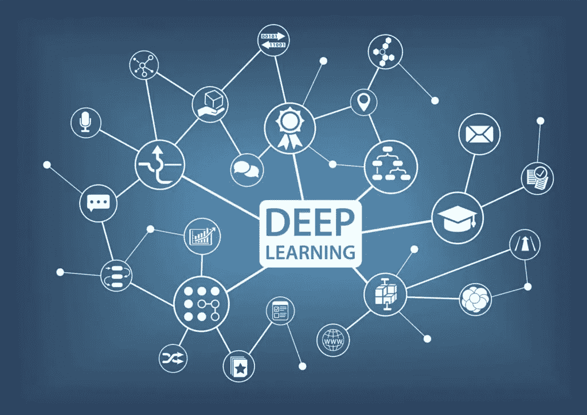
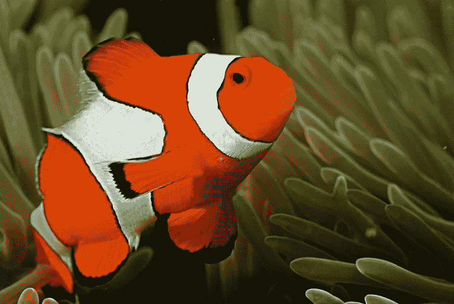
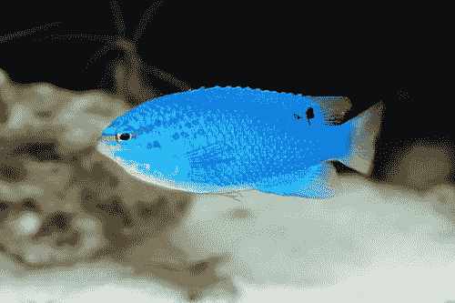
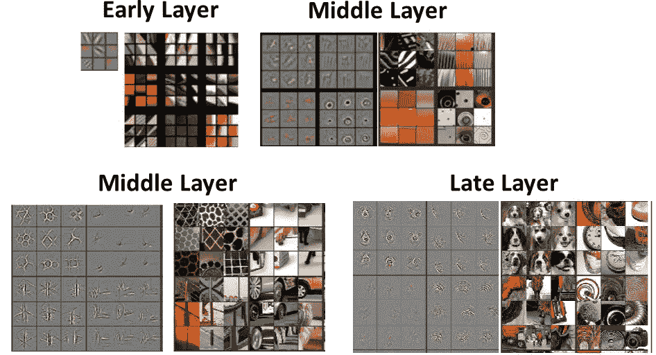
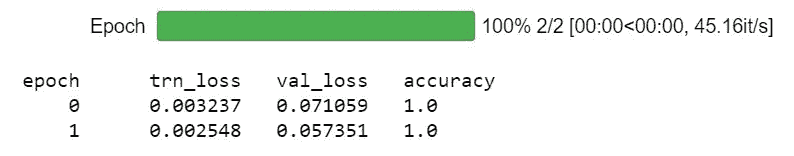
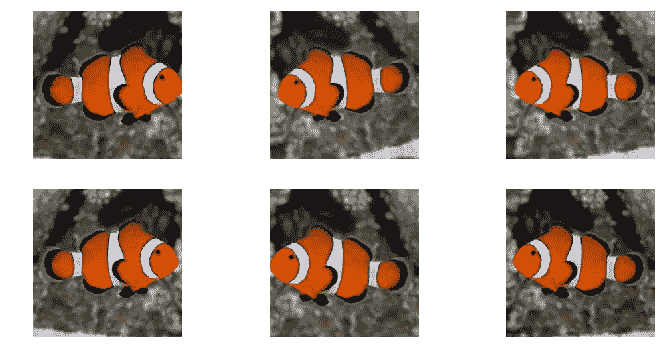
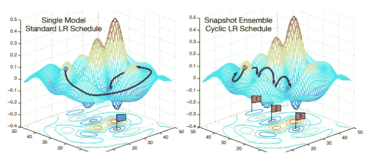
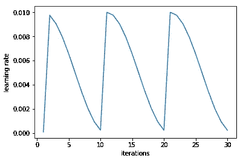
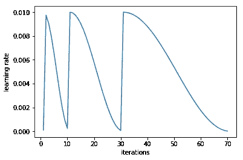

# 深度学习真的需要“大数据”吗？—不！

> 原文：<https://towardsdatascience.com/does-deep-learning-really-require-big-data-no-13890b014ded?source=collection_archive---------4----------------------->

当我告诉人们应该考虑对他们的数据应用深度学习方法时，我得到的一个常见的初步反应是我(1)没有处理足够“大”的数据，以及(2)我没有足够的计算资源来训练深度学习模型。我相信这些假设来自大公司(如谷歌)，它们经常喜欢通过对大型数据集进行研究来炫耀，如包含超过一百万张图片的 [ImageNet](http://www.image-net.org/) ，并使用大量的 GPU。这对这些公司来说很好，但从我的印象中，一般的深度学习从业者不会处理这样大的数据集(或者甚至不需要)，也没有机会访问这样大的计算资源。例如，作为一名研究生，我的资金几乎限制了我只能使用免费的资源，所以我使用谷歌云平台免费提供的(至少一年)K80 GPU 来进行我所有的深度学习。**是的，我没有花一分钱进行深度学习，我只用了 1 个 GPU。**

我写这篇文章是想告诉你，这些假设是不正确的。**深度学习不需要大量的数据和计算资源。**这些假设非常有害，因为它们限制了人们利用深度学习的数量，而我认为深度学习有可能改善世界。我举例说明了深度学习不需要“大数据”，方法是训练一个分类器来区分我最喜欢的两种鱼的图片——小丑鱼和蓝色少女(是的，我确实有一个只有这两种鱼的盐水水族馆)。我能够用训练数据集中仅有的 20 幅图像来训练一个准确率为 100%的分类器。我也借此机会举例说明我解决计算机视觉问题的常用方法。事实证明，这些方法中的一些并不一定要达到 100%的准确性，但它们通常对处理更大的数据集非常有帮助(我通常处理成千上万的图像)。代码和示例数据集可在我的 [GitHub](https://github.com/zachmonge) 上获得。

# **数据集&模型**

该数据集由小丑鱼和蓝色少女的图片组成。在训练组中，每种鱼有 10 条。在验证集内有 11 条小丑鱼和 10 条蓝色少女。我通常在验证集中包含大约 20%的项目，但是这里我有 50%,因为这是一个很小的数据集。

我训练的型号是 [Resnet-34](https://arxiv.org/abs/1512.03385) 。我不会详细介绍这个模型(也许我会在以后的文章中介绍)，但它是一个最先进的卷积神经网络。我们可以利用 Resent(以及许多其他卷积神经网络)已经在著名的 [ImageNet](http://www.image-net.org/) 数据集上进行了训练。ImageNet 由来自 1000 个类别的 100 多万张图片组成的大型数据集。这些类别从动物到植物到无生命的物体。尽管在 ImageNet 上训练的模型被训练来区分这 1000 个类别，但事实证明，训练的层可推广到其他数据集。研究人员已经从 ImageNet 上训练的模型中可视化卷积过滤器(见下图)，早期层的过滤器检测低级视觉特征，如边缘，直到后面的层，过滤器才拾取更特定于训练数据集的特征。这意味着，根据数据集的不同，预训练过滤器可能会应用于您正在使用的数据集。由于我们正在训练一个分类器来区分两种类型的鱼，并且 ImageNet 包含鱼，所以使用预训练模型可能非常容易。

Image source: [https://arxiv.org/abs/1311.2901](https://arxiv.org/abs/1311.2901)

# 训练模型

所以让我们开始训练模型吧！我们再次使用预训练模型。我们将弹出最后一层(区分 1000 个 ImageNet 类别)并添加一个新层，区分小丑鱼和蓝色少女。首先，我们将只训练最后一层。在我们开始训练之前，我们需要选择学习率，这在传统上被认为是很难选择的。解决这个问题的方法是使用循环学习。通过这种方法，学习速率是变化的，并且损失的变化被检查。我们从非常低的学习率开始，逐渐提高学习率。下图演示了这种方法。左图显示，随着迭代次数的增加，学习率也增加。右图是我们如何选择学习率，并显示了作为学习率函数的验证损失。通常，我们选择最高的学习率，此时损失仍在减少，但尚未达到稳定状态。由于这是一个如此小的数据集，我们应该选择什么样的学习速率并不完全明显，但是对于包含更多迭代的较大数据集，这通常更明显。在这里，我选择了 1e-2 的学习率。

我们现在准备开始训练！正如下面所看到的(参见运行的纪元的完整数目的代码)，我们已经成功地训练了我们的分类器，具有 **100%的准确性**来区分小丑鱼和蓝色少女！不太难吧？

# 改进模型

在这里，我们实现了 100%的准确性，因此我们可能不需要进一步改进模型，但对于绝大多数数据集，要实现高准确性需要做更多的工作。这里有一些我在训练卷积神经网络时经常使用的技术。

**数据扩充**

改进计算机视觉模型的一种方法是通过数据扩充。数据增强在每个时期都会稍微改变我们的图像。在某种程度上，这就像在没有收集额外数据的情况下向训练集添加更多数据，这有时很困难，甚至是不可能的。**这是一个非常强大的方法**，根据我的经验，它几乎总能提高分类器的准确性。以下是数据扩充可能对图像进行更改的示例。

**差异学习率**

在前面的示例中，我们所做的只是训练最后一层，这对于本示例数据集来说很好，但一种强大的方法是训练所有层，但学习率不同。请记住，我们的预训练模型来自 ImageNet。如上所述，先前的工作已经确定来自早期层的滤波器检测低级视觉特征，例如边缘，并且随着我们越来越深入网络，滤波器开始拾取更高阶的视觉特征。因此，几乎总是可能出现这样的情况，即没有必要像训练更特定于训练数据集的后面的层那样训练更早的层。我们训练每一层的程度也取决于它与训练数据集的相似程度。在这个例子中，我们正在训练鱼的图片，这些图片也包含在 ImageNet 中，所以我们不打算对早期的图层进行太多的修改(或者甚至根本不修改！)作为后来的层。

**重启的随机梯度下降**

我的下一个技巧是使用重启随机梯度下降(SGDR)。SGDR 是学习率退火的一种变体，其中学习率随着训练的进行而逐渐降低。理论是，当我们接近最小值时，我们需要开始使用较小的学习速率，这样我们就不会错过最小值。问题是，我们可能会陷入一个不太有弹性、不能很好概括的最小值。所以我们能做的就是跳回到一个更高的学习率，再次开始降低学习率，并且尽你所能地重复这个过程。这背后的想法如下图所示。

Image source: [https://arxiv.org/abs/1704.00109](https://arxiv.org/abs/1704.00109)

我在示例 fish 数据集上使用了这种技术，如下图所示。该图显示了学习率随着迭代次数的增加而降低，但是随后学习率跳回(即重新开始)。

我们可以通过改变学习率下降的时间来做得更好，从而重新开始学习。随着训练的进行，我们的模型可能会到达一个更稳定的位置，更接近于最小值。因此，在训练的后期，我们可能不希望频繁地重新开始，所以我们可以加倍(或乘以任何你想要的数字)从最高到最低学习速率的周期。这可以在下图中看到。

# 结论

从这个分类问题的例子中可以看出，深度学习可以成为解决计算机视觉(以及其他)问题的一个非常强大的工具**，即使在小数据集的情况下也能很好地工作**。我希望这篇文章将激励目前不使用深度学习的机器学习从业者考虑将深度学习方法添加到他们的工具包中，即使他们无法访问大型计算资源。深度学习已经被证明能够解决以前很难解决的问题，因此，我相信它将继续彻底改变这个领域。同样，如果你有兴趣看代码和示例 fish 数据集，请查看我的 [GitHub。](https://github.com/zachmonge)