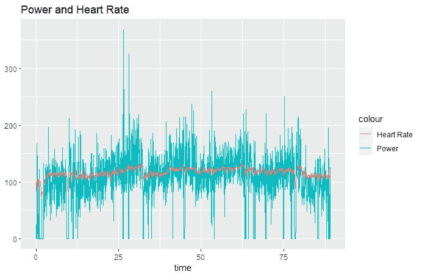
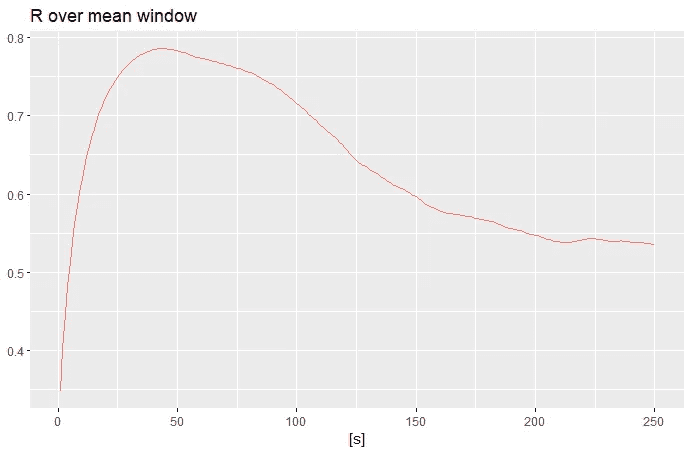
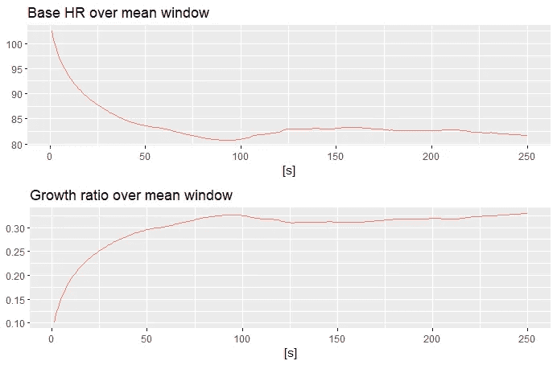
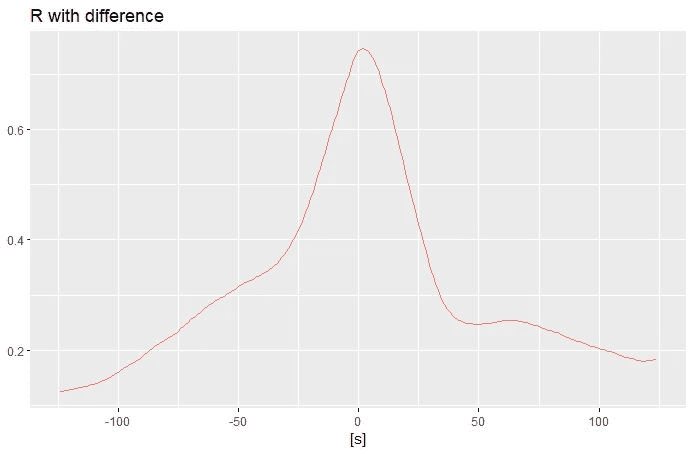
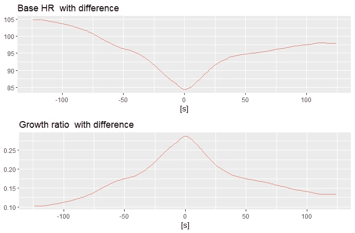
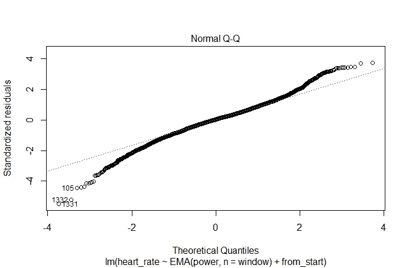
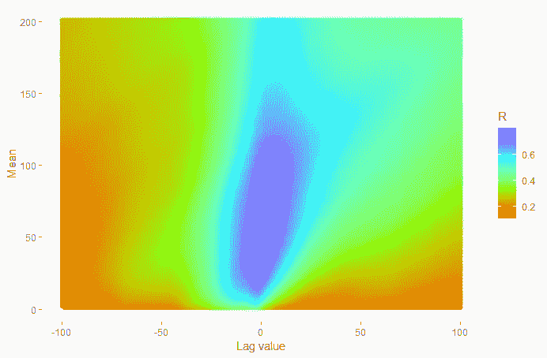
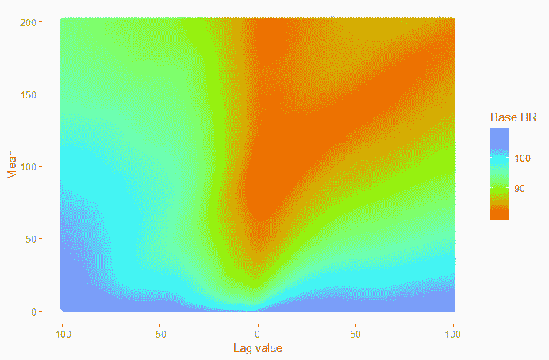
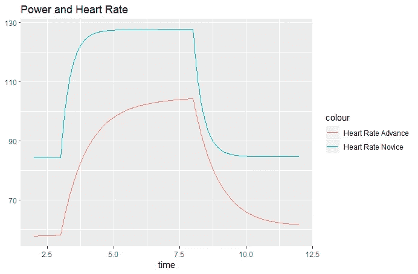

# 骑车时力量和心率是齐头并进的吗？

> 原文：<https://towardsdatascience.com/does-power-and-heart-rate-go-hand-in-hand-when-you-ride-a-bike-37a174785f37?source=collection_archive---------10----------------------->

充分利用电表的数据分析方法。

# 介绍

你有功率表或者考虑买一个吗？也许你认为这样的设备是下一个收集成千上万数据却不给你任何信息的小工具？不管你的主要动机是什么，继续读下去。

在这篇短文中，我将尝试通过户外骑行期间收集的功率表和心率的数据分析来指导您。对于统计计算和图形，我使用了 R 软件，所有代码都包含在文本中，供您参考。

这种关系的理论很简单。锻炼时你付出的努力越多，你的心率就必须向你的肌肉输送更多的血液，以便输送燃料(糖原)和氧气。

并发症来自人体生理和锻炼环境。肌肉含有能量储备，可在紧急情况下立即使用。这种储存不会持续很长时间，但足以延迟心脏反应一段时间。户外环境对数据分析师来说也不是那么友好。丘陵、风或不平的道路使得骑自行车的人几乎不可能在最短的时间内保持稳定的功率输出水平。此外，大多数锻炼都设计了低功率输出和高功率输出的间隔，从而不断地来回拉动您的心率。

# 线性回归从 R 开始

在我们开始处理数据之前，我们需要准备一个 R 环境包，它可以很好地解释 Garmin fit 文件。如果你遇到任何问题，不要害怕在评论中提出问题。我们将同时加载所有的库，因此我们将完全覆盖这一部分。

```
#In order to install directly from github you have to get and use devtools
install.packages('devtools')
library(devtools)
assignInNamespace("version_info", c(devtools:::version_info, list("3.5" = list(version_min = "3.3.0", version_max = "99.99.99", path = "bin"))), "devtools")
#Library that is used to read garmin fit files is here [https://github.com/kuperov/fit](https://github.com/kuperov/fit) but it is better to use fork as this has more recent SDK.
#add CXXFLAGS=-g -std=c++11 in C:\Program Files\R\R-3.5.1\etc\i386\Makeconf
install_github("russelldb/fit")library(fit) # read fit files
library(ggplot2) # plots in R
library(TTR) # Exponential Moving Average
library(gridExtra) # Plots aggregator 
library(dplyr) #lag and leadoptions("scipen"=100, "digits"=4) #print numbers in normal notation#The part that reads exported workout file from Garmin Connect
cycling <- read.fit('2951865119.fit')
```

现在我们有了所有可用的数据，我们可以绘制功率和心率图。



```
#Prepare data
record <- cycling$record # make record data frame available globally
record <- record[!is.na(record$power) & !is.na(record$heart_rate) ,] # remove NA
record$time <- (record$timestamp-record$timestamp[1])/60 # Show time in minutes
record$from_start <- record$timestamp - record$timestamp[1]  # create variable seconds from start#Plot the first graph
ggplot(cycling$record, aes( x=time)) + 
  geom_line(aes(y = power, colour = "Power")) + 
  geom_line(aes(y = heart_rate, colour = "Heart Rate")) + 
  theme(axis.title.y=element_blank()) +
  ggtitle("Power and Heart Rate")
```

正如你可能看到的那样，这种相关性是存在的，但是我们不应该期望有什么强的相关性。首先，测得的输出功率比我们在心率中看到的噪声(或方差)多得多。第二件事是，当你停止踩踏板时，功率为零，而心率仍然保持在高水平。

让我们从基本的线性回归开始，即心率直接取决于产生的功率。

```
#linear regression
linearMod <- lm(heart_rate ~ power , data=record)
summary(linearMod)
```

在对我乘坐的数据进行快速计算后，我得到了如`HRM = 105.33 + 0.1057 * PWR`这样的模型。这两个参数都具有统计学意义，更重要的是，它们都有很好的解释。`105` 是我的基础心率，`0.10`是力量增长比率。调整后的 R-squared: `0.29`，表明模型只在很小的百分比上解释了数据。

# 心率功率的高级建模

首先，让我们注意到功率比心率有更大的可变性，为了能够得到更好的解释，我们需要以某种方式重新调整它。此外，权力积累本身的内部和驱动心率在一个体积。可以用来实现它的一种方法是使用一段时间的平均值。

我们再加上一个可以反映疲劳的变量。最简单的方法是加上从健身程序开始算起的秒数。

```
HRM ~ moving_average(PWR, window) + time from start
```

我们将使用指数移动平均线而不是简单移动平均线，因为 SMA 被认为有一个被称为“吠两次”的问题。这对于耐久性数据来说尤其不方便，因为过去努力应该只有最小的影响。

现在，问题可能是最适合我们的模型的最佳窗口参数是什么。让我们把它当作一个参数来估计，我们将迭代地做 0 到 250 秒之间的窗口大小的线性回归。

```
iterations = 250L
variables = 5
output <- matrix(ncol=variables, nrow=(iterations))
for (i in c(1:iterations)){
  print(i)
  linearMod <- lm(heart_rate ~ EMA(power,n=i) + from_start, data=record)
  summary <- summary(linearMod)
  output[i,] <- c(i,summary$r.squared, summary$coefficients[1],summary$coefficients[2],summary$coefficients[3])
}summary.df <- data.frame(output)summary.df[summary.df$X2==max(summary.df$X2),]
window  <- summary.df[summary.df$X2==max(summary.df$X2),1] #declare variable for future useggplot(summary.df, aes(x = X1)) + 
  geom_line(aes(y = X2, colour = "R"), show.legend=F) +
  xlab("[s]") +
  theme(axis.title.y=element_blank()) +
  ggtitle("R over mean window")
```



随后的下降有明显的局部最大值，这给这种方法以信心。r 平方增加到 0.78，这是一个体面的模型拟合。自行车静息心率下降到 84，这也是更可信的值。随着功率的下降，增长率略有上升。当平均值的窗口大约为 43 秒时，模型达到最佳拟合。

最后一个值得检查的是基础 HR 和增长比率的行为。

```
plot1 <- ggplot(summary.df, aes(x = X1)) + 
  geom_line(aes(y = X3, colour = "Base HR"), show.legend=F) +
  xlab("[s]") + theme(axis.title.y=element_blank()) +
  ggtitle("Base HR over mean window")
plot2 <-ggplot(summary.df, aes(x = X1)) + 
  geom_line(aes(y = X4, colour = "Base HR"), show.legend=F) +
  xlab("[s]") + theme(axis.title.y=element_blank()) +
  ggtitle("Growth ratio over mean window")
grid.arrange(plot1, plot2, nrow=2)
```



您可以看到，随着窗口大小的增加，基础 HR 不断下降，并稳定在一个更小的值。

ne 可能会问引入移动平均是否足以让模型完美拟合，并质疑心率反应是否有立竿见影的效果。事实上，我们应该以类似的方式检查滞后或超前是否改进了模型。

新模型将会是这样的:

```
HRM ~ moving_average(lag or lead(PWR,difference), window) + time from start
```

估计也是基于迭代方法，但这次我们需要计算每个`i`的滞后和超前

```
iterations = 125L
variables = 5
output <- matrix(ncol=variables, nrow=(iterations*2-1))
for (i in c(1:iterations-1)){
  print(i)
  linearMod <- lm(heart_rate ~ lead(EMA(power,n=window) ,n = i)  + from_start, data=record)
  summary <- summary(linearMod)
  output[i+iterations,] <- c(i,summary$r.squared, summary$coefficients[1],summary$coefficients[2],summary$coefficients[3])
  linearMod <- lm(heart_rate ~ lag(EMA(power,n=window) ,n = i) + from_start , data=record)
  summary <- summary(linearMod)
  output[iterations-i,] <- c(-i,summary$r.squared, summary$coefficients[1],summary$coefficients[2],summary$coefficients[3])
}linearMod <- lm(heart_rate ~ EMA(power,n=window)  + from_start , data=record)
summary <- summary(linearMod)
output[iterations,] <- c(0,summary$r.squared, summary$coefficients[1],summary$coefficients[2],summary$coefficients[3])summary.df <- data.frame(output)summary.df[summary.df$X2==max(summary.df$X2),]
summary.df[summary.df$X4==max(summary.df$X4),]
summary.df[summary.df$X3==min(summary.df$X3),]ggplot(summary.df, aes(x = X1)) + 
  geom_line(aes(y = X2, colour = "R"), show.legend=F) +
  xlab("[s]") + theme(axis.title.y=element_blank()) +
  ggtitle("R with difference")

plot1 <- ggplot(summary.df, aes(x = X1)) + 
  geom_line(aes(y = X3, colour = "Base HR"), show.legend=F) +
  xlab("[s]") + theme(axis.title.y=element_blank()) +
  ggtitle("Base HR  with difference")
plot2 <-ggplot(summary.df, aes(x = X1)) + 
  geom_line(aes(y = X4, colour = "Base HR"), show.legend=F) +
  xlab("[s]") + theme(axis.title.y=element_blank()) +
  ggtitle("Growth ratio  with difference")
grid.arrange(plot1, plot2, nrow=2)
```



当没有超前或滞后时，达到模型的最佳拟合，并且基本 HR 的最小值和增长率的最大值同时达到。这是理想的，但是小的滞后或超前值也是可以接受的，因为可能会有一些设备记录时间不匹配。

另一件值得检查的事情是线性回归残差的分位数-分位数图。基本上，它告诉你没有被解释的部分是一个随机的正常噪音还是有一些隐藏的模式在里面。

```
linearMod <- lm(heart_rate ~ EMA(power,n=window)+ from_start   , data=record)
summary(linearMod)
plot(linearMod)
```



在完美的排列中，所有的点都应该在一条直线上。在我们的例子中，尾部没有被很好地放置，这可能暗示了模型的一些改进领域。

最后一部分是用热图交叉检查一张图上的所有数据。因此，我们将同时检查窗口大小参数和滞后或超前。

```
#check for moving average
iterations = 201L
variables = 6output <- matrix(ncol=variables, nrow=iterations^2-1)
for (j in c(1:iterations)){
  for (i in c(1:(iterations/2L))){
    print(iterations*(j-1)+i)
    linearMod <- lm(heart_rate ~ lead(EMA(power,n=j),n=i) + from_start  , data=record)
    summary <- summary(linearMod)
    output[iterations*(j-1)+i+iterations/2,] <- c(i,j,summary$r.squared, summary$coefficients[1],summary$coefficients[2],summary$coefficients[3])
    linearMod <- lm(heart_rate ~ lag(EMA(power,n=j),n=i) + from_start  , data=record)
    summary <- summary(linearMod)
    output[iterations*(j-1)+iterations/2-i,] <- c(-i,j,summary$r.squared, summary$coefficients[1],summary$coefficients[2],summary$coefficients[3])
  }
  linearMod <- lm(heart_rate ~ EMA(power,n=j) + from_start  , data=record)
  summary <- summary(linearMod)
  output[iterations*(j-1)+(iterations/2L),] <- c(0,j,summary$r.squared, summary$coefficients[1],summary$coefficients[2],summary$coefficients[3])
}summary.df <- data.frame(output)summary.df[summary.df$X3==max(summary.df$X3),]ggplot(summary.df, aes(x = X1,y=X2, color=X3)) +  geom_point() + scale_colour_gradientn(colours=rainbow(4)) +
  labs(x = "Lag value", y = "Mean", color ="R")ggplot(summary.df, aes(x = X1,y=X2, color=X4)) +  geom_point() + scale_colour_gradientn(colours=rainbow(4)) +
  labs(x = "Lag value", y = "Mean", color ="Base HR")
```



我想在这里展示的最后一件事是受过训练和未受过训练的运动员之间的比较。为此，我们有一组来自经常训练的高级选手和新手的数据。我们做了 5 分钟 150W 稳定负荷下的心率模拟。为了简化，不存在预热。

```
#Prepare data
cycling2 <- read.fit('Szosa-4x1395-98%FTP/2863955610.fit')
record2 <- cycling2$record # make record data frame available globally
record2 <- record2[!is.na(record2$power) & !is.na(record2$heart_rate) ,] # remove NA
record2$from_start <- record2$timestamp - record2$timestamp[1]  # create variable seconds from startrobert <- lm(heart_rate ~ EMA(power,n=116) + from_start, data=record2)
marek <-  lm(heart_rate ~ EMA(power,n=43) + from_start, data=record)warmUp <- rep(0,3*60)
powerPhase <- rep(150,5*60)
coolDown <- rep(0,5*60)power <- c(warmUp, powerPhase, coolDown)
from_start <- as.numeric(seq(power))experiment <- data.frame(power,from_start)
experiment$heart_rate1<-predict(robert,experiment)
experiment$heart_rate2<-predict(marek,experiment)
experiment$time <- experiment$from_start/60 # Show time in minutesggplot(experiment, aes( x=time)) + 
  geom_line(aes(y = heart_rate1, colour = "Heart Rate Advance")) + 
  geom_line(aes(y = heart_rate2, colour = "Heart Rate Novice")) + 
  theme(axis.title.y=element_blank()) +
  scale_x_continuous(limits = c(2, 12)) +
  ggtitle("Power and Heart Rate")
```



# 接下来呢？

*   构建一个出色的应用程序来处理您的数据
*   分析恢复时间，因为受过训练的运动员应该恢复得更快
*   将厌氧效果添加到模型中

如果您发现任何不清楚的地方，请留下评论或提出问题。