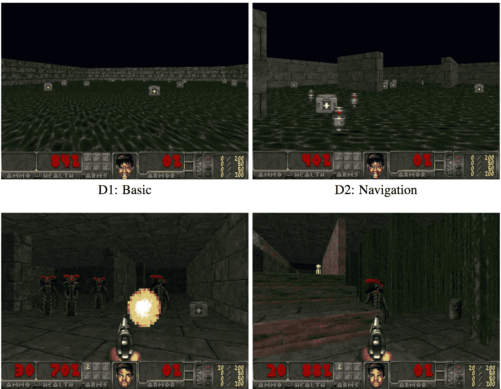
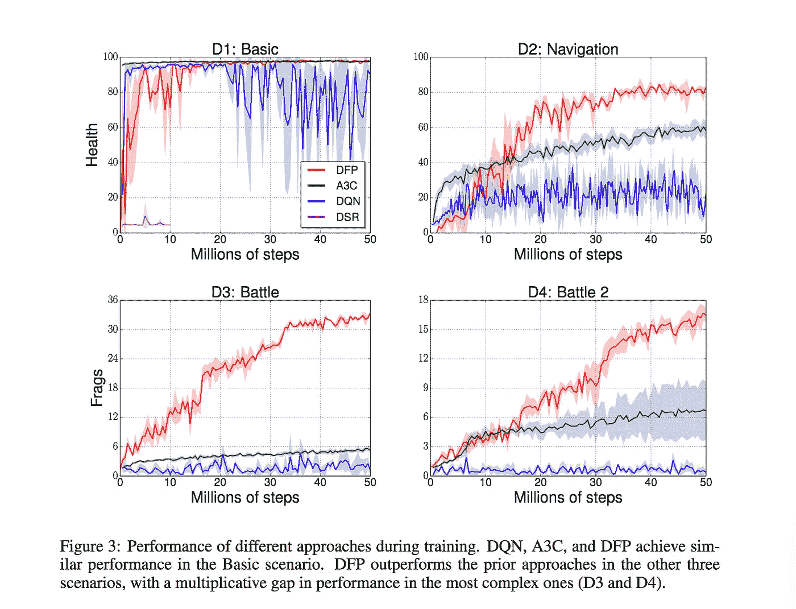

# 强化学习可以使用更多的监督吗？

> 原文：<https://towardsdatascience.com/does-reinforcement-learning-require-more-supervision-4378e839c339?source=collection_archive---------4----------------------->

Apparently this is a popular video game. Video games are an area of apparently-relevant ML knowledge where my scope of understanding is woefully incomplete

当我最初读到这篇论文的标题[通过预测未来来学习行动](https://arxiv.org/pdf/1611.01779v2.pdf)时，我满怀希望地认为，它将为一个我已经思考了一段时间的问题添加一个令人信服的解决方案:在头脑中没有特定目标的情况下，是否有可能教授一个强化学习模型来了解世界。这是真的:在某种意义上，这篇论文解决了这个问题，但我发现它比我希望的更有限。

本文的核心实现细节是，教导代理玩第一玩家射击游戏 Doom，而不是基于奖励值的学习，实际的学习是基于强迫我们自己建立一些小的可见测量值的良好预测:健康、耐力和杀戮。这到底是怎么回事？

Network architecture diagram from the Learning to Act… paper

网络最终产生的输出是一个向量，长度等于你试图预测的测量值的数量，乘以你可以采取的可能行动的数量，它代表了我们对我们每个可能行动的世界中的那些测量值的预测。例如，如果我们想象我们的一个动作是“向前一步”,那么向量中的元素 0、1 和 2 可能是我们对从现在起 3 步后的健康、从现在起 3 步后的死亡和从现在起 3 步后的耐力的预测，假设我们从当前状态“向前一步”采取动作。该载体有两个用途:

1.  它帮助我们决定采取什么行动。在本文中，用于选择行动的代理的目标函数由权重定义，该权重指定了三个关键度量中的每一个在我们的目标函数中所占的比例。例如，我们可能对未来的健康赋予 0.5 的权重，对未来的耐力赋予 0.5 的权重，对未来的杀戮赋予 1.0 的权重。在这种情况下，我们采用模型对健康/耐力/死亡的预测，并采取行动，使加权组合在预期中最高。
2.  它提供了模型训练的损失来源。一旦我们选择了要采取的行动，我们就可以观察预测测量的实际值，并可以根据预测和现实之间的差异来计算损失。这是一个简单的均方损失，用来训练我们的模型。

[下一段重点介绍如何创建预期行动预测向量的机制；如果您只是在寻找方法的整体直觉，请随意跳过]

继续向后工作，对应于每个动作的预测向量通过两个向量的组合来学习:期望向量和每个动作向量。这仅仅意味着我们两者都要学

1.  代表我们平均期望的向量，例如，如果我们想象我们只是从动作分布中随机抽取动作，我们的预测会是什么，以及
2.  一个向量，表示与每个动作相对应的期望值的“偏移”。例如，如果我们预测的平均期望值是(4，90，1)，如果我们“向前一步”的预测是(5，88，2)，那么“向前一步动作”的偏移量将是(1，-2，1)

您可能会注意到，期望向量比完整的动作偏移向量短得多，因为它总共只包含一组预测，而不是每个动作一组。而且，你可能是正确的:为了使向量数学起作用，期望向量被“平铺”，即一遍又一遍地重复，直到它与动作偏移向量的长度相同。这些“期望”和“行动”子网建立在三个输入源的基础上:当前状态的像素(进入卷积网络)、当前测量值(进入一组紧密连接的层)和当前目标向量，也就是前面在如何选择下一个行动的上下文中讨论的测量值的权重向量。如果你对为什么要添加目标向量作为输入感到困惑，我也是；我稍后会谈到这一点。

当你在普通游戏中从健康和最终杀戮的角度来看性能时，这种方法确实比两种当前非常流行的强化学习技术要好:双 Q 学习和异步优势演员-评论家(A3C)。

所以。这些都是令人印象深刻的图表。我的缺乏热情源于哪里？为了解释这一点，我认为稍微了解一下强化学习的理论是有益的。本质上不是定理或方程，而是强化学习问题的什么使它们首先变得独特和困难？

I regret nothing

在像国际象棋和围棋这样的游戏中，你需要学习长期策略，以便让自己更接近胜利。然而，至关重要的是，*在任何给定的时间点，你的棋子的可见位置和预期的最终奖励之间没有人类已知的映射，例如获胜的概率*。你不能说赢的本质是这里有 3 个棋子，这里有 4 个，等等，如果你达到了这个标准，你就赢了。这种映射是模型在训练过程中必须学习的。相比之下，在本文中，我们硬编码了观察变量和报酬之间的映射，因此模型需要学习的只是如何预测观察变量。

我认为这是我对论文框架感到沮丧的核心:模型预测的“度量”与其目标并没有太大的不同。目标只是测量值的加权组合。在(1，1，1)目标向量的情况下，这个模型框架相当于“预测从现在开始三步你将积累的奖励金额”。因为这些测量是由人类手工选择的，并手工映射到奖励上，它们似乎并没有真正实现我所希望的承诺:以一种更不受监督的方式从未来发生的事情中学习。

综上所述，我认为，如果你忘记了衡量与奖励的关系，只看它们相等的情况，这种模式与 DQN 和 AC3 相比的表现确实表明，在你经常获得奖励的环境中，这种模式具有很强的竞争力。在 DQN 和 AC3，行动的价值(/Q 函数)本质上是递归的:对行动和游戏结束之间将获得的奖励金额的预测。这篇论文建议，你可以通过直接优化从现在开始的几个步骤来做得很好，而不是使用更复杂的过程，通过长长的梯度传递链来到达游戏的结尾。在需要长期战略的环境中，这显然是不够的，但在更短期的情况下，这种降低的复杂性可能会提供很多价值。

总而言之，这篇论文的一个(间接)贡献是，它让我更清楚、更清晰地思考“学习一套行为”这一大伞下的不同类型的问题，以及这些问题的不同奖励结构如何能够、也应该引导你以根本不同的方式将这些问题概念化，这是我非常欣赏的。

*该论文实际上使用了一系列帧的测量结果，但就人类游戏时间而言，这是一个相对较短的窗口；3-4 秒。