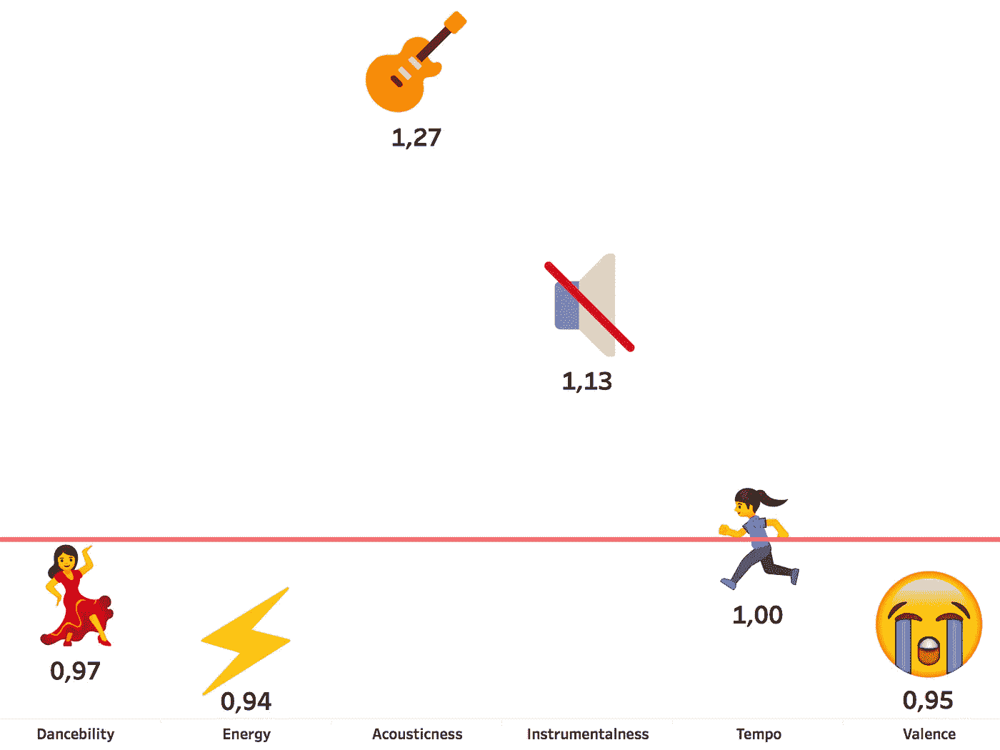
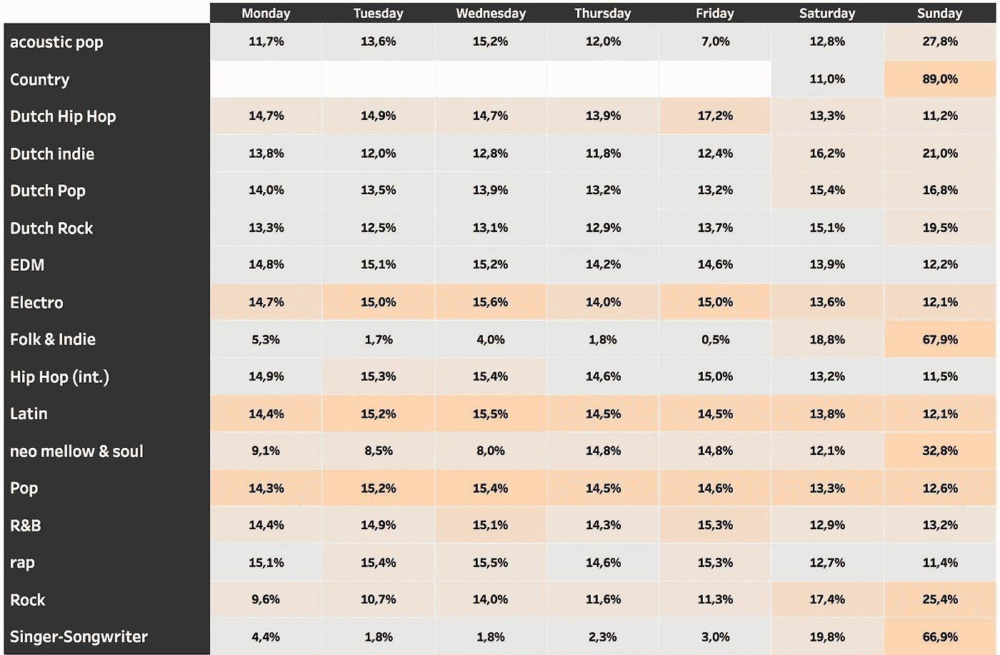
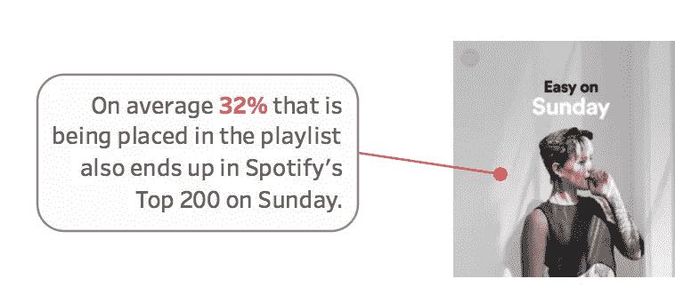

# Spotify 周日的图表与本周其他时间有所不同吗？

> 原文：<https://towardsdatascience.com/does-spotifys-chart-on-sunday-differ-from-the-rest-of-the-week-d7272f300508?source=collection_archive---------9----------------------->

审视我自己的倾听行为，我经常承认，与一周中的其他时间相比，我在周日倾向于有不同的偏好。这一天，你只想以较慢的速度做事，包括 BPM。不过，我想知道，如果不仅仅是我，是否会有很多其他荷兰 Spotify 用户陪着我...根据我的经验，我注意到当你在周一看图表时(显示周日的热门曲目)，你可以发现与本周其他时间相比有一些细微的差异。一些浮出水面的想法，进一步调查 Spotify 在周日和本周其他时间的前 200 名之间的差异。

## 数据集

*   我收集了从 1 月 5 日到 5 月 17 日荷兰的所有 Spotify 每日排行榜。这是通过*网页抓取方法*完成的。
*   为了更准确地了解工作日之间的差异，我必须检索所有排行榜上的艺术家的相关流派。这可以通过 Spotify 的 API 来实现。
*   为了查看声音是否有差异，我还检索了所有排行榜曲目的声学变量。这也是 Spotify 的 API 功能之一。
*   通过 [Spot on Track](https://www.spotontrack.com/playlists/367317/2018-02-04) 我设法获得了 Spotify 的 [Easy on Sunday](https://open.spotify.com/user/spotify/playlist/37i9dQZF1DWZpGSuzrdTXg?si=3w09NeimQLyu3e3UkEN1EA) 播放列表中多个周日的曲目列表，从 1 月到 5 月。

## 声音的差异

在我之前在 Eurovision 发表的文章中，我描述了 Spotify 分配给音轨的声学变量。我们还可以利用这些来确定周日和本周其他时间的排行榜上的曲目之间是否有任何差异。所以基本上我们试图回答周日*的星盘与本周其他时间相比是否有所不同。*

如下图所示，我们可以断定**声音**和**仪器**与前几天相比表现出色。**化合价(情绪)、dancebility** 和**能量**表现略差。

看着这些指数得分，我觉得这很符合人们可能会认为周日更舒适的假设。效价(情绪)测量的指数为 0.95 也是有意义的，因为这个变量是从 0(悲伤)到 1(快乐)来测量的。

## 流派差异

当你在周一看 Spotify 排行榜时，你会立即注意到相当多的歌曲的流量和位置有所下降。为了更好地了解不同流派在工作日的份额，我检索了 Spotify 前 200 名中出现的歌曲/艺术家的所有相关流派。从那以后，对于每个流派，我都根据图表收录/流来计算每个工作日的份额。

与一周的其他时间相比，乡村音乐、流行音乐、创作歌手、新成熟音乐、灵魂乐、摇滚、民谣、独立音乐和荷兰流行音乐、独立音乐和摇滚音乐在周日的排行榜上所占的份额明显更高。

相反，我们看到像(荷兰)Hip Hop、Pop 和 EDM 这样的流行流派在周日有所下降，但与我们在周日看到高增长的流派相比，它们的份额在一周的其余时间里保持更加一致。

## 播放列表影响

Spotify 在荷兰最受欢迎的播放列表之一是他们的 [**Easy on Sunday 播放列表**](https://open.spotify.com/user/spotify/playlist/37i9dQZF1DWZpGSuzrdTXg?si=uD2TX9rUTwOqcWKK0fCJwA) 。我以前注意到，这个播放列表的策展与周日的新图表条目有相似之处。通过查看从 1 月到现在的 19 个周日，我想更好地了解这个播放列表在那个特殊的日子对荷兰排行榜的影响。这个播放列表对周日的 Spotify 排行榜有直接影响吗？

平均而言, **32%的曲目** (32 首不同的曲目，因为播放列表由 100 首曲目组成)被放置在周日播放列表**中，并在同一天(周日)出现在图表**中。

可以肯定的是，它不仅仅是以流行音乐为特色，而是在整个一周内都出现在图表中，我对其他工作日做了同样的计算。事实证明，周一至周五和周六、**、**分别出现在排行榜和《周日轻松》中的曲目平均数量为 **5.5%** **和 **16.6%，这意味着该播放列表在周末对排行榜有重大影响——导致相当多的新曲目仅出现一天。大多数曲目的位置范围在 101 和 200 之间，而播放列表位置高的曲目往往会进入前 100。****

下图显示了在过去的几个月里，播放列表中当天就出现在排行榜上的歌曲的百分比。

## 放弃

*   Spotify 给艺术家贴了很多不同流派的标签。对某些子类型进行了分组，以保持一个全球概览。
*   上面提到的所有分析和结果完全基于荷兰 Spotify 图表。因此，这些结果可能与其他地区不同。最后，这只是涵盖了 Spotify 平台的图表部分，不应被视为 Spotify 图表范围之外的收听行为的整体表现。

**感谢阅读！如果你喜欢读这篇文章👏🏻很感激。**