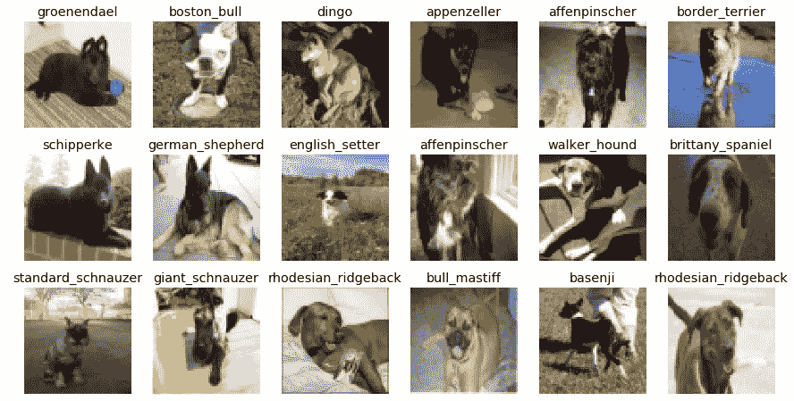
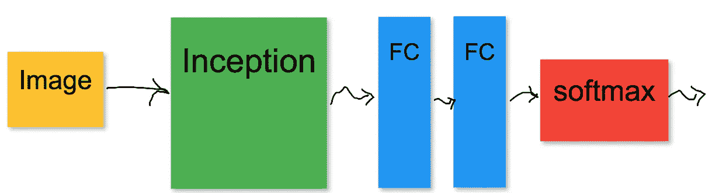
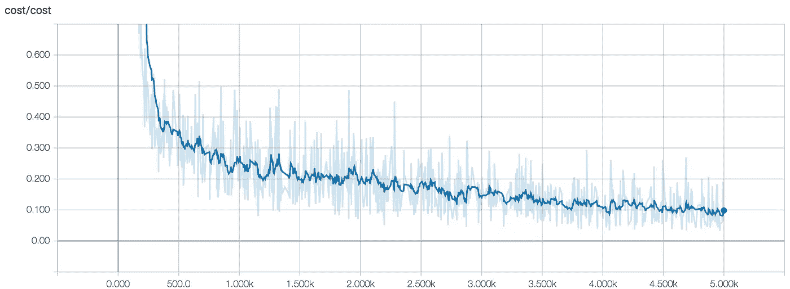
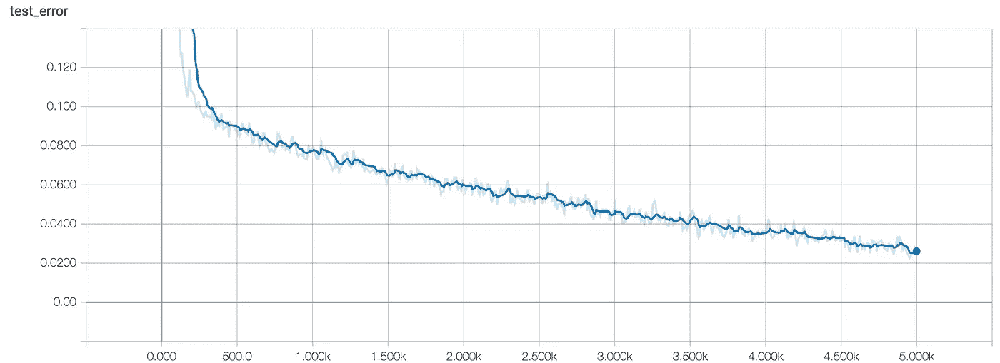
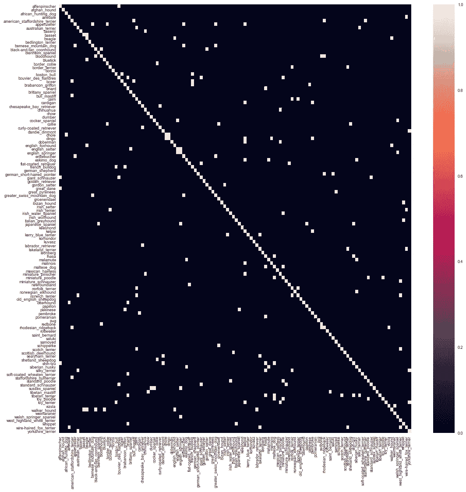
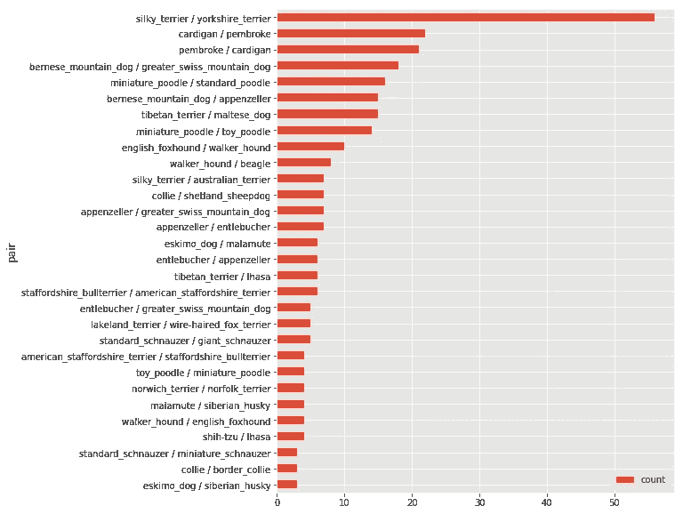
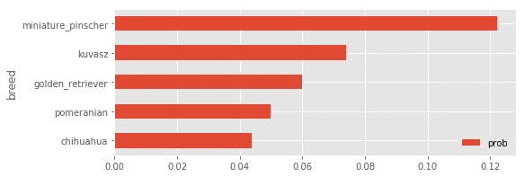

# 使用深度学习的犬种分类:一种实践方法

> 原文：<https://towardsdatascience.com/dog-breed-classification-hands-on-approach-b5e4f88c333e?source=collection_archive---------2----------------------->

Preview of images from [Stanford Dogs Dataset](http://vision.stanford.edu/aditya86/ImageNetDogs/)

# 问题

几天前，我注意到由 Kaggle 主办的[犬种鉴定挑战赛。我们的目标是建立一个模型，能够通过“观察”狗的图像来进行狗的品种分类。我开始思考建立这样一个模型的可能方法，以及它可能达到的精确度。似乎有了像](https://www.kaggle.com/c/dog-breed-identification) [TensorFlow](https://www.tensorflow.org/) 这样的现代机器学习框架，以及公开可用的数据集和预先训练的图像识别模型，这项任务可以以相当高的准确度解决，而无需付出太多努力和花费太多时间和资源。我将分享使用 TensorFlow 构建犬种分类器的端到端过程。

> [repo](https://github.com/stormy-ua/dog-breeds-classification)包含重现训练和使用训练好的模型运行推理所需的一切。

# 训练数据集

拥有一个好的训练数据集是迈向健壮模型的一大步。斯坦福狗数据集有大约 20000 张 120 个品种的狗的图片。数据集中的每张图片都标注了显示的狗的品种。你可能已经注意到，只有 120 个不同品种的大约 20000 张图片(每个品种大约 200 张图片)不足以训练一个深度神经网络。卷积神经网络(CNN)是公认的用于图像分类的最佳机器学习模型，但在这种情况下，没有足够的训练样本来训练它。它将无法从这个数据集中学习足够通用的模式来对不同的狗品种进行分类。最有可能的是，它会过度适应这少量的训练样本，从而降低测试集的准确性。有两种可能的方法来缓解缺乏训练样本的情况:

*   将 dogs 数据集与另一个更大的带有图像的数据集(即 [ImageNet](http://image-net.org/) )合并，并在这些合并的例子上训练 CNN。
*   在一个更大的数据集上采用一个已经预先训练好的深度神经网络，切入其中，并附加一个额外的“分类头”，即几个额外的完全连接的层，Softmax 层位于它们的顶部。

第一种方法有两个很大的缺点:需要分析的数据量要大得多，而且在这个大数据集上进行训练需要花费更多的时间和资源。第二种方法似乎很有希望:必须在原始数据集上执行训练，并且训练仅具有几个完全连接的层的“分类头”将不需要大量的时间和资源。

> 在较小的数据集上训练带有“分类头”的预训练模型的方法被称为迁移学习。

迁移学习确实起作用的原因在于 CNN 的工作原理。有相当多的资源详细描述了这一点，例如[http://cs231n.stanford.edu/](http://cs231n.stanford.edu/)。简而言之，在大数据集上训练的深度神经网络的底层捕获图像的低级图元(例如，轮廓和简单形状)，使得这种知识对于所有图像是通用的，并且可以“转移”到任何图像识别问题。

# 神经网络模型

所以最终的神经网络模型如下:

图像被输入到初始模型中。Inception 模型的输出经过几个完全连接的(FC)层，最后 softmax 输出图像属于每个类的概率。只有代表“分类头”的 FC 层必须接受培训。初始模型保持冻结，并带有已经预定义的模型参数。

# 下载和准备数据

下一步是下载 dogs 数据集，并通过 Google Inception 模型进行预训练。从回购的根目录执行时，[*setup*/*setup . sh*](https://github.com/stormy-ua/dog-breeds-classification/blob/master/setup/setup.sh)*脚本将下载所有内容，进行解压缩，并放入适当的目录。下载和提取后的 Dogs 数据集是一组文件夹，在单独的文件中包含图像和注释。TensorFlow 有一个漂亮的[数据集 API](https://www.tensorflow.org/versions/r1.4/programmers_guide/datasets) ，它可以更好地处理 TF Records 数据格式。这个想法是将所有的训练示例和它们的注释保存在一个文件中，所有的示例都以一个 [protobuf](https://developers.google.com/protocol-buffers/docs/overview) 序列化的形式存储在这个文件中。TensorFlow Dataset API 可以有效地处理这种数据格式，并在训练期间以最少的磁盘 I/O 操作和内存需求加载所需数量的示例。有一个 [python 脚本](https://github.com/stormy-ua/dog-breeds-classification/blob/master/src/data_preparation/stanford_ds_to_tfrecords.py)将原始 dogs 数据集转换成 TF 记录文件，以备训练使用:*

*它必须从回购的根目录执行。转换数据集可能需要大约 1 小时。每一个图像都被输入到初始模型中，并且它的输出与图像和其他注释一起被存储。这简化了训练，因为我们不需要在训练期间计算每个例子的初始输出，而是，它已经被预先计算并且准备好被使用。结果 TF Records 文件将在*data/Stanford . TF Records . setup . sh 中*脚本还下载并提取 Google 的 Inception 模型，表示为冻结的 TensorFlow 图。冻结意味着所有变量都被替换为常数并嵌入到图形本身中，这样就不需要为了将模型加载到 TensorFlow 会话中并开始使用它而将检查点文件与图形一起携带。初始模型在*freezed/Inception/classify _ image _ graph _ def . Pb .*中*

# *培养*

*下一步是实际执行培训。首先，可能会给模型一个唯一的名称。第二，应该配置多个完全连接的层和这些层中的多个单元。可以在[*src/common/consts . py*](https://github.com/stormy-ua/dog-breeds-classification/blob/master/src/common/consts.py)模块中配置。*

*默认情况下，有两个 1024 和 120 单位的完全连接层。并且输入层具有 2048 个单元，这等于初始模型的最后一层中的单元数量。*

*[*src/training/train . py*](https://github.com/stormy-ua/dog-breeds-classification/blob/master/src/training/train.py)做训练。学习率、时期数和小批量大小可以在脚本本身中配置:*

*另外，[张量板](https://www.tensorflow.org/get_started/summaries_and_tensorboard)可以启动用于训练监控:*

*有三个可用的度量:成本、测试集上的错误和训练集上的错误。默认情况下，错误率是针对训练集中的 3000 个示例和也有 3000 个示例的整个测试集计算的。我用以下超参数训练模型:*

*   *小批量= 64*
*   *学习率= 0.0001*
*   *纪元计数= 5000*

*以下是我在 TensorBoard 中获得的这三个指标的数据:*

**

*Cost*

**

*Test set error*

**

*Error on a sample from the training set*

*执行 5K 个纪元花费了大约 1 小时。培训结束后，指标具有以下值:*

*   *成本= 0.1*
*   *测试误差= 2.7%*
*   *训练误差= 2.5%*

*这两个错误在测试集和训练集上都非常低。并且由于训练集上的误差与测试集上的误差大致相同，因此不存在对训练集的严重过度拟合的症状。*

# *冻结模型*

*一旦模型被训练，其优化参数被存储在*的检查点文件中。/检查点*目录。为了有效地重用模型进行推理，最好将它作为一个冻结的张量流图，并将参数嵌入到图本身中。这可以使用[*src/freezing/freezy . py*](https://github.com/stormy-ua/dog-breeds-classification/blob/master/src/freezing/freeze.py)*:*来完成*

*该脚本按以下顺序执行几项操作:*

*   *将初始模型和“分类头”模型加载到同一个 TensorFlow 会话中，并将它们一起绑定到单个计算图中，以便初始模型的输出直接进入“分类头”模型的输入。一旦绑定完成，脚本就会在文件系统上序列化图中的复合模型。此时，图形还没有冻结，因为在训练期间计算的模型参数仍然在检查点文件中。*
*   *使用 tensor flow[*freeze _ graph*](https://github.com/tensorflow/tensorflow/blob/master/tensorflow/python/tools/freeze_graph.py#L206)函数冻结上一步生成的图形。它从检查点文件中获取模型参数，并将它们注入到图形变量中。图形变量依次被转换成常量。结果文件转到*。/冻结了*目录下的型号名称。*

# *推理*

*一旦冷冻模型准备好了，就可以对任意图像进行分类了。[*src/inference/classify . py*](https://github.com/stormy-ua/dog-breeds-classification/blob/master/src/inference/classify.py)*脚本能够对存储在文件系统上或作为 HTTP 资源可用的狗图像进行分类。在幕后，它加载冻结的图形并将图像输入其中。这里有两个例子来说明推论是如何对艾尔代尔梗和西施犬起作用的:**

**如果你只是想玩玩推理是如何工作的，有一个 [docker 容器](https://hub.docker.com/r/kirillpanarin/dog_breed_classification/)，里面装着所有的代码和冻结的模型。它公开 Python notebook 进行推理。它实际上已经为在 docker 容器内部进行培训做好了一切准备。可以使用以下命令启动容器:**

**一旦容器启动，浏览浏览器到`http://localhost:8888/notebooks/Inference.ipynb`，你将能够对你自己的图片进行分类。**

# ****错误分析****

**仔细研究机器学习模型未能正确分类的例子总是一个好主意。脚本[*src/analysis/training _ perf _ analysis . py*](https://github.com/stormy-ua/dog-breeds-classification/blob/master/src/analysis/training_perf_analysis.py)*生成CSV 文件(它转到 metrics/training_confusion.csv ),其中包含所有训练示例的预测和实际品种。***

**通过从 *training_confusion.csv* 加载数据，可以绘制混淆矩阵:**

****

**这里很难进行详细的分析，因为品种太多了。让我们试着找出前 30 对分类错误的品种(如何做的例子可以在 [Confusion.ipynb](https://github.com/stormy-ua/dog-breeds-classification/blob/master/Confusion.ipynb) 中找到):**

****

**Top 30 misclassified pair of breeds**

**可以看出，这一对“丝毛梗/约克夏梗”在错误分类方面是绝对的领导者，如果我们研究一下这两个品种的狗看起来像什么，这确实是有意义的。**

**丝毛梗和约克夏梗似乎经常被人混淆。更多详情在[本文](https://www.cuteness.com/article/difference-between-yorkie-silky-terrier)。**

# **你喜欢狗吗？**

**如果你认为自己是个爱狗的人，你可以直接问模特你是什么品种:)就我而言，我得到了以下答案:**

****

**Miniature Pincher! What?**

# ****结论****

**正如我们所见，如果您可以访问预训练的深度神经网络和 TensorFlow 等现代机器学习库，即使您没有足够的训练图像和/或计算资源，也可以训练一个鲁棒的图像分类器。**