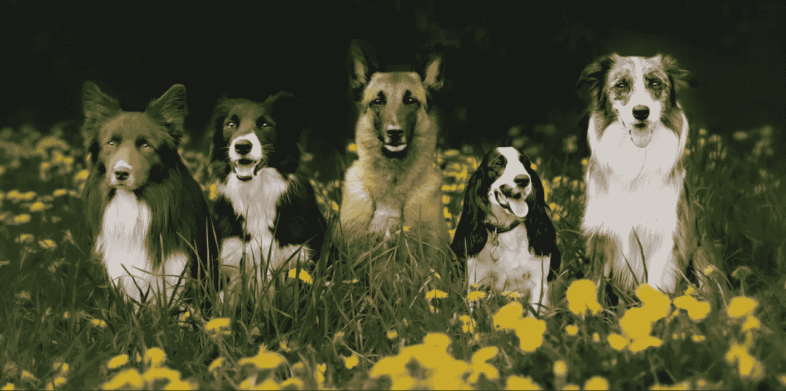
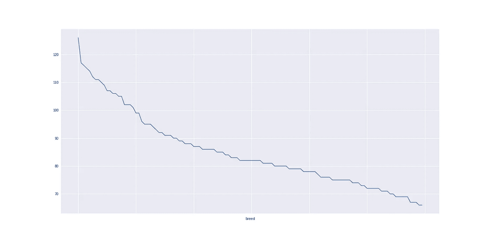
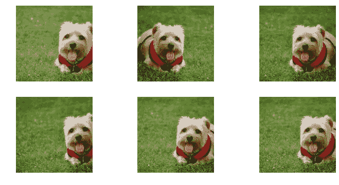
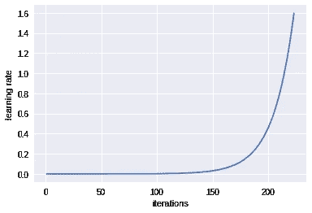
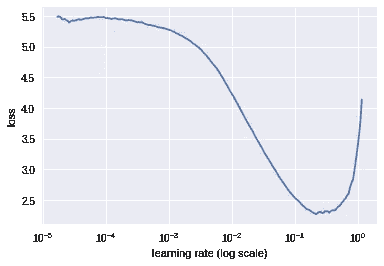
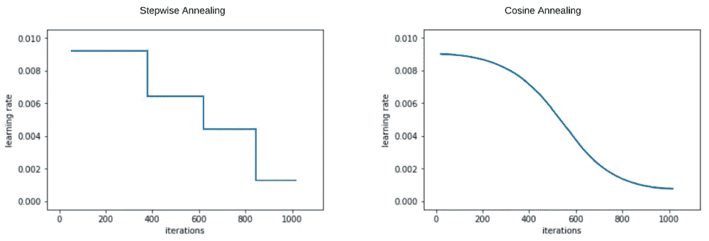
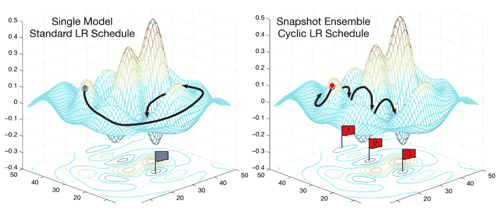
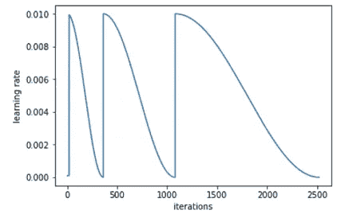

# 那是什么品种的狗？

> 原文：<https://towardsdatascience.com/dog-breed-identification-e3c6d6b4be84?source=collection_archive---------8----------------------->

## 利用深度学习确定狗的品种。

我参加了这个游乐场 [kaggle 竞赛](https://www.kaggle.com/c/dog-breed-identification)，目标是创造一个能够从照片中确定狗的品种的分类器。该数据集包括 120 种狗。下图显示了每个品种的狗的数量在 60 到 130 之间。

number of dogs VS breed

我们将使用建立在[**ResNeXt-50**](https://github.com/facebookresearch/ResNeXt)**网络架构上的预训练模型。该模型在 ImageNet 数据库上训练，该数据库包括分布在 1000 个类中的 120 万个图像。**

# **改善深度学习模型的关键实践**

## **数据扩充:**

**要改进一个 DL 模型，最重要的事情就是给它更多的数据。如果你持续训练你的模型一段时间，它会开始过度拟合。**

> **过度拟合意味着模型正在学习识别训练集中的特定图像，而不是学习可以转移到验证集中的一般图像。
> 如果您的训练集损失显著低于验证集损失，则模型过度拟合。它不能在验证集中再现高精度，因此，它在测试集中的表现同样差。**

**修复过度拟合的一种方法是有效地向模型提供更多数据。我们可以收集更多的数据，但另一种更简单的方法是数据扩充。这是指以不应该影响图像解释的方式随机改变图像，例如水平和垂直翻转、放大和缩小、改变对比度和亮度等等。**

****

**6 different versions of the same image.**

## **学习率查找器:**

***学习速率*决定了您希望在梯度下降的帮助下更新*权重*(或*参数*)的快慢。学习率是最难设置的参数之一，因为它会显著影响模型性能。**

****

**如果学习率太小，梯度下降会非常慢。另一方面，如果学习率太大，梯度下降会超过最小值。它可能无法收敛，甚至发散。**

**为了找到最佳的学习速率，我们将使用 Leslie N. Smith 在 2015 年论文[中开发的用于训练神经网络的循环学习速率](https://arxiv.org/abs/1506.01186)的技术。**

********

**这个想法是不断增加学习率指数，直到损失停止下降。**

**最初，当学习率较低时，损失改善不多。随着学习率的增加，损失将在一段时间内显著改善，直到学习率变得太大，损失迅速增加。这是因为随着学习率变得太大，我们开始偏离最小值。**

**我们需要在图上选择一个损失减少最快的点。在这个例子中，当学习率在 0.01 和 0.1 之间时，损失函数快速减小。**

## **重启随机梯度下降(SGDR):**

**这与**学习速率退火**的思想密切相关**

> **当你越来越接近损失最小的点时，你应该开始降低学习速度，以便准确地到达正确的点。这种在训练时降低学习率的想法被称为**学习率退火。****

****

**实现这一点的“黑客”方法是*逐步退火*，即使用特定的学习速率一段时间，当损失停止改善时，手动降低它。一个更好的方法是使用函数形式。余弦曲线的一半似乎是完美的拟合。它会在一段时间内保持较高的学习率，然后在接近最小值时迅速下降。**

****

**当我们想避免陷入函数的局部极小值时，SGDR 就出现了。陷入局部最小值意味着我们不在重量空间的弹性部分，由于重量的小变化可能导致损失的大变化。因此，SGDR 使用的技术提高了我们的模型找到函数的全局最小值的能力。**

****

**Iteration VS Learning-Rate for SGDR**

**基本思想是在一定次数的迭代后重置我们的学习率，这样如果我们出现停滞，我们就可以跳出局部最小值。在实践中，这被证明是对普通 SGD 的一个重大改进。**

****

**如果周期太短，我们就没有给 SGD 足够的时间去寻找最小值。我们需要一种方法来延长我们降低学习速度的时间。我们可以以倍增的方式延长迭代次数，而不是在一定次数的迭代后重新开始。**

## **不同的学习率:**

**如前所述，我们正在使用一个预先训练好的模型。这意味着我们只是在预训练模型的顶部添加一些层，并且只训练新添加的层，称为 ***密集层*** 。这是一种迁移学习。**

> **迁移学习是使用在一个过程/活动中学到的知识并将其应用于不同任务的过程。**

**我们可以通过在卷积层和密集层上进行训练来改进我们的模型。虽然，我们不需要像后期的密集层那样改变前期的卷积层。这是 ***差异学习率的基础。*****

> ****不同的学习率**意味着在我们的培训中，网络的不同部分有不同的学习率。其思想是将各层划分为不同的层组，并为每组设置不同的学习速率，以便获得理想的结果。**

****

**红色图层学习基本特征，如边缘、形状，中间的蓝色图层学习与数据集相关的特定细节。**

**鉴于上面的陈述，过多地改变初始层的学习权重不是一个好主意，因为它们已经擅长于它们应该做的事情(检测像边缘等特征)。中间层将了解复杂的特性，如果我们稍微修改它们，这些特性可能在某种程度上有助于我们的任务。所以，我们想稍微调整一下。**

**在这方面，不同的学习率有助于我们。我们现在可以把一个样本网络想象成三层组(红、蓝、绿)，并设置不同的学习速率。最初的红色层将具有较小的学习率，因为我们不想过多地干扰它们，中间的蓝色层将具有比初始层更高的学习率，而最终的绿色层将具有最佳的最高学习率。**

**初始层和中间层的学习率的多少取决于预训练模型和我们需要的模型之间的数据相关性。例如，如果任务是创建一个狗/猫分类器，并且我们的预训练模型已经擅长识别猫，那么我们可以使用较小数量级的学习率。但是如果我们的任务是在卫星图像/医学图像上创建一些模型，那么我们的学习率会稍微高一些。**

## **测试时间增加(TTA):**

**在测试阶段，我们所有的测试图像在通过我们的模型时都会被自动裁剪成一个正方形。这样做的原因是一种次要的技术细节，但如果你有不同的图像尺寸，GPU 不能够有效地执行。这可能会在未来得到解决，但就目前而言，这是我们拥有的技术状态。
*这可能会导致图像的一些非常重要的特征被遗漏，而这些特征对于图像的准确预测至关重要。* 在测试时间增强中，我们将随机进行 4 次数据增强，以及未增强的原始数据(中间裁剪)。然后，我们将计算所有这些图像的预测值，取平均值，并将其作为我们的最终预测值。这确保了我们在这 5 个不同的方块内捕捉到整个画面。**

# **结果**

**使用上述实践，我能够在验证集上实现 92.6%的准确率，即模型之前没有见过的图片。**

# **参考**

*   **[fast.ai](http://fast.ai)**
*   **莱斯利·史密斯。训练神经网络的循环学习率。 *arXiv 预印本 arXiv:1506.01186***
*   **[https://medium . com/38 th-street-studios/exploring-random-gradient-descent-with-restructs-sgdr-fa 206 c 38 a 74 e](https://medium.com/38th-street-studios/exploring-stochastic-gradient-descent-with-restarts-sgdr-fa206c38a74e)**
*   **[https://towards data science . com/transfer-learning-using-differential-learning-rates-638455797 f00](/transfer-learning-using-differential-learning-rates-638455797f00)**