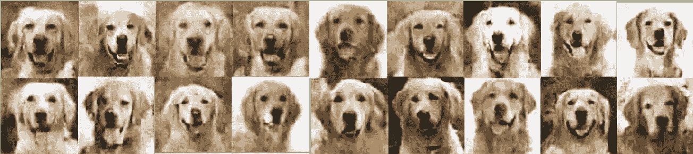
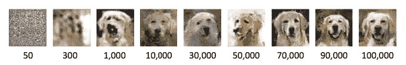
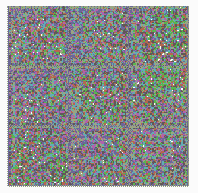
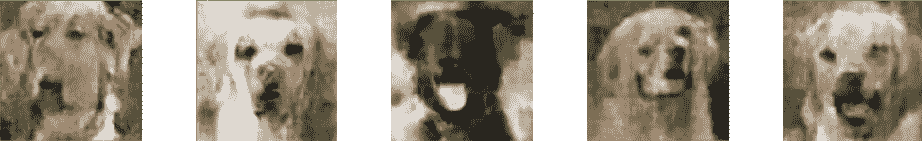
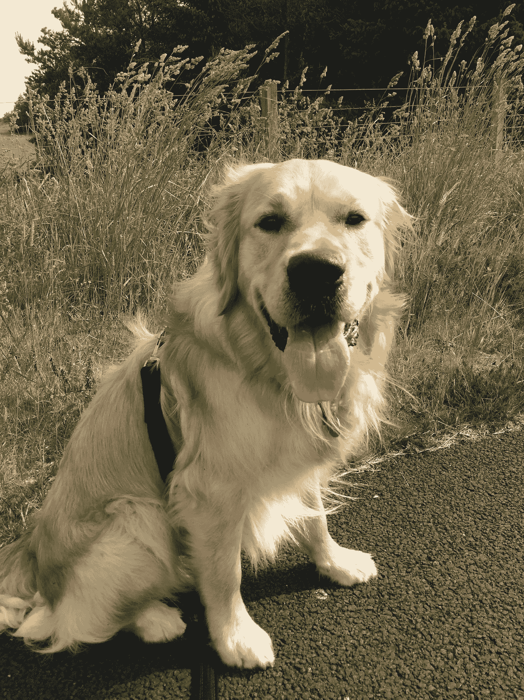

# DOGNET:人工智能模型能骗过人类吗？

> 原文：<https://towardsdatascience.com/dognet-can-an-ai-model-fool-a-human-85ed90c2326c?source=collection_archive---------23----------------------->

## 建造一只 DC 猎犬来创造金毛猎犬的图像，并通过一项调查来测试人们是否能区分真假图像

实验很简单:机器学习(ML)模型能否产生人们会误认为是真实的金毛猎犬图像？选择狗的原因…是因为狗很棒！

在我们当前的气候下，我们经常听到“假新闻”这个词，随着 ML 模型变得越来越先进，他们创建非人类内容的能力只会越来越好。因此，我认为让人们有机会测试他们辨别“真实”或“虚假”图像的能力是合适的。为创建这些图像而构建的 ML 模型被恰当地称为 DOGNET，它来自于一个称为 GANs(生成对抗网络)的模型分支。

尽管 DOGNET 大多有点好玩，但 GANs 也有现实世界的应用:它们有能力生成新内容、增强图像、填充缺失内容，甚至检测医学成像中的实体。

# GAN 是如何工作的？

在 GAN 中，两个神经网络相互竞争；姑且称之为生成器和鉴别器吧。对于生产者来说，一个很好的类比是将其视为一个伪造者，试图制造假币。鉴别者的工作就像警察一样，试图发现欺诈行为，并确定货币是假币还是真币。

GAN 的目标，特别是我们的生成器，是最大限度地提高其创造假东西的能力，鉴别器会将其归类为真的。为了实现这一点，鉴别器将被给予来自生成器的例子或者真实的例子，并且它必须决定所呈现的是“真实的”还是“虚假的”。

如果生成器未能生成足够假的图像，它将受到处罚，当鉴别器说一个真实的例子是假的时，同样的情况也会发生。保持两个神经网络的训练平衡很重要:拥有一个太擅长识别假货的鉴别器会阻止生成器学习，反之亦然。

# 建筑狗网

DOGNET 模型是使用 TensorFlow 构建的深度卷积(DC) GAN。它在 AWS SageMaker 上使用 *ml.p2.xlarge* GPU 实例进行了 120，000 次迭代训练。训练数据集由 300 张金毛寻回犬图像组成，这些图像在狗的颜色、头部位置、嘴部位置和环境方面都有所不同。随着模型的训练，我们可以查看生成器组件在学习创建狗的图像时产生了什么:

Generator output images at different iteration steps

Animation of Generator training

在这个过程中，模型并不总是正确的。这里有几个我最喜欢的尝试:

Model training producing some interesting results

# 实验和结果

一旦模型生成了我认为不错的金毛寻回犬图像，我就想测试人们是否能从训练数据中的实际例子中区分出模型生成的图像。为此，我整理了一份简短的调查，由同事、家人、朋友和数据科学界的其他专业人士填写，共收集了 104 份调查回复。

下表总结了这些数据，受访者必须首先从四个选项中识别“真实”图像，然后从四个选项中识别“虚假”图像(正确答案以绿色表示)。

Table of survey responses: Q1\. Select which image you think has not been created by our model. Q2\. Select which image you think has been created by our model

结果显示，这并不是一项容易的任务:只有 24.0%的受访者正确回答了 Q1，29.8%的人正确回答了 Q2，只有 12.5%的人两个问题都答对了。

应用二项式检验表明，对于这两个问题，不存在大于预期的 25%的显著差异(Q1 p=0.63 [单侧]；Q2 p=0.15 [单侧])。换句话说，在选择正确的图片方面，参与者并不比随机挑选的人强多少。

# 养狗会影响你的机会吗？

对于 Q1 来说，正确回答率没有太大的区别:在那些不养狗的人中，22%回答正确，在那些养狗的人中，26%回答正确。在 Q2，22%的非养狗者猜对了，相比之下养狗者只有 38%。尽管准确性有所提高，但卡方检验显示这些变量之间的关系并不显著( *χ* 2 [2，N = 104] = 3.08，p=0.08)。换句话说，从统计数据来看，拥有一只狗并没有增加你识别 DOGNET 产生的“虚假”图像的机会。

# 结束语

虽然 DOGNET 被设计成一个有趣的实验，但它确实揭示了当它与真正的狗图像放在一起时，它产生的输出对我们来说是难以区分的。与典型的照片相比，这些图像的分辨率显然较低，但它确实提出了一个有趣的问题:随着这些模型的不断发展，我们是否仍然能够在我们的在线内容中区分“事实”和“虚构”？

我将给你们留下我的狗韦斯利的最后一张照片，我可以肯定地告诉你们，它是真正的:D

Source: Christopher Doughty