# 在 Google 云平台的命令行上做数据科学

> 原文：<https://towardsdatascience.com/doing-data-science-at-the-command-line-38fe9f17121d?source=collection_archive---------10----------------------->

数据工程是关于收集和收集数据，以适当的方式存储数据，进行一些处理并提供给数据科学家。

每个数据科学家在享受总是期待的建模阶段之前，都必须面对许多数据工程和数据准备任务。此外，当开始一个新项目时，你必须考虑选择正确的语言和平台的权衡。

此刻抛开平台，R，Python，Julia，Matlab，Octave 等。是数据科学中使用的一些语言吗，特别是 R 和 Python，它们在过去几年中有了很大的发展，并且有很大的社区支持。

然而，现在我想解释你如何通过使用你的操作系统命令行来面对许多初始任务，以及 shell 如何必须是你的堆栈的一部分。

我们将发现像 curl、 [sed](https://www.gnu.org/software/sed/manual/sed.html) 、 [jq](https://stedolan.github.io/jq/) 或 [csvkit](https://csvkit.readthedocs.io) 这样的命令行程序如何通过编写更少的代码来简化您的许多重复任务，通过使用低级接口使其可移植甚至更快。

在这篇文章中，我们将一起使用这些神奇的工具，不需要任何 IDE、笔记本等就可以通过管道传输它们的命令。下载、转换、转换并加载到大数据仓库中。

这些数据由[EMT de Madrid](https://www.emtmadrid.es)(Empresa municipal de transportes de Madrid)发布，可在[http://open data . EMT Madrid . es](http://opendata.emtmadrid.es/Datos-estaticos/Datos-generales-(1))获得，这是一组文件，记录了从 2017 年 4 月到 2018 年 8 月 [BiciMad](https://www.bicimad.com/) (马德里的公共自行车租赁服务)用户的所有旅行。


© Oriol Salvador ([https://www.flickr.com/photos/boarderland/](https://www.flickr.com/photos/boarderland/))

该集合 ATOW 由 17 个文件和 26.35 GB 的 28.550.144 条记录组成，其中每一条记录记录了两个自行车站点之间的自行车旅行，这两个站点的信息也在一个单独的文件中提供，我们将在后面展示。

为了下载所有这些文件，我更喜欢做一些 web 清理，这样我甚至可以自动下载并以编程方式获取新数据。

这可以使用**命令行**轻松完成。首先，我们必须检查所有的链接有一个共同的模式来识别所有的文件。通过使用浏览器开发人员控制台，我们可以检查 DOM 和 HTML 文档源代码来找到链接。

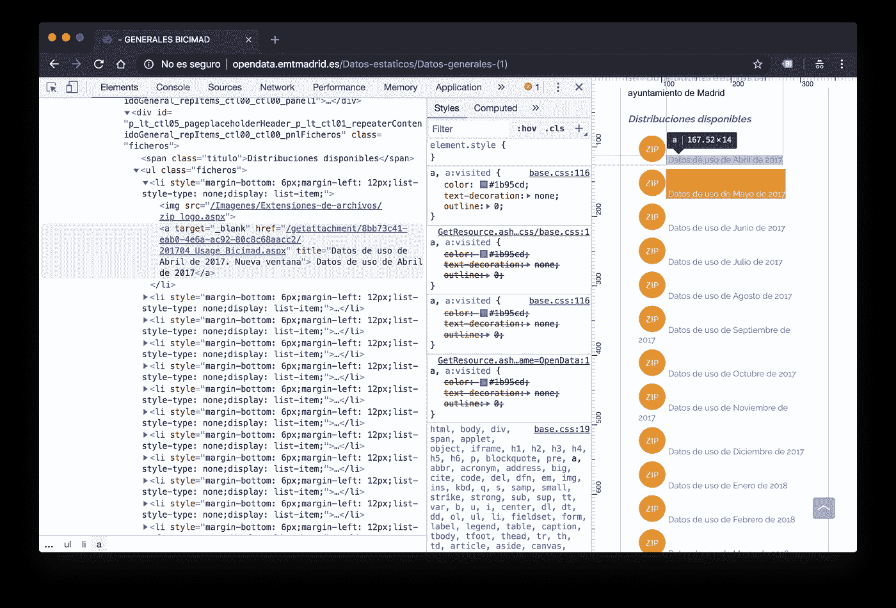

前面的图片显示了所有的文件都有一个共同的结构，所以，是时候做一些编码了！

## 可选择的

> 我喜欢[无服务器](https://en.wikipedia.org/wiki/Serverless_computing)架构和云计算，因为它们通过向每个数据科学家提供无限、可扩展、容错和廉价的资源，使数据科学民主化，而不需要特定的硬件或系统维护。谷歌云平台是我最喜欢的平台之一，我将使用它来启动一个计算引擎实例，并在那里执行所有命令。
> 
> 这基本上和在我自己的笔记本电脑上做是一样的，但我将受益于谷歌云数据中心的巨大带宽。Google 还为所有机器提供了 Google Cloud SDK，无需管理本练习最后步骤所需的身份验证即可使用。这非常符合我做[敏捷数据科学](https://www.oreilly.com/ideas/a-manifesto-for-agile-data-science)的想法。

我们有几种方式与谷歌云平台互动:一个令人敬畏的网络界面，强大的 API，主要编程语言的库，…和实用的 SDK。因为我将只使用 shell，所以 SDK 是我的首选。通过使用它，我也可以确信所有的德 GCP 命令可以在任何操作系统中执行，并很容易向你展示我在做什么。

如果你想自己做，你可以在这里有[指令](https://cloud.google.com/sdk/docs/quickstarts)下载并在你的操作系统中设置它，但是如果你使用的是 Linux 或 Mac(我希望你这样做)，它就像:

```
curl https://sdk.cloud.google.com | bash
exec -l $SHELL
```

安装完成后，您可以通过以下方式开始安装:

```
gcloud init
```

> 对于上一步，你需要一个谷歌云平台帐户。是[免费](https://cloud.google.com/free/)。

现在我准备启动一个虚拟机。我不需要一个非常强大的硬盘，但必须有足够的存储空间来下载所有文件，所以我会安装一个 200G 的硬盘。

```
gcloud beta compute --project=datascience-open-data instances create bicimad-vm --zone=europe-west1-b --machine-type=n1-standard-2 --subnet=default --network-tier=PREMIUM --maintenance-policy=MIGRATE --service-account=874126907357-compute@developer.gserviceaccount.com --scopes=https://www.googleapis.com/auth/cloud-platform --image=ubuntu-minimal-1804-bionic-v20180917 --image-project=ubuntu-os-cloud --boot-disk-size=200GB --boot-disk-type=pd-standard --boot-disk-device-name=bicimad-vm
```

一旦部署了虚拟机，be 就可以从 [Google Cloud Shell](https://cloud.google.com/shell/) 或我们的本地计算机登录到它:

```
gcloud compute --project "datascience-open-data" ssh --zone "europe-west1-b" "bicimad-vm"
```

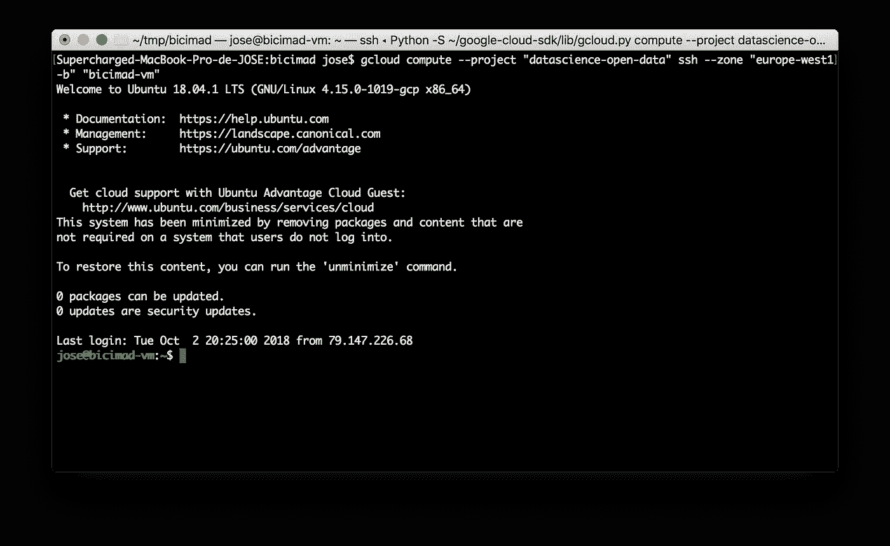

## 下载数据

现在，我们准备将文档源代码下载到本地文件中:

```
curl '[http://opendata.emtmadrid.es/Datos-estaticos/Datos-generales-(1)'](http://opendata.emtmadrid.es/Datos-estaticos/Datos-generales-(1)') > bicimad.html
```

我们可以检查源代码:

```
cat bicimad.html
```

在这里，我们再次检查文件链接是否具有相同的结构:

```
<li style="margin-bottom: 6px;margin-left: 12px;list-style-type: none;display: list-item;"><a target="_blank" href="/getattachment/8bb73c41-eab0-4e6a-ac92-80c8c68aacc2/201704_Usage_Bicimad.aspx" title="Datos de uso de Abril de 2017\. Nueva ventana" > Datos de uso de Abril de 2017</a></li><li style="margin-bottom: 6px;margin-left: 12px;list-style-type: none;display: list-item;"><a target="_blank" href="/getattachment/11054216-35d1-4003-b76b-8421c4a46eb4/201705_Usage_Bicimad.aspx" title="Datos de uso de Mayo de 2017\. Nueva ventana" > Datos de uso de Mayo de 2017</a></li>
```

现在我们必须得到那些文件链接。通过将`sed`与一些正则表达式知识结合起来，这非常容易:

```
cat bicimad.html | sed -n 's/.*href="\/getattachment\([^"]*Bicimad\.aspx\).*/\1/p'
```

这是我们得到的结果:

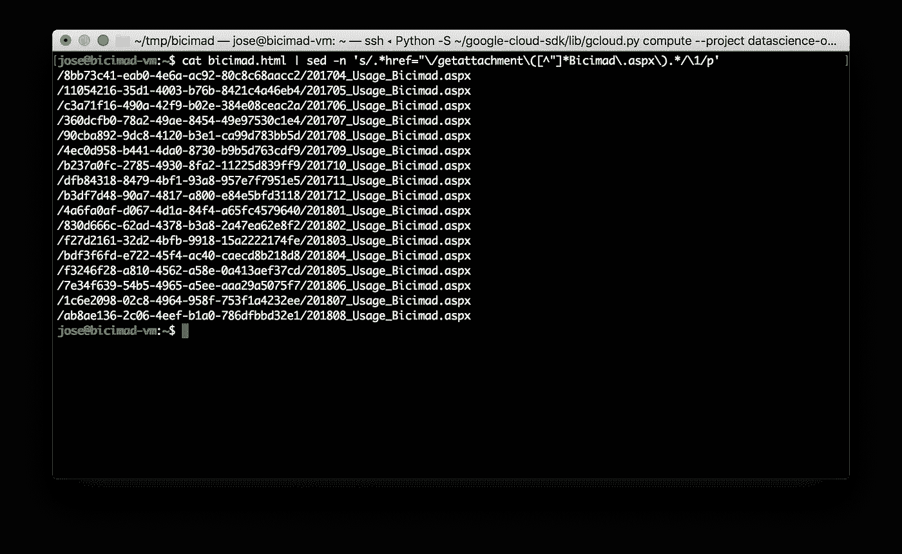

现在我们只需要用域名(*http://open data . EMT Madrid . es*)完成远程服务器中的文件路径就可以获得完整的 URL:

```
cat bicimad.html | sed -n 's/.*href="\/getattachment\([^"]*Bicimad\.aspx\).*/\1/p' | sed -e 's/^/http:\/\/opendata.emtmadrid.es\/getattachment/'
```

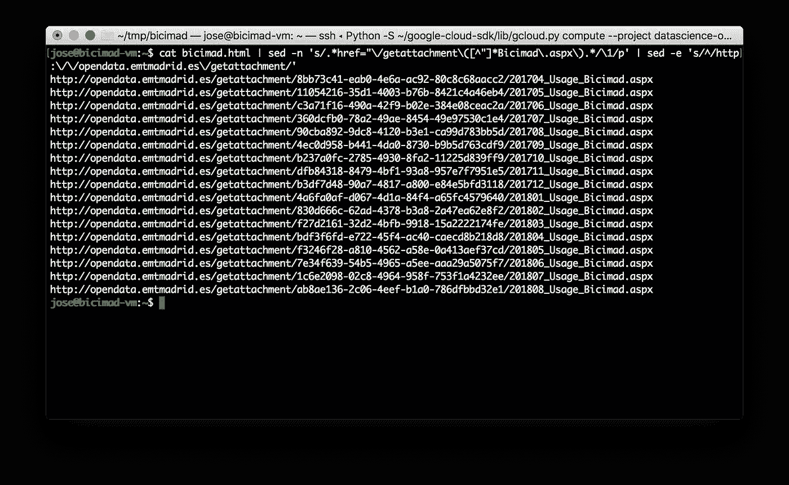

我们将`sed`所做的最终处理保存到一个临时文件`tmp_file`:

```
cat bicimad.html | sed -n 's/.*href="\/getattachment\([^"]*Bicimad\.aspx\).*/\1/p' | sed -e 's/^/http:\/\/opendata.emtmadrid.es\/getattachment/' > tmp_file
```

这个临时文件包含指向压缩数据文件的所有 URL:

```
cat tmp_file
```

结果是:

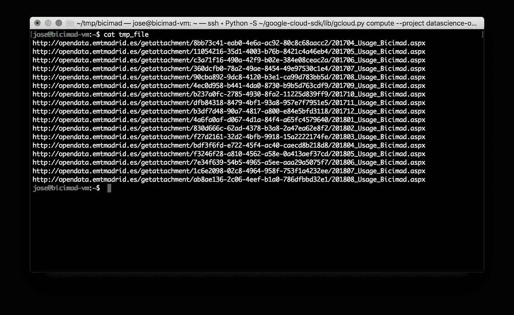

现在，我们只需浏览之前的每个 URL，并将它们下载到我们的系统中。一种方法是结合`curl` + `parallel`。这样我们可以同时下载几个文件。首先我们安装`parallel`:

```
sudo apt-get update
sudo apt-get install parallel
```

安装完成后，我们读取`tmp_file`，将所有链接发送到`curl`:

```
cat tmp_file | parallel -j 4 curl -O
```

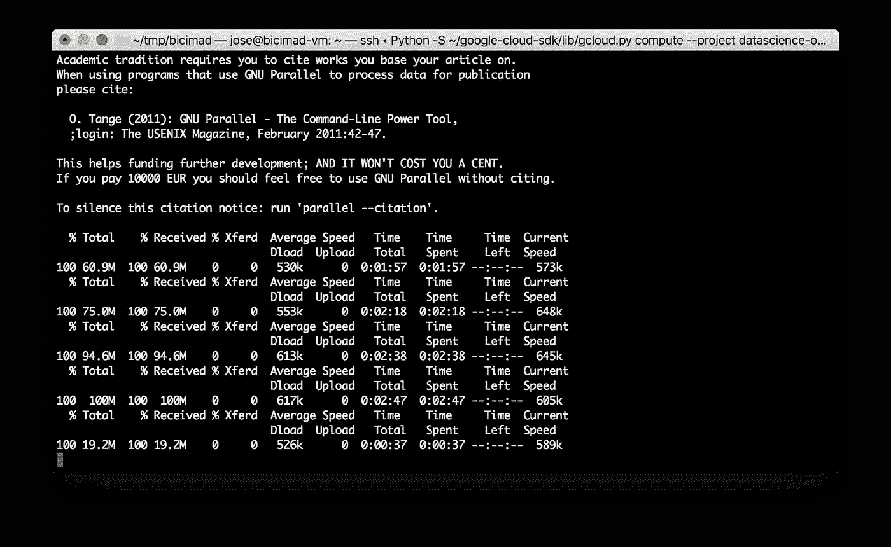

这个过程需要几分钟。完成后，我们可以通过在当前目录中执行`ls -l`来检查下载的文件:

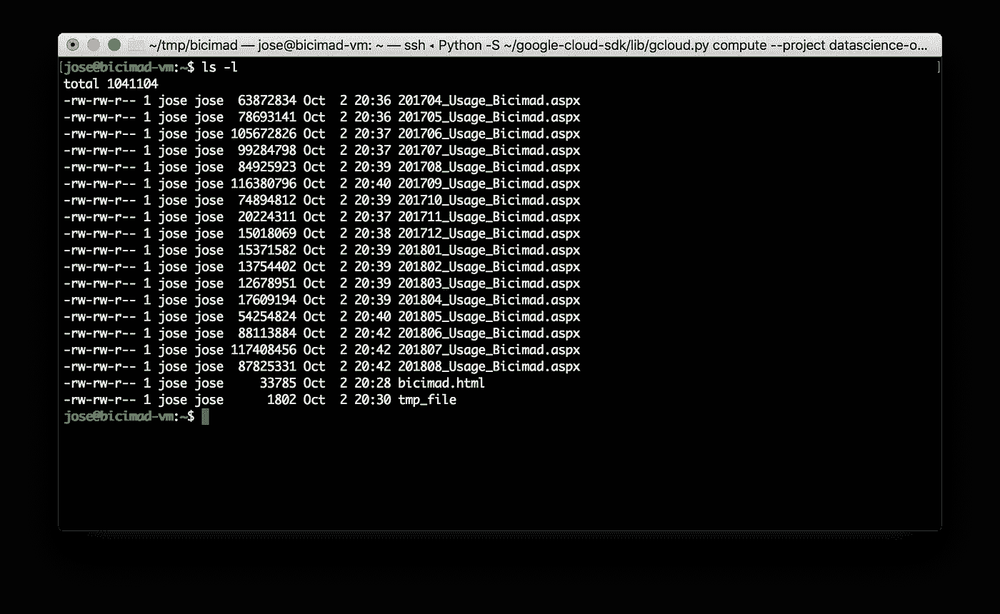

下一步是解压缩文件。我们需要先安装`unzip`:

```
sudo apt-get install unzip
```

…然后我们解压缩所有以 *Bicimad.aspx* 结尾的文件:

```
TMP_DIR="."
ZIP_FILES=*Bicimad.aspxfor FILE in `ls  ${TMP_DIR}/${ZIP_FILES} `; do
  echo $FILE
  unzip -o $FILE
done
```

所有压缩文件都在同一个文件夹中解压缩，因此`ls -l *.json`显示为 Json 文件，其中包含数据:

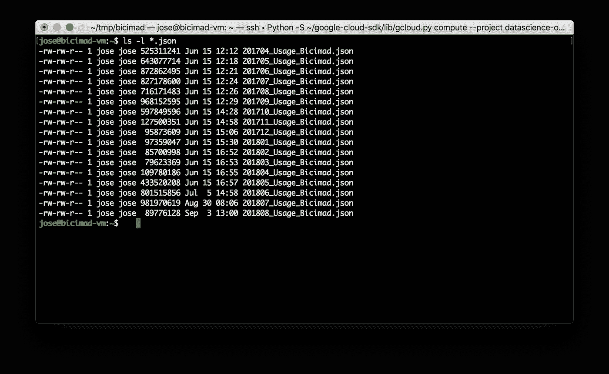

接下来，我们将检查 Json 文件的内容，以理解提供给我们的结构化数据。为了处理 Json 文件，`jq`是我们最好的朋友，所以 web 将像我们通常做的那样安装它。然后我们打印任何文件的第一行:

```
sudo apt-get install jqcat 201808_Usage_Bicimad.json | head -1 | jq
```

我们可以检查这个 Json 是否遵循了从 MongoDB 导出数据的典型模式:

```
{
  "_id": {
    "$oid": "5b6779012f384302541d6813"
  },
  "user_day_code": "6c30d6e283ea7a160379fa9adb20b93d2c06e16853ad0804e26485e98066f6ba",
  "idplug_base": 11,
  "track": {
    "type": "FeatureCollection",
    "features": [
      {
        "geometry": {
          "type": "Point",
          "coordinates": [
            -3.7078158,
            40.4127144997222
          ]
        },
        "type": "Feature",
        "properties": {
          "var": "28005,ES,Madrid,Madrid,CALLE SAN BRUNO 1,Madrid",
          "speed": 6.19,
          "secondsfromstart": 190
        }
      },
      {
        "geometry": {
          "type": "Point",
          "coordinates": [
            -3.7071841,
            40.4156114997222
          ]
        },
        "type": "Feature",
        "properties": {
          "var": "28012,ES,Madrid,Madrid,PLAZA MAYOR 27,Madrid",
          "speed": 3.47,
          "secondsfromstart": 130
        }
      },
      {
        "geometry": {
          "type": "Point",
          "coordinates": [
            -3.7048058,
            40.4167895
          ]
        },
        "type": "Feature",
        "properties": {
          "var": "28013,ES,Madrid,Madrid,CALLE ARENAL 1,Madrid",
          "speed": 3.61,
          "secondsfromstart": 71
        }
      }
    ]
  },
  "user_type": 1,
  "idunplug_base": 7,
  "travel_time": 228,
  "idunplug_station": 1,
  "ageRange": 0,
  "idplug_station": 43,
  "unplug_hourTime": {
    "$date": "2018-08-01T01:00:00.000+0200"
  },
  "zip_code": ""
}
```

每条记录为我们提供了以下变量:

*   _id:记录标识
*   user_day_code:当天的用户标识
*   idunplug_station:起点自行车站
*   idunplug_base:原点自行车站中的 base
*   idplug_station:落客自行车站
*   idplug_base:落客自行车站中的基地
*   unplug_hourTime:租赁开始时间。
*   travel_time:以秒为单位，自行车拔掉插头和插上插头之间的时间
*   轨道:行程路径
*   用户类型:1。-按年订阅的用户，2。-偶尔使用者，3。-企业用户
*   ageRange: 1。-[0–16]年，2。- [17–18], 3.- [19–26], 4.-[27–40], 5.-[41–65], 6.- [>66]
*   zip_code:用户邮政编码。

> [完整描述](http://opendata.emtmadrid.es/Documentos/Servicios-y-estructuras-Bicimad-V1-1.aspx)(西班牙语)

从前面所有的变量中，有一个具有特殊的结构: *track。*该密钥为 [GeoJson](http://geojson.org/) 格式，这是一种在使用过程中注册自行车位置地理数据的便捷方式。看一下这个键，你会注意到系统每 60 秒跟踪一次自行车的位置。非常遗憾的是，这些信息在提供的某些时期是不可用的。

## 将数据加载到 BigQuery

Google BigQuery 可能是最强大的无服务器数据仓库，是在几秒钟内处理大量数据的好地方。可以将 Json 文件导入到 BigQuery 表中，但它还不能处理 GeoJson，尽管它支持地理信息系统(GIS)。

同时，我决定皈依*。json 文件转换成*。csv，但是在开始之前，建议更改文件编码。所提供的是 iso-8859–1 编码，这将在一些字符串中产生一些特殊西班牙字符的问题。

我们可以使用以下代码检查文件编码:

```
file --mime-encoding 201808_Usage_Bicimad.json
```

最好的解决方案是使用`iconv`将文件转换成 UTF-8:

```
iconv -f iso-8859-1 -t UTF-8 201808_Usage_Bicimad.json > tmp_file.json  && mv -f tmp_file.json 201808_Usage_Bicimad.json
```

现在是时候从 Json ton CSV 转换了。正如之前指出的，并不是所有的每月 Json 文件都有带有地理位置值的`track`键，我已经请求 EMT 来解决这个问题。同时，我们将只处理带有该信息的对象。

首先，我们检查`track`是否存在，然后我们遍历所有的键，以获取它们的值，并以非规范化的方式将它们展平。一旦完成，我们可以使用 de '@csv' decorator 并将结果写入文件。

```
cat 201808_Usage_Bicimad.json | jq -r '. | select(.track != null) | .track.features[]  as $track | [._id[], .user_day_code, .idplug_base, .user_type, .idunplug_base, .travel_time, .idunplug_station, .ageRange, .idplug_station, .unplug_hourTime[], .zip_code]  + [$track.geometry.coordinates[0], $track.geometry.coordinates[1], $track.properties.var, $track.properties.speed, $track.properties.secondsfromstart]|[@csv](http://twitter.com/csv)' > 201804_Usage_Bicimad.csv 
```

强烈推荐使用的处理 CSV 文件的工具是`csvkit`。尽管并非绝对必要，但我们将使用它以更好的方式检查 CSV 文件。以下是运行它所需的步骤:

```
sudo apt-get install python-dev python-pip python-setuptools build-essential
pip install --upgrade setuptools
pip install --user csvkit
export PATH=$HOME/.local/bin:$PATH
```

让我们检查一些随机列的结果:

```
cat 201804_Usage_Bicimad.csv | head -10 | csvcut -c 1,3,10,12,13,14  | csvlook --max-columns 6 --no-header-row
```

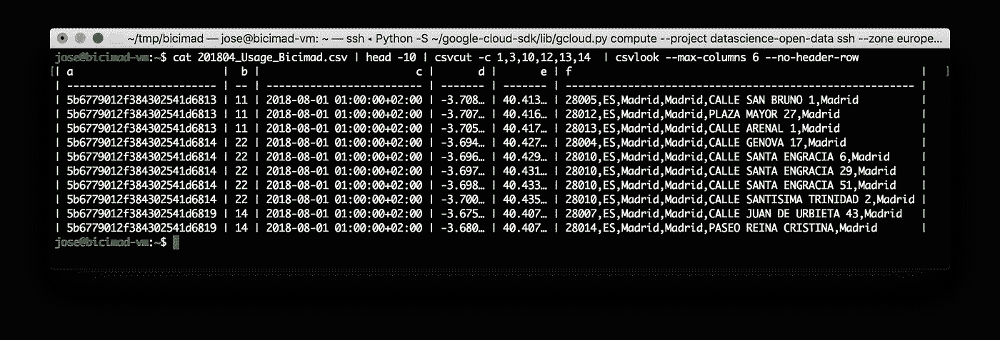

是时候将 CSV 文件加载到 BigQuery 中了！因为我们不能直接从本地机器加载数据，所以让我们将文件复制到 Google 云存储桶中。以下命令创建一个存储桶并将文件上传到其中:

```
gsutil mb open-datasets
gsutil -m cp 201808_Usage_Bicimad.csv gs://open-datasets/bicimad
```

然后，我们将在 BigQuery 中创建新的数据集:

```
bq --location=EU mk bicimad
```

然后，我们必须在数据集中创建一个表。在这个例子中，我包括了表模式:

```
bq mk --table bicimad.usage_201808 oid:STRING,user_day_code:STRING,idplug_base:STRING,user_type:INTEGER,idunplug_base:INTEGER,travel_time:INTEGER,idunplug_station:INTEGER,ageRange:INTEGER,idplug_station:INTEGER,unplug_hourTime:STRING,zip_code:STRING,latitude:FLOAT,longitude:STRING,var:STRING,speed:FLOAT,secondsfromstart:INTEGER
```

最后，我们创建一个加载作业，将 CSV 文件从 Google 云存储桶导入到新表中:

```
bq load --source_format=CSV --replace --quote='"'  bicimad.usage_201808 gs://open-datasets/bicimad/201804_Usage_Bicimad.csv
```

> 向 BigQuery 加载大量数据时，建议使用[分区表](https://cloud.google.com/bigquery/docs/partitioned-tables)。分区表使查询数据变得容易，提高了查询性能并减少了您的账单。在这种情况下，我们将每个月的数据加载到不同的表中，这是一种旧的数据分区方式，但是可以随意改进。

加载作业完成后，我们可以查询数据并检查结果:

```
bq query --use_legacy_sql=false  'SELECT travel_time, unplug_hourTime, var FROM `datascience-open-data.bicimad.usage_201808` LIMIT 10'
```

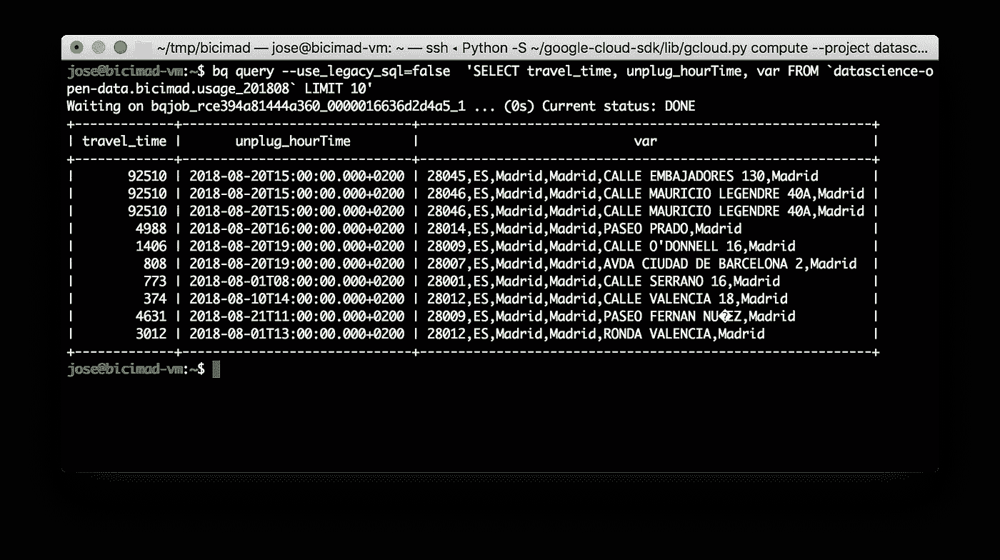

或者我们也可以使用 Google Cloud 控制台中的 BigQuery UI，这是开发 SQL 查询的推荐方式:

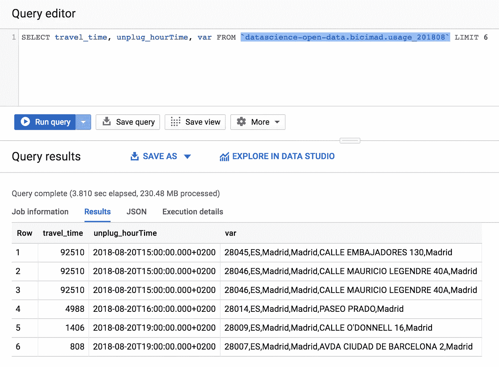

# 现在一起！

因此，将 CSV 文件加载到我们的数据库的过程。为了加载它们，我们可以编写一个小的 bash 脚本来遍历目录中的所有 Json 文件，转换成 CSV 文件，上传到云中并加载到相应的表中。

这正是`transform_and_load.sh`要做的:

```
#! /bin/bashTMP_DIR="."REPORT_FILENAME_PATTERN=*Bicimad.jsonfor FILE in `ls  ${TMP_DIR}/${REPORT_FILENAME_PATTERN} `; doBASENAME=$(basename $FILE .json)YEAR_MONTH=`echo ${BASENAME:0:6}`iconv -f iso-8859-1 -t UTF-8 "$FILE" > "$FILE.new"  && mv -f "$FILE.new" "$FILE"cat $FILE | jq -r '. | select(.track != null) | .track.features[]  as $track | [._id[], .user_day_code, .idplug_base, .user_type, .idunplug_base, .travel_time, .idunplug_station, .ageRange, .idplug_station, .unplug_hourTime[], .zip_code]  + [$track.geometry.coordinates[0], $track.geometry.coordinates[1], $track.properties.var, $track.properties.speed, $track.properties.secondsfromstart]|[@csv](http://twitter.com/csv)' > $BASENAME.csvgsutil -m cp $BASENAME.csv gs://open-datasets/bicimadbq mk --table bicimad.usage_$YEAR_MONTH oid:STRING,user_day_code:STRING,idplug_base:STRING,user_type:INTEGER,idunplug_base:INTEGER,travel_time:INTEGER,idunplug_station:INTEGER,ageRange:INTEGER,idplug_station:INTEGER,unplug_hourTime:STRING,zip_code:STRING,latitude:FLOAT,longitude:STRING,var:STRING,speed:FLOAT,secondsfromstart:INTEGERbq load --source_format=CSV --replace --quote='"'  bicimad.usage_$YEAR_MONTH gs://open-datasets/bicimad/$BASENAME.csvdone
```

我们将所有用户的执行权限添加到脚本中并运行它:

```
chmod 755 transform_and_load.sh
./transform_and_load.sh
```

完成后，我们可以查询所有 2018 年的数据，以获得按年龄范围划分的自行车租赁时长中位数(我不喜欢没有正态分布数据的平均值)。

```
SELECT
  ageRange,
  ROUND(APPROX_QUANTILES(travel_time/60,1000)[OFFSET(500)], 2) AS median_travel_time
FROM
  `datascience-open-data.bicimad.usage_2018*`
GROUP BY
  ageRange
ORDER BY
  2 DESC
```

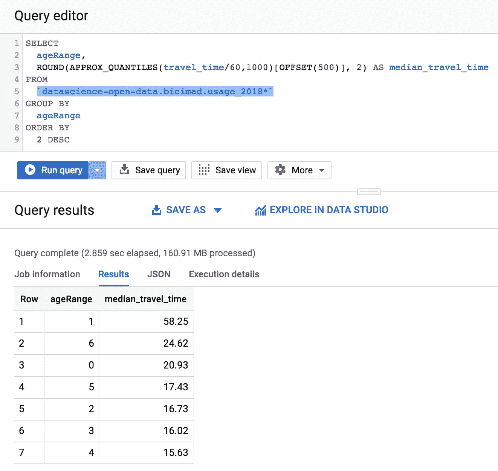

就自行车租赁持续时间而言，似乎最年轻的用户(年龄 1)也是最大的用户。我们可以知道检查他们是否也是最频繁的用户等等。

# 自行车站点数据

正如我之前告诉您的，我们将对包含每个自行车站点信息的数据集重复相同的步骤。

```
curl -o Bicimad_Estacions_201808.rar [http://opendata.emtmadrid.es/getattachment/8321277e-4f8b-4a45-89fd-63cbeefa1cf1/Bicimad_Estacions_201808.aspx](http://opendata.emtmadrid.es/getattachment/8321277e-4f8b-4a45-89fd-63cbeefa1cf1/Bicimad_Estacions_201808.aspx) && unrar x Bicimad_Estacions_201808.rar && rm Bicimad_Estacions_201808.rariconv -f iso-8859-1 -t UTF-8 Bicimad_Estacions_201808.json > tmp_file.json  && mv -f tmp_file.json Bicimad_Estacions_201808.json
```

这是数据集中可用的信息:

```
{
  "activate": 1,
  "name": "Colón A",
  "reservations_count": 0,
  "light": 0,
  "total_bases": 18,
  "free_bases": 14,
  "number": "106a",
  "longitude": "-3.6877227",
  "no_available": 0,
  "address": "Calle Serrano nº 34",
  "latitude": "40.4251002",
  "dock_bikes": 3,
  "id": 111
}
```

让我们转换成 CSV 格式:

```
cat Bicimad_Estacions_201808.json | jq -r '.stations[] | [.[]] | [@csv](http://twitter.com/csv)' > bike_stations.csv
```

因为这个数据集很小(12.9 MB)，所以我们可以直接从本地磁盘加载到 BigQuery 中。

第一个 web 制作新表格:

```
bq mk --table bicimad.bike_stations activate:INTEGER,name:STRING,reservations_count:INTEGER,light:INTEGER,total_bases:INTEGER,free_bases:INTEGER,number:STRING,longitude:FLOAT,no_available:INTEGER,address:STRING,latitude:FLOAT,dock_bikes:INTEGER,id:INTEGER
```

然后我们创建一个加载作业:

```
bq load --source_format=CSV --replace --quote='"'  bicimad.bike_stations bike_stations.csv
```

通过观察数据，我们可以看到每个自行车站点都有几个记录，记录了数据集未提供的时间段内`freee_bases`和其他字段的变化。

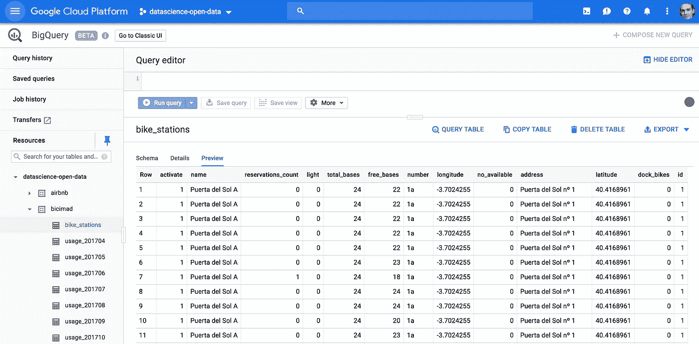

尽管如此，我们可以查看可用自行车站的数量:

```
SELECT
  COUNT(DISTINCT name) AS total
FROM
  `datascience-open-data.bicimad.bike_stations`
```

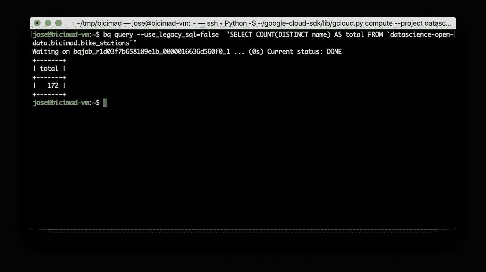

加载完所有数据后，我们可以删除计算实例:

```
gcloud compute instances delete bicimad-vm --zone=europe-west1-b --quiet
```

目前就这些。在下一篇文章中，我们将使用 SQL 进行一些探索性的数据分析。也不是 R 或 Python，我保证！