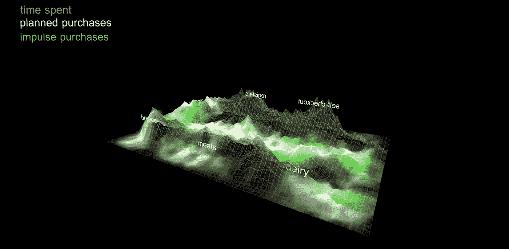

# 在一个数据文盲组织中做数据科学

> 原文：<https://towardsdatascience.com/doing-data-science-in-a-data-illiterate-organization-300981cbfdf6?source=collection_archive---------7----------------------->

A still from an animated visualization of shopper behavior in an instrumented grocery store.

科技媒体和行业博客充满了创新、早期采用者和数据智能公司的故事。数据科学家很容易设想在一个理解并重视他们的技术、推理和工作方式的组织中的角色。但是，当然，越来越多的传统企业正在雇佣数据科学家，并试图利用数据做出更好的决策。

我每天都与设计师、战略家、数据科学家、开发人员和研究人员组成的多学科团队一起工作。虽然我们生活在技术工作最具协作性的黄金时代，但我亲眼目睹了数据科学家在不太懂数据的环境中遇到的动荡。合法、准确、有效的科学很容易在翻译中丢失。下面我概述了一些给数据科学家的实用建议，我发现这些建议在数据盲组织中最有效。

# **1。询问“问题”,永远不要停止思考:我们解决的是正确的问题吗？**

成功的数据密集型项目总是始于对业务目标的透彻理解——最好将其视为一个*假设*。作为一名数据科学家，你的工作是提出问题，并挖掘其更广泛的背景。努力弄清楚到底发生了什么，找出根本原因，并帮助引导提问者和被提问者不仅仅是一个*“是”*或*“否”*的问题，而是一个有效且相关的对手头更大问题的重构。

> **他们**:“我们的哪个产品性能最好？”
> 
> **你**:“告诉我更多关于你目前定义*最佳*的方式？”

随着设计师、研究人员和战略家越来越多地使用数据来改善他们的决策，您需要回答的问题可能来自各种专业和领域。问题和假设通常来自数据科学领域之外的某个人——经理、设计师或研究人员。你要解开他们的问题，与提问者产生共鸣，了解他们假设的背景，并帮助他们决定前进的最佳路线。

# 2。 **始终回答问题——即使答案是一个关于*可能性*而不是确定性的故事。**

探索频道的节目*流言终结者(2003–2016)*当原始流言的结果以任何可能的方式被复制时，而不仅仅是当原始流言被终结时，才变得真正与观众相关。像亚当和杰米一样:得出没有相关性的结论是不够的，要洗手不干，继续前进。讲述一个关于相关性*会是什么样子*的故事，它在数据集中的什么地方出现——即使它在统计上不显著——并且用上下文来呈现它。解释如何证明他们的假设是正确的，并提供其他可能的答案作为支持证据。

当一个模型表现不佳时，过快地退出会对团队使用数据科学的态度产生负面影响。相反，尽可能向您的受众提供后续步骤:可以收集的额外数据，模型不收敛的潜在现实原因，或者描述性能确实有效的情况的子样本，以帮助解释为什么它不能达到高水平。

# **3。传达你的结果:准确性和细节是两回事。**

想象一下，你正在建立一个预测模型来确定某件事情发生的可能性(百分比)。神奇的是，在没有你控制的情况下，在模型投入生产之前，一个邪恶的数据仙女会随机改变你所有的结果几个百分点(比如说 73%对 71%或者. 681 对. 657)。在现实世界的部署中，这些看似微不足道的数量可能意味着自动驾驶汽车乘客的生死之差。在向你的 C 级团队做演示时，这些金额的差异可能不会实质性地改变他们调整战略、营销计划或商业决策的方式。71%或 73%的市场份额(谁在乎！)将是打开啤酒的理由。

我的观点是使用环境决定一切。你的工作是了解你的工作成果将如何付诸行动，并据此设计你传达这些成果的方式。例如，在自动化生产环境中，包含尽可能多的细节。在这里，准确性很重要。你的模型可能需要学习，不断地被训练，或者适应多种可能性，没有理由回避或者抽象输出。

不同的是，对于一个人在回路的场景，你的结果需要在你的专家解释和最初询问的背景下形成。在你拿着事实和数据冲进会议之前，先想想你要表达的更广泛的观点。在这些情况下，没有人需要知道你的模型的表现有多差(或多好)——把这个细节放在你的后袋里作为支持证据。

用无关紧要的数字来压倒非数据科学家的听众，往往会分散你试图表达的更广泛的观点。当几个百分点不是生死攸关的情况时，用简单的语言给出你的结果的背景:

> "这种预测模型工作得相当好，但在这些边缘情况下可以使用一些改进."
> 
> "你认为存在的相关性可能只是巧合."

# **4。建立共同语言并坚持下去。**

像许多其他技术领域一样，数据科学非常晦涩难懂。即使通过图表直观地传达思想，代表性形式的可能性和变化也是巨大的，每一种形式都需要观众去理解，并学会如何阅读。如果你在使用口头和视觉语言的方式上不一致，很容易失去你的听众。

我见过最尖锐的演讲因不一致和定义不清的术语使用而脱轨，如*模型*、*原始*、*加工过的*、*特征*，或*培训*。往往是日常意义上的简单词汇引发了最大的问题。例如:“带标签的数据”在分类模型中有一个非常具体的定义，但非数据科学家可能会通过将他们自己的生活经验应用到“标签”这个词来误解你试图表达的观点*Excel 中的列不是都已经标注好了吗？如果所有东西都没有标签，你怎么知道你在做什么？如果我们没有在一些数据上贴标签，这些数据是坏的吗？*一致性和清晰性可以强化这些科学含义，防止你的观众自行定义术语并迷失在翻译中。要极其小心、耐心，并与你的听众保持一致。

借助视觉效果，从简单和高水平开始。不要在没有注释或解释的情况下第一次显示新的图表类型。在每一种已建立的视觉语言的基础上慢慢讲述数据的故事。使用一致的颜色、轴和符号。如果解释如何阅读图表比理解图表花费的时间更长，那你就做错了。

# **5。不要孤立地工作。**

无论您是否注册，您现在都是组织内的教育工作者、主题专家和数据传播者。你的工作是你最好的教育材料，你的过程是最好的证据。记录一个项目的开发不仅仅是一个好的实践，它还是一个帮助他人理解你做什么和你如何做的强大工具。

我所做的绝大多数数据可视化都是为了让其他人能够了解我的思考过程，在我的团队中引发对话。努力实现一个开放、可视化的流程，让复杂的技术不仅仅被数据科学家理解。它可以帮助你以合作的方式对照最初的假设评估你的工作——突出误解、错误的假设和灵感的瞬间。

我发现，有一个空间来展示我的作品、草图和正在进行的可视化效果，对增加沟通和协作大有帮助。即使你不公开，也要让它公开。你需要成为新的数据文化的倡导者和催化剂。对于组织中的许多人来说，将数据科学视为他们永远无法理解的魔法太容易了。你有责任证明他们是错的。公开您的流程将增加您的组织对使用数据解决问题的实际意义的理解，并将数据文盲的工作场所转变为数据驱动的工作场所。