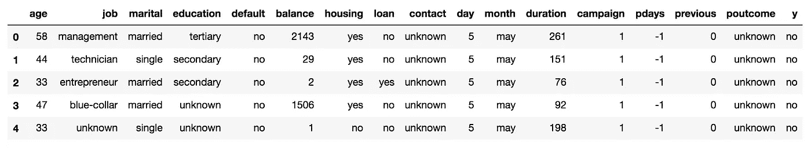
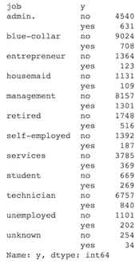
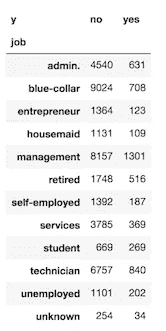
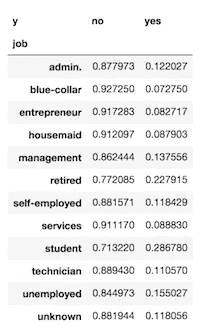

# 做分类项目的 EDA？pandas.crosstab 将改变你的生活。

> 原文：<https://towardsdatascience.com/doing-eda-on-a-classification-project-pandas-crosstab-will-change-your-life-c61c1cb2c20b?source=collection_archive---------1----------------------->

探索性数据分析(EDA)是数据科学家工作的重要组成部分。事实上，根据 2017 年 O'Reilly 的数据科学调查，基础 EDA 是数据科学家最常见的任务。这是有原因的。除非完全靠运气，否则如果你不理解你的数据，你最复杂、最健壮的模型也不会有多大作用。他们肯定不会表现得像他们本该表现的那样好。

理解数据、数据特征及其分布对于任何成功的数据科学任务都至关重要，无论是推理还是预测。与你所期望的相反，EDA 的重要性并不在于技术，也与编程无关。这是将平庸的数据科学家与伟大的数据科学家区分开来的东西——决策。

作为一名数据科学家，你编程。你用统计学。你建立模型。但是你要做的最重要也可能是最困难的事情是做出许多选择。你的选择会带来后果。有时后果很严重。所以你尽你所能做出负责任的、明智的选择。EDA 是你做出选择的最佳时机。好的 EDA 是盲目工作、抱最大希望、做出深思熟虑的决定以实现目标之间的区别。

好吧，你明白了，埃达很重要。现在，让我们来看看`pd.crosstab().`的魔力

最近，我做了一个项目，使用了来自 UCI 机器学习库的银行营销数据集。它看起来是这样的:

每个观察对象都是银行的潜在客户，而“y”变量是他们是否订阅了新的定期存款。如您所见，这些数据包括每个客户的个人信息，以及银行之前向该客户营销的信息。这是一个相对干净的数据集，也是一个非常有趣的项目。主要的挑战是处理不平衡的类别，因为只有大约 11%的客户订阅定期存款。就像我说的，这是一个有趣的项目，值得一看。但是回到 EDA。

首先要决定的事情之一是模型中包括哪些变量。例如，让我们看看“工作”一栏。它列出了每个客户拥有的领域或职位。该数据集中有 12 种类型的作业。要决定是否要在您的模型中使用工作信息，您必须确定一个人的工作是否与订阅存款的可能性增加相关。从极端的角度来看这个问题，如果数据集中的每个“技术人员”都订阅了押金，我将假设技术人员更有可能订阅，我将使用这些信息来进行预测。另一方面，如果每种类型的工作都有相同比例的人订阅存款，那么工作信息将不会有助于做出预测。

那么，如何计算订阅每种工作类型的人的百分比呢？下面是我曾经使用的函数:`bank.groupby('job').y.value_counts()`，它将按作业类型对观察结果进行分组，并对每种作业类型的“y”出现次数进行计数。

它返回这个:

这回答了我们需要的问题，但它看起来很乱。如果我们能把 y 的值变成一个表格会怎么样？然后……这里是`pd.crosstab(bank.job, bank.y)`,它给了我们这个:

Now that’s much prettier.

很好，我们有桌子了。我们可以观察一下，发现大约有 10%的女佣和服务人员缴纳了押金。很明显，更高比例的退休人员认购存款。所以我们可以对分布有个概念...但是我们想要更多。我们需要每种工作类型的订阅的准确百分比。

`pd.crosstab()`让你再次得到保护。就像这样添加' normalize '参数:`pd.crosstab(bank.job, bank.y, normalize='index').`现在看起来是这样的:

Looking good!

完美。目标变量的分类百分比细分。正是我们需要的。现在很清楚，工作类型可能是我们模型的相关信息。

您可以对分类任务的任何分类变量运行此函数。这是评估崩溃的完美方法。使用这个函数，并且只有这个函数，您可以获得对数据集非常重要的洞察力。明智地使用它，用好它！