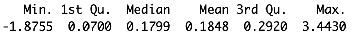
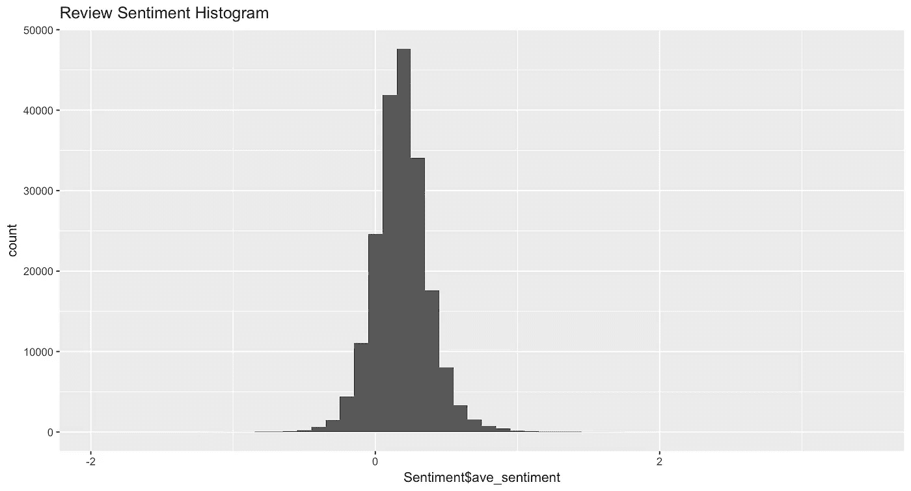

# 在 R 中使用 Sentimentr 进行第一次情感分析

> 原文：<https://towardsdatascience.com/doing-your-first-sentiment-analysis-in-r-with-sentimentr-167855445132?source=collection_archive---------6----------------------->

## 从字符串中提取情感的最快最简单的方法。

R 的 [Sentimentr](https://cran.r-project.org/web/packages/sentimentr/sentimentr.pdf) 包有利于分析心理学或社会学研究的文本。它的第一大优势是，它使情感分析变得简单，只需几行代码就可以实现。它的第二大优势是它纠正了反转，这意味着虽然更基本的情绪分析会根据形容词*好*将“*我不好*判断为积极的，但 Sentimentr 会识别出好的反转，并将其归类为消极的。

> 总而言之，Sentimentr 允许你快速进行复杂的情感分析，并直接将其作为回归或任何其他进一步分析的输入。

本文涵盖了如何开始。如果您正在寻找高级分析技术，请参考其他文章，如 [Tyler Rinker 的 Github Repo](https://github.com/trinker/sentimentr) 的自述。在本教程中，我将分析来自 [He & McAuley (2016)数据集](http://jmcauley.ucsd.edu/data/amazon/)的亚马逊美容产品评论。但是，您可以轻松地修改代码，使其适合您自己的数据集。


Photo by [Obi Onyeador](https://unsplash.com/@thenewmalcolm?utm_source=unsplash&utm_medium=referral&utm_content=creditCopyText) on [Unsplash](https://unsplash.com/s/photos/sentiment?utm_source=unsplash&utm_medium=referral&utm_content=creditCopyText)

默认情况下，Sentimentr 使用 [Jockers (2017)字典](https://github.com/mjockers/syuzhet)，这对于大多数情况来说应该是完美的。

# **安装软件包并加载数据**

```
install.packages("sentimentr")
library(sentimentr)
```

前两个命令安装并加载 Sentimentr 包。接下来，我加载数据。因为它是 JSON 格式的，所以我需要加载 ndjson 包。然后我可以使用这个包的 **stream_in** 函数来加载 Amazon Beauty 数据。

```
install.packages("ndjson")
library(ndjson)
df = stream_in("AmazonBeauty.json")
head(df)
```

我还使用了 **head** 函数来快速查看前几行数据。正如您在自己的机器上执行此操作时所看到的，有一个名为 **reviewText** 的列包含评论。

# 做实际的情感分析。

```
sentiment=sentiment_by(df$reviewText)
```

这个命令运行情感分析。在这种情况下，我使用了**perspective _ by**命令来获得整个评审的总体情绪度量。在其他情况下，您可以使用**情感**命令(不带 _by)来获取每个句子的情感。

当这个命令运行时(确实需要一段时间)，我将讨论函数将返回什么。该示例中的情感对象将是包括以下列的数据表:

*   **element_id** —审核的 id 号
*   **字数** —评论的字数
*   **sd** —评论中句子情感得分的标准差
*   **ave _ sensition**—评论中句子的平均情感得分

最有趣的变量是**ave _ perspective**，这是一个数字中评论的情绪。该数字可以取正值或负值，并表示情感的效价和极性。

# 分析情感得分

我们可以看一些计算出来的情绪得分的汇总统计。

```
summary(sentiment$ave_sentiment)
```



如你所见，大多数评论倾向于适度正面，但也有一些极端的异常值，最正面的评论为 3.44，最负面的评论为-1.88。这些值与平均值和中值相差甚远，应考虑将其剔除，以便进一步分析。

我还做了一个快速直方图来查看评论的情绪。

```
library(ggplot2)
qplot(sentiment$ave_sentiment,   geom="histogram",binwidth=0.1,main="Review Sentiment Histogram")
```



# 将你的情感分数整合到原始数据集中

因为我对情感分数最感兴趣，所以我将通过将情感分数及其标准差集成回主数据集中来结束本教程。

```
df$ave_sentiment=sentiment$ave_sentiment
df$sd_sentiment=sentiment$sd
```