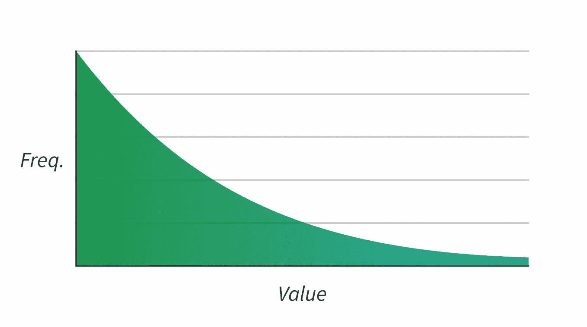

# 不要忽视空头:用中位数汇总数据的陷阱

> 原文：<https://towardsdatascience.com/dont-ignore-bears-the-pitfalls-of-summarizing-data-with-medians-3c07b4d509db?source=collection_archive---------8----------------------->


有些人非常喜欢将中位数作为汇总统计数据。我有时也是。但是它有一些很大的缺点——正如所有的统计数据一样——我希望我们能意识到这一点。

为什么人们一开始就建议使用中位数？通常是因为中位数忽略了极值。如果你要为你的初创公司雇佣一名新的平面设计师，你可能要以你所在地区的其他人的工资为基准。假设你能得到数据，你可能会找到一些在大公司工作的摇滚明星的高薪。但这不是你想要的基准:你想要的是更普遍的东西。“集中趋势”的想法是中值可以带给你的。10 万美元的家伙被排除在外。

但是这是有代价的:中位数忽略了所有异常值，因为它们忽略了数据集中的所有*值*，除了单个中心项的值(或者在平局的情况下两个项)。相对位置才是最重要的。这意味着每次使用中间值时，你都在丢弃数据。(统计学上的“低效率”。)自然，这会给你带来麻烦。这里有一些例子。

# 故障类型 1:小范围的值

当数据集的中点附近有一小组选项时，就会出现这种情况。当离散值(1，2，3 而不是 1.234 等)覆盖的范围很窄时，这种情况很可能发生。例如，假设您对某个产品有 1-5 颗星的评价。一些不好的事情会发生。


## ***坏事 1A:夸大小差异***

这两款产品的评分几乎相同。但是有一个等级——核心等级——是不同的:

```
**Product A**: 1 1 1 2 2 2 2 2 2 3 3 3 3 3 3 3 4 4 5**Product B**: 1 1 1 2 2 2 2 2 2 2 3 3 3 3 3 3 4 4 5 
                             ^
 *Median*
```

查看产品排名中值，您会发现产品的值为 3 和 2。但是手段只有零点几分的不同。

## ***坏事 1B:缺失变化***

如果变化不影响中值，您将不会注意到任何变化:

```
**Product C**: 1 1 2 3 3 3 3 3 3 3 3 3 3 3 3 4 4 4 4**Product D**: 2 3 3 3 3 3 3 3 3 3 3 3 4 4 4 4 5 5 5 
                             ^
 *Median*
```

即使分布的两端都向上移动，中位数仍然保持在 3。从 2.9 到 3.5，平均值移动了 20%以上。

# 失败类型 2:忽略极端值

人们喜欢忽略极端情况，因为它们可能是“异常值”，意味着错误。但极端情况是大多数现实世界系统的自然特征，比如工资、工厂密度或灾难影响。这通常意味着数据向左倾斜，有几个非常大的值，还有许多小值:



极端情况会极大地抬高(算术)平均值——但这不一定是件坏事:极端情况在现实世界中也会产生巨大影响，你的分析可能需要反映这一点。生态学家不应该因为熊很大就忽视它们！

如果你在有偏差的数据上使用中位数，你就忽略了罕见的极端情况，而是专注于常见的情况。这是否是一个好主意取决于你想知道什么。想象一下，你经营着一个创客空间，拥有每周顾客受伤人数的数据:

```
**Injuries**: 1 1 1 1 1 1 1 1 2 2 2 3 3 5 8 16 40
                          ^
                        *Median*
*Mean*: 5.2
```


## 平均值和中间值回答不同类型的问题

除了永远不再允许“战斗机器人星期四”，我们还能说什么？视情况而定:

*   如果我们想知道“这周我能期待多少伤病？”那么中间值可能工作得很好。假设过去是一个很好的预测，你有 50%的机会减少 2 次伤害。
*   如果我们想，“如果我再开两周，我还会受多少伤？”然后我们需要(算术)平均值。均值是一种假装所有日子都一样，同时保持总数不变的方法。大部分日子少于 5 次受伤；但是如果每天都有 5 个，最终什么都不会改变。如果我们更加开放，我们可以估计另外 5.2 x 2 = 10.4 人受伤。

## 什么时候极端很重要？

不要只选择最有吸引力的数字:2 次受伤听起来比 5 次好，但不是提前计划的好方法。两个简单的问题可以帮助你评估你是否需要一个平均值来代替中位数:

*   如果最大值大 10 倍，我会在乎吗？
*   我实际上是在问，“如果每个值都一样会怎么样？”

# 外卖信息

我们都需要汇总统计数据:我们不能只是直观地或以表格的形式呈现原始数据。几乎所有的回归分析都是基于它们。他们不会走的。因此，我们的选择是更好地了解不同的统计数据，以及何时明智地使用它们。

考虑您的数据中是否有小范围的值，以及极端值是否重要。如果是这样，平均值可能比中值更好。可视化您的数据。不要不假思索地使用任何统计数据！

