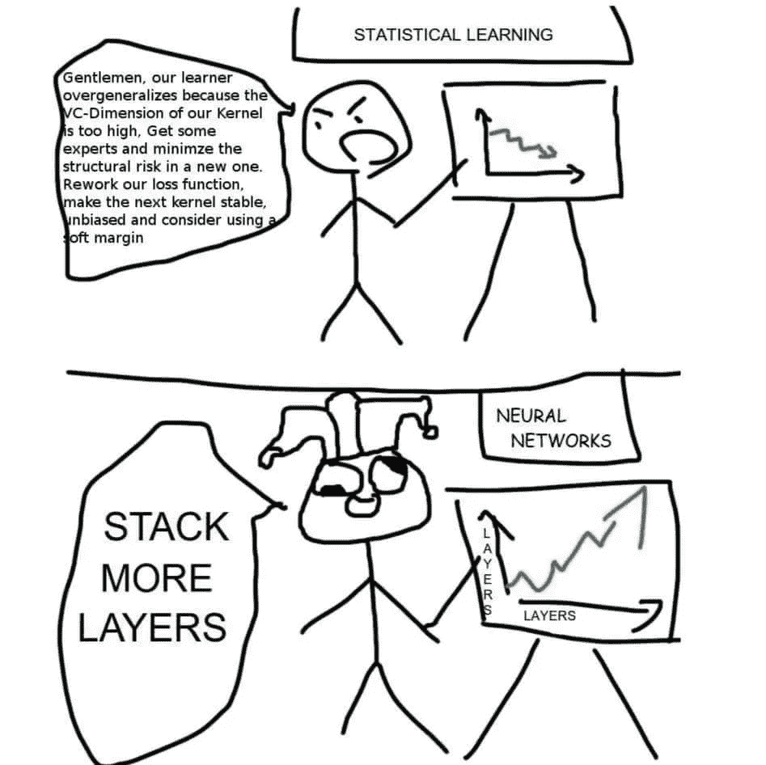
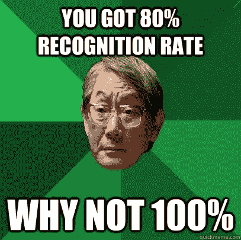

# 24 小时不要学机器学习

> 原文：<https://towardsdatascience.com/dont-learn-machine-learning-in-24-hours-3ea3624f9881?source=collection_archive---------2----------------------->

Source — [https://medium.com/designer-hangout/machine-learning-and-ux-c28725b5f3a5](https://medium.com/designer-hangout/machine-learning-and-ux-c28725b5f3a5)

最近偶然看到 Peter Norvig 的一篇精彩文章——《10 年自学编程》。

这是一个诙谐且有点讽刺的标题，对那些旨在 24 小时、7 天、10 天、***插入一个可笑的短时间线*** 教你编程的茶几编程书籍进行了挖苦。

诺维格博士提出了一个很强的理由。是的，你可能会在 24 小时内掌握一门编程语言的语法、本质和风格，但这并不意味着你已经精通编程艺术。因为编程根本不是一门语言。编程是关于智能设计，对时间和空间复杂性的严格分析，理解某种语言何时能超越另一种语言，等等。

当然你可以在 24 小时内用 C++写一个 Hello World 程序，或者在 24 小时内写一个求圆的面积的程序，但这不是重点。你把[面向对象编程](https://en.wikipedia.org/wiki/Object-oriented_programming)理解为一种范式吗？你了解[名称空间](https://msdn.microsoft.com/en-IN/library/5cb46ksf.aspx)和[模板](http://www.cplusplus.com/doc/oldtutorial/templates/)的用例吗？你知道你在著名的 [STL](https://www.topcoder.com/community/data-science/data-science-tutorials/power-up-c-with-the-standard-template-library-part-1/) 附近的路吗？如果你这样做了，你肯定不会在一周内，甚至一个月内学会所有这些。这花了你相当多的时间。你学得越多，你就越意识到深渊比它从悬崖上看起来更深。

我在当前围绕机器学习、深度学习和人工智能的整体氛围中发现了类似的情况。成千上万的博客、文章和课程到处涌现，助长了这种炒作。其中数以千计的标题都是同类的——“7 行代码的机器学习”、“10 天的机器学习”等等。这反过来导致 Quora 上的人们提出类似[“我如何在 30 天内学会机器学习？”](https://www.quora.com/How-should-I-plan-my-day-to-learn-machine-learning-in-30-days)。简短的回答是，“你不能。没人能。没有一个专家(甚至是熟悉其来龙去脉的专家)做到过。”

Looks familiar? Found this on a very funny Facebook [page](https://www.facebook.com/npcompleteteens/photos/a.165757437252172.1073741828.165182533976329/324222291405685/?type=3&theater)

即使我们暂时忘记 [10，000 小时规则](https://www.businessinsider.in/Malcolm-Gladwell-Explains-What-Everyone-Gets-Wrong-About-His-Famous-10000-Hour-Rule/articleshow/35964144.cms)，你也无法用 7 行代码完成机器学习。

为什么？因为这 7 行代码没有解释你在[偏差-方差权衡](https://en.wikipedia.org/wiki/Bias%E2%80%93variance_tradeoff)中的表现，你的精度值意味着什么，或者[精度是否是一个合适的性能指标摆在首位](https://stats.stackexchange.com/questions/34193/how-to-choose-an-error-metric-when-evaluating-a-classifier)，你的模型[是否超过了](/overfitting-vs-underfitting-a-complete-example-d05dd7e19765)，你的数据是如何分布的，以及你是否选择了[正确的模型来拟合你所拥有的数据](https://www.itl.nist.gov/div898/handbook/pmd/section4/pmd422.htm)，等等。甚至在你回答了这些问题之后，还有更多事情要做。

因为你不能解释你的模型，你调整了 sklearn 中的参数，获得了最小的精度提高，然后高高兴兴地回家。但是你真的学会了吗？

Source — [http://machinelearningjourney.blogspot.in/2012/03/machine-learning-and-memes.html](http://machinelearningjourney.blogspot.in/2012/03/machine-learning-and-memes.html)

简而言之，不要用 7 行代码来做。做 6 个月，一年。你会在那个时期的中期知道它是否让你感兴趣。暂时忘记魅力，真正进入这个令人惊叹的研究领域的深处。这个你绝对要看[。我发现这是对这一领域新手的最好介绍。你不需要知道数学或代码来阅读它。但是在读完这篇文章后，你会意识到你需要理解的所有概念，以便在这个领域中流畅地思考，可以这么说。](https://homes.cs.washington.edu/~pedrod/papers/cacm12.pdf)

确实有一些关于这个主题的有趣的博客。以下是我个人最喜欢的一些:

1.  [http://colah.github.io/](http://colah.github.io/)
2.  [http://mark.reid.name/blog/](http://mark.reid.name/blog/)
3.  [http://karpathy.github.io/](http://karpathy.github.io/)

Medium 也是一个学习的好地方。我几乎只关注这个出版物。

如果你是守旧派，就去斯坦福上吴恩达的 CS229。这比他在 Coursera 上的课程更涉及，也是一个很好的介绍。

炒作的一个不幸结果就是我们“淹没在信息中，渴望知识”。很多人都这样做，以至于我们经常忽略了大局。机器学习很奇妙。这是一个严肃的研究和开发领域，正在推动许多 21 世纪的使用案例。

只是不要在 24 小时内做。

这是彼得·诺维格的文章，是我们这个时代一位杰出的人工智能研究者的必读之作。

Seriously, though. Why not?