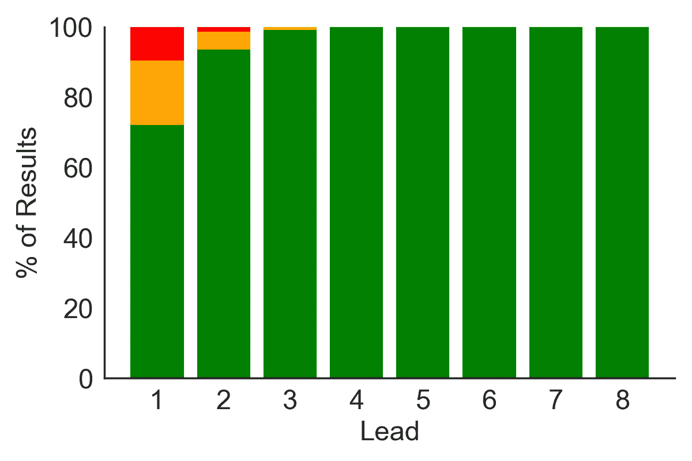
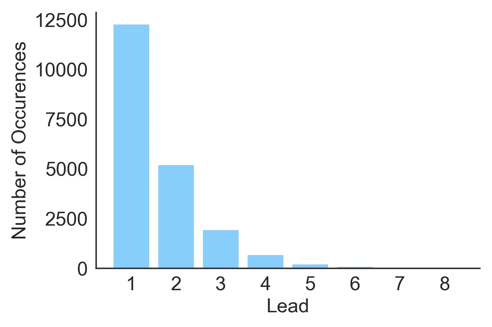
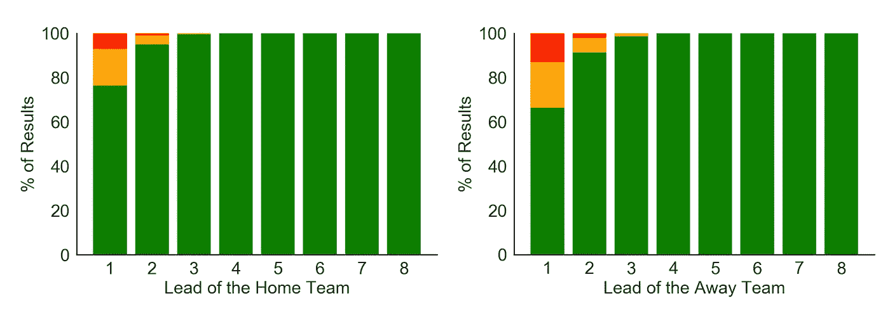
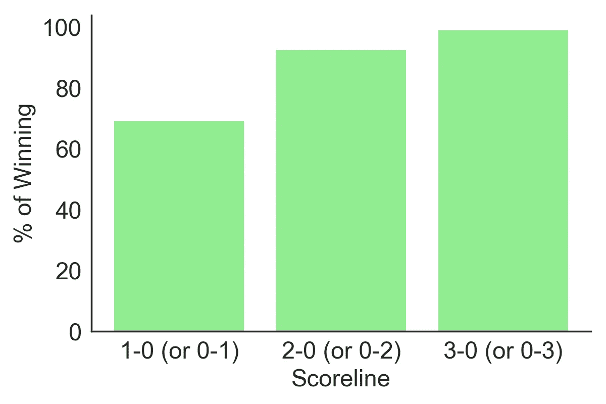

# 不要放松:足球中的危险领先

> 原文：<https://towardsdatascience.com/dont-relax-just-yet-dangerous-leads-in-soccer-5e5a28630f03?source=collection_archive---------9----------------------->

## 足球比赛中 2 比 0 的领先优势是最危险的吗？

你会听到比赛评论员说“2-0 的领先是最危险的领先”，这意味着与其他类似的比分相比，你输(或最多平局)的可能性是最大的。

这是一个有趣的理论。在“仅仅”1-0 领先的情况下，领先的球队仍然知道对手只差一球就能追平比赛，然后有可能获得心理优势。因此，领先的团队仍然保持警惕，更有效地保护领先。但是 2-0 的领先看起来很舒服:即使对手得分，你仍然领先。理论表明，这就是为什么 2-0 领先的球队比以往任何时候都更容易被得分(一次又一次)，并最终输掉比赛。

**这个理论有统计学上的价值吗？**

## 数据集

我使用了[这个 Kaggle 数据集](https://www.kaggle.com/secareanualin/football-events)——包括 2012 年至 2017 年赛季在英国、德国、法国、意大利和西班牙国内联赛中进行的 9K 场比赛的详细事件——试图为这个流行的理论添加一些数据视角。

## **方法论**

对于数据集中的每场比赛，我得到了每一个进球和进球的一方(主场或客场)。然后我生成了每场比赛的每一个比分。例如，如果一场比赛以 2-1 结束，比赛产生的比分可能是 1-0，然后是 2-0，然后是 2-1。在这个过程的最后，有 57 个独特的得分线。请注意，评分线 2–1 不同于评分线 1–2。

然后，我减去构成得分线的两个数字，得出领先优势。正领先表示主队赢了(例如比分是 2-1，领先 1 球)，负领先表示客队赢了(例如 1-2，领先-1 球)。为了能够一起分析积极和消极的线索，我将线索与最终结果进行了比较，并从领导团队的角度分配了一个“赢/平/输”。因此，如果在某个时候比分是 2 比 1，主队最终获胜，那就是领先队的“胜利”，如果客队获胜，那就是领先队的“失败”。

上述方法的一个重要注意事项是，同一个游戏可以为我们的数据集贡献多个观察值，每个观察值对应一个不同的得分线。作为一个说明性的例子，如果一个队在比赛的某一点上以 1-0 领先，那么在另一点上以 2-0 领先，最后以 2-1 领先，这就产生了 ***两个****1 球领先的观察结果和一个主队获胜的 2 球领先的观察结果。*

最后，请注意，这种方法考虑了每场比赛*中除平局之外的所有可能的比分。*

## 结果

这是领先团队的结果分布，是领先程度的函数。

**Figure 1\.** The distribution of results for each observed lead in the dataset. **Green** represents **victory** for the leading team, **Orange** a **draw** and **Red** a **loss**.

与理论所暗示的相反(但可能并不令人惊讶),我们看到你的领先优势越高，你赢得比赛的机会就越大！领先 2 球的球队有 94%的可能性赢得比赛，相比之下，领先 1 球的球队“只有”72%的可能性赢得比赛。拥有 3 球的领先优势几乎可以保证赢得比赛(99.1%的概率)。只有一次球队领先 3 球却输掉了比赛:2011-2012 赛季意大利甲级联赛莱切和米兰之间的一场比赛，当时莱切半场 3-0 领先，但米兰扳回一局，以 3-4 获胜。

为了理解图 1 中每个条形的样本大小，这里列出了每个导联被观察的次数。请注意，在同一场比赛中，可以多次观察到相同的领先优势。

**Figure 2\.** How many times was each lead observed. Note that there are ~9K games in the dataset overall and ~8.3K games in which at least 1 goal was scored. Each lead can be observed multiple times within the same game.

我们可以更深入地分析，根据主队和客场队的领先优势，分解结果的概率分布，例如，比较主队和客场队领先 2 球时赢得比赛的概率。

**Figure 3:** Distribution of results as the lead increases. For Home and Away teams.

同样，我们看到领先优势越大，你就越有可能赢得比赛，无论是主场还是客场。我们还注意到，与领先优势相同的主队相比，如果你是客场队，赢得比赛的机会就更小。如果我们考虑到主队有他们的球迷支持，因此可能比客队更有可能卷土重来，这是有道理的。领先一球的主队有 76%的可能性赢得比赛，而领先一球的客场队有 66%的可能性赢得比赛。主队以 2 球领先赢得比赛的概率是 95%，客场是 91%。在领先 3 球的情况下，获胜的概率是 99%和 98.5%。

领先 4 球的球队没有平局或输球的记录。

## 具体来说 2-0 领先怎么样？

好吧，不管我们怎么看，2 球领先比 1 球领先更安全，但是如果我们真的*只*考虑 2-0(或 0-2)比分并将其与 1-0(或 0-1)比分进行比较，“2-0 领先是最危险的领先”这一理论能得到任何统计支持吗？

**没有**。

**Figure 4\.** Probability of winning depending on the scoreline

与“仅仅”1 比 0 领先的情况相比，一个 2 比 0 领先的球队更有可能赢得比赛。如果他们 3-0 领先，他们也几乎肯定会赢得比赛(虽然，我敢肯定 2005 年冠军联赛决赛米兰将不敢苟同)。

因此，对欧洲一些最大联赛(英格兰、法国、德国、意大利和西班牙)约 9K 场比赛的统计分析显示，2-0 领先是最危险领先的理论没有任何价值。数据显示，领先优势越大，团队越安全。

这个理论能在其他运动中找到支持吗？或者也许是电子足球(PES 和 FIFA)？

感谢阅读！

*你可以在这里* *找到所有分析* [*的 jupyter 笔记本。*](https://github.com/yortos/soccer-dangerous-leads)