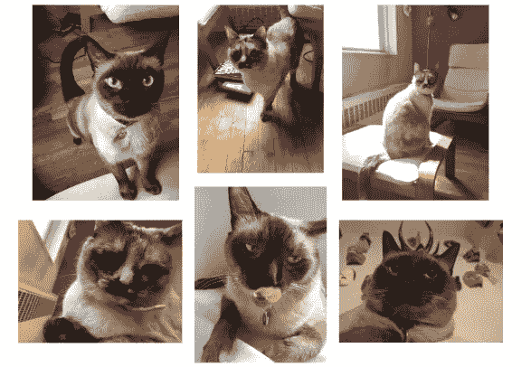
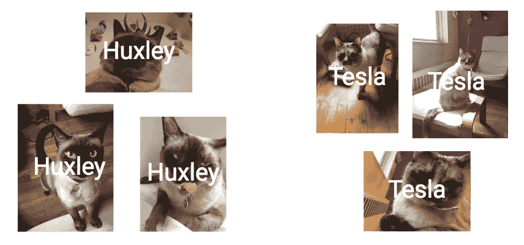
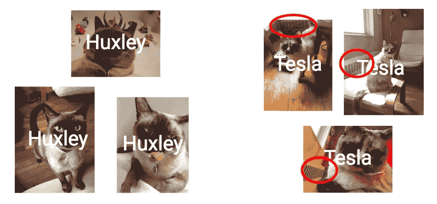
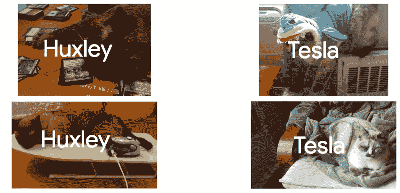

# AI 犯错是谁的错？

> 原文：<https://towardsdatascience.com/dont-trust-ai-10a7df520925?source=collection_archive---------10----------------------->

别误会，我爱[机器学习和 AI](http://bit.ly/quaesita_emperor) 。但是我不会盲目地信任他们，你也不应该，因为你构建有效可靠的 [ML/AI](http://bit.ly/quaesita_emperor) 解决方案的方式就是迫使每个解决方案**赢得** 你的信任。

*(本文中的许多建议也适用于没有 ML/AI 的数据洞察和模型，尤其是最后一段。)*

> 盲目的信任是一件可怕的事情。

在你开始认为这和机器人或者科幻有什么关系之前，打住！ [ML/AI](http://bit.ly/quaesita_emperor) 系统不像人类，它们[只是有用的东西的标签](http://bit.ly/quaesita_simplest)有着诗意的名字。相反，他们的不信任完全来自其他地方。我认为最好是展示而不是讲述，所以我们来看一个[熟悉的例子](http://bit.ly/quaesita_unsupervised1) …

【**剧透警告:**这篇文章会破坏[无监督学习去神秘化](http://bit.ly/quaesita_unsupervised1)的乐趣，让你对我的小认知演示免疫。]

Never trust [ML/AI](http://bit.ly/quaesita_emperor) blindly, always force it to earn your trust with appropriate testing. Image: [source](https://recruitingdaily.com/blind-recruitment-starts-right-path-equal-opportunity-hiring/blindfolded/).

## 为一厢情愿的想法做准备

欢迎回到我们的猫，你们可能已经见过[T21，当我们建立一个分类器将我的六张照片的原始数据集分成两组时。](http://bit.ly/quaesita_unsupervisedimg)

The original training dataset from [Unsupervised Learning Demystified](http://bit.ly/quaesita_unsupervisedimg). Do you see the two groups?

你看到了吗？我神奇的[神奇的机器学习系统](http://bit.ly/quaesita_simplest)成功地返回了我所期望的确切结果！

This example works for [supervised ML](http://bit.ly/quaesita_slkid) and for [unsupervised ML](http://bit.ly/quaesita_unsupervisedimg), so don’t worry about that. The important thing is that the [model](http://bit.ly/quaesita_slkid) perfectly identifies my two cats with 100% training accuracy.

答对了。这是两只不同的猫，而[型号](http://bit.ly/quaesita_slkid)完美地回复了它们的标签，让我泪眼模糊，为我聪明的分类机器人感到自豪。这意味着我刚刚建立了一个特斯拉和赫胥黎分类器！！！…对吗？

## 我们的思想会捉弄我们

没那么快！那是我们人类的一厢情愿又捉弄了我们。我太沉迷于我的小猫了，以至于我可能没有注意到所有特斯拉的照片都有一个散热器作为背景，而所有赫胥黎的照片都没有。你注意到了吗？再看看。

This system was never a cat detector. I jumped to that conclusion thanks to [confirmation bias](http://bit.ly/quaesita_confirmation), selectively noticing the evidence that confirmed the story I liked and failing to notice evidence that suggests the system is actually a [radiator detector](http://bit.ly/radiatordetector).

## 猫探测器还是散热器探测器？

我不知道的是，我的解决方案实际上是一个散热器探测器，而不是 Hux/Tes 探测器。用新的例子进行测试是有帮助的，所以让我们看看我们是否能以这种方式发现问题…

Turns out that using more examples from the same dataset doesn’t do much to, ahem, iron out the issue.

即使我通过给它看这些新照片，用新数据来测试它，也不会有一丝警报。哦亲爱的。有问题吗？

不是 ***如果*** Tes 是 ***总*** 用散热器拍摄而 Hux ***总*** 不是。如果是这样的话，谁在乎它是如何工作的呢？它 ***总是*** 起作用。它每次都会给正确的猫。没有问题。

那是一个很大的假设。如果猫搬到另一个公寓会怎样(真实故事)？如果你继承了我的分类器而没有我的笔记，并在你的照片上使用它，会怎么样？

在这些情况下，返回的标签将是“Huxley ”,任何依赖于我的 Hux/Tes 检测器的关键任务系统都将崩溃并严重燃烧。

## 这是谁的错？

在大火肆虐的时候，让我们做一个快速的尸检:

*   *就像常见的* [*AI*](http://bit.ly/quaesita_simplest) *一样，把像素转换成标签的配方是* [*太复杂了*](http://bit.ly/quaesita_simplest) *。*
*   *我观察到的只是输入(像素)和输出(Hux / Tes 标签)。*
*   *因为我是* [*人类*](http://bit.ly/conf_bias) *，所以我不会注意到就在我眼皮底下的东西(散热器和 Tes 总是重合的)。*
*   *我告诉自己的关于输入与输出之间关系的故事不仅过于简单，而且还偏离了* [*一厢情愿*](http://bit.ly/conf_bias) *的散热器解释。*
*   *没事。我不需要理解它是如何工作的，只要我能确定它确实工作。*
*   检验它是否有效的方法是评估它在一系列它从未见过的相关例子上的表现。

到目前为止，一切顺利。实际上还没有问题。你相信很多东西，却不知道它们是如何工作的，例如我们很多人用来治疗头痛的扑热息痛。它确实起作用，然而[科学无法告诉你如何起作用](https://bjaed.org/article/S1743-1816(17)30088-4/fulltext)。重要的一点是，你可以验证[扑热息痛**是否**起作用](https://en.wikipedia.org/wiki/Paracetamol)(不像[在你头上绑一颗死痣](http://bit.ly/headache_mole))。

Don’t know how this popular 100+ year old drug works at a molecular level? [Neither does science](https://bjaed.org/article/S1743-1816(17)30088-4/fulltext).

像思考头痛治疗一样思考复杂的人工智能系统。确保它们有效，你就没事了。好吧，在哪里解开？请击鼓！

*   *不幸的是，我在不像我希望系统运行的例子上检查性能。*

就在那里。这最后一个是*实际上*出了可怕错误的地方。只要我们用适当的例子适当地测试系统，其余的都没问题。所以，答案是:**是我人类的错。**

> 如果你为一项工作测试这个系统，然后把它应用到另一项工作中…你期望什么？

如果我用一组例子来教和测试一个学生，而这些例子并没有涵盖我希望这个学生学习的任务，那么如果以后出现混乱，我为什么会感到惊讶呢？如果我所有的例子都来自 Tes 和辐射器总是在一起的世界，那么我只能期望我的分类器在那个世界工作。当我把它移到一个不同的世界时，我把它放在了不属于它的地方。这个应用程序最好是低风险的，因为没有借口*“哎呀，但是我不知道它不能在它被设计的环境之外工作。”*你知道。如果你以前不知道，现在你知道了。

这就是为什么从一开始就记住你的[目标和用户](http://bit.ly/quaesita_dmguide)是如此重要。开始之前，请指定规格和设置。请让一个负责任的成年人来负责或者坚持玩具应用。

> 当更大的事情处于危急关头时，不要只是在不相关的数据集上抛出一些时髦的词语。

没有熟练和负责任的领导，嗯，我希望你的应用程序永远不会有任何人的健康，安全，尊严，或未来挂在上面…

## 常识，不是魔法

我一直用“例子”这个词代替“数据”——它们是同一个东西——来提醒你这不是魔术。 [ML/AI](http://bit.ly/quaesita_emperor) 的重点是你在[用例子而不是指令来表达你的愿望](http://bit.ly/quaesita_simplest)。为了让它起作用，例子必须是相关的。任务越复杂，你需要的例子就越多。你每天都用例子交流，所以你已经知道这些东西了。也许你想知道数学是否有不同的说法；并没有。请放心，常识一直是你最好的算法。

> 如果你想用例子来教学，例子必须是好的。如果你想信任你的学生，测试必须是好的。

## 盲目的信任是一件可怕的事情

除了您检查系统的条件之外，您对系统的安全性一无所知，所以请将这些提醒放在手边:

*   如果你没有测试过，就不要相信它。
*   如果你没有在[环境]中测试过，就不要在[环境]中信任它。
*   如果你没有用【用户人群】测试过，就不要用【用户人群】信任它。
*   如果你没有用[数据总体]测试过，就不要用[数据总体]信任它。
*   如果一个输入是不寻常的，不要相信你的系统会输出合理的东西。考虑使用异常检测和[安全网](http://bit.ly/quaesita_policy)(例如，标记一个不寻常的实例以供人工审查)。

如果你使用的工具没有经过安全验证，你造成的任何混乱都是你的错。人工智能和其他工具一样。

# 感谢阅读！YouTube 课程怎么样？

如果你在这里玩得开心，并且你正在寻找一个为初学者和专家设计的有趣的应用人工智能课程，这里有一个我为你制作的娱乐课程:

Enjoy the entire course playlist here: [bit.ly/machinefriend](http://bit.ly/machinefriend)

# 喜欢作者？与凯西·科兹尔科夫联系

让我们做朋友吧！你可以在 [Twitter](https://twitter.com/quaesita) 、 [YouTube](https://www.youtube.com/channel/UCbOX--VOebPe-MMRkatFRxw) 、 [Substack](http://decision.substack.com) 和 [LinkedIn](https://www.linkedin.com/in/kozyrkov/) 上找到我。有兴趣让我在你的活动上发言吗？使用[表格](http://bit.ly/makecassietalk)取得联系。