# 用深度学习涂鸦！

> 原文：<https://towardsdatascience.com/doodling-with-deep-learning-1b0e11b858aa?source=collection_archive---------5----------------------->

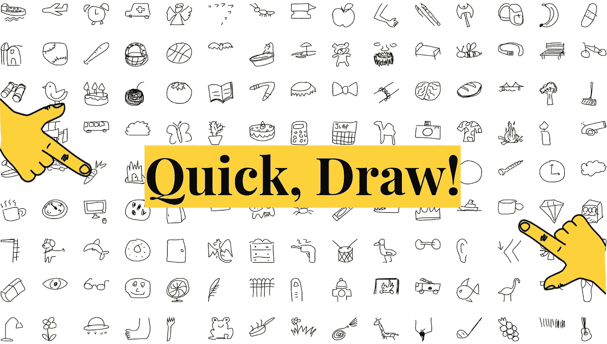

## ***我们的旅程与素描识别***

在这篇博文中，我们描述了我们对过程的理解，对模型的拟合，以及找到一个有趣的 Google Quick，Draw 应用程序！数据集。与我们一起走过这段旅程，看看我们是如何应对成功分类“可以说是世界上最可爱的研究数据集”这一挑战的

该项目由 Akhilesh Reddy、Vincent Kuo、Kirti、Tiffany Sung 和 Helena Shi 建造。要查看使用的完整代码，请找到我们的 [github](https://github.com/QuickDraw-sketchRecognition/Sketch_Recognition/) :

# **一、背景**

2016 年，谷歌发布了一款名为“快，画！”—这是一项人工智能实验，它在神经网络方面对公众进行了教育，并建立了超过 10 亿张图纸的庞大数据集。游戏本身很简单。它会提示玩家在某个类别中涂鸦一幅图像，当玩家在画画时，神经网络会在人机游戏的猜图游戏中猜测这幅图像描绘了什么。你可以在这里找到更多关于游戏[的信息](https://cloud.google.com/blog/products/gcp/drawings-in-the-cloud-introducing-the-quick-draw-dataset)或者自己玩[游戏](https://quickdraw.withgoogle.com/)！

自从在数据集中发布了 5000 万幅图画以来，ML 社区已经开始探索这些数据在改进手写识别、训练[草图 RNN](https://ai.googleblog.com/2017/04/teaching-machines-to-draw.html) 模型来教机器画画等方面的应用。值得注意的是，它在 OCR(光学字符识别)、ASR(自动语音识别)& NLP(自然语言处理)方面具有强大的潜力，并揭示了世界各地的人们如何[不同，但却是相同的](https://www.blog.google/technology/ai/quick-draw-one-billion-drawings-around-world/)。

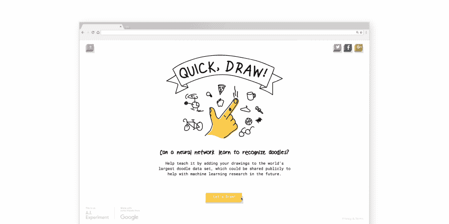

# **二。数据**

我们的总数据量为 73GB，包含 340 个标签类别中的 5000 万张图纸。每张图纸都有特定的变量:

*   “**字**”—该图纸的类别标签
*   "**国家代码** " —出票人的原产国
*   “**时间戳**”—图纸的时间戳
*   “**识别出**”—表示 app 预测成功
*   **绘图**——针对涂鸦图像的笔画基础数据；每幅画都由矩阵形式的多个笔画组成

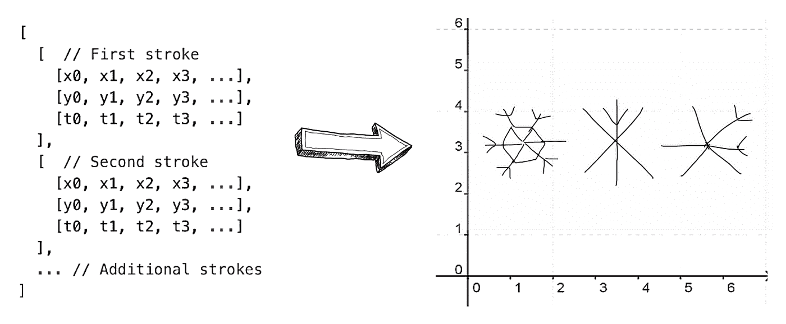

As seen here, each point in a stroke corresponds to an x-coordinate, y-coordinate, and time point

# **三。接近**

我们首先了解构成草图的数组的结构，并对数据进行预处理。然后，我们深入研究拟合一些简单的分类器和一个基本的卷积神经网络，或 CNN。从那里，我们处理 CNN 架构，如 ResNet 和 MobileNet。最后，我们通过参加 [Kaggle 竞赛](https://www.kaggle.com/c/quickdraw-doodle-recognition)与世界分享了我们的成果。

由于数据的巨大规模和对更高容量 GPU 的需求，我们在谷歌云平台上实现了 CNN 结构，该平台提供 300 美元的免费试用。要了解我们是如何做到的，请点击链接[这里](https://medium.com/@alamhanz/jupyter-notebook-on-gcp-for-pythoners-18a8e7a73a56)和[这里。](https://medium.com/google-cloud/using-a-gpu-tensorflow-on-google-cloud-platform-1a2458f42b0)

# **四。数据预处理**

对于每个类别标签的图形，数据以单独的 CSV 文件格式存在。因此，我们首先改组 CSV，用来自所有类的数据创建 100 个新文件，以确保模型接收图像的随机样本作为输入，并消除偏差。

大多数人画涂鸦的方式都差不多。例如，如果我让你画一个太阳，你会从一个圆开始，然后以顺时针方向画出从圆心向外辐射的虚线。为了捕捉这些信息，我们使用灰度/颜色编码处理来利用 RGB 通道，同时构建 CNN，以便模型可以识别每个笔画之间的差异。我们给涂鸦的每一个按时间顺序排列的笔画分配了一种颜色，这样模型就可以获得单个笔画的信息，而不仅仅是整幅图像。

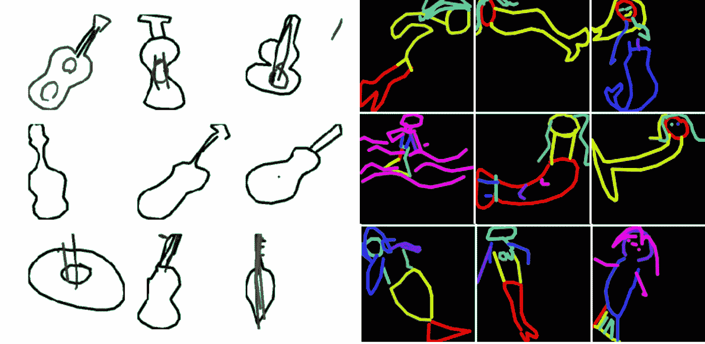

Violin (left) in black & white; Mermaid (right) color-encoded

我们还通过随机翻转、旋转或阻挡部分来增加图像，以将噪声引入图像，并增加模型处理噪声的能力。在游戏过程中，一些玩家没有完成他们的涂鸦或以不同的角度画画。在这些情况下，增强可以为模型提供信息。

灰度/彩色编码和图像增强都使用了来自 keras **、**的 OpenCV 和 ImageGenerator，它们从 csv 文件中加载大量原始数据，并将其转换为图像。

# **五、建筑模型**

在完成所有的数据收集和预处理步骤之后，就该开始项目中最有趣的部分了——模型构建！

在我们进入 CNN 之前，我们尝试了一些基本的分类器来比较不同的机器学习算法，并熟悉这些数据。我们从[谷歌云存储](https://console.cloud.google.com/storage/browser/quickdraw_dataset/full/numpy_bitmap//)中提取了数据的 numpy 文件。该数据已经过预处理，并在 numpy 中呈现为 28x28 灰度位图。npy 格式。由于整个数据集包括超过 345 个类别，我们最终选择了仅包含以下 5 个类别的子集:飞机、闹钟、救护车、天使和动物迁徙。

## **随机森林**

我们首先从随机森林分类器开始。我们利用 GridSearchCV 交叉验证模型并优化参数。我们发现精确度在 100 棵树后趋于平稳，所以我们使用 n_estimators = 100 作为我们的最终模型，返回的精确度为 0.8291。

## **KNN**

其次，我们尝试了 k-最近邻(kNN)分类器，这可以说是最简单、最容易理解的模型。它的算法通过在 k 个最接近的例子中找到最常见的类来对未知数据点进行分类。我们交叉验证了 n_neighbors，发现给出的最佳模型是 k = 5，这返回 0.8752 的准确度。

## **多层感知器(MLP)**

最后，我们尝试了 scikit-learn 的多层感知器(MLP)。我们在不同的隐藏层大小和学习率上进行交叉验证，决定隐藏层大小为(784)，学习率α= 0.001，这给出了 0.8654 的准确度。

## **卷积神经网络**

然后，我们转到一个简单的 CNN 模型，为模型性能设置一个较低的阈值，并理解模型的细微差别和执行时间。在这个模型中，我们使用数据中的绘图信息，通过 OpenCV 创建所需大小的图像。这里，我们尝试了一系列不同的参数，如下所示:

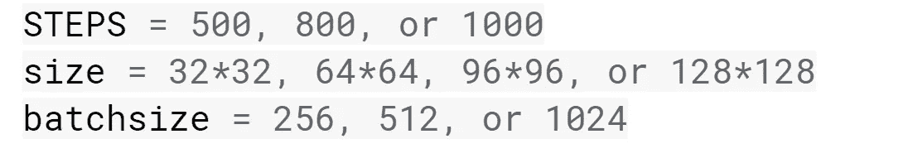

这是我们参数设置背后的一些直觉。首先，较大的批量将有助于解决由于错误标记的训练数据而产生的噪声。尺寸参数表示图像尺寸/分辨率，对精度有重要影响。例如，32x32 和 128x128 的比较表明，32x32 的大小过于像素化，无法实现精确的模型。

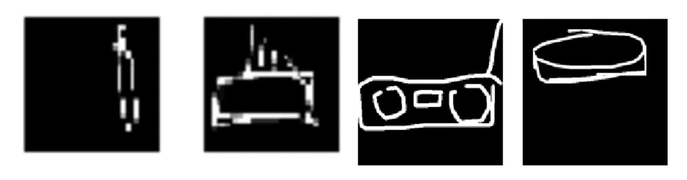

32x32 (left), 128x128 (right)

第一个模型使用两个卷积层，每个深度为 128。然而，这种图像尺寸的增加需要更大的感受野 conv 层或额外的 conv 层。因此，当用更大的图像尺寸训练时，我们包括了多一层。下面是我们创建的自定义 CNN 模型，在构建模型时，将卷积层数、密集层数、压差和大小作为参数。

由于我们仍在决定进一步进行分析的最佳模型，我们在初始步骤使用了有限的数据来减少执行时间。

## 选择优化器

继续培训之前的一个关键步骤是决定使用哪个优化器。在参考了文献并听取了各种 Kaggle 论坛上专家的建议后，我们决定比较 Adam 优化器和 SGD 优化器在我们的数据上的性能。在多次迭代之后，我们选择了 Adam 优化器，因为我们观察到它显示出比 SGD 稍好的结果并且收敛得更快。

在对每个班级的 25000 张图片运行该模型大约 3 小时后，我们在 Kaggle 的公共排行榜上获得了 0.76 的 MAP@3 分数——对于每个班级仅有 25000 张图片来说，这是一个不错的结果！客观地说，数据集中的平均类包含 150000 幅图像。然而，当我们增加模型的复杂性时，精确度略有下降，这就导致了我们的下一步:ResNet。

## **SE-ResNet-34，SE-ResNet-50:**

当增加模型的深度时，可能会面临消失梯度和退化等问题；相比之下，更深的模型比更简单的模型表现更差。残差网络(ResNet)是一种神经网络架构，它通过使用深度残差学习，以最简单的方式解决消失梯度和退化问题。

简而言之，在反向传播过程中，当信号反向发送时，梯度总是要经过 *f(x)* (其中 *f(x)* 是我们的卷积、矩阵乘法或批量归一化等)，这可能会由于涉及到的非线性而带来麻烦。

结尾的“ *+ x* ”是快捷键。它允许渐变直接向后传递。通过堆叠这些层，梯度理论上可以“跳过”所有中间层，并到达底部而不会减小。

可以参考[原文](https://arxiv.org/pdf/1512.03385.pdf)进一步了解 34 层平面网络和 34 层残差网络的比较。

在该过程的这一步中，我们训练 SE-ResNet-34 和 50 作为简单 CNN 的进一步发展。术语 SE 指的是挤压和激发网；有了它，一个额外的块给不同的通道加权。通过给出权重，SE 模块被证明提供了额外的精度，而仅仅增加了总参数的不到 10%。关于挤压和激励网络的更多信息可在[这里](https://arxiv.org/pdf/1709.01507.pdf)找到。

在训练 SE-ResNet-50 时，我们对 50 到 60 个时期尝试了如下不同的参数。

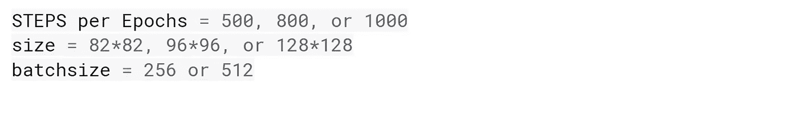

最后，在所有组合中，批量大小为 512 和图像大小为 128x128 的组合对分数的改善最大，将分数提高到 0.9093。值得注意的是，更改批量大小和图像大小是基于我们使用的 GPU，这些是 Tesla k80 上我们数据的最大可能参数。

## MobileNet

在与 SE-ResNet 进行多次迭代后，随着竞赛截止日期的临近，我们决定探索 MobileNet，它提供了相当的准确性，但执行速度更快。

MobileNet 由 Google 推出，旨在为客户随时随地提供最新的技术，如对象、徽标和文本识别，而不考虑互联网连接。MobileNets 基于一种流线型架构，使用深度方向可分离的卷积来构建轻量级深度神经网络。

为了正确理解这一点，标准卷积在所有输入通道上应用滤波器，并在一个步骤中组合这些值。相比之下，深度方向可分离卷积执行两个不同的步骤:

1.  *深度方向卷积*将单个滤波器应用于每个输入通道
2.  *逐点卷积*，一个简单的 1×1 卷积，然后用于创建深度方向层输出的线性组合

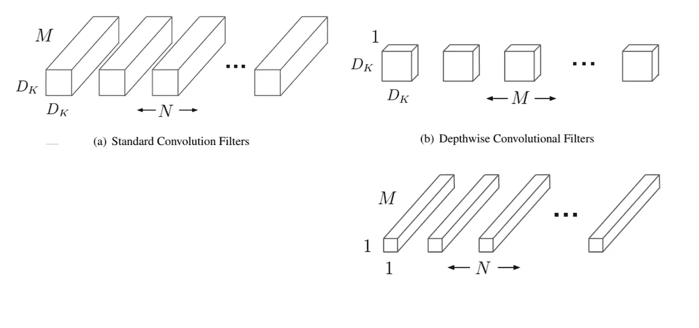

这种因子分解大大减少了计算和模型大小，因为它打破了输出通道数量和内核大小之间的相互作用。根据 MobileNet 上的原始论文，MobileNet 显示计算成本减少了至少 9 倍。更详细的内容，可以参考 MobileNet 上的[原创论文。](https://arxiv.org/pdf/1704.04861.pdf)

为了简单起见，我们在 keras 中使用了简单的两行标准 MobileNet 模块。

在训练模式之前，我们确保使用所有 50 MM 图像来训练模型，并通过每个笔画的灰度梯度包括笔画信息的顺序。经过多次迭代，我们发现以下参数是最佳参数。

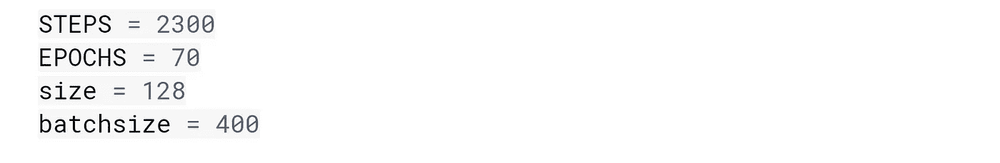

# 不及物动词结果

我们开始在谷歌云平台提供的特斯拉 P100 GPU 上用 50 毫米的图纸和 340 节课训练模型。经过 20 个小时的训练和 50 美元的 GCP 积分，我们最终在 Kaggle 排行榜上使用 MobileNet 获得了 0.9211 的分数，这帮助我们在 1316 支参赛队伍中获得了 268 名的排名！

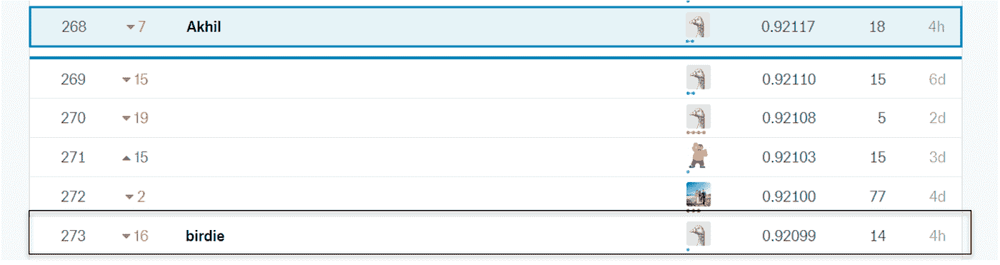

在这里，您可以看到我们模型参数和结果的总体总结:

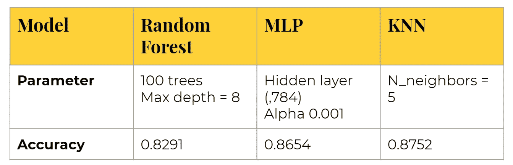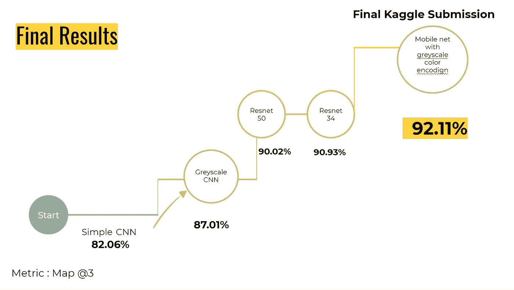

以下是我们预测的一些例子！

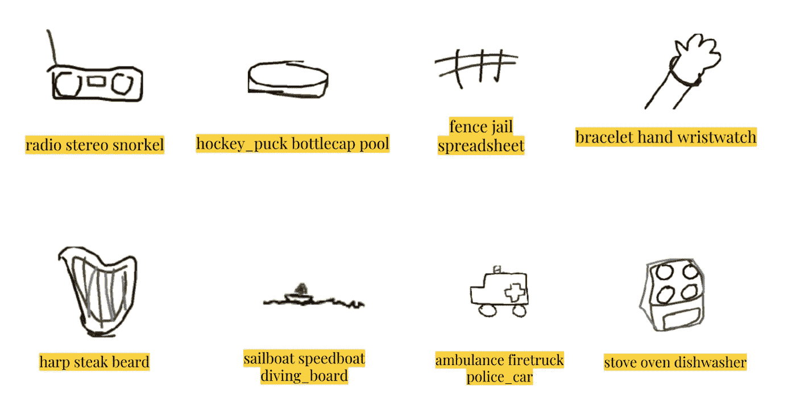

# 有趣的奖励！

如果你坚持读完并读到这一点，给你加分！作为一个有趣的治疗，我们决定也增加一点趣味，并创建了一个可以通过网络摄像头捕捉涂鸦的应用程序！该应用程序使用我们的模型进行实时预测。OpenCV 函数被用来从网络摄像头捕捉视频并提取所绘制的图像。

我们使用第一个简单的 CNN 模型作为我们的后端，因为它是我们运行过的最轻的模型。该模型在 15 个类别(如下所列)上进行训练，并实现了 87%的正确率来检测所画的涂鸦。

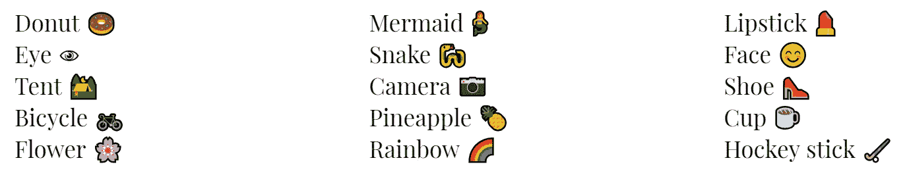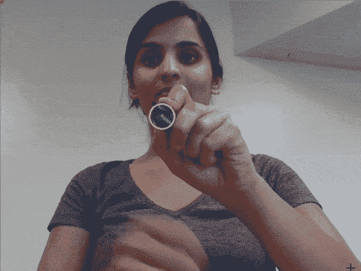

# 七。结论

最后，我们将总结一下这个曲折旅程中所采取的步骤:

1.  绞尽脑汁理解涂鸦数据的独特结构，并想出如何连接谷歌云平台来运行模型
2.  通过混洗 CSV 和用笔画信息扩充图像等执行数据清理和预处理
3.  在我们的本地系统上的三个简单分类器上运行五个类的缩减数据集
4.  实施深度学习模型，从简单的 CNN 到 ResNets 和 MobileNets
5.  向比赛提交了成果，给了我们自己一个大大的鼓励，并通过创建一个应用程序来庆祝项目的结束！

以下是在训练深度学习网络时学到的一些经验:

*   获得该算法的一个基本实现，首先在一个较小的数据集上测试它，以节省执行时间
*   探索所有可用的 GPU 选项，并根据任务所需的计算强度在它们之间进行交替
*   随着时代的增加而降低学习率。我们有一个名为 ReduceLRonplateau 的内置函数来执行这个操作。这影响了模型在平台期的学习

总的来说，这个项目非常值得！作为研究生，我们抓住了这两个机会(希望如此！)打动我们的教授，参加有声望的比赛。我们能够第一次通过处理图像分类来挑战自己，并且得出了非常令人满意的结果。

# 参考

这些工作没有一项是我们自己能够完成的。查看以下参考资料，获取我们使用的所有重要资源:

[https://cloud . Google . com/blog/products/GCP/drawings-in-the-cloud-introducing-the-quick-draw-dataset](https://cloud.google.com/blog/products/gcp/drawings-in-the-cloud-introducing-the-quick-draw-dataset)
https://ai . Google blog . com/2017/04/teaching-machines-to-draw . html
[https://www.kaggle.com/c/quickdraw-doodle-recognition](https://www.kaggle.com/c/quickdraw-doodle-recognition)
[https://www . blog . Google/technology/ai/quick-draw-10 亿次绘图-环游世界/](https://www.blog.google/technology/ai/quick-draw-one-billion-drawings-around-world/)
q = https://stats . stack exchange . com/questions/148139/rules-for-selecting-convolutionary-neural-network-hyperparameters&sa = D&ust = 1544740608219000&usg = afqjcngwjl 5 gpzwwpkmpfclt 6 qinwqnha
[http://ruder.io/optimizing-gradient-descent/index.html#adam](http://ruder.io/optimizing-gradient-descent/index.html#adam)
[http://cs231n.stanford.edu/reports/2016/pdfs/264_Report.pdf](http://cs231n.stanford.edu/reports/2016/pdfs/264_Report.pdf)