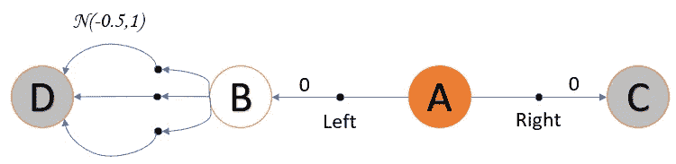
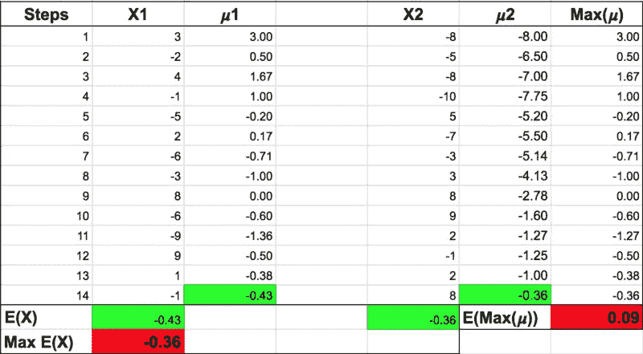
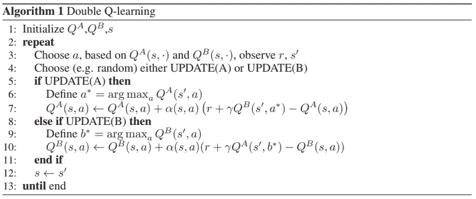
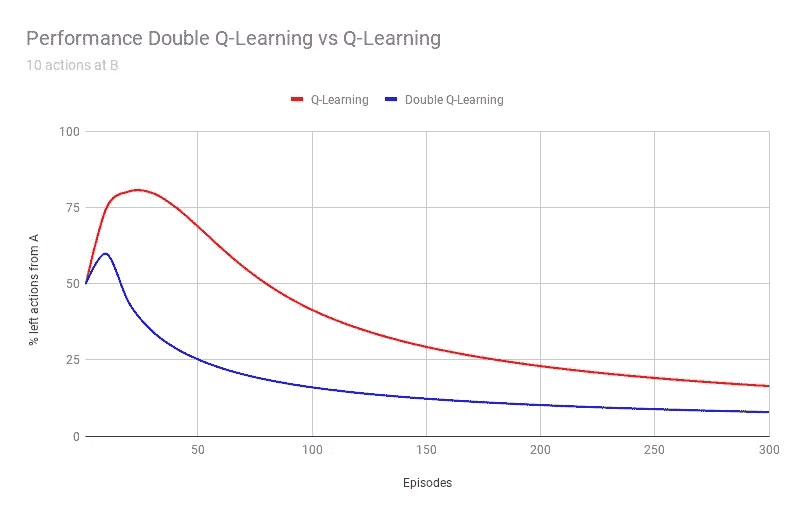
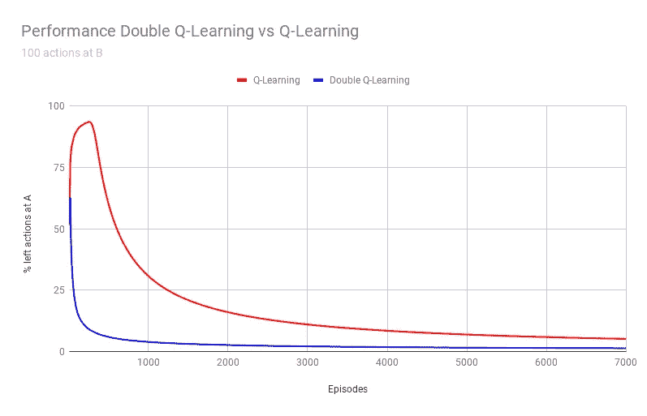
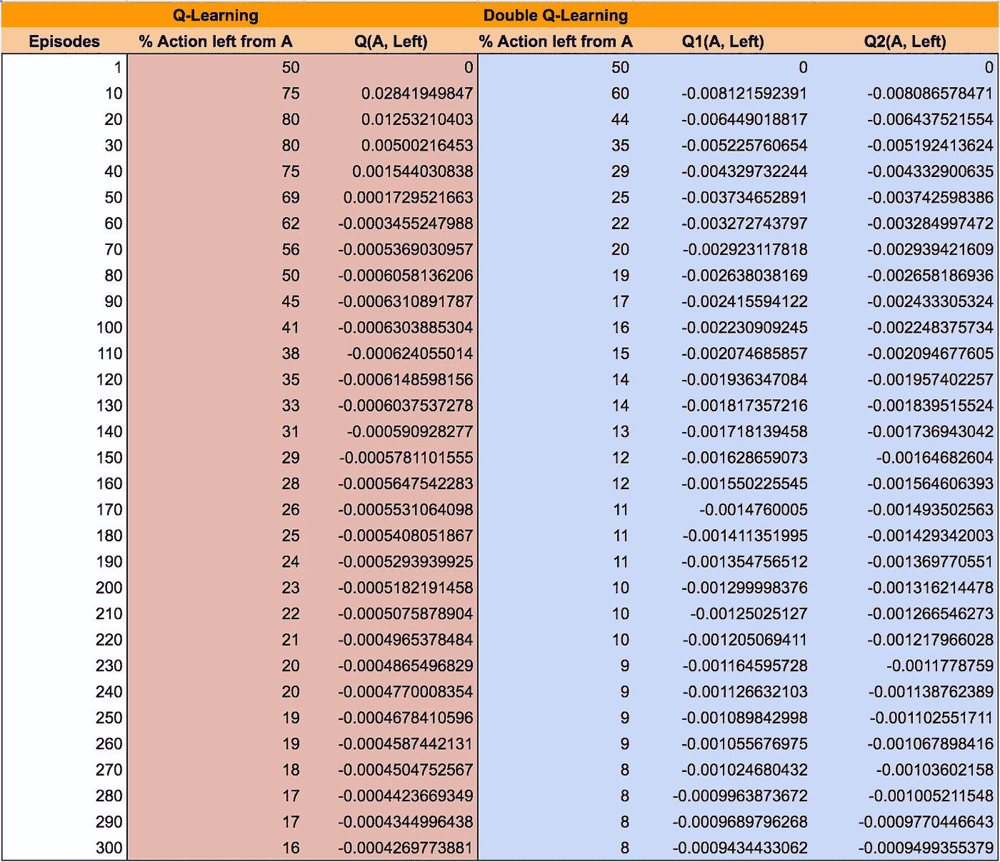

# 双 Q 学习，最简单的方法

> 原文：<https://towardsdatascience.com/double-q-learning-the-easy-way-a924c4085ec3?source=collection_archive---------6----------------------->

## 理解双 Q 学习的介绍

**更新**:学习和练习强化学习的最好方式是去 http://rl-lab.com

Q-learning (Watkins，1989)被认为是 TD 控制强化学习算法的突破之一。

然而，在他的论文[双 Q 学习](https://papers.nips.cc/paper/3964-double-q-learning.pdf)中，哈多·范·哈瑟尔特解释了 Q 学习在一些随机环境中表现不佳的原因。他指出，性能不佳是由于在 Q-learning 中使用 Max Q(s '，a)而导致的动作值被大大高估。

为了解决这个问题，他提出了双 Q 学习法。

# 问题是

考虑一个有四个状态的 MDP，其中两个是终态。
状态 A 总是被认为是开始状态，并且有两个动作，或者右或者左。右边的动作给出零奖励，并到达终端状态 c。
左边的动作将代理移动到状态 B，奖励为零。

状态 B 有许多动作，它们将代理移动到终端状态 D。但是(这很重要)从 B 到 D 的每个动作的奖励 R 有一个**随机值，该值遵循均值为-0.5、方差为 1.0 的正态分布**。

已知 R 的期望值为负(-0.5)。这意味着在大量的实验中，R 的平均值小于零。

基于这个假设，很明显，从 A 向左移动总是一个坏主意。然而，因为 R 的一些值是正的，Q-Learning 会被欺骗，认为从 A 向左移动会使回报最大化。事实上，这是一个糟糕的决定，因为即使它对某些情节有效，但从长远来看，它肯定是一个负面的回报。

那么为什么 Q-Learning 会高估呢？
为了回答这个问题，我们考虑以下场景:
设 X1 和 X2 是两个随机变量，它们代表状态 b 下两个行为的回报。由于它们是随机变量，我们将计算它们的期望值 E(X1)和 E(X2)。但有一个问题，我们不知道他们的期望值，所以我们能做的是通过计算增量平均𝝁1 和𝝁2.来使用这些期望值的估计值这些估计值是无偏的，因为随着样本数量的增加，整组值的平均值越来越接近 E(X1)和 E(X2)，如下表所示。

然而，Q-Learning 使用 Max Q(s '，a)，在表中由 Max(𝝁).表示从表中可以清楚地看出(见红色单元格)，E(Max(𝝁)不同于 Max E(X)。这说明 Max(𝝁)不是 Max E(X)的一个好的估计量。是有失偏颇！
换句话说，当用最大 Q(s’，a)更新 Q(s，a)时，Q(s，a)没有向状态 B 的动作的期望值移动，即-0.5。

这个场景直观地解释了为什么 Q-Learning 高估了这些值。正式的数学证明可以在论文中找到。

# 解决方案

所提出的解决方案是维护两个 Q 值函数 QA 和 QB，其中一个从另一个获得下一个状态的更新。更新包括找到在下一个状态中使 QA 最大化的动作 a*(Q(s '，a*) = Max Q(s '，a))，然后使用 a*获得 QB(s '，a*)的值，以便更新 QA(s，a)。

下面的伪代码显示了算法的行为。请注意，本文末尾有一段 python 代码，对这两种方法进行了比较。
算法的第 3 行显示了如何从两个 Q 值函数中选择动作。例如，可以合并两个 Q(平均每个动作的值)，然后应用ε-greedy。

该算法以等概率的方式更新 QA 和 QB。

Algorithm taken from Double Q-learning by Hado van Hasselt

下面的图表显示了当状态 B 的动作数量连续为 10 和 100 时，双 Q 学习和 Q 学习之间的比较。
很明显，双 Q 学习比 Q 学习收敛得更快。
注意，当 B 点的动作数量增加时，Q-learning 比双 Q-Learning 需要更多的训练。

## 为什么有效？

范·哈瑟尔特在他的论文中证明了 E(Q2(s '，a*)≤马克斯·Q1(s '，a*)。
所以经过足够多的实验，Q2(s '，a*)的期望值小于或等于最大 Q1(s '，a*)，这意味着 Q1(s，a)没有用最大值更新。

下表显示了随着发作次数的增加，状态 A 下左侧动作的 Q 值的演变。
请注意，在 Q-Learning 中，Q(A，Left)是正的，因为它受到状态 b 中存在的正奖励的影响。由于这个正值，算法对采取左边的动作更感兴趣，希望最大化奖励。正如你所看到的，直到第 50 集，左手动作的比例一直在增加。
在双 Q-Learning 中，Q1(左一)和 Q2(左一)开始时略显消极。
因此，左侧动作的百分比很早就开始下降，从而节省了训练时间。

# 结论

本文表明双 Q 学习有时可能低估动作值，但避免了 Q 学习高估偏差的缺陷。它还表明，对于这种类型的问题，双 Q 学习更快地达到良好的性能水平。

# Python 代码

以下 Python 代码模拟了双 Q 学习和 Q 学习，并输出了这两种方法的表格和对比图。

# 相关文章

*   [TD 在强化学习中，最简单的方法](/td-in-reinforcement-learning-the-easy-way-f92ecfa9f3ce)
*   [Q vs V 在强化学习中，最简单的方法](https://medium.com/p/9350e1523031)
*   [数学背后的强化学习，最简单的方法](https://medium.com/p/1b7ed0c030f4)
*   [蒙特卡洛强化学习中最简单的方法](https://medium.com/@zsalloum/monte-carlo-in-reinforcement-learning-the-easy-way-564c53010511)
*   [动态编程中的强化学习，简单易行的方法](https://medium.com/@zsalloum/dynamic-programming-in-reinforcement-learning-the-easy-way-359c7791d0ac)