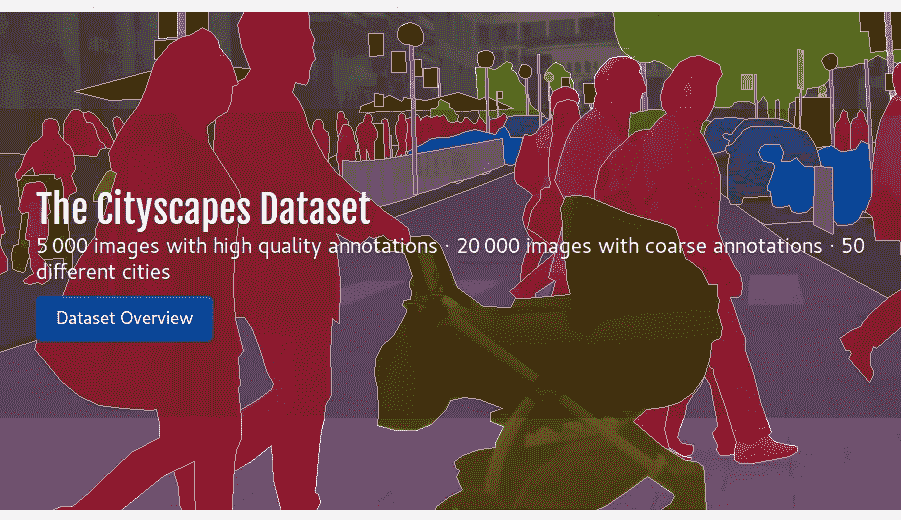
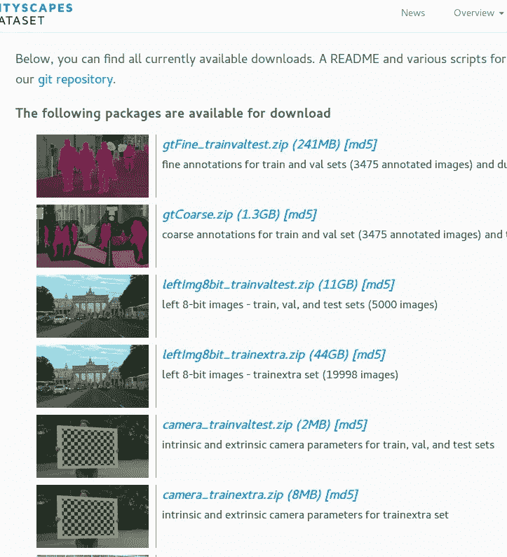

# 下载带有脚本的城市景观数据集

> 原文：<https://towardsdatascience.com/download-city-scapes-dataset-with-script-3061f87b20d7?source=collection_archive---------14----------------------->

City Scapes 数据集是一个非常流行的数据集，由带标签的街道图像(来自视频序列)组成。高质量标注帧 5000 个，弱标注帧 20000 个。这个数据集的网站是[www.cityscapes-dataset.com](https://www.cityscapes-dataset.com/)



当我使用这个数据集时，我很快意识到数据集只能在登录后从网站下载。所以，没有直接下载链接。这意味着当你需要将深度学习模型部署到云机器或另一台 linux 机器时，你需要从另一个来源获得数据:Dropbox 等。有些数据文件非常大:44GB、11GB、6.6GB！！！。这个问题的解决方案是不用浏览器登录和下载数据。

首先，您需要在网页中创建一个帐户。您将在脚本的第一行使用您的用户名和密码登录到该页面。

下面是两行脚本:

```
wget --keep-session-cookies --save-cookies=cookies.txt --post-data 'username=myusername&password=mypassword&submit=Login' [https://www.cityscapes-dataset.com/login/](https://www.cityscapes-dataset.com/login/)wget --load-cookies cookies.txt --content-disposition [https://www.cityscapes-dataset.com/file-handling/?packageID=1](https://www.cityscapes-dataset.com/file-handling/?packageID=1)
```

在第一行，输入你的**用户名**和**密码**。这将使用您的凭据登录，并保留关联的 cookies。

在第二行中，您需要提供 **packageID** 参数，它将下载文件。

网站中的 packageIDs 映射如下:

1-> gt fine _ trainvaltest . zip(241 MB)
2->gt coarse . zip(1.3 GB)
3->left mg 8 bit _ trainvaltest . zip(11GB)
4->left mg 8 bit _ train extra . zip(44GB)
8->camera _ trainvaltest . zip(2MB)
9->camera _ train extra . zip(8MB)【中

下载页面的屏幕截图:



你可以在这里看到这个脚本的 GitHub 库[。](https://github.com/cemsaz/city-scapes-script)