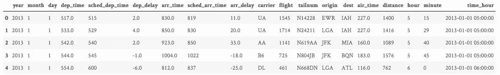
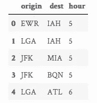
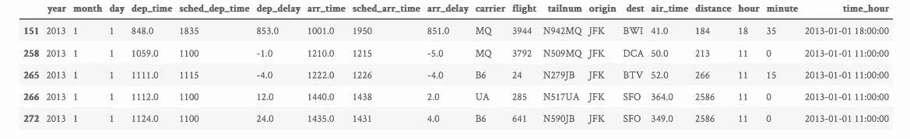
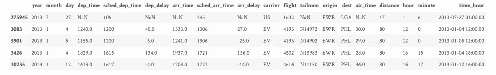
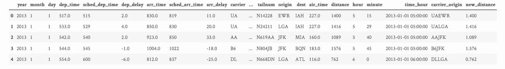
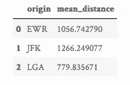
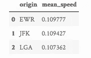

# 用 Python 中的管道进行 dplyr 风格的数据操作

> 原文：<https://towardsdatascience.com/dplyr-style-data-manipulation-with-pipes-in-python-380dcb137000?source=collection_archive---------1----------------------->


我经常使用 R 的`dplyr`包进行探索性的数据分析和数据操作。除了提供一组一致的函数来解决最常见的数据操作问题，dplyr 还允许使用管道编写优雅的、可链接的数据操作代码。

现在，Python 是我的主要语言，而`pandas`是我用于数据分析的瑞士军刀，然而我常常希望有一个 Python 包，允许直接在熊猫数据帧上进行 dplyr 风格的数据操作。我上网搜了一下，找到了一个叫`dfply`的包，是由 [**基弗·卡托维奇**](https://github.com/kieferk) 开发的。和 dplyr 一样，dfply 也允许用管道操作符链接多个操作。

这篇文章将关注 dfply 包的核心函数，并展示如何使用它们来操作 pandas 数据帧。完整的源代码和数据集可在 [**Github**](https://github.com/allenakinkunle/dplyr-style-data-manipulation-in-python) 上获得。

## 入门指南

我们需要做的第一件事是使用`pip`安装包。

`pip install dfply`

根据该项目的 Github repo，dfply 只适用于 Python 3，因此请确保您安装了正确版本的 Python。

## 数据

为了探索 dfply 的功能，我们将使用[**dplyr**](https://cran.r-project.org/web/packages/dplyr/vignettes/dplyr.html)简介中使用的相同数据。数据来自于[](https://www.bts.gov/)**交通统计局，包含了 2013 年所有从纽约市出发的 336776 次航班的信息。**

```
from dfply import *
import pandas as pd

flight_data = pd.read_csv('nycflights13.csv')
flight_data.head()
```

****

## **平静的**

**假设您想在输出最终结果之前对数据集执行`n`离散变换操作。最常见的方法是逐步执行操作，并将每一步的结果存储在一个变量中。保存中间结果的变量将用于转换管道的下一步。让我们看一个抽象的例子。**

```
# 'original_data' could be a pandas DataFrame.
result_1 = transformation_1(original_data, *args, **kwargs)
result_2 = transformation_2(result_1, *args, **kwargs)
result_3 = transformation_3(result_2, *args, **kwargs)
.
.
.
final_result = transformation_n(result_n-1, *args, **kwargs)
```

**这不是非常优雅的代码，写起来可能会令人困惑和混乱。这就是管道救援的地方。管道允许我们重写上面的代码，而不需要那些中间变量。**

```
final_result = original_data -->
                transformation_1(*args, **kwargs) -->
                transformation_2(*args, **kwargs) -->
                transformation_3(*args, **kwargs) -->
                .
                .
                .
                transformation_n(*args, **kwargs)
```

**魔法？！不，不是的。管道的工作原理是隐式地将一个阶段的输出作为下一个阶段的输入。换句话说，每个变换步骤都处理前一个步骤的变换结果。**

## **带供给的管道**

**dfply 允许在 pandas 数据帧上用`>>`操作符链接多个操作。可以将操作链接起来，并将最终输出(一个 pandas 数据帧，因为 dfply 直接在数据帧上工作)赋给一个变量。在 dfply 中，一个操作链的每一步的 DataFrame 结果都用`X`来表示。
例如，如果您想在一个步骤中从数据帧中选择三列，在下一个步骤中删除第三列，然后显示最终数据帧的前三行，您可以这样做:**

```
# 'data' is the original pandas DataFrame
(data >>
 select(X.first_col, X.second_col, X.third_col) >>
 drop(X.third_col) >>
 head(3))
```

**`select`和`drop`都是 dfply 变换函数，而`X`代表每个变换步骤的结果。**

## **探索 dfply 的一些转换方法**

**`dfply`提供了一组用于选择和删除列、子集化和过滤行、数据分组和数据整形的函数。**

## **用`select()`和`drop()`选择并放下列**

**有时，您会处理包含许多列的数据集，但只有一部分列是感兴趣的；`select()`允许您选择这些列。
例如，要选择我们之前加载的`flight_data`数据帧中的`origin`、`dest`和`hour`列，我们需要:**

```
(flight_data >>
 select(X.origin, X.dest, X.hour))
```

****

**`drop()`是`select()`的逆。它返回除作为参数传入的列之外的所有列。
例如，获取除`year`、`month`和`day`列之外的所有列:**

```
(flight_data >>  
  drop(X.year, X.month, X.day))
```

**您也可以通过在您想要删除的列前面放一个波浪号`~`来删除`select()`方法中的列。
例如，选择`flight_data`数据框中除`hour`和`minute`列之外的所有列:**

```
(flight_data >> 
  select(~X.hour, ~X.minute))
```

## **用`mask()`过滤行**

**`mask()`允许您根据逻辑标准选择 pandas 数据框架中行的子集。`mask()`选择条件为真的所有行。
例如，选择 1 月 1 日从 JFK 机场始发的所有超过 10 小时的航班:**

```
(flight_data >>
  mask(X.month == 1, X.day == 1, X.origin == 'JFK', X.hour > 10))
```

****

## **使用`arrange()`对行进行排序**

**`arrange()`允许您根据一列或多列对行进行排序；默认行为是按升序对行进行排序。
例如，先按`distance`排序，然后按航班的数量`hours`排序，我们这样做:**

```
(flight_data >>
  arrange(X.distance, X.hour))
```

****

**要按降序排序，可以将`arrange()`的`ascending`关键字参数设置为`False`，如下所示:**

```
(flight_data >>
  arrange(X.distance, X.hour, ascending=False))
```

## **用`mutate()`添加新列**

**`mutate()`允许您在数据框中创建新列。新列可以由现有列组成。
例如，让我们创建两个新列:一个是将`distance`列除以`1000`，另一个是连接`carrier`和`origin`列。我们将这些新列分别命名为`new_distance`和`carrier_origin`。**

```
(flight_data >>
 mutate(
   new_distance = X.distance / 1000,
   carrier_origin = X.carrier + X.origin
 ))
```

****

**新创建的列将位于数据帧的末尾。**

## **使用`group_by()`和`ungroup()`对数据进行分组和取消分组**

**`group_by()`允许您按一列或多列对数据帧进行分组。在`group_by()`之后链接的功能应用于该组，直到数据框被`ungroup()`功能取消分组。例如，要按始发机场对数据进行分组，我们需要:**

```
(flight_data >>
 group_by(X.origin))
```

## **使用`summarize()`总结数据**

**`summarize()`通常与`group_by()`一起使用，将每个组缩减为单行摘要。换句话说，每个组在输出中都有一行。例如，要计算从每个机场始发的航班的平均距离，我们需要:**

```
(flight_data >>
  group_by(X.origin) >>
  summarize(mean_distance = X.distance.mean())
)
```

****

# **用管道把它们聚集在一起**

**假设您想要对航班数据执行以下操作**

*   **[第一步]:过滤掉所有不到 10 小时的航班**
*   **[步骤 2]:使用公式[距离/(飞行时间* 60)]创建一个新列 T25**
*   **[步骤 3]:计算从每个机场始发的航班的平均速度**
*   **[步骤 4]:按平均速度降序排列结果**

**我们将使用`dfply`管道操作员`>>`编写操作。我们不必使用中间变量来保存每一步的结果。**

```
(flight_data >>
  mask(X.hour > 10) >> # step 1
  mutate(speed = X.distance / (X.air_time * 60)) >> # step 2
  group_by(X.origin) >> # step 3a
  summarize(mean_speed = X.speed.mean()) >> # step 3b
  arrange(X.mean_speed, ascending=False) # step 4
)
```

****

**如果我们使用`pandas`数据操作函数，而不是`dfply`的，我们的代码看起来会像这样:**

```
flight_data.loc[flight_data['hour'] > 10, 'speed'] = flight_data['distance'] / (flight_data['air_time'] * 60)
result = flight_data.groupby('origin', as_index=False)['speed'].mean()
result.sort_values('speed', ascending=False)
```

**我发现`dfply`版本比`pandas`版本更容易阅读和理解。**

# **结论**

**这绝不是对`dfply`包功能的详尽介绍。 [**包文档**](https://github.com/kieferk/dfply) 真的很好，我建议你去看看了解更多。**

**如果你有建议或问题，请在下面的评论区留言。也可以发邮件到 hello [at] allenkunle [dot] me 或者 tweet at me[**@ allenakinkulle**](https://twitter.com/allenakinkunle)我会尽快回复。**

**这篇博文的完整源代码可以在 [**Github**](https://github.com/allenakinkunle/dplyr-style-data-manipulation-in-python) 上找到。感谢您的阅读，请不要忘记分享。**

***本帖原载于 2018 年 1 月 3 日* [*艾伦·阿肯昆勒的个人博客*](http://allenkunle.me/dplyr-style-data-manipulation-in-python) *。***