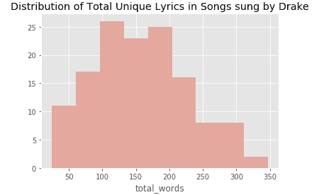
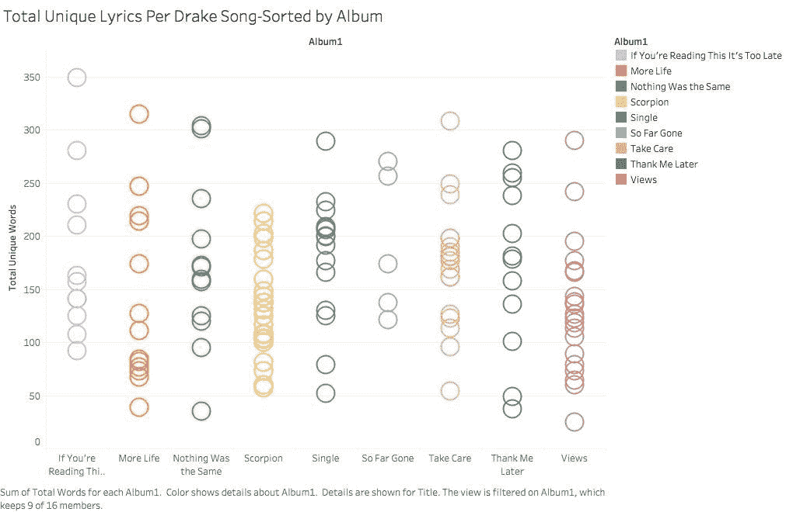
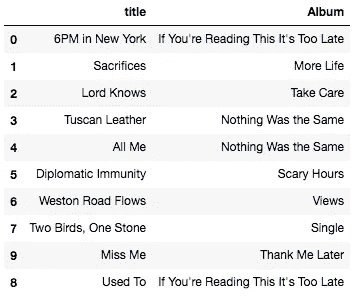
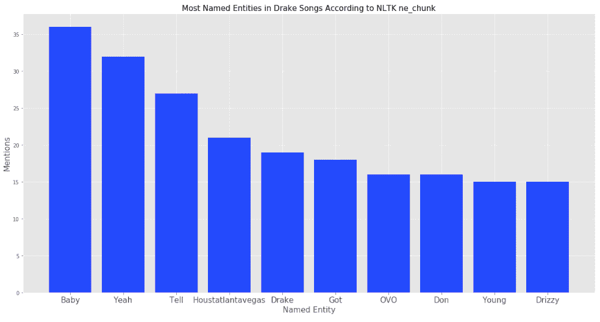
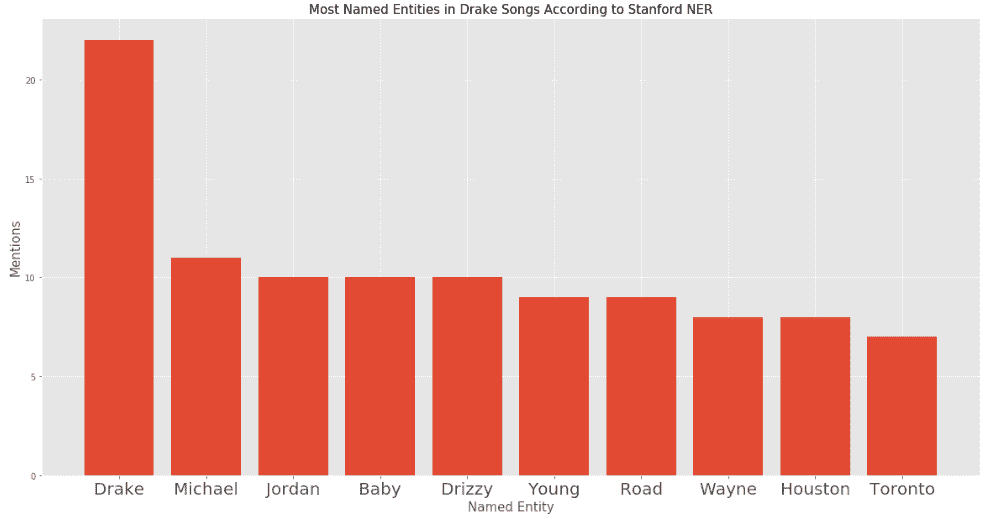
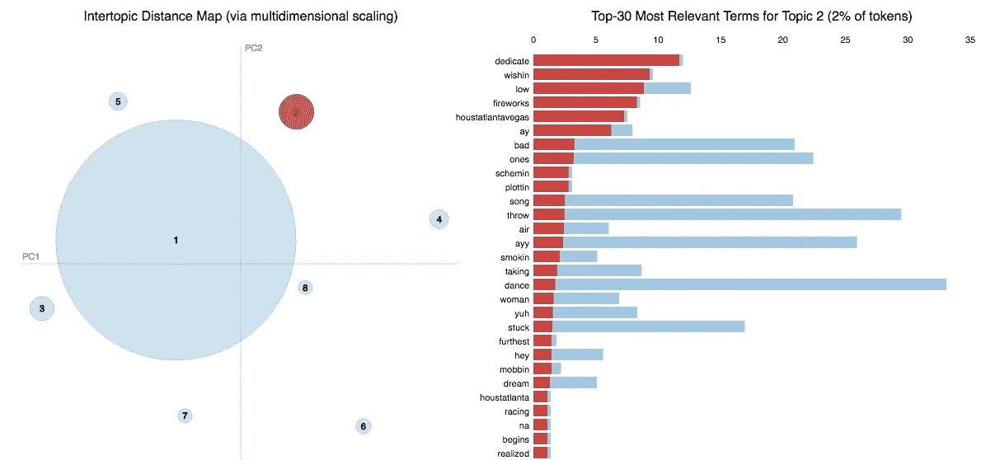

# 德雷克——用自然语言处理来理解他的歌词

> 原文：<https://towardsdatascience.com/drake-using-natural-language-processing-to-understand-his-lyrics-49e54ace3662?source=collection_archive---------1----------------------->

***简介*** :

每隔几年，就会有一位艺术家席卷全球。在过去，这是甲壳虫乐队和迈克尔·杰克逊等人的作品。这些艺术家天生就有能力用他们的创作天才影响数百万人。似乎当我们开始 21 世纪的第二个十年时，许多艺术家都在争当第一。然而，也许出乎意料的是，一个名叫奥布里·格雷厄姆的多伦多人以艺名“德雷克”登上了顶峰。

德雷克最初成名是因为他在 21 世纪初的流行青少年情景喜剧《德格拉斯:下一代》中扮演的角色。然而，当德雷克想成为一名说唱歌手时，他离开了节目。李尔·韦恩是当时最有影响力的说唱歌手之一，他把这位土生土长的多伦多人作为自己的门生。在与韦恩的唱片公司 Young Money Entertainment 签约后，德雷克发行了他的第一张录音室专辑《T4》。它被认证为白金唱片，加速了德雷克迅速上升到嘻哈世界的顶峰。在接下来的八年里，他又推出了四张录音室专辑、一张混音带和一张播放列表，其中《蝎子》是他的最新专辑。

我们知道德雷克的作品很受欢迎，但为什么他的大多数歌曲如此受欢迎呢？是制作的原因吗？是市场营销吗？大概是多种因素综合作用。然而，我将关注的是他的歌词。德雷克的工作内容广泛，证据充分，因此获取文本数据并不是一项困难的任务。然而，弄清楚如何分析它。但是由于 NLP(自然语言处理)最近的改进，分析文本数据现在比以往任何时候都容易。

根据维基百科，自然语言处理(NLP)“是计算机科学和人工智能的一个领域，涉及计算机和人类(自然)语言之间的交互，特别是如何编写计算机程序来处理和分析大量自然语言数据。”NLP 是我认为机器学习最有趣的领域。文本以如此多的不同形式产生，它给我们提供了如此多的数据。

在过去的 5-10 年里，NLP 得到了快速发展，这与深度学习的兴起直接吻合。神经网络已经成为无数 NLP 算法的通用框架。今天，有多种多样的工具可供使用，因此从业者可以解决大量的 NLP 问题。这些工具让我得以研究德雷克的歌词。

*寻找歌词来源*:

在开始实际分析之前，我必须先拿到德雷克的歌词。虽然网上有几个歌词资源，但我还是决定用 Genius.com。对于那些不知道的人来说，Genius 是一个注释歌词的网站。Genius 有一个非常好用的 API 。

**第一部分**

**哪首公鸭歌的歌词最独特？**

德雷克经常受到批评的一点是他的创造力——或者说缺乏创造力。在过去，他曾被指控窃取其他说唱歌手的音乐流和雇佣代笔人。我开始观察他的批评者的抱怨是否有根据。

每首歌使用一些独特的词的灵感来自于[这篇](https://pudding.cool/2017/02/vocabulary/)漂亮的文章，它可视化了说唱中最大的词汇。在我看来，由于当今艺术家的重复性，总字数不是衡量创造力的标准。

一旦我清理完文本数据，我就开始分析每首歌中独特的歌词数量。下面是德雷克所有歌曲中独特歌词的分布直方图。似乎他的大多数歌曲都有 100 到 200 个独特的词。没有参考其他艺术家歌曲的分布，这个直方图并没有告诉我多少关于德雷克的创造力。

更好的方法是通过专辑来了解他的创造力。下图中的情节是在 Tableau 中创作的。x 轴上是作品名称。y 轴代表唯一单词的数量。每个泡泡代表一首歌。没有一张专辑看起来更有创意(就独特的歌词而言)。不过，从独特歌词的数量来看(减去*蝎子*)，似乎每首作品都至少有一个离群值。看到他最新发行的专辑《蝎子》(25 首歌曲)中的歌曲在独特的歌词数量上几乎没有变化，这有点令人着迷。

现在，回答这个问题，哪首歌的歌词最独特？答案似乎是纽约时间*下午 6 点*。其余的前 10 名在下面。

**第二部分**

**命名实体识别**

命名实体识别是“信息提取的一个子任务，它试图定位文本中的命名实体并将其分类成预定义的类别，例如人名、组织、位置、时间表达式、数量、货币值、百分比等。”([维基百科](https://en.wikipedia.org/wiki/Named-entity_recognition))。NER 是一项特别棘手的任务。英语的复杂性使得创建对所有文本源都准确的 NER 算法非常困难。一个算法可能在一个文本语料库(在我们的例子中是德雷克歌曲集)上表现很好，而在另一个语料库上表现很差。这种不一致性使得有必要尝试几种 NER 算法。正如你将看到的，算法不是很不准确。

我实现的第一个是由 [NLTK](https://www.nltk.org/api/nltk.chunk.html) 提供的命名实体算法。“Ne_chunk”使用分配了词性标签([词性标签](https://web.stanford.edu/~jurafsky/slp3/10.pdf))的单词列表来推断哪些单词是命名实体。从我找到的结果可以看出，NLTK 的算法本身并没有做得很好。

我尝试的第二个命名实体算法是斯坦福大学开发的。斯坦福大学的计算语言学系可以说是世界上最负盛名的。这个受人尊敬的部门开发的众多令人印象深刻的工具之一是他们的 [NER 工具](https://nlp.stanford.edu/software/CRF-NER.shtml)。

与 NLTK 的算法相比，这个工具需要更长的时间来运行，但是它也产生更精确的结果。虽然它并不完美，但这是一个巨大的进步。

**第三部分**

**主题建模:**

NLP 中最有趣的学科之一是主题建模。主题模型是一种用于发现出现在文档集合中的抽象“主题”的统计模型。主题建模是一种常用的文本挖掘工具，用于发现文本主体中隐藏的语义结构([来源](https://en.wikipedia.org/wiki/Topic_model))主题建模有几种比较突出的算法。其中最突出的是显式语义分析和非负矩阵分解。然而，出于本文的目的，我选择使用的是潜在的狄利克雷分配( [LDA](http://blog.echen.me/2011/08/22/introduction-to-latent-dirichlet-allocation/) )。LDA 是由吴恩达、迈克尔·乔丹和大卫·布雷提出的一种生成统计模型。基本上，它首先学习给定语料库中固定数量主题的表示。给定这个数量的主题，LDA 学习语料库中每个文档的主题分布。

*话题建模所有公鸭歌词*

我想用 LDA 做的第一件事是学习德雷克所有歌曲中最突出的主题。为了做到这一点，我将所有歌曲放入一个列表中。然后，使用 SciKitLearn 的[计数矢量器](http://scikit-learn.org/stable/modules/generated/sklearn.feature_extraction.text.CountVectorizer.html)，我创建了一个代表所有这些歌曲的单词包。单词包是通过矩阵表示([链接](https://machinelearningmastery.com/gentle-introduction-bag-words-model/))来表示单词的一种简单方式。然后，使用 SciKit learn 的 LDA 版本，我拟合了一个模型，目标是在给定的文本中找到 8 个主题。

*可视化主题*

我发现了两种可行的方法来可视化 LDA 模型。第一个是通过我写的函数。基本上，它输出每个主题中最突出的单词。

这里的结果很有趣，但只给我提供了适量的信息。很明显，主题 7 不同于主题 2，但是没有提供足够的信息来告诉我*它们有多么*不同。

LDA Topics

辅助主题没有提供足够的信息来区分彼此。出于这个原因，我制定了另一种方法来显示文本中的主题。

在 Python 内部，有一个很棒的库叫做 [pyLDAvis](http://pyldavis.readthedocs.io/en/latest/) 。这是一个专门的库，使用 D3 来帮助可视化 LDA 模型创建的主题。 [D3](https://d3js.org/) 可以说是最好的可视化工具。但是，它是针对 Javascript 用户的。对于不太了解 JavaScript 的人来说，拥有这个插件非常有用。为了可视化数据，该库使用了降维技术。维数约减将具有许多变量的数据集压缩成更少量的特征。降维技术对于可视化数据非常有用，因为它可以将数据压缩成两个特征。对于我的特定可视化，我决定最好使用[T-SNE](https://lvdmaaten.github.io/tsne/)(T-分布式随机邻居嵌入)进行降维。

Visualizing Topics

似乎从我的模型的拟合来看，德雷克的大部分歌词都可以归类到一个占据了大部分图表的巨大主题中。相比之下，其余的话题就显得微不足道了。

Drake 所有主要版本的主题是什么样的？

为了做到这一点，我遵循了与之前相同的步骤，除了运行 LDA 算法为每张专辑精确地找到一个主题。然后，我使用我之前定义的函数来显示他所有主要作品中最突出的词。

Most Prominent Words in all Drake’s Major Works

**结论**:

德雷克可以说是世界上最受欢迎的艺术家。当他决定退休时，他将成为有史以来最有成就的说唱歌手之一。因此，每当他发布一首新歌或一张专辑，就一定会引起一片热烈的反响。他的作品几乎总是登上流行排行榜的榜首。结果，他的歌词瞬间成为 Instagram 和脸书数周的主要标题。他的歌曲令人难忘，他的歌词是主要原因。

就我的第一个 NLP 项目而言，我认为这是成功的。我觉得通过这里的工作，我对德雷克的歌词有了更具体的理解。虽然在未来的工作中，我当然可以尝试许多其他的 NLP 任务，但是主题建模和命名实体识别是一个很好的起点。

感谢你阅读这篇文章！如果您对未来的工作有任何建议或对我的工作有任何批评，请随时评论或联系我。

***注意事项*** :我把歌词里的脏话去掉了，让这篇文章更亲民。