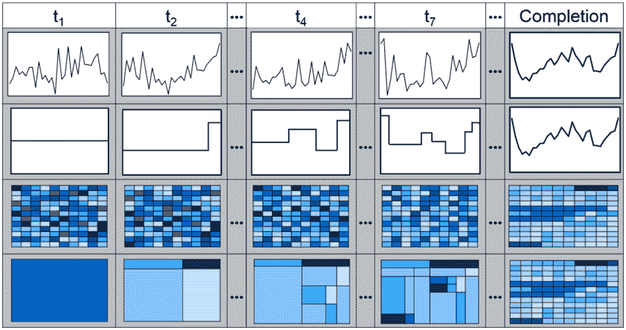
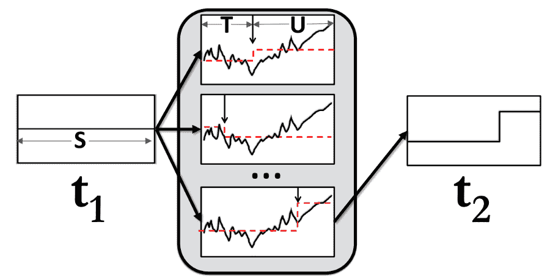

# 提前下结论

> 原文：<https://towardsdatascience.com/draw-conclusions-early-with-incvisage-45c608634ca0?source=collection_archive---------3----------------------->

## 可视化增量生成的新范式

*这篇博客文章是对我们 VLDB 17 年论文的高度概括，标题为“我已经看够了:为快速决策而逐渐改进可视化”，github* *上有* [*代码。本文*延伸版](https://github.com/zenvisage/incvisage)[此处](http://data-people.cs.illinois.edu/incvisage.pdf) *。主要由 Sajjadur Rahman 撰写，我做了一些小的编辑；合著者包括 Maryam Aliakbarpour、Hidy Kong、Eric Blais、Karrie Karahalios 和 Ronitt Rubinfeld。*

越来越大的数据集上的数据可视化仍然很麻烦:当数据集很大时，生成可视化可能需要几个小时，这阻碍了交互，阻止了探索，并延迟了洞察力的提取。

更快生成可视化效果的一种方法是使用*采样*——我们可以显示随着时间的推移逐渐改进的可视化效果，并最终收敛到对整个数据计算的可视化效果。然而，这种中间可视化是近似的，并且经常剧烈波动，导致*不正确的结论*。 ***我们提出了基于采样的增量可视化算法，可以快速揭示“显著”特征，同时最大限度地减少错误，实现快速、无错误的决策。***

**示例:**在下面图 1 的第一行中，我们描述了当获取更多样本时当前采样算法的变化:在*t1*、*T2*、*T4*、*T7*以及当所有数据都已被采样时。这可能就是可视化标准采样算法的结果所能提供的。如果用户在任何中间时间点看到可视化，他们可能会做出错误的决定。例如，在时间 *t_1* 时，用户可能会得出错误的结论，即开始和结束时的值低于大多数趋势，而事实上，情况正好相反——这种异常是由于到达 *t_1* 时抽取的样本有偏差。在 *t_2* 、 *t_4* 和 *t_7* 处，可视化继续变化，数值根据抽取的样本随机波动。

Figure 1: Example

另一种方法，我们称之为 **IncVisage** ，并在第二行中描述如下:在每个时间点 *t_i* ，通过在 *t_{i-1}* 分割趋势线的一个线段，显示一个 *i* 线段趋势线的附加线段，此时工具有足够的信心这样做。因此，IncVisage 在 *t_1* 处非常保守，仅提供整个范围的平均值，然后在 *t_2* 处，它将单个段分成两个段，表明趋势向末端增加。总的来说，在 *t_7* 之前，该工具已经表明了趋势的许多重要特征:它从高点开始，中间有一个凸起，然后向终点增加。这种方法按照重要性的顺序揭示了最终可视化的特征，允许用户获得早期的洞察力并尽早得出结论。所提出的方法也可以应用于热图可视化——如第 4 行所示，对应于第 3 行所示的标准采样方法——在热图中很典型，值越高，颜色越深。

# 增量改进可视化:增量方法

我们如何着手产生这些增量呢？考虑预先知道所有组的集合(x 轴值)时的设置。因此，我们不需要执行采样，并且问题简化为仅在每次迭代 *k* 时寻找最佳 *k* 段近似。在每一次迭代中，我们最终将前一次迭代中的一个片段分割成两个新的片段。

Figure 2: Improvement Potential

现在，我们如何决定在哪里分裂？让我们看一个例子(见图 2)。给定段 *S* ，有许多分裂的候选——我们只显示了三个。但是我们选哪一个呢？嗯，在这种情况下，底部的候选项给了我们最大的“跳跃”——直觉上，我们希望选取一个足够大的段来分割，并且值之间的差异也很大。这种分割的想法被称为*改进潜力*的概念所捕捉，在这个概念中，我们考虑了价值之间的差异和细分规模。(详见我们的论文。)

我们现在将我们的方法推广到在线采样，其中我们在迭代中抽取样本。*事实证明，我们可以使用相同的改进潜力测量的经验版本，并且仍然可以获得最佳结果。*现在，我们应该在每次迭代中抽取多少样本来获得最佳结果？有点令人惊讶的是，如果我们在每次迭代中跨 x 轴组均匀地绘制样本，我们仍然可以满足保证。我们还推导了底层算法的采样复杂度的匹配下界。此外，我们证明了通过几何地减少在迭代中抽取的样本总数，我们获得了一个高度交互的算法，对近似的精度只有很小的影响。我们在论文中详细讨论了支持这些主张的定理。

# 实验外卖

那么这在实践中是如何运作的呢？以下是我们实验评估的一些要点。报纸上还有很多！

## **增长速度极快。**

我们的方法比读取整个数据集的顺序扫描方法快几个数量级。在图 3 中，我们在三个不同大小的数据集上绘制了 Scan 的执行时间和 IncVisage 的不同迭代。黑色垂直箭头突出显示了 IncVisage 和 Scan 之间的完成时间差异。从图 3 中可以明显看出，IncVisage 通过相当快地揭示重要特性(图 3 中的迭代 5、10 和 50)促进了更快的决策制定。同时，随着数据集大小的增长，顺序扫描的执行时间也会增加，而 IncVisage 的不同迭代的执行时间几乎保持不变，与数据集无关。

Figure 3: IncVisage is orders of magnitude faster than Scan

## **IncVisage 提供高度可解释的可视化和更好的决策。**

我们进行了两项用户研究，评估 IncVisage 的可解释性和可用性。第一项研究表明，IncVisage 生成的可视化效果具有高度的可解释性。在第二项研究中，我们将 IncVisage 与标准方法进行了比较，标准方法是在取样时描述整个可视化评估，这是根据决策能力进行的。该研究表明，在准确性方面，IncVisage 优于标准方法(IncVisage = 94.55%，标准= 45.83%)，而延迟相当。此外，用户认为使用 IncVisage 更容易找到答案并尽早终止。我们在此展示一些用户反应:

> “…更容易知道我什么时候想停下来，因为我首先有了总体想法。然后我就等着得到确切的答案，因为我知道它就要来了……”
> 
> “……随着时间的推移，看起来真的很有趣。特别是，起初当事物是一两个颜色块时，然后看着数据出现，然后看着不同的盒子变成某种东西……我实际上发现自己看了很长时间。”
> 
> “…我更喜欢 IncVisage，因为它可以更容易地缩小范围…与标准方法相比…如果你选择了错误的方法，你可能会犯很大的错误。”

# 结论

我们开发了一种逐步改进的可视化生成算法，当分析师有信心时，它会向分析师揭示见解，从而允许更快、更准确地做出决策，同时还开发了一种名为 *IncVisage* 的工具来实现这种算法。

*我们希望 IncVisage 代表了体现这些原则的可视化工具开发的有希望的第一步——帮助用户在非常大的数据集上获得早期但自信的见解。*

## 承认

非常感谢 NSF、NIH、Siebel Energy Institute、Adobe 和 Google 对这项研究的支持。