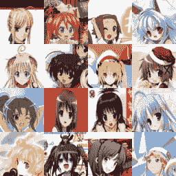
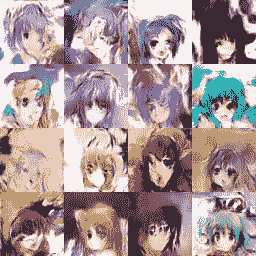
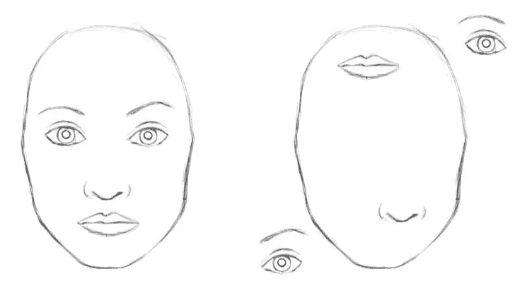
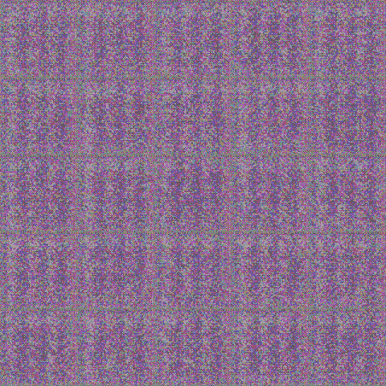
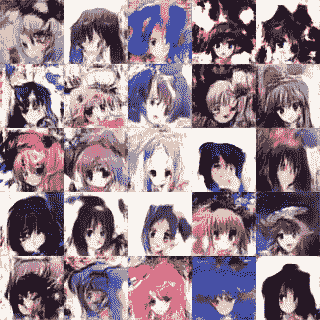

# 用深度学习画动漫少女

> 原文：<https://towardsdatascience.com/drawing-anime-girls-with-deep-learning-4fa6523eb4d4?source=collection_archive---------4----------------------->

这篇文章是关于玛丽·凯特·麦克弗森的一个兼职项目。我们喜欢做一些辅助项目，比如音乐视频的人工智能，以及[派对按钮](https://www.youtube.com/watch?v=ULTM3BeMQ4g)。这个想法是尝试一种[对抗性神经网络](https://twitter.com/goodfellow_ian/status/969776035649675265?lang=en)，它在对一组人类创造的动漫面孔进行训练后生成新的动漫面孔。我们从一个网上的例子开始。该作品和动画人脸数据集的原始代码可以在[这里](https://github.com/forcecore/Keras-GAN-Animeface-Character)找到。

Running training on the original code from [here](https://github.com/forcecore/Keras-GAN-Animeface-Character).

正如你在上面的图像中看到的，生成敌对网络(GAN)随着时间的推移在生成逼真的图像方面不断改进。GAN 包含一个生成新图像的发生器和一个为发生器提供建设性反馈的鉴别器。生成器和鉴别器都是卷积神经网络(CNN)。

以下是训练数据的示例:

下图是最终输出的一个很好的例子。

Anime faces generated entirely using artificial intelligence.

在上面的图像中，你可以看到右下角的角色头上有一个弓，眼睛和嘴巴通常在脸上的正确位置。正如我们在第一行左起第二行看到的，一些生成的输出有点混乱。图像总体上看起来不错，尽管它们不是很大(3 个颜色通道的 64 乘 64 像素)。

这是一个很酷的结果，但是 CNN 有一些已知的限制。例如，Capsnets 比 CNN 更能理解图片中事物的位置(见下图)。

CNNs do not mind “seeing” faces when everything is in the picture, but in weird places (source [here](http://sharenoesis.com/wp-content/uploads/2010/05/7ShapeFaceRemoveGuides.jpg) and further reading [here](https://medium.com/ai³-theory-practice-business/understanding-hintons-capsule-networks-part-i-intuition-b4b559d1159b)). This is a problem capsule networks aim to address.

现在，作为一个超常发挥者， [Mary Kate MacPherson](https://medium.com/u/c1c775be8058?source=post_page-----4fa6523eb4d4--------------------------------) 决定使用带有胶囊网络的 g an 代替 CNN 来尝试这项任务。数据集已从原始代码库转移到 capsule 网络代码库。胶囊网码来自这里的，来自胶囊网码的生成器被来自动漫项目的生成器所取代，从而做出动漫少女而不是手写数字。

Running training on the new neural architecture with capsule network.

Final output of the capsule network GAN. Some are really good. Others, like the second from left on the first and last rows, don’t have the right face parts.

我们没有看到使用胶囊网络代替 CNN 作为鉴别器有很大的改进。也许生成和区分图像的统计特征会给我们带来更好的结果(想法来自 nVidia 研究论文[此处](http://research.nvidia.com/publication/2017-10_Progressive-Growing-of))。我们正在努力。我们向生成器的预测添加了一个维度，它生成生成图像的[梯度方向直方图(HOG)](https://en.wikipedia.org/wiki/Histogram_of_oriented_gradients) 。HOG 用于帮助检测物体，因此它看起来很适合我们希望能够教会生成器神经网络更好地预测真实人脸的东西。我们也在考虑清理数据集。[玛丽·凯特·麦克弗森](https://medium.com/u/c1c775be8058?source=post_page-----4fa6523eb4d4--------------------------------)会在我们有好结果的时候，在推特 上的一个 [**专用推特频道上发布这次冒险的结果。如果你有自己的发电机，我们也很乐意公布你的结果。到目前为止，这种新方法看起来并不是非常有前途，但这就是这些副业项目的进展:它并不工作，直到突然开始工作。**](https://twitter.com/waifu_gen)

未来工作思路二:拥有多个胶囊网络的 GANs！

因此，总之，人工智能可以用来创造艺术，以一组现有图像的风格创造新的图像。

如果你喜欢这篇关于生成动漫女孩面孔的文章，请点击关注按钮，看看我过去读过的一些文章，比如“[如何为人工智能项目](https://medium.com/towards-data-science/how-to-price-an-ai-project-f7270cb630a4)定价”和“[如何聘请人工智能顾问](https://medium.com/towards-data-science/why-hire-an-ai-consultant-50e155e17b39)”除了与业务相关的文章，我还准备了一些关于寻求采用深度机器学习的公司所面临的其他问题的文章，如“[没有云和 API 的机器学习](https://medium.com/@lemaysolutions/locked-in-a-box-machine-learning-without-cloud-or-apis-76cc54e391c8)”

编码快乐！

-丹尼尔
[丹尼尔@lemay.ai](mailto:daniel@lemay.ai) ←打个招呼。
[LEMAY . AI](https://lemay.ai)
1(855)LEMAY-AI

您可能喜欢的其他文章:

*   [人工智能和不良数据](/artificial-intelligence-and-bad-data-fbf2564c541a)
*   [人工智能:超参数](/artificial-intelligence-hyperparameters-48fa29daa516)
*   [人工智能:让你的用户给你的数据贴上标签](https://medium.com/towards-data-science/artificial-intelligence-get-your-users-to-label-your-data-b5fa7c0c9e00)