# 从比例的 A/B 测试中推断:频率主义者与贝叶斯方法

> 原文：<https://towardsdatascience.com/drawing-inferences-from-a-b-tests-on-proportions-frequentist-vs-bayesian-approach-c85590382b14?source=collection_archive---------11----------------------->

对许多数据科学家来说，从 A/B 测试中做出推论是一项不可或缺的工作。我们经常听到频率主义者(经典)的方法，在这种方法中，我们指定 alpha 和 beta 比率，看看我们是否可以拒绝零假设而支持替代假设。另一方面，随着更多的证据变得可用，贝叶斯推理使用贝叶斯定理来更新假设为真的概率。

在这篇博文中，我们将使用 R 来遵循[1]中的[示例](https://ocw.mit.edu/courses/mathematics/18-05-introduction-to-probability-and-statistics-spring-2014/readings/MIT18_05S14_Reading20.pdf)，并将其扩展为灵敏度分析，以观察调整先验对结果的影响。[1]对频率主义者和贝叶斯的优缺点有很好的讨论，我推荐阅读。我的主要收获是:

1.  贝叶斯经常因主观先验而受到批评，我们将在敏感性分析部分对此进行检验
2.  Frequentist 因不同的实验设置具有不同的 p 值而受到批评，我们将在下一节停止规则中对此进行研究
3.  “…对于任何决策规则，都有一个贝叶斯决策规则，在精确的意义上，它至少与规则一样好”——对于数据科学家来说，在进行推理时获得另一种视角不会有什么坏处

# 案例研究背景

实验的目的是检查硬币是否有偏差，假设进行实验的人(让我们称他为研究者)与进行结果分析的人(让我们称他为分析师)不是同一个人。

研究者有两种方法可以停止实验(停止规则):

1.  投掷硬币 6 次，并报告人头的数量
2.  投掷硬币，直到第一个头像出现

研究者向分析师报告 HHHHHT 和他的停止规则。然而，分析师忘记了什么是止损规则。

# 频繁主义方法

频率主义分析师建立了一个假设:

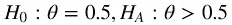

## 二项分布

在停止规则(1)下，人头数服从[二项式](https://en.wikipedia.org/wiki/Binomial_distribution)分布。更正式地说，观测头数为~ Bin(6，0.5)

```
# Binomial Distribution
n = 6
num_heads = c(1:n)
pmf_binom <- dbinom(k,size=n,prob=0.5)
plot(num_heads,pmf_binom,type="h", main = "Prob mass function of a Binomial distribution")

# The following two lines are equivalent
1-pbinom(q=4,size=6,prob=0.5)
pmf_binom[5]+pmf_binom[6]
```

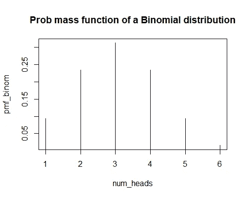

概率(6 次投掷中有 5 或 6 个头)= 0.1094

因此，我们无法在 0.05 的显著性水平上拒绝零假设。

## 几何分布

在停止规则(2)下，直到头出现所需的翻转次数服从[几何](https://en.wikipedia.org/wiki/Geometric_distribution)分布。

number _ failures _ until _ 1st _ head ~ Geometric(0.5)

```
# Geometic Distribution
num_fails = c(0:10)
pmf_geom = dgeom (x = num_fails, prob=0.5)
sum(pmf_geom)
plot(num_fails, pmf_geom, type = "h", main = "Prob mass function of a Geometric dist.")# The following two lines are equivalent
1- pgeom(q=4,prob=0.5)
1-sum(pmf_geom[1:5])
```

p(在第一个磁头之前至少需要 5 次故障)= 0.0313

因此，我们在 0.05 的显著性水平上拒绝零假设。注意同样的数据如何导致相反的结论。

> 在 Frequentist 方法下，决定随机变量分布的停止规则必须在实验前指定。

# 贝叶斯方法

我们想估算θ，它被定义为硬币正面朝上的真实概率。我们使用一个[贝塔](https://en.wikipedia.org/wiki/Beta_distribution)分布来表示共轭先验。为了不失去案例研究的重点，我们在附录中介绍了 beta 分布。

作为先验分布，我们假设先验分布在 Beta 分布(3，3)下，这表明在 0.5 左右是一个相当平坦的分布。这表明分析师认为硬币是公平的，但使用(3，3)作为他的不确定性的指示。我们将在灵敏度分析部分研究改变这两个参数的影响。现在，我们来看看:

Theta_prior ~ Beta(3，3)

在实验过程中，我们有 6 次翻转，其中一次是正面。让我们填写下表:

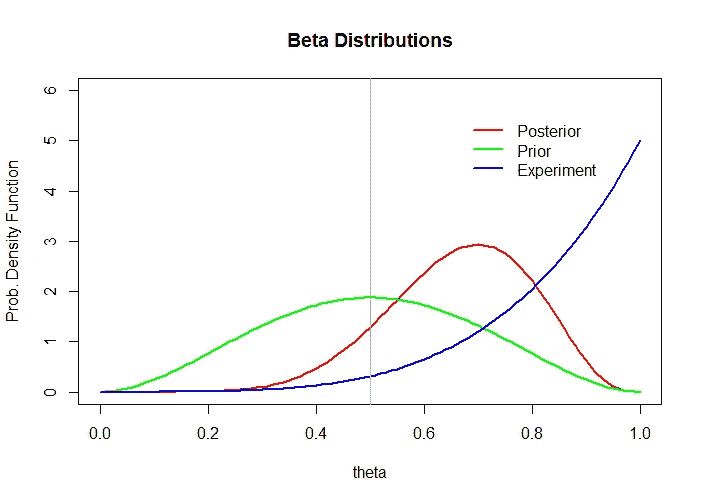

```
# Bayesian Approach
theta=seq(from=0,to=1,by=.01)
plot(theta,dbeta(theta,8,4)
,type="l"
, ylim = c(0,6)
, col = "red"
, lwd =2
, ylab = "Prob. Density Function"
, main = "Prob. Density Function")

lines(theta,dbeta(theta,3,3),type="l", col = "green", lwd =2)
lines(theta,dbeta(theta,5,1),type="l", col = "blue", lwd =2)

abline(v=0.5, col='grey')

legend("topright",
legend = c("Posterior", "Prior", "Experiment"),
col = c("red", "green", "blue"),
bty = "n",
text.col = "black",
horiz = F ,
inset = c(0.1, 0.1),
lty = 1, lwd=2)theta=seq(from=0,to=1,by=.01)

1-pbeta(0.5, 8,4)
```

P(theta > 0.5 | data) = 0.89，即 0.89 是红色曲线下的面积，在 0.5 的右边。在下一节中，我们将研究改变先验分布的形状对后验概率的影响。

# 先验分布对后验概率影响的敏感性分析

从β(3，3)改变先验分布对θ> 0.5 的后验概率有何影响？在本节中，我们将改变分布的方差和期望值，作为敏感性分析的一部分。

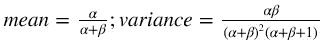

**(1)改变方差** —当我们注入一个方差更低的更强的先验，说明硬币是公平的，后验概率从 0.89 降低到 0.84。

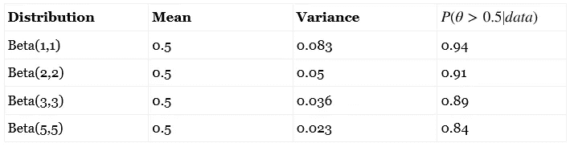

```
## Sensitivity Analysis - change the variance

par(mfrow = c(2,2))

alpha_prior = 5
beta_prior = 5

alpha_expt = 5
beta_expt = 1

alpha_post = alpha_prior + alpha_expt
beta_post = beta_prior + beta_expt

title = paste0("Prior Beta(", alpha_prior, "," , beta_prior, ")")

# Bayesian Approach

theta=seq(from=0,to=1,by=.01)
plot(theta,dbeta(theta,alpha_post,beta_post)
     ,type="l"
     , ylim = c(0,6)
     , col = "red"
     , lwd =2
     , ylab = "Prob. Density Function"
     , main = title)

lines(theta,dbeta(theta,alpha_prior,beta_prior),type="l", col = "green", lwd =2)
lines(theta,dbeta(theta,alpha_expt,beta_expt),type="l", col = "blue", lwd =2)

abline(v=0.5, col='grey')

# Prior Mean
alpha_prior / (alpha_prior + beta_prior)

# Prior Variance
(alpha_prior * beta_prior) / ((alpha_prior + beta_prior)^2 * (alpha_prior + beta_prior+1))

# P(theta > 0.5 | data)
1-pbeta(0.5, alpha_post,beta_post)
```

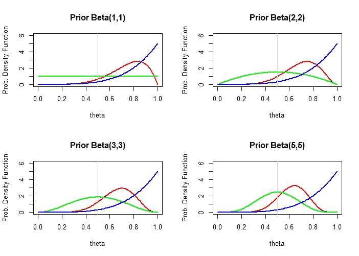

*Above: Effect of changing prior variance whilst keeping mean constant. Green: Prior; Red: Posterior; Blue: Experiment*

**(2)改变均值——**同样，和预期的一样，如果我们注入硬币偏向尾部的先验，当实验偏向正面时，我们就不那么有信心硬币偏向正面了。

给定均值和方差，我需要计算α和β。谢天谢地，我们有这个 stackoverflow [post](https://stats.stackexchange.com/questions/12232/calculating-the-parameters-of-a-beta-distribution-using-the-mean-and-variance?utm_medium=organic&utm_source=google_rich_qa&utm_campaign=google_rich_qa) 帮助我们做到这一点:

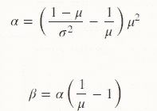

为简单起见，我们将α和β四舍五入为最接近的整数。因此方差可能有点不同。

```
par(mfrow = c(2,2))

mean = 0.7
variance = 0.036

alpha_prior = ((1-mean)/variance - 1/mean) * mean^2
beta_prior = alpha_prior * (1/mean - 1)

alpha_prior = round(alpha_prior,0)
beta_prior = round(beta_prior,0)

alpha_expt = 5
beta_expt = 1

alpha_post = alpha_prior + alpha_expt
beta_post = beta_prior + beta_expt

title = paste0("Prior Beta(", alpha_prior, "," , beta_prior, ")")

# Bayesian Approach

theta=seq(from=0,to=1,by=.01)
plot(theta,dbeta(theta,alpha_post,beta_post)
     ,type="l"
     , ylim = c(0,6)
     , col = "red"
     , lwd =2
     , ylab = "Prob. Density Function"
     , main = title)

lines(theta,dbeta(theta,alpha_prior,beta_prior),type="l", col = "green", lwd =2)
lines(theta,dbeta(theta,alpha_expt,beta_expt),type="l", col = "blue", lwd =2)

abline(v=0.5, col='grey')

# Prior Mean
alpha_prior / (alpha_prior + beta_prior)

# Prior Variance
(alpha_prior * beta_prior) / ((alpha_prior + beta_prior)^2 * (alpha_prior + beta_prior+1))

# P(theta > 0.5 | data)
1-pbeta(0.5, alpha_post,beta_post)
```

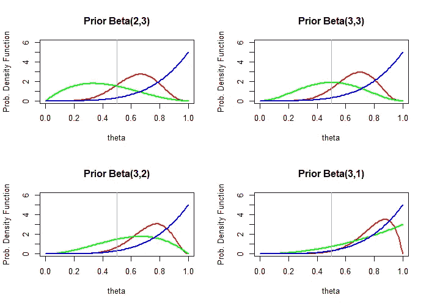

*Above: Effect of changing prior mean, keeping variance constant. Green: Prior; Red: Posterior; Blue: Experiment*

# 结论

总之，我们已经证明了小样本 A/B 测试的贝叶斯观点。我们看到，在频率主义方法中，停止规则在建立 p 值时是至关重要的，而在贝叶斯方法中不考虑停止规则。给定先验和实验结果，贝叶斯方法也给出假设为真的概率。最后，我们还观察了后验概率如何受到先验分布的均值和方差的影响。

# 附录— Beta 分布

贝塔分布是定义在区间[0，1]上的一族连续概率分布，区间[0，1]由两个正的形状参数参数化，用α和β表示。有三个原因可以解释为什么贝塔分布对贝叶斯推断很有用:

1.  区间[0，1]适合表示概率。
2.  它有一个很好的性质，即后验分布也是贝塔分布。需要明确的是，先验分布是指我们在进行任何分析之前认为θ表现出的分布，而后验分布是指我们在观察一些样本后认为θ表现出的分布。
3.  我们可以通过改变 a 和 b 来指定大范围的信念——给定 a 和 b，θ的概率密度函数如下:

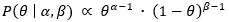

从上面的等式中，我们看到α和 b 控制分布的形状，事实上，它们被称为[形状参数](https://en.wikipedia.org/wiki/Shape_parameter)。让我们把一些值代入 R，观察形状的不同。期望值由α / (α+β)计算得出。

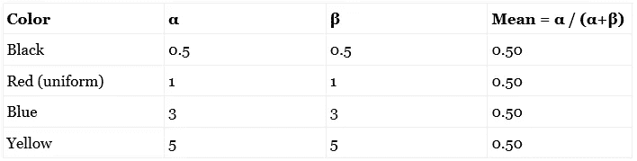

```
theta=seq(from=0,to=1,by=.01)

plot(theta,dbeta(theta,0.5,0.5)
,type="l"
, ylim = c(0,3)
, col = "black"
, lwd =2
, ylab = "Prob. Density Function")

lines(theta,dbeta(theta,1,1),type="l", col = "red", lwd =2)
lines(theta,dbeta(theta,3,3),type="l", col = "blue", lwd =2)
lines(theta,dbeta(theta,5,5),type="l", col = "yellow", lwd =2)
```

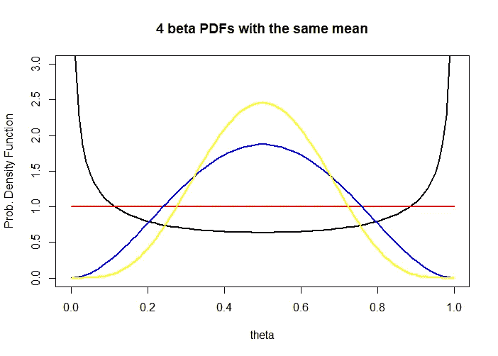

请注意，所有四个分布的平均值都是 0.5，可以指定不同的分布。这就是我们所说的大范围的信念可以用贝塔分布来确定。

# 参考

[1]杰里米·奥尔洛夫和乔纳森·布鲁姆。 *18.05 概率和统计导论。【2014 年春天。麻省理工学院:麻省理工学院开放课件，【https://ocw.mit.edu】T4。许可:[知识共享协议 BY-NC-SA](https://creativecommons.org/licenses/by-nc-sa/4.0/) 。*

*最初发表于*[*www . Joshua Kim . io*](http://www.joshuakim.io/drawing-inferences-from-a-b-tests-on-proportions-frequentist-vs-bayesian-approach/)*。*