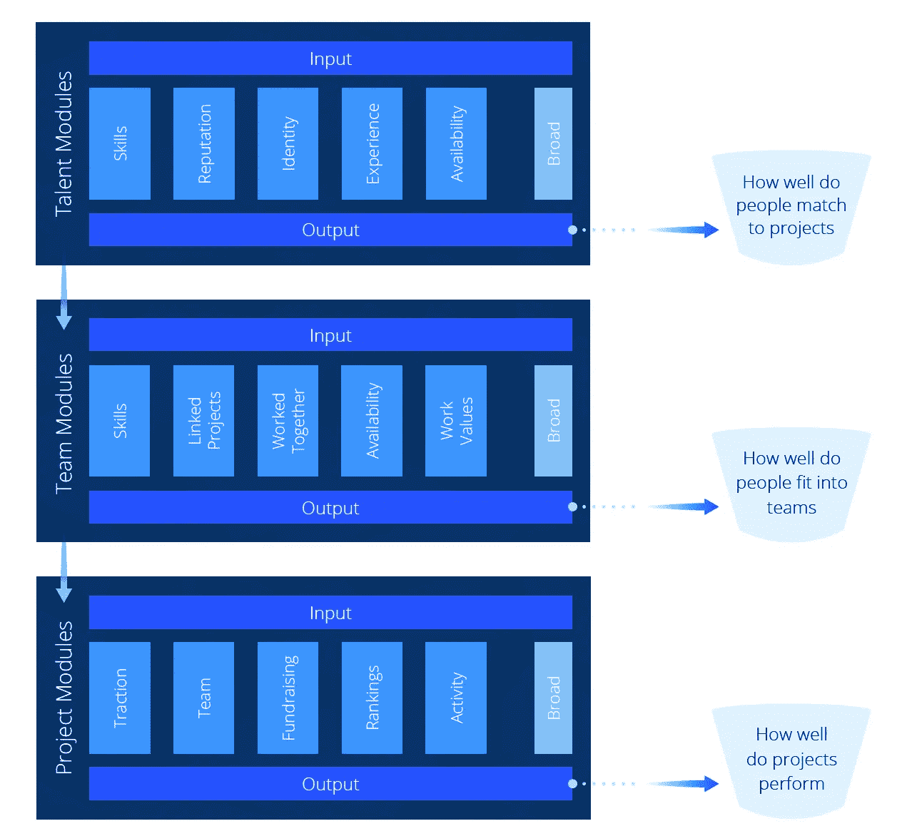

# DREAM.ac:利用人工智能建立团队

> 原文：<https://towardsdatascience.com/dream-ac-build-teams-using-artificial-intelligence-c4f1fdd7ee66?source=collection_archive---------11----------------------->

人工智能正在被用来解决许多人类问题，最近[谷歌的 Duplex 可以通过与人对话来代表你预订座位](https://ai.googleblog.com/2018/05/duplex-ai-system-for-natural-conversation.html)。

我们在人力资源领域有一些非常有趣的客户，这是一个以人际互动为主的领域。我们从客户那里看到的主要问题是，如何使用人工智能来进行猎头或为候选人匹配职位。今天，我想向你们介绍我们在人力资源领域的一个客户的解决方案架构，并让你们了解如何部署人工智能来自动化和改善人力资源流程。

DREAM.ac 与 A.I .一起建立团队，让更多的项目和创业公司获得成功。激励问题很简单:68%的项目失败，90%的创业公司失败。这些失败往往可以追溯到错误的团队，领导不力，或未能筹集资金。梦想是由已经在人力资源领域的自由职业者中取得成功的创始人建立的，因此这些要求是由创业行业问题的现实经验驱动的，而不是在餐巾纸上画画。

Teams have a set of roles that need to be filled in order to complete the project.

梦之队想要首先解决的问题是建立成功的团队。早在 2000 年代，我致力于将 DVD 与人们想要的 DVD 列表相匹配(见 [zip.ca](https://en.wikipedia.org/wiki/Zip.ca) )。DVD 分配问题技术名称是[转运问题](https://en.wikipedia.org/wiki/Transshipment_problem)。考虑到一张 DVD 一次只能邮寄给一个人的物理限制，这个想法是为了最大化每个人的快乐。同样，对于梦想，我们只能用一个人来完成一项工作，一个人只能做这么多工作。

DREAM.ac connects people to projects using A.I.

为了让一个人适合某个角色，我们使用回归来给候选人列表中的每个可能的人一个适合度分数，该分数代表他们将在工作中做得很好的可能性，并延伸到团队将成功实现他们的目标。个人与工作的匹配分数基于个人过去从事此类工作的历史(经验)以及该类型的人在该类型的角色中表现良好的历史。使用聚类来“发现”人员和角色的类型。候选人按前 n 名排序，这样就可以为每个职位考虑最适合该工作的人选。这个匹配系统的目标是最大化团队的成功，而不是最大化职位的完成。为了涵盖尽可能多的一般规则和例外，我们设计了一个使用[广度和深度学习](https://www.tensorflow.org/tutorials/wide_and_deep)的解决方案。

最终的解决方案是一个推荐系统，这是我最喜欢的，因为这是我在 T2 的博士论文的主题。

一些开源数据集在实践中证明这种想法的有效性时非常有用。Kaggle 列出了以下数据集，以及其他一些数据集，供您开始使用:

*   [来自凯业必达的工作推荐挑战](https://www.kaggle.com/c/job-recommendation/rules) (2012)
*   来自职业中心的 19K 个职位 (2017)
*   [Dice.com 22K 工作岗位](https://www.kaggle.com/PromptCloudHQ/us-technology-jobs-on-dicecom) (2017)
*   [Monster.com 22K 工作岗位](https://www.kaggle.com/PromptCloudHQ/us-jobs-on-monstercom/data) (2017)
*   [Naukri.com 22K 工作岗位](https://www.kaggle.com/PromptCloudHQ/jobs-on-naukricom) (2017)
*   [里德英国的 5 万个职位](https://www.kaggle.com/jobspikr/50000-job-board-record-from-reed-uk) (2018)

正如我在上一篇文章中提到的那样，拥有专有数据集是获得竞争优势的关键。DREAM 不是建立在这些公共数据集的基础上，而是围绕私人会员数据进行设计，这些数据由平台用户所有，并与公司共享，以提供培训示例。该公司只拥有衍生训练系统，而不是原始数据，用户可以选择通过关闭他们的帐户拿回。

让我们看看团队是如何建立的，目标是让团队成功。

A high level view of how teams can be assembled using a recommender system, with the overall objective of maximizing the likelihood of team success.

构建成功项目的问题是一个层次问题，需要[神经网络模型](https://www.tensorflow.org/tutorials/wide_and_deep)来理解(建模)团队和角色。我们正在继续开发一些非常酷的技术，以解决当今传统人力资源方法组装项目的方式中的这一差距。

总之，人工智能可以用来根据角色的“适合度”(得分)来确定团队中某个职位的最佳候选人。这可以在组建团队的更大过程中完成，甚至可以在开发成功项目的更大范围内完成。

要阅读更多关于 [DREAM.ac](https://DREAM.ac) 和[白皮书](https://tokensale.dream.ac/whitepaper/dream_whitepaper.pdf)的内容，只需点击那些链接。

如果你喜欢这篇关于使用人工智能建立团队的文章，请点击关注按钮，看看我过去读过最多的文章，比如“[如何雇用人工智能顾问](https://medium.com/towards-data-science/why-hire-an-ai-consultant-50e155e17b39)”除了与业务相关的文章，我还准备了一些关于寻求采用深度机器学习的公司所面临的其他问题的文章，如“[没有云和 API 的机器学习](https://medium.com/@lemaysolutions/locked-in-a-box-machine-learning-without-cloud-or-apis-76cc54e391c8)”

编码快乐！

-丹尼尔
[丹尼尔@lemay.ai](mailto:daniel@lemay.ai) ←打个招呼。
[LEMAY . AI](https://lemay.ai)
1(855)LEMAY-AI

您可能喜欢的其他文章:

*   [人工智能和不良数据](/artificial-intelligence-and-bad-data-fbf2564c541a)
*   [人工智能:超参数](/artificial-intelligence-hyperparameters-48fa29daa516)
*   [人工智能:让你的用户给你的数据贴上标签](https://medium.com/towards-data-science/artificial-intelligence-get-your-users-to-label-your-data-b5fa7c0c9e00)