# 彩色梦

> 原文：<https://towardsdatascience.com/dream-in-color-faf1ea5190e9?source=collection_archive---------3----------------------->

一个机器学习解决方案来设计你的新娘派对

# 介绍

婚礼行业正在蓬勃发展。2016 年美国婚礼的平均费用估计在 35329 美元左右，高于 2006 年的 27852 美元(1，2)。同样，在科技领域，与婚礼相关的产品和解决方案也有越来越多的机会。这个项目旨在创建一个这样的解决方案。

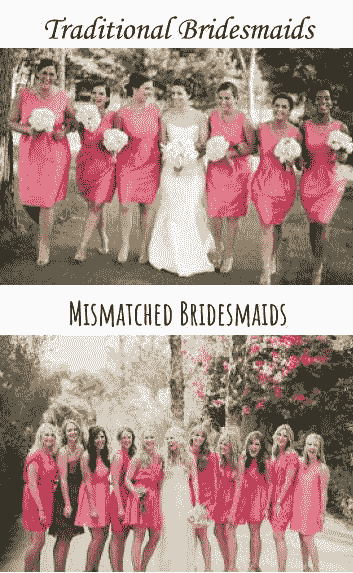

在传统的婚礼策划中，新娘会为所有的伴娘选择一件礼服。一种被称为“不匹配的伴娘”的新趋势背离了上述传统，并且越来越受欢迎。为了达到“不相配的伴娘”的效果，每个伴娘都有不同风格和/或颜色的礼服，它们都符合一个共同的主题。这种外观很难实现，在线工具也很少。在 2016 年对伴娘的一项调查中，一位受访者引述道:

> “我知道让每个人都穿不同的颜色是 Pinterest 的时尚，但这对伴娘来说是一种痛苦。”

一场婚礼平均有 5 名伴娘，打造一套巧妙搭配的礼服需要大量的协调工作。大多数在线服装零售商在其网站上只提供 12-14 种颜色的选择。在这个项目中，我的目标是完成以下工作:

*   创建一个机器学习算法，可以将服装分为几个特定的颜色类别
*   将该模型应用于目前可在线购买的服装
*   让应用程序可供新娘和伴娘使用

# 材料和方法

我把这个项目当作一个图像分类问题。我希望能够根据在线零售商提供的图片对服装进行分类。网上出售的每件衣服都有图片，而描述或颜色名称并不总是可用，也不总是在零售商之间保持一致。最终，一切都取决于服装的外观，而这最好通过图片来评估。

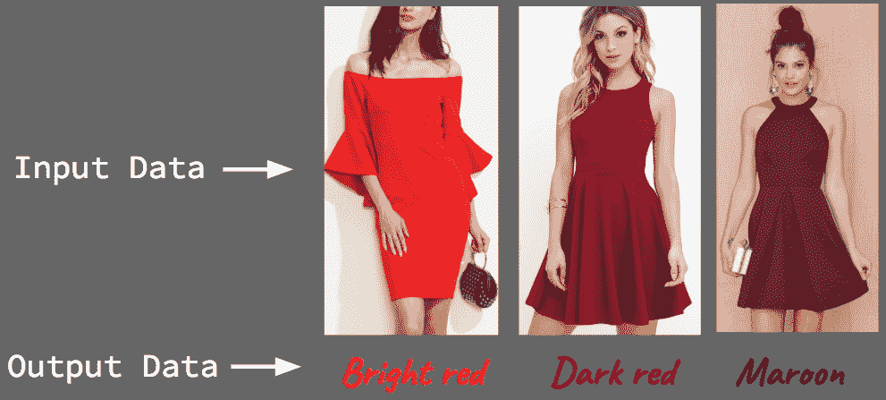

**数据收集**

通常需要成千上万的图像来训练一个成功的图像分类算法。我使用了两个批量图像下载应用程序，通过谷歌图像搜索、谷歌购物搜索以及一些在线服装零售网站从网络上收集图像。图像质量的范围很广，从零售/专业质量到手机图片。

为了训练算法对图像进行分类，需要对图像进行标记。我选择了 64 种可能的颜色标签，并与网络开发人员 Robb Prescott 合作，建立了一个在线标签系统(color.suprinfinity.com)。标签系统如下所示。单击第一个图像中显示的颜色组之一，会显示更多特定的颜色供标签选择。

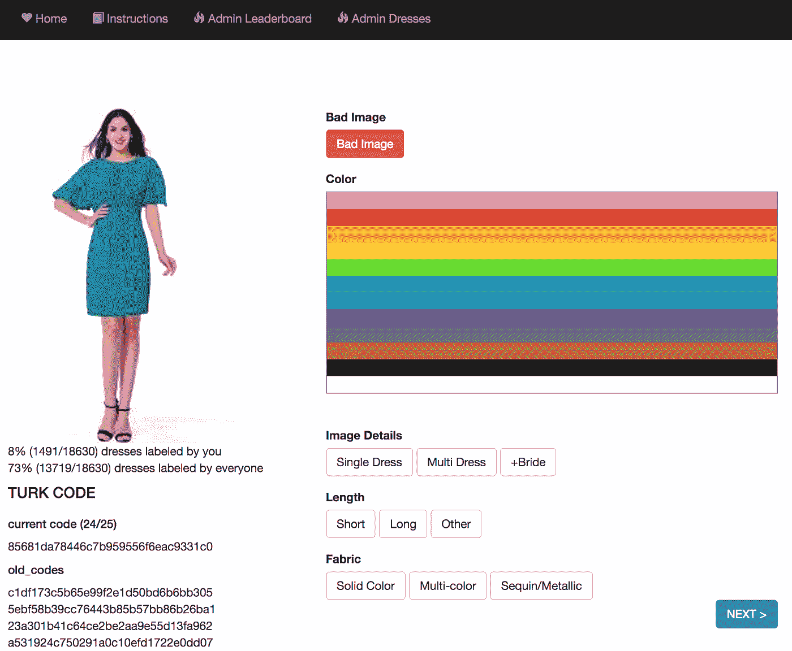

*Above: Labeling page at color.suprinfinity.com*

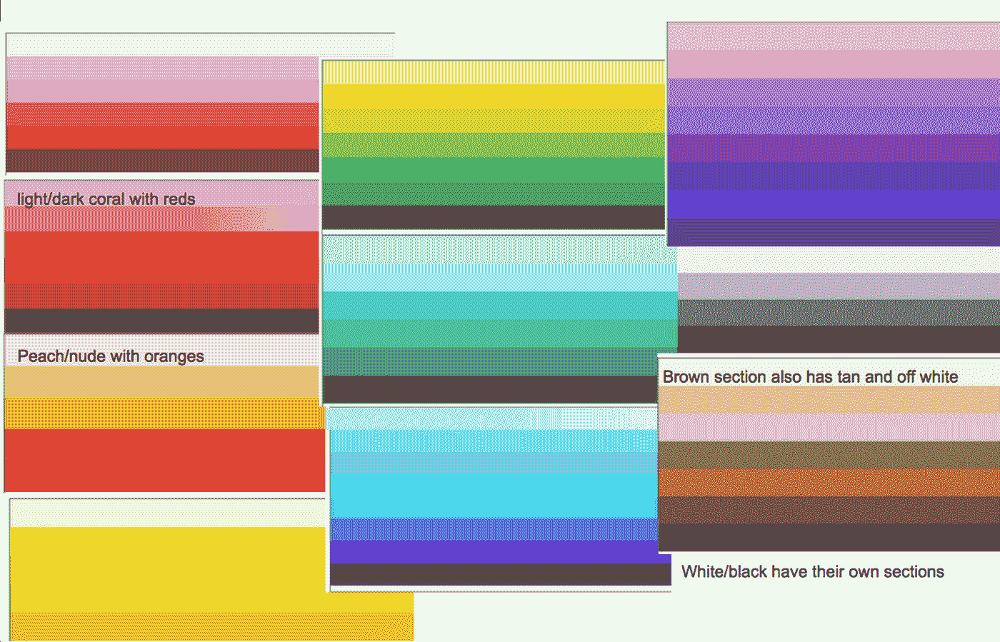

*Above: Specific color labeling groups at color.suprinfinity.com*

一旦图像被标记，数据就被收集到 Postgres 数据库中。其他标签(除了颜色)被收集用于项目中的潜在用途:

*   “图像细节”标签帮助我从建模中排除了某些类型的图片
*   长度和织物标签未在当前项目中使用，但可能用于未来的改进/功能。

我收集了 18，630 张图片，存储在亚马逊网络服务(AWS)的 S3 存储桶中。为了给这个项目贴上足够多的标签，我通过**亚马逊土耳其机器人**外包了标签任务。MTurk 是一个你可以付钱给个人来完成可追踪的在线任务的系统。

虽然 MTurk 对于完成大量标签是有效的，但是标签工作的质量并不好。在使用 MTurk 之后，我花了几天时间重新标记(清理)数据集，直到它达到可以接受的建模形状。我使用了我们标签网站的“管理服装”页面，这允许我查看所有的服装及其标签，以及查看特定标签下的所有图像。下面的截图显示了前几件标有“teal5”颜色的裙子。我最终得到了超过 **10，000 张**的可用的带标签的图片来训练我的模型。

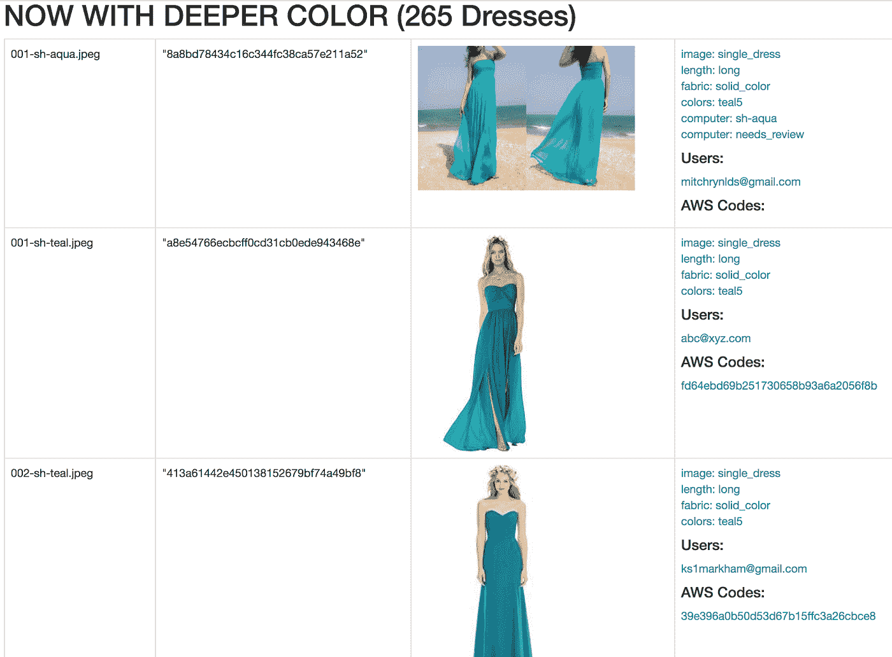

*Above: Admin Dresses page showing ‘teal5’ label*

**模型构建**

为了创建一个可行的产品来实现项目目标，我希望我的模型比典型的服装零售网站有更多的颜色类别。我在我所有的模型中使用了 30 到 35 种颜色。这些颜色类别由原始 64 种颜色标签的不同组合构成。

我尝试了一些建模算法，但选择专注于卷积神经网络(卷积网)，因为它们对图像分类很有效。为了增加计算能力，我通过谷歌云平台计算引擎设置了一个带有一个 NVIDIA Tesla K80 GPU 的 Ubuntu 虚拟机(8 个 vCPUs，52 GB 内存)，并安装了带有 Keras 的 tensorflow-gpu 进行建模。

**图像预处理和数据准备**

由于每个类的图像数量相对较少，我使用 Keras 预处理工具(ImageDataGenerator)来扩充图像以进行建模。下面是这个 Keras 工具如何工作的一个例子。通过拉伸、翻转和应用其他修改，同一个图像可以多次使用，有效地增加了用于训练模型的样本大小。

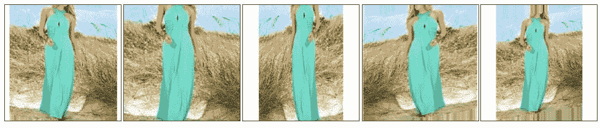

**卷积网络架构**

我尝试了几个不同的参数，这个项目最有效的 convonet 架构如下所示。对于这个模型，我使用了校正的线性激活，50 %的丢弃，以及 16 的批量大小。这个相同的体系结构被应用于一些不同的分类安排，并且总体上比其他体系结构表现得更好。

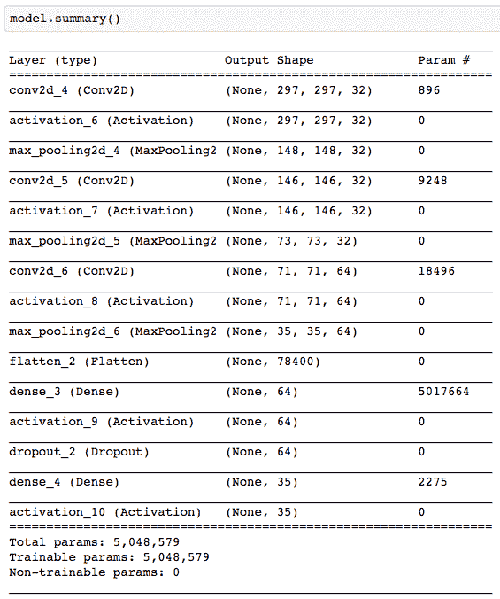

# 结果

为了评估每个模型的性能，我首先查看了典型的性能指标:准确度、精确度、召回率和 f1 分数。准确性是衡量模型总体预测正确的服装数量。精确度和召回率是模型在每个颜色类别中表现如何的度量，f1 是这两者的调和平均值。

这些指标帮助我优化初始模型参数，调整颜色分类，并识别高性能和低性能模型，而无需过度耗时的评估。通过这个过程，我创建了一个有 31 个颜色类别的有效卷积网(Model_31)。

**Model_31 分数汇总:**

*   整体模型精确度:81 %
*   平均精度:81 %
*   平均召回率:80 %
*   平均 F1: 81 %

为了进一步评估 Model_31，我观察了每个颜色组的表现。我检查了每个单独颜色组中被算法错误分类的图像。通过这个过程，我对模型错误标记的图像进行了两个关键观察，并相应地解决了每个问题:

**该模型经常预测一个非常接近的颜色组。**

*   对于我的产品来说，这是一个可以接受的结果。例如，浅黄色的服装可以归类为黄色服装。它仍然属于同一个颜色系列，可能会被挑选浅黄色礼服的伴娘看到。然而，一件浅黄色的衣服被错误地归类为翠绿色是不可接受的，原因有几个。
*   由于上述原因，我创建了自己的**【接近得分】**指标来评估模型。我计算了 1 个和 2 个颜色组中的“接近整体模型准确度”和“接近回忆”分数。这包括将 1 或 2 个相近颜色组内的任何分类作为“相近阳性”而不是“真阳性”进行计数。

模型实际上正确地标记了一些图像(我错误地标记了它们)。

*   我发现颜色组中的一些图像在建模前被贴错了标签。例如，该模型将几件灰色连衣裙归类为米色。当我打开这些图片时，它们实际上是我贴错标签的米色连衣裙。
*   由于在评估 Model_31 时的这一发现，我回去在建立更多模型之前进一步清理了我的数据。

下图展示了这两种观察结果。它展示了来自**珊瑚**群的图像，这些图像被错误地标记为暗粉色或亮粉色。

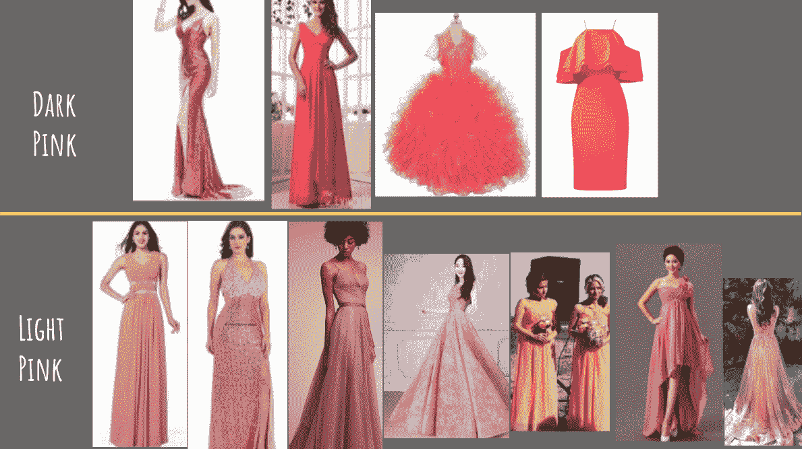

**Above images and classification were from final selected model (Model_35)*

**型号选择**

在进一步清洗标签，又尝试了几个型号后，我用上面的流程选择了我的最终型号: **Model_35** 。

**Model_35 分数汇总:**

*   整体模型准确度:79 %
*   平均精度:80 %
*   平均召回率:79 %
*   平均 F1: 78 %
*   平均关闭(1)召回率:87%
*   平均关闭(2)召回率:93%

# 应用

[http://dreamincolor.suprinfinity.com](http://dreamincolor.suprinfinity.com/)

为了使用我的模型创建一个可行的产品，我需要收集当前可用服装的数据，以便分类并显示给用户。我从以下六家主要的网上伴娘礼服零售商那里搜集了数据:

*   诺德斯特龙
*   威丁顿路
*   卢卢斯
*   Asos
*   德西集团
*   绳结

我使用 Xpath、scrapy spiders 和其他策略从这些网站收集数据。对于每件衣服，我收集了以下信息:

*   服装图片链接
*   价格
*   链接到产品
*   产品名称
*   零售商名称

在清理和编译数据后，我使用我的模型从图像中预测颜色类别，并将所有内容提供给 Robb，以便与网站集成。罗柏为 dreamincolor.suprinfinity.com 完成了所有的网页开发工作。我将生产图像存储在另一个 AWS S3 存储桶中用于生产访问，网站是通过 Heroku 和 postgres 数据库建立的。

我总共收集了**3670 件衣服**在网站上展示。

该网站的访问者可以一次选择多达 5 种颜色类别进行查看。该网站显示所选颜色类别中的所有服装以及与每件服装相关的所有信息。当用户点击一件衣服时，它会直接把她带到零售商的购买页面。

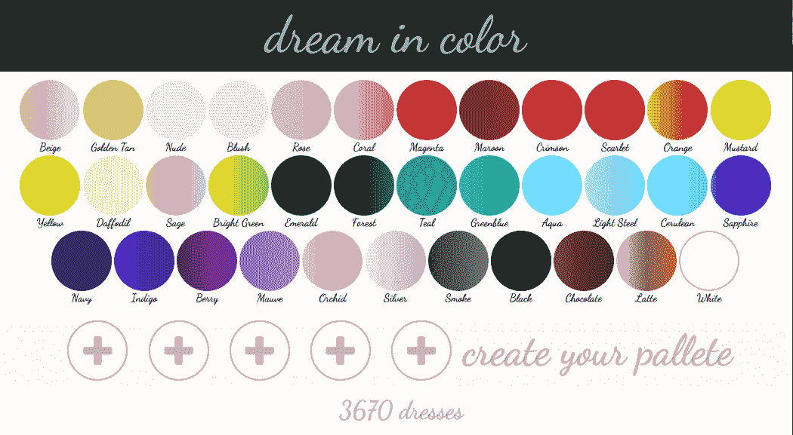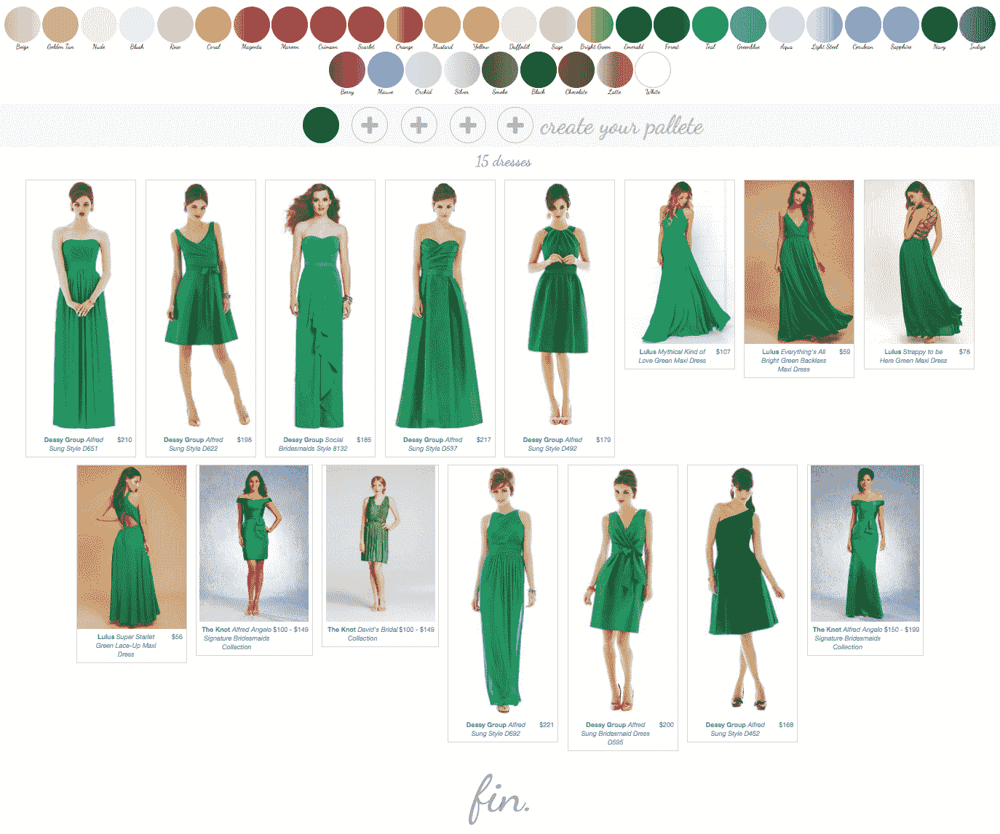

*Above: Snapshot of Emerald Dresses displayed at dreamincolor.suprinfinity.com*

# 生产中的模型性能

下图显示了基于验证数据的颜色组的召回分数。下面的分数与 web 应用程序的实际模型性能之间存在一些有趣的差异。三个颜色类别特别展示了这些差异。

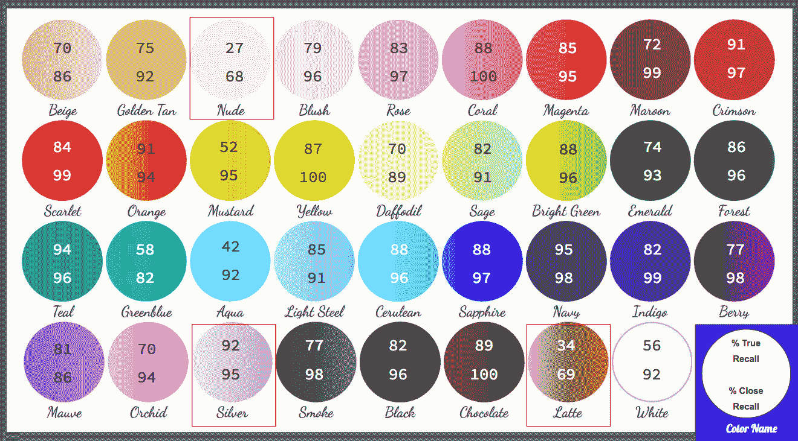

*Above: Image shows True and Close(2) recall scores across color groups. Website color names are shown and differ from class names during modeling.*

无装饰的

*   这位模特在裸色服装上得分很低，可能是因为**在标签**上重叠了相近的颜色组。裸色、腮红、米色、金褐色和玫瑰色组都包含非常相似的服装颜色。这是一些最常见的伴娘礼服颜色，所以我想有单独的选择。更好的标注可以提高分数。这位模特在制作裸色服装时表现得非常出色。

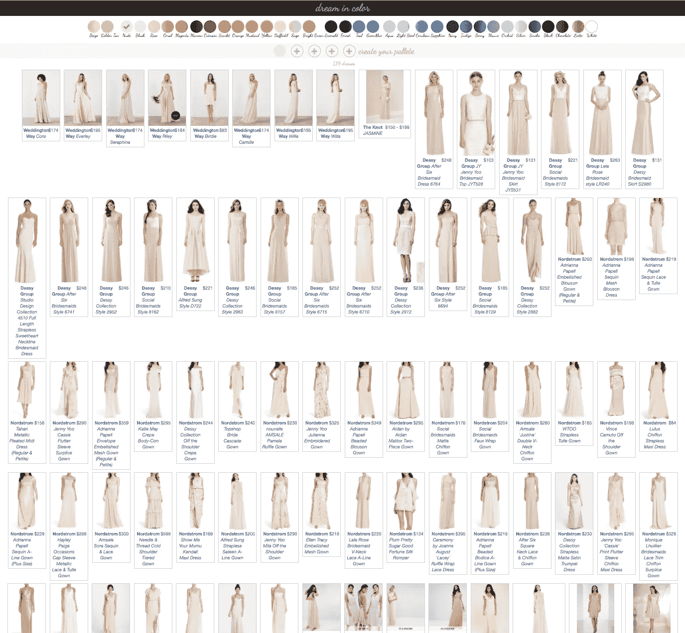

Nude dresses

拿铁咖啡

*   这一颜色类别的分数也很低，但可能是出于不同的原因:**阶级不平衡**。拿铁咖啡(棕色)的图片最少。然而，巧克力色(深棕色)和金黄色也比其他颜色类别的图像少得多，但总体表现良好。**缓解班级失衡可能会提高各颜色组的模型分数**。再说一次，这位模特在生产过程中对拿铁礼服进行了有效的分类。

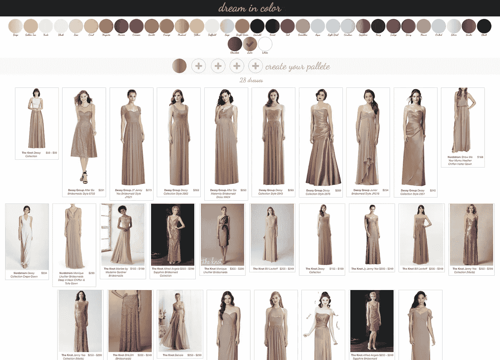

银

*   这一类别的高分表明模特应该准确地对银色礼服进行分类。在生产中，该模型的表现不如预期。这也可能是由于类别中的错误标记以及一些潜在的背景和图像质量噪声。更多的训练图像和更好的标记可能会提高这种性能

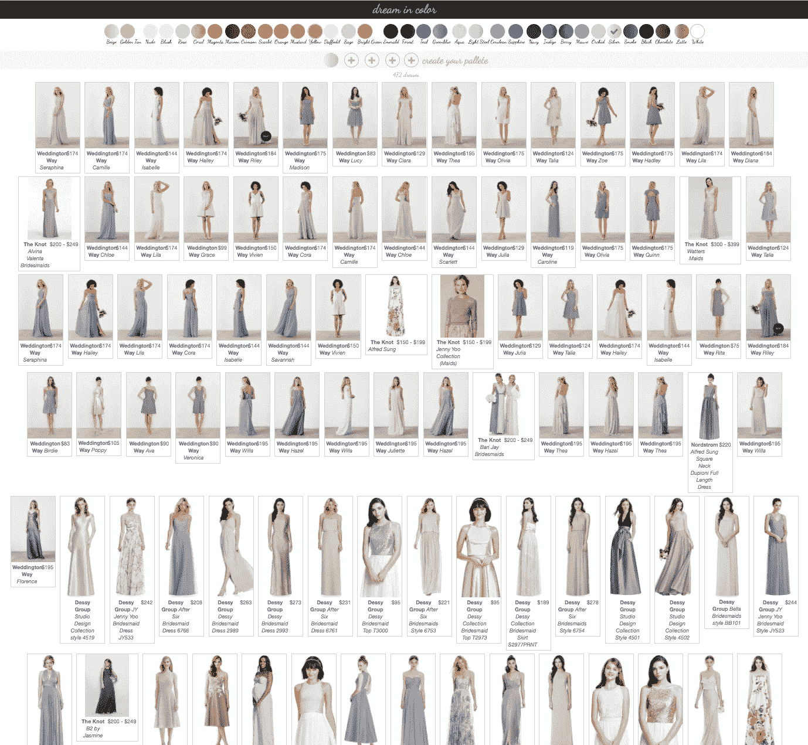

# 额外功能

**寻找相似的服装—** 从 Model_35 卷积网的最后一个密集层，我为每张产品图像提取了一个 64 维向量。这是通过构建一个具有相同架构的网络，从 Model_35 的层插入权重，并从每个图像的第一个密集层输出矢量(省略 softmax 输出层)来实现的。利用 64 维向量集，我创建了一个余弦相似矩阵。该矩阵基于卷积输出向量给出相似服装的“分数”。

我的余弦相似矩阵的目标是为网站创建一个功能，允许用户查看与他们喜欢的衣服相似的衣服。我的希望是，在神经网络的回旋中，除了颜色之外的一些服装特征可能被捕获(例如，长度、织物质地、光泽)。我看了一些例子，这似乎是成功的。

下面，我选择了一条香槟色的亮片长裙。《黑客帝国》中最相似的裙子都是长的，颜色非常相似，有些有某种光泽、纹理或亮片。

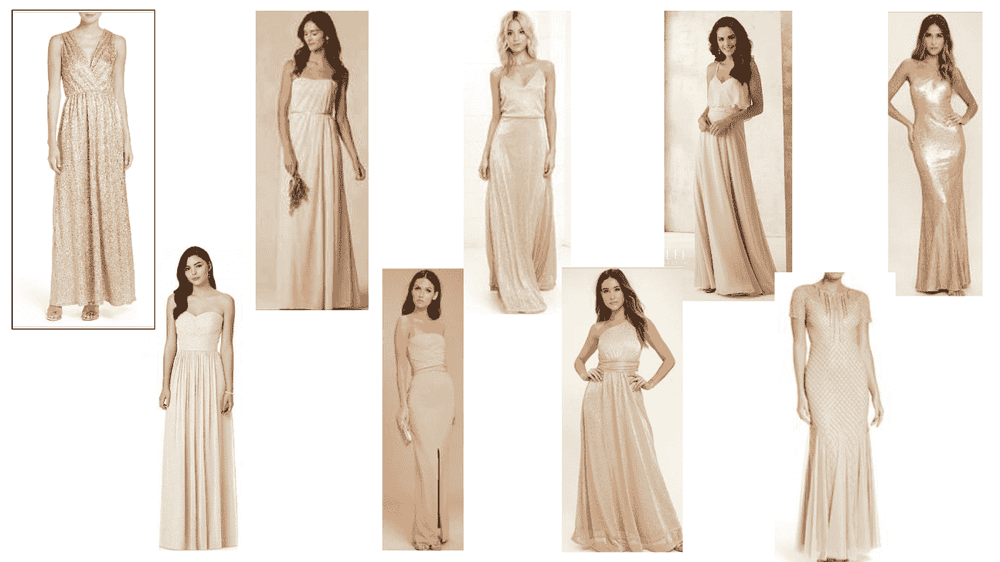

在第二次测试中(见下图)，我选择了另一条亮片长裙。这条参考裙子(左上角的轮廓图)是海军蓝，但是模特把它误归类为黑色。有趣的是，余弦相似矩阵中所有最相似的裙子都被正确归类为海军蓝。他们也很长，有些有亮片或花边。

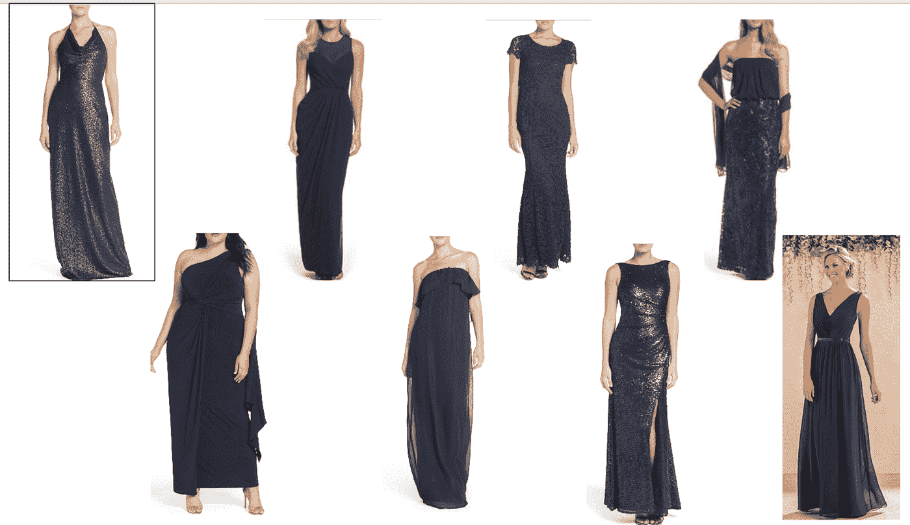

余弦相似性矩阵对于寻找相似服装的有效性看起来相当成功。更大范围内的表现仍需评估。找出这一特征中的弱点，识别多少件衣服在风格/颜色相似性上有明显的差异，将是有用的。我想这将受到参考服装颜色类别中可用服装数量的严重影响。

**其他类似产品——**从发饰到个性珠宝，再到指甲油和相配的坡跟鞋，伴娘的套装不仅仅是她的礼服。同样，伴郎也需要搭配(想想领结、吊带、方巾、袜子)。考虑到这一点，我想看看我的 convonet 是否可以用在其他与婚礼相关的产品上。

我首先在蝴蝶结上测试了这个理论。领带和领结的零售图像通常集中在产品上，背景简单，没有太多其他干扰。Model_35 在识别领结的小样本的颜色类别方面非常有效。下图显示了领结和模型预测颜色类别。有效性的进一步评估是有保证的，这看起来像一个非常有前途的网站的潜在功能！

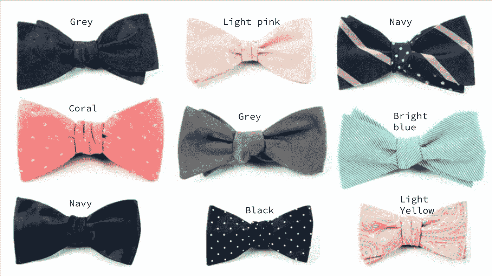

# 未来的工作和结论

提高模型性能的一些未来策略包括进一步清理图像标注、收集更多数据、解决类别不平衡，以及尝试背景扣除或通过 RGB 值标注。我还想尝试迁移学习和具有本地化能力的应用程序。该网站本身可以在许多方面进行改进，包括更好的 UX 设计，添加上述特殊功能，以及快速清理分类错误的服装。

使用卷积神经网络对服装图像进行分类是实现我的目标的有效方法。数据收集、清理和贴标签是该项目的最重要和最耗时的部分。最终的网站比典型的在线零售商提供了更多的颜色选择，这是一个很好的起点，在许多方面都有改进的潜力。

# 资源

1.  西弗玛姬。"全国平均婚礼费用达到 35329 美元."*结。https://www.theknot.com/content/average-wedding-cost-2016*。
2.  “婚礼$eason。” *CNN 财经*。[http://money.cnn.com/2006/02/10/pf/weddings_costs/](http://money.cnn.com/2006/02/10/pf/weddings_costs/)。2006 年 2 月 10 日。
3.  安德烈·伯克。"技术利润和 3000 亿美元婚礼空间的支点."*赫芬顿邮报。*[http://www . huffington post . com/Andre-bourque/technology-profit-and-PIV _ b _ 7193112 . html](http://www.huffingtonpost.com/andre-bourque/technology-profit-and-piv_b_7193112.html)。2016 年 05 月 01 日。
4.  凯特琳.肯尼。"如今当伴娘是什么感觉:调查结果."*终极伴娘。*[http://ultimate 伴娘. com/2016/05/04/what-its-like-to-be-a-a-伴娘-今日调查-结果/](http://ultimatebridesmaid.com/2016/05/04/what-its-like-to-be-a-bridesmaid-today-survey-results/) 。
5.  “根据 2016 年 Knot Real Weddings 研究，美国婚礼的成本创下新高，夫妇们为每位客人花费更多，以创造一个难忘的体验。” *xo 组。* [http://www .美通社/news-releases/the-knot-the-1-wedding-site-releases-2014-real-wedding-study-statistics-300049675 . html](http://www.prnewswire.com/news-releases/the-knot-the-1-wedding-site-releases-2014-real-weddings-study-statistics-300049675.html)。2017 年 2 月 2 日。