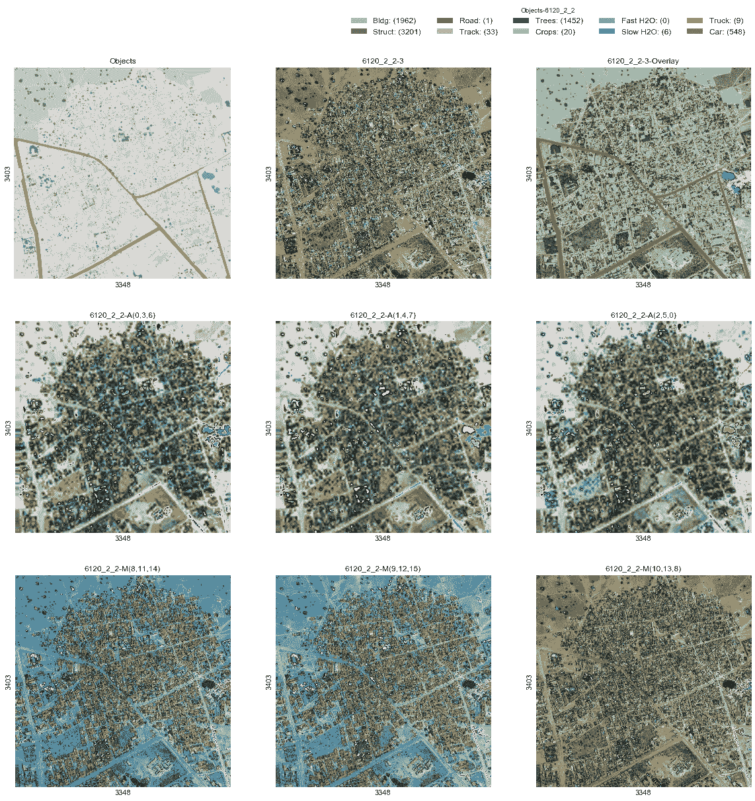
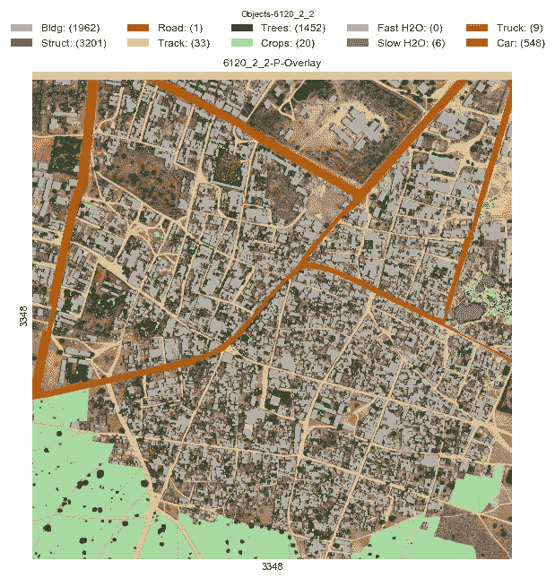
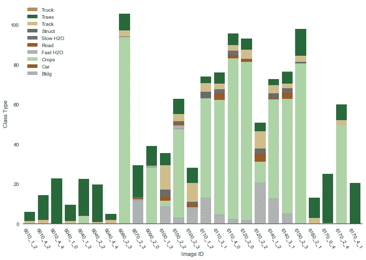
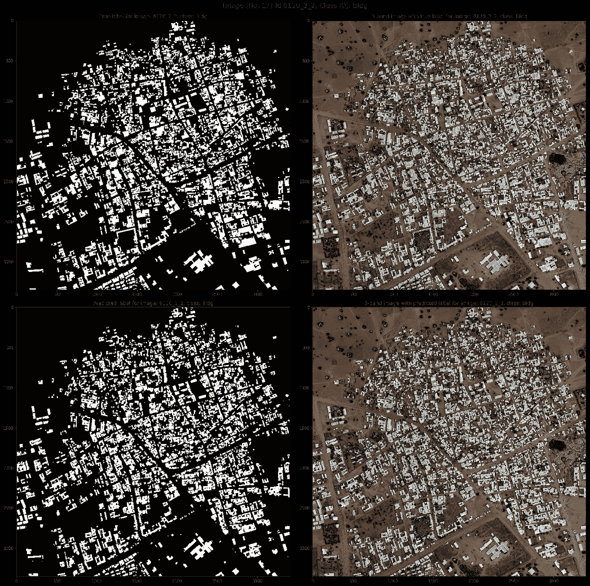
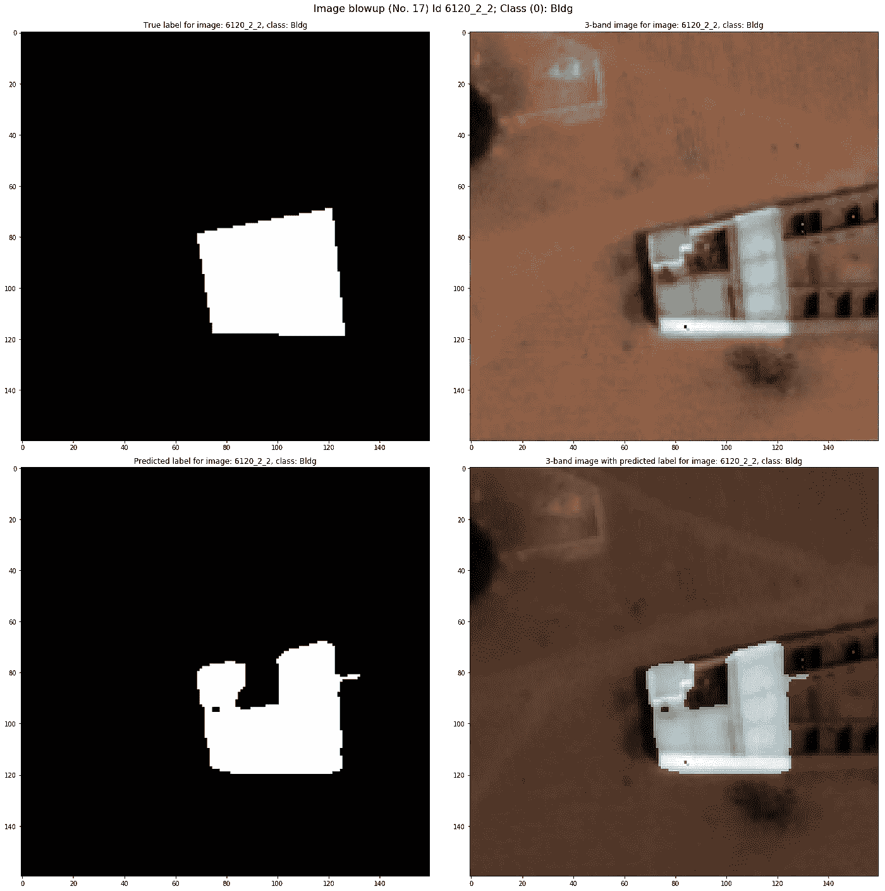

# 用于卫星图像分割的神经网络

> 原文：<https://towardsdatascience.com/dstl-satellite-imagery-contest-on-kaggle-2f3ef7b8ac40?source=collection_archive---------4----------------------->

我们的卡格尔 DSTL 卫星图像竞赛项目概述。该项目在公共测试数据集上获得了 0.46 的分数，在私有测试数据集上获得了 0.44 的分数，这将在私有领导板上的 419 个团队中排名第 7。代码在我的 [github](https://github.com/jiangxu87/dstl_unet) 上。

## **数据可视化和特征合成**

训练数据集包括 25 个图像，每个图像具有 20 个通道(3 个波段(3 个通道，RGB) + A 波段(8 个通道)+ M 波段(8 个通道)+ P 波段(1 个通道))，以及对象的相应标签。用等高线标注的重叠对象有 10 种( [wkt](https://en.wikipedia.org/wiki/Well-known_text) 类数据)，其中 0。建筑物，1。杂项，2。路，3。音轨，4。树木，5。农作物，6。水路，7。死水，8。大型车辆，9。小型车辆。

我们的策略是首先将轮廓转换成掩模，然后为每一类对象训练一个逐像素的二元分类器。下图显示了 20 个通道和标签的示例。值得注意的是，A 波段(下面中间一行)的分辨率比其他波段低得多，因此在我们的模型中没有直接使用。M 波段相对于 3 波段显示出轻微的空间偏移，并且被插值到与 3 波段相同的分辨率，并且进一步配准到 3 波段。我们还根据给定的 3、A、M 波段创建了另外 4 个指数， [CCCI](https://www.researchgate.net/publication/259360047_Use_of_the_Canopy_Chlorophyl_Content_Index_CCCI_for_Remote_Estimation_of_Wheat_Nitrogen_Content_in_Rainfed_Environments) 、 [NDWI](https://en.wikipedia.org/wiki/Normalized_difference_water_index) 、 [EVI](https://en.wikipedia.org/wiki/Enhanced_vegetation_index) 、 [SAVI](https://en.wikipedia.org/wiki/Soil-Adjusted_Vegetation_Index) 。这些指数已被证明与传统 GIS 中的某些类别的对象有很好的相关性，并且可能使特征学习更容易。因此，我们总共有 16 个通道(3 个波段(3 个通道)+ M 波段(8 个通道)+ P 波段(1 个通道)+ 4 个合成通道)输入。

Examples of all channels of training data and class labels

An example of the 3-band image with class labels overlay

## 班级统计

与包含大约 100 万张训练图像的 ImageNet 分类挑战相比，这个训练数据集相当小，只有 25 张图像。然而，本次竞赛中的标签是在像素级别上，因此每个像素都是一个训练示例，该数据集的有效大小为 3300 * 3300 * 25 = 2.7 亿。

对所有训练图像的所有类别的百分比面积的统计显示了大多数类别的真标签和假标签之间的高度不平衡，以及真标签在类别之间的严重不平衡分布。因此，我们决定为每个类别训练一个二元分类器，而不是用单一模型来预测所有类别。

Statistics of percentage area for all classes of all the training data. (Note: on some images, the sum is over 100% because of overlap between classes.)

## U 网模型

在 tensorflow 中开发了具有批量归一化的 U-net，并用作分类模型。该模型被训练 9000 批，每批包含 60 个图像补片。每个图像块都是原始图像的 144*144 裁剪。类似于最初的 [U-net](https://arxiv.org/abs/1505.04597) 论文，由于边缘像素仅接收部分信息，因此仅在中心 80*80 区域上计算损失。

损失函数:比较了两种损失函数，包括加权交叉熵和软 [Jaccard 指数](https://en.wikipedia.org/wiki/Jaccard_index)，这两种损失函数都可以解释真假标签的不平衡。发现加权交叉熵在训练期间对交叉验证数据产生振荡性能。给定评估度量是类的平均 Jaccard 指数，使用 Jaccard 指数作为损失函数是理想的。不幸的是，Jaccard 指数是不可微的。相反，软 Jaccard 指数是可微分的，并且在非常有把握的预测中接近 Jaccard 指数。交叉熵(H)和软 [Jaccard 指数](https://en.wikipedia.org/wiki/Jaccard_index) (J)的组合，L = H -log(J)，被用作损失函数。

优化器:使用初始学习率为 0.0001 的 Adam 优化器。虽然 Adam optimizer 应该自然地执行步长退火，但我们发现每 4000 批学习率衰减到 0.1 确实改善了训练。

批量大小:原来的 U-net 模型使用每批中的单个图像进行训练，显然不适合这个问题。从职业统计可以看出，职业分布在不同的图像中变化很大。大批量(此处为 60)是可取的，以确保每个有效批量的统计数据(考虑动量)与整个训练数据集的统计数据一致。批量大小也必须与有效训练区域妥协，因为边缘像素必须被丢弃。太大的批量将导致用于训练的中心区域非常小。

在 CPU 上创建两个独立的线程进行数据预处理，预处理后的数据被推入两个队列，并分别在 GPU 上进行训练和交叉验证。这减轻了 GPU 的负担，加快了训练的速度。所有训练数据都被预加载到 RAM 中，以避免训练期间缓慢的文件 I/O。

该项目是通过对 21 幅图像进行训练，使用另外 4 幅图像进行交叉验证而开发的。最终的模型是用所有 25 幅图像训练出来的。

## 训练数据扩充

训练数据扩充包括随机水平和垂直反射和平移，以及 360 度旋转(1 度步长)。旋转破坏了 CNN 的平移对称性。选择 1 度的步长，因为对于 144 的裁剪大小，围绕其中心旋转 1 度会在边缘产生约 1.3 个像素的偏移，从而为 CNN 产生不同的输入图像。有趣的是，通过实验确定旋转在多大的步长下停止改善性能。

## 测试时间增加

U-net 模型的一个优点是它是完全卷积的，因此用于训练和推断的输入数据的空间维度不必相同。如上所述，在训练中，相对较小的图像补片和较大的批量是可取的。然而，对于推断来说，使图像块尽可能大以减少由丢弃边缘上的预测而产生的开销是有益的。受 GPU 内存的限制，我们每次只能将大约四分之一的图像(~1900*1900)送入 U-net 进行推理。图像的每四分之一旋转 0、90、180 和 360 度，并且水平和垂直翻转，用于放大。并且最终预测掩码是 8 个掩码的算术平均值，以减少预测中的方差。与最初的 U-net 论文类似，我们在边界上应用了反射，以改进边缘像素上的预测。

## 预测和结果

在线评估在私人排行榜上的得分为 0.44113，在 419 分中排名第七。下图显示了 0 级建筑物的真实标签和预测标签之间的比较。

一些有趣的观察:该模型能够从训练数据中纠正一些不精确的标签。如下图所示，3 波段图像似乎有一个小的“空”区域，充满了自然光产生的阴影，位于建筑物的中间。虽然“真实”标签将整个区域作为建筑物类包括在内，但预测掩膜能够正确排除阴影区域。我们在预测中发现了几个这样的例子。

水类:我们已经注意到，对于建筑物类，如果只使用 2 个图像进行训练，U-net 会完全过拟合，但是对于≥21 个训练图像，U-net 可以很好地推广。了解确切的界限在哪里以及为什么会有意思。这也意味着深度学习在这场比赛中对水类不起作用，因为水类只在很少的图像上有实例。我们已经发现，对于水类，阈值 CCCI 优于深度学习模型。

## 一些评论

1.  该模型主要基于其在 0 级(即建筑物)上的性能而开发。通过为每个类定制模型参数，结果肯定可以进一步改善。
2.  我们的模型完全无法预测大型和小型车辆类别，可能是由于严重的真假标签不平衡和车辆的空间尺寸太小。诸如对真实标签的过采样和大批量训练等技术可能有助于前者。