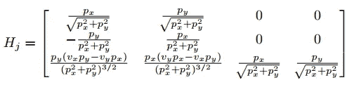
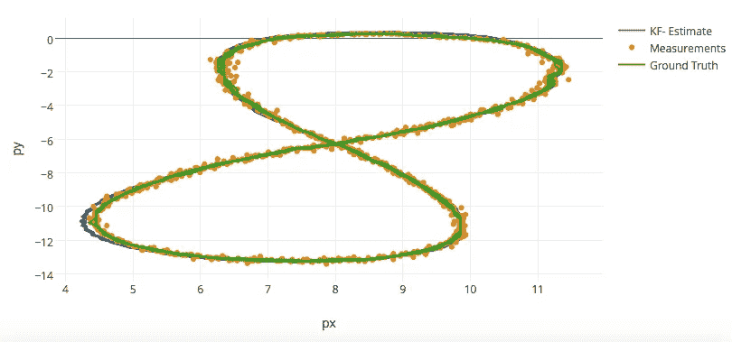
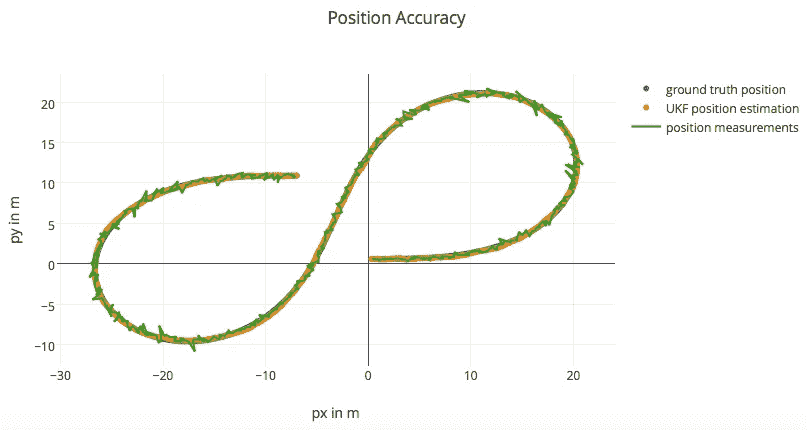
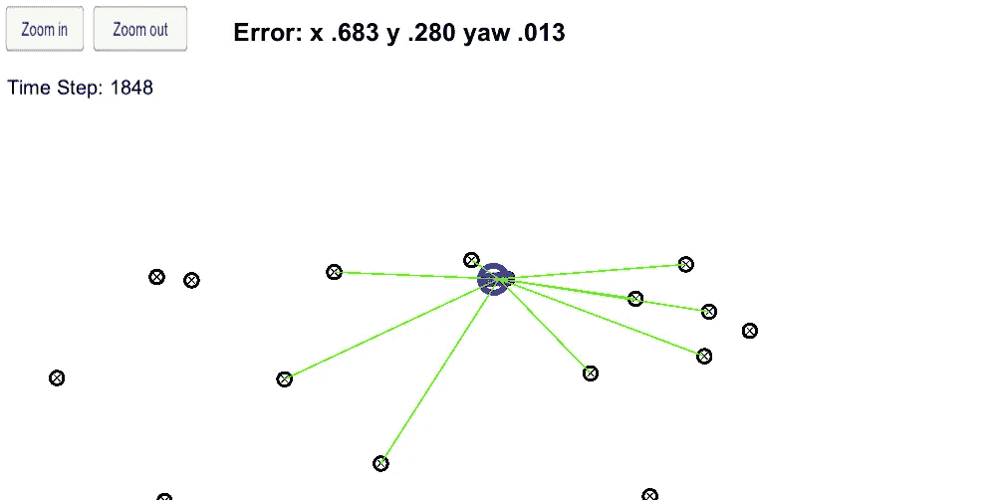
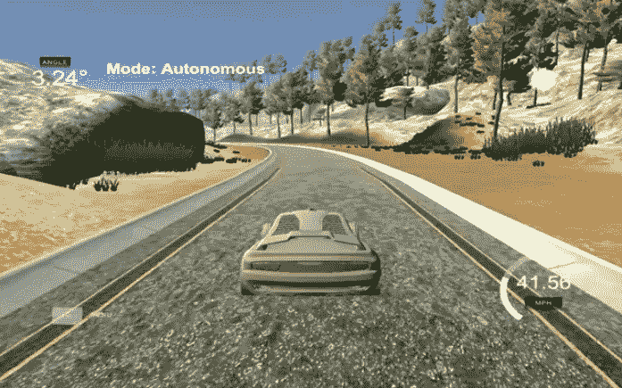
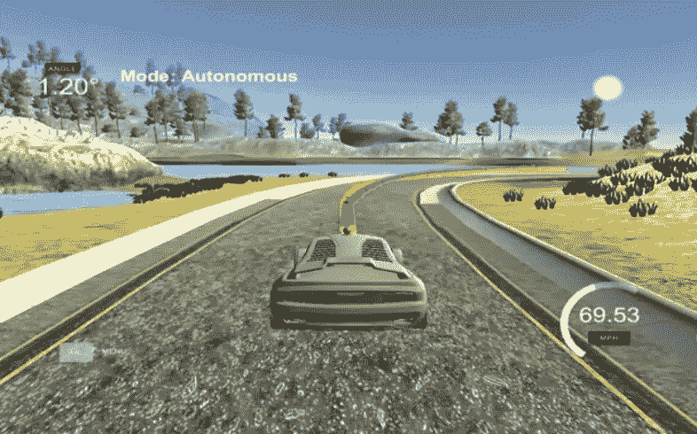

# 伙计，我的车呢？回顾 Udacity SDCND 第 2 期

> 原文：<https://towardsdatascience.com/dude-wheres-my-car-looking-back-at-udacity-sdcnd-term-2-e518fede30a1?source=collection_archive---------4----------------------->

Udacity 自动驾驶汽车纳米学位项目的第二个学期介绍了传感器融合、定位和控制。即使仅仅是过去的主题本身，这个术语也有许多其他重要的变化。首先，术语 1 通常侧重于您可以从已经创建的库中导入的算法(在使用深度学习进行交通标志分类和驾驶行为克隆以及支持向量机进行车辆检测的情况下)，术语 2 需要更具体的编程-您必须学习实现所介绍的各种技术所需的精确数学方程。这导致了一些复杂的方程和矩阵，如下面的雅可比矩阵:

Looks fun right?

我承认，在进入第二学期的时候，意识到有多少数学是直接涉及的，这是相当令人生畏的。尽管我对自己的数学能力很有信心，但第一学期更多的机器学习/数据科学基础更在我的掌控之中。

然而，一旦你对这些方程有了感觉，它们在代码中的实际实现就没那么难了。这让我们看到了 Term 2 的第二个重大变化:Term 1 完全是用 Python 编写的，而 Term 2 完全是用 C++编写的。这给我提出了一个比数学更大的问题，因为我以前从未使用过 C++。幸运的是，这个学期的大部分内容只需要基本的 C++技能就可以完成，我还使用了一些在线资源来让自己感觉更舒服一些。这是我对第二学期有一点遗憾的地方，因为我已经决定将第二学期从最初的 12 月份的时间表提前到 11 月份的时间表，我认为在第二学期开始前多学习一些 C++或许会让我受益匪浅。

我在 Slack 上看到的关于第一学期的一大抱怨是，Udacity 的创始人巴斯蒂安·特龙&也许是自动驾驶汽车的“父亲”，在这个学期的大部分时间里都是失踪的。这在第二学期得到了纠正，尽管主要是通过使用 Sebastian 的用于机器人课程的[人工智能，该课程可在 Udacity 上免费获得。如果你是一名未来的 SDC 纳米学位学生，或者正在第一学期和第二学期之间消磨时间，我强烈建议你去看看那门课，因为它将是第二学期的一大助力。由于 Sebastian 的课程是 Python，Udacity 从梅赛德斯-奔驰和优步·ATG 请来工程师对内容进行了一些更新，并涵盖了一些 C++方面的实现。](https://www.udacity.com/course/artificial-intelligence-for-robotics--cs373)

第二学期的最后一个变化也是基于我在网上看到的第一学期的一些反馈，学生们经常提出比预期更高的学期时间承诺。我当然觉得这在学期的早期得到了改善，尽管我确实认为一些后来的项目(尤其是第五个带有模型预测控制的项目)需要比 Udacity 目前提供的更多的课程；虽然课程本身是一个很小的时间承诺，这意味着你经常被困在自己试图找出一些更先进的概念。

## 项目一——扩展卡尔曼滤波器

Tracking a Bicycle with an EKF

第一个项目是卡尔曼滤波器概念的介绍，第二个项目是更高级的版本。课程首先介绍项目中要融合的两种传感器，雷达和激光雷达，以及它们各自的优缺点。虽然目前昂贵得多，激光雷达的分辨率确实比雷达高，但雷达可以在更广泛的天气情况下工作。雷达也可以直接测量速度(转换坐标空间后)，而激光雷达不行。雷达和激光雷达传感器在输入数据中都包含噪声，在传感器融合过程中的每一步都必须考虑噪声(通常通过高斯分布的方式)。

扩展卡尔曼滤波器的工作原理是首先基于初始传感器测量值初始化值，也许是为了跟踪车辆前方的物体。对于随后的时间步长，它预测被跟踪的对象将在哪里(基于在给定单个时间步长上的先前状态的情况下获取其运动预期)，获取当前传感器测量值，然后基于结合来自传感器的测量数据及其预测来更新它认为对象实际在哪里。在更新步骤中结合这些测量值和预测值有助于解决每个传感器中固有的噪声。对于雷达和激光雷达，此更新步骤必须以不同的方式完成-雷达需要线性近似(EKF 不能使用非线性函数，因为您输入的是高斯函数，而想要返回的是高斯函数)来转换到计算中使用的测量空间，这最终会给模型增加一点不准确性(参见前面提到的雅可比矩阵)。EKF 的另一个缺点是它们基于恒速的概念，这在车辆转弯时尤为明显。请注意，上图中的 KF 估计值(蓝色)沿曲线越来越偏离地面真实值，该模型预测被跟踪的对象比实际情况更远离转弯圆。

## 项目二——无味卡尔曼滤波器

Tracking a Bicycle with UKF. Note that the UKF estimate does a better job overlapping the ground truth (in blue), so much that it cannot really be seen above.

[无味卡尔曼滤波器](https://github.com/mvirgo/Unscented-Kalman-Filter)改进了 EKF，因为它允许跟踪非线性模型，通过使用“西格玛点”,该点是使用平均位置周围的噪声产生的。这些西格玛点被输入到非线性函数中，并有助于根据得到的西格玛点的分布进行预测。我将在这里跳过许多细节，因为它很容易成为自己的 10 分钟长的帖子，但本质上，你将再次做一个预测和更新的过程。此外，EKFs 使用恒定速度(CV)模型，UKFs 使用恒定转弯角速度和速度幅值(CTRV)模型。这个模型将偏航(转弯)和偏航率(汽车转弯的速度)添加到模型中(旧的状态空间只有 x、y 和速度)。如上所示，UKF 在沿曲线进行估计时表现得更好。

## 项目三——粒子过滤器(被绑架的车辆)

Localizing the vehicle using a particle filter’s observation of map landmarks

接下来是本地化的概念。你可能已经猜到了，这是基于汽车知道它在哪里。GPS 当然可以给我们一个相当接近的估计，但自动驾驶汽车需要比 GPS 所能提供的更精确的位置。由于信号中断，GPS 在高楼林立的城市等地区也很难工作。这些课程还深入研究了可用于定位的不同运动模型，在这些模型中，预测再次发生，并与测量(基于所用的传感器，测量总是有一定量的噪声)相结合，以更新到更准确的位置。

粒子滤波是一种很好的方法，因为它们可以处理多峰分布，而卡尔曼滤波只能处理单峰分布。这是有帮助的，因为汽车最初在新环境中可能相当不确定它的确切位置(本课给出了一个走廊的例子，该走廊在两侧几乎相同，直到遇到侧室中的物体)。简而言之，大量“粒子”分布在地图中，与最近的已知地图地标相关联，然后基于地标、新的预测和测量，粒子过滤器慢慢过滤掉不太可能给出某个测量的“粒子”。这是通过用相应的误差对粒子进行加权来实现的，不太精确的粒子被慢慢剔除。这里一个重要的中间步骤是坐标转换——汽车有自己的本地坐标系，而地标来自的地图也有自己的。没有这种转变，汽车将无法实现本地化。

[的最终结果](https://github.com/mvirgo/Kidnapped-Vehicle-Project)是一辆虚拟汽车，它可以在基于不太精确的 GPS 数据进行初始化后，根据其环境中地标的传感器测量来定位自己。

## 项目四——PID 控制

Back to the Udacity simulator!

第四个项目是关于比例-积分-微分(PID)控制，这有助于驾驶车辆。虽然该项目本身带回了之前在 Term 1 中用于行为克隆的 Udacity 模拟器，但这次是在没有深度学习的情况下完成的。该名称的“比例”部分来自于与跨轨迹误差(CTE)成比例的转向，或者从车道中间到汽车实际位置的距离。这很有道理，因为你肯定希望大部分时间都待在车道中间。然而，如果模型只由 P 控制驱动，它总是超调，导致它在中心来回驱动大波浪。这可以通过名字的“衍生”部分来改进。PD 控制器会考虑 CTE 的变化是正还是负，以及多少，这意味着当汽车接近车道中心时，它会减小转弯角度，有助于减少超调。

现在，你们中的一些人可能已经注意到，在把你自己的车拿到商店后，你的车倾向于向某个方向拉。把手从方向盘上拿开，车慢慢漂移出车道！在模拟器的情况下，这会在最终的转向角度中产生系统偏差——如果汽车存在这种偏差，PD 控制器将总是计算错误的角度，汽车将慢慢偏离轨道。这是通过名字的“积分”部分解决的，如果在一个给定点上所有 CTE 的总和向一个方向偏离太远，转向角将被补充以对此进行校正。

PID 控制器的主要重点是确定这些部分的系数:P、I 和 d。PID 控制器的实际基础实现非常短(如果您已经检查了上面链接的 Github)，但找到这些值是该项目的真正挑战。[旋转](https://www.youtube.com/watch?v=2uQ2BSzDvXs) &随机梯度下降法在这里都是潜在的方法——虽然我在选择最终值时尝试了一下这两种方法，但我最终没有在最终版本中包含它们。PID 控制器在实际应用中对我来说似乎是无效的，所以当我得知现在大多数机器都使用这种方法时，我有点惊讶！

## 项目五——MPC 控制

MPC, a much more advanced, yet much more accurate control method than PID

很多人类司机都是反动司机。他们几乎只是专注于保持他们的车道和速度(你们中的一些人可能也想争论)，如果有问题发生，他们会对问题做出反应。然而，要成为一名好司机，你需要积极主动，能够预测在你前面会发生什么事情。如果你在高峰时间行驶在高速公路上，看到前方远处的刹车灯，你可以猜测你前面的车也将很快刹车，并可以放油门。如果你还没有从早期的项目中注意到，预测对于自动驾驶汽车来说至关重要——它们不仅需要看到车辆前方和周围的情况，还需要能够预测十字路口的行人可能会进入它的道路，或者前面的汽车突然转向意味着潜在的事故和需要刹车。一辆自动驾驶汽车提前一点刹车，甚至可以帮助其他人类司机提前一点看到尾灯，从而做出反应。

第二学期的[期末项目，模型预测控制，将这一点推到了前沿。该项目不仅能够规划未来的行动以遵循一条路径(见上图中黄色的轨迹路点，绿色的汽车预测路径)，而且还增加了计算时间与转向角和油门/制动的执行器值之间的延迟。我考虑这种延迟的方法是实际上根据延迟结束时汽车的预测位置为我的模型提供一个预测状态空间，从而使所有结果计算都像是实时的(当然是基于原始预测)。当然，这个项目不仅仅是延迟，我认为这可能是迄今为止整个 Nanodegree 中对我最具挑战性的，需要结合论坛、Slack 频道和查看项目 Q & A。我的](https://github.com/mvirgo/MPC-Project) [Github 文章](https://github.com/mvirgo/MPC-Project)比之前的一些文章更广泛，所以如果你想更深入地了解它，我建议在那里阅读。

## **到了期末**

我非常惊讶地看到自动驾驶汽车纳米学位的最后一个术语！到目前为止，这是一次相当疯狂的经历，在这么短的时间里，我学到了比我想象中更多的东西。第三学期侧重于路径规划、专业化(如果你已经阅读了我关于深度学习车道检测的[之前的](https://medium.com/towards-data-science/lane-detection-with-deep-learning-part-1-9e096f3320b7) [帖子](https://medium.com/towards-data-science/lane-detection-with-deep-learning-part-2-3ba559b5c5af)，你可能会猜到我会关注高级深度学习专业化)，以及系统，其中甚至有可能我的一些代码(以及潜在团队中的其他人的代码)会出现在 Udacity 自己的自动驾驶汽车上！那绝对会让我大吃一惊。在我开始下一个学期之前，我还有几个星期的时间，但我很兴奋地想知道接下来会发生什么。