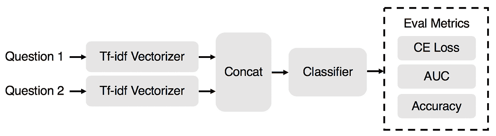
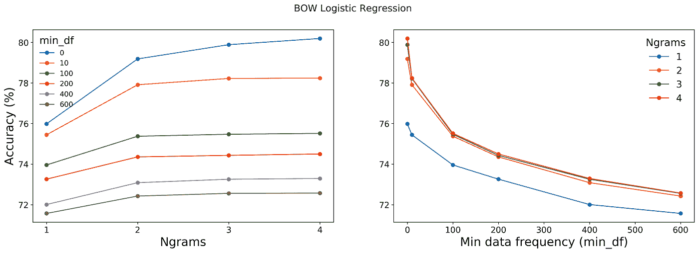
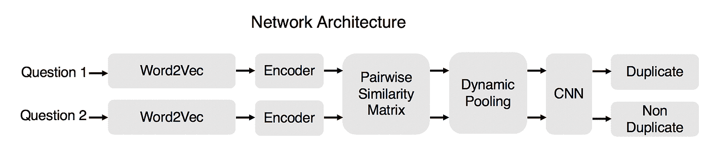
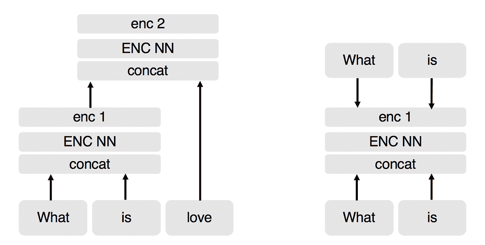

# 使用 Word2Vec、XGBoost 和自动编码器的重复问题检测

> 原文：<https://towardsdatascience.com/duplicate-question-detection-using-word2vec-xgboost-and-autoencoders-f9353d58ba34?source=collection_archive---------8----------------------->

Photo by [Emily Morter](https://unsplash.com/@emilymorter?utm_source=medium&utm_medium=referral) on [Unsplash](https://unsplash.com?utm_source=medium&utm_medium=referral)

在这篇文章中，我解决了**根据问题对是否重复**进行分类的问题。这对于像 Quora 或 Stack Overflow 这样的公司来说很重要，在那里发布的多个问题是已经回答的问题的重复。如果算法发现了一个重复的问题，用户可以被引导到这个问题，并更快地找到答案。

两个重复问题的一个例子是“**我如何阅读和找到我的 YouTube 评论？”以及“我如何才能看到我在 Youtube 上的所有评论？**’，非重复问题是“**是什么导致某人吃醋？以及‘我能做些什么来避免嫉妒某人？**’。有两种方法适用于这个问题:

1.  **通过自动编码器方法训练的序列编码器和用于分类的动态池**
2.  **具有逻辑回归和 XGBoost 分类器的词袋模型**

ngrams = 4 且 min_df = 0 的词袋模型在 XGBoost 的情况下实现了 82 %的准确度，相比之下，在 Bi LSTM 和 attention 的文献中报告的最佳准确度为 89.5%。这里实现的编码器方法实现了 63.8%的准确度，这低于其他方法。我发现这很有趣，因为 autoencoder 的实现和这种方法考虑了可变长度序列的短语和单词之间的相似性。或许，可以通过改变动态池矩阵的维度、不同的数据清理方法以及拼写检查来提高效率。

分类器可以基于三种不同的评估指标进行比较，即对数损失、auc 和准确性。对数损失或交叉熵损失是分类器输出的概率分布相对于类别标签的真实概率分布有多不同的指示符。接收器操作特性绘制了真阳性率对假阳性率，曲线下面积(auc)为 0.5 对应于随机分类器。AUC 越高，分类器越好。准确度是一个简单的指标，用于计算正确预测标签的比例。

在这篇文章中，我使用准确性作为比较的标准，因为没有理由不这样做。完整的代码可在[这里](https://github.com/aspk/Quora_question_pairs_NLP_Kaggle)获得。

# 船首模型

如图所示，当 min_df 从 0 变为 600 时，对于 ngram = 4，精度从 80%降低到 72 %。min_df 根据计数对词汇表中出现的 ngrams 进行阈值处理。语料库中出现频率低于 min_df 的任何 ngram 都被忽略。不使用超过 4 的 n gram，因为当 n gram 从 3 增加到 4 时，精度变化可以忽略不计。使用 Tf-idf 矢量器而不是计数矢量器来加速计算，并且它还少量地提高了精度(对于一个数据点不到 1%)。通过 XGBoost 运行相同的输入可以获得 82%的精度。

对于 BOW 模型，参数 sweep 词汇表的大小范围从 703912 (n-grams = 4 和 min_df =0)到 1018 (ngrams = 1 和 min_df = 600)。

# 自动编码器和动态池 CNN 分类器

上图显示了实现的模型，类似于 Socher 等人的 Word2Vec 嵌入是根据 Tensorflow Word2Vec 开源发布，使用 skip gram 模型，以 100000 的词汇量生成的。在这些嵌入中，共享相似上下文的词具有较小的余弦距离。关键问题是处理不同长度的问题。通过训练自动编码器来压缩句子的信息内容。这种方法背后的主要动机是通过比较整个句子以及句子中的短语来找到句子之间的相似性。不同长度的问题通过如下所述的上采样和动态池来解决。

使用左图所示的方法对句子进行编码。这三个单词和两个编码被认为是生成相似性矩阵的输入。使用 Tensorflow 对自动编码器进行训练，如右图所示。右图描述了编码器和解码器的架构。我为编码器和解码器使用了单层神经网络，也可以考虑多个隐藏层。多批字被连接并馈入编码器，在理想情况下，解码器的输出应该与输入相匹配。神经网络的均方误差损失用学习率为 0.1 的梯度下降优化器最小化。1e-4 的 L2 正则化系数用于编码器和解码器权重。

这里的 autoencoder 使用任意两个词进行训练，可以批量训练。它不同于 Socher 等人使用的方法，作者对整个句子进行编码，并通过将其展开为一个问题来解码。展开自动编码器在 Tensorflow 中很难甚至不可能实现。像 pytorch 这样的动态计算图构造工具可能更适合实现完整的方法。

整个句子及其中间编码可以用作上采样和动态池阶段的输入。在上采样阶段，通过重复从向量中随机选择的编码来对所考虑的问题对的较小向量进行上采样，以匹配其他问题编码的长度。为每个短语向量生成成对的相似性矩阵，并且可变维度矩阵被汇集成 n pool×n pool 的矩阵。我用的是 npool = 28。这个矩阵被馈送到 CNN 分类器，以分类为重复或不重复。npool 的超参数优化也可以提高精度。该模型的准确率为 63.8 %。

# 问题

我面对一些与 sklearn 的逻辑回归有关的问题。该模型确实输出了正确的分类标签，但却输出了错误的概率。我还没有想出解决这个问题的办法。XGBoost 没有这个问题。

# Github 回购

[https://github.com/aspk/Quora_question_pairs_NLP_Kaggle](https://github.com/aspk/Quora_question_pairs_NLP_Kaggle)

# 参考

最佳问题对匹配方法:王、志国、Wael Hamza 和 Radu Florian。“自然语言句子的双边多视角匹配。”arXiv 预印本 arXiv:1702.03814 (2017)。

理解交叉熵损失和可视化信息:【http://colah.github.io/posts/2015-09-Visual-Information/ 

展开递归自动编码器的方法:Socher，Richard，et al .〈释义检测的动态汇集和展开递归自动编码器〉神经信息处理系统进展。2011.

Word2Vec 嵌入式 tensroflow 开源发布:[https://github . com/tensor flow/tensor flow/blob/r 1.9/tensor flow/examples/tutorials/word 2 vec/word 2 vec _ basic . py](https://github.com/tensorflow/tensorflow/blob/r1.9/tensorflow/examples/tutorials/word2vec/word2vec_basic.py)tensor flow:[https://www.tensorflow.org/](https://www.tensorflow.org/)