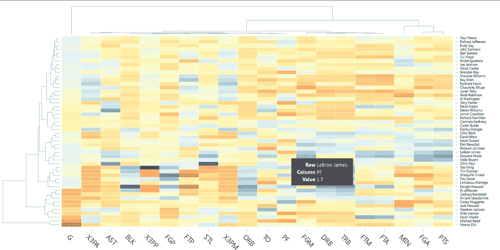

# DYK flexdashboard 解决了数据科学家的 javascript 文盲问题

> 原文：<https://towardsdatascience.com/dyk-flexdashboard-solves-data-scientists-javascript-illiteracy-96b82a8d7f?source=collection_archive---------6----------------------->


Image Courtesy: [https://unsplash.com/search/colors?photo=5IHz5WhosQE](https://unsplash.com/search/colors?photo=5IHz5WhosQE)

**问题:**

I-am-a-R-coder 数据科学家的最大问题是他们在网络友好的交互式可视化方面遇到的巨大障碍。因为在大多数组织中，数据科学家的角色不仅仅是构建复杂的统计模型，更多的是从数据块中提取有价值的见解，其最终结果是(漂亮的)可视化。

这个世界还没有完全排除 Powerpoint 演示，但当前需要的是交互式仪表板，因为少即是多——仅在鼠标悬停时显示信息比将这些值刻在图表上好得多，交互式可视化也使分析师能够比静态图像输入更多的信息(需要时会显示出来)。

**救援计划:**

但是作为一个 R 主导的数据科学家，尤其是那些面临 js 挑战的数据科学家，移动友好的交互式可视化世界突然变得空白，这时你必须知道，有一种叫做'***flex dashboard****的东西，它将拯救你！*

[](http://rmarkdown.rstudio.com/flexdashboard/) [## flexdashboard:用于 R 的简单交互式仪表板

### 仪表板分为列和行，输出组件使用 3 级降价标题(###)描述…

rmarkdown.rstudio.com](http://rmarkdown.rstudio.com/flexdashboard/) 

虽然***flex dashboard***有很多不错的特性，但我想指出两点:

1.  **支持包含**[**html widgets**](http://www.htmlwidgets.org/)

[](http://www.htmlwidgets.org/index.html) [## R 的 html 小部件

### HTML 小部件的工作方式就像 R plots，除了它们产生交互式 web 可视化。一两行 R 代码就是全部…

www.htmlwidgets.org](http://www.htmlwidgets.org/index.html) 

**2。灵活的** [**布局**](http://rmarkdown.rstudio.com/flexdashboard/layouts.html) **(类似于自举)**

[](http://rmarkdown.rstudio.com/flexdashboard/layouts.html) [## flexdashboard 布局示例

### 此页面包括各种示例布局，您可以将其用作自己的仪表板的起点。

rmarkdown.rstudio.com](http://rmarkdown.rstudio.com/flexdashboard/layouts.html) 

前者将 js 可视化库带到了 R 程序员的手中，而后者有助于将它们布置在一个响应性(移动友好)的网格布局中。文档使得从期望的布局开始变得非常容易(除非有非常复杂的业务需求，这是非常不可能的，因为它不是一个成熟的仪表板)

```
## Markdown *Code to create an interactive heatmap using d3heatmap```
library(knitr) 
library(d3heatmap) 
library(flexdashboard)url <- "http://datasets.flowingdata.com/ppg2008.csv" 
nba_players <- read.csv(url, row.names = 1) 
```### Stats by Player {data-width=650}  
```{r} 
d3heatmap(nba_players, scale = "column") 
```
```

**还有，发货:**



Screenshot of Interactive Heatmap generated with above code snippet

一旦构建了可视化，有两个简单的部署选项:

1.  [R-Shiny App](https://walkerke.shinyapps.io/neighborhood_diversity/)
2.  [针织面料(如 HTML](https://beta.rstudioconnect.com/jjallaire/htmlwidgets-d3heatmap/htmlwidgets-d3heatmap.html)

通过很少的学习曲线(浏览文档和理解所需 htmlwidgets 的功能和参数的能力)和对 javascript 的零知识，

> Flexdashboard 支持 R-only 数据科学家部署交互式可视化(就像 js-wizard 一样——至少定制较少)