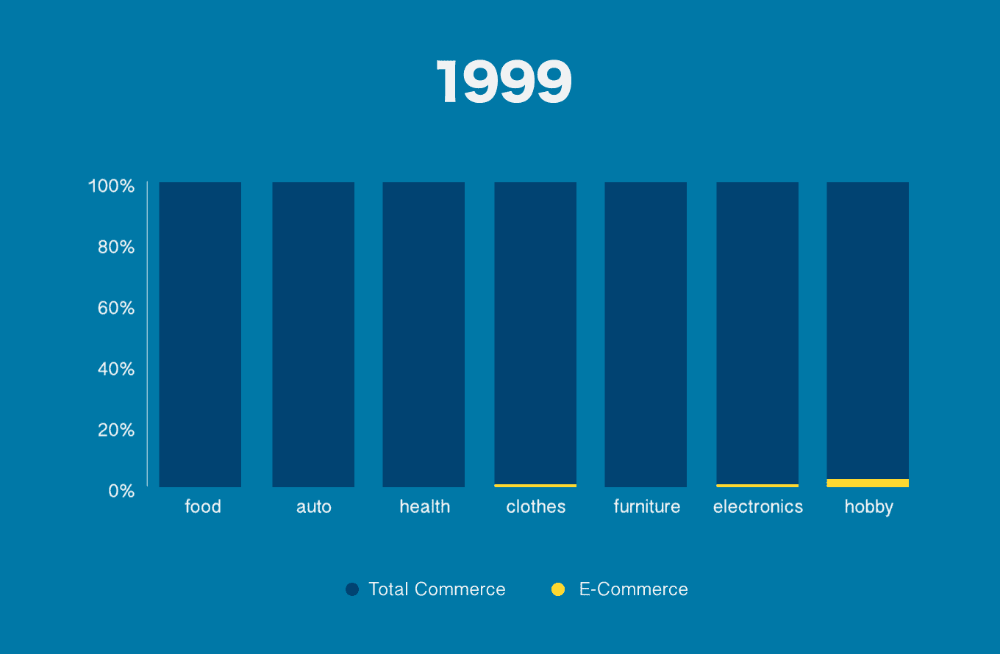
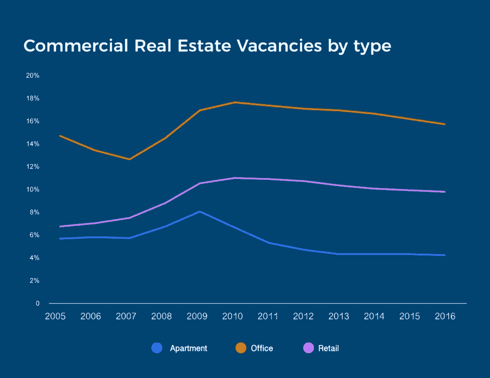
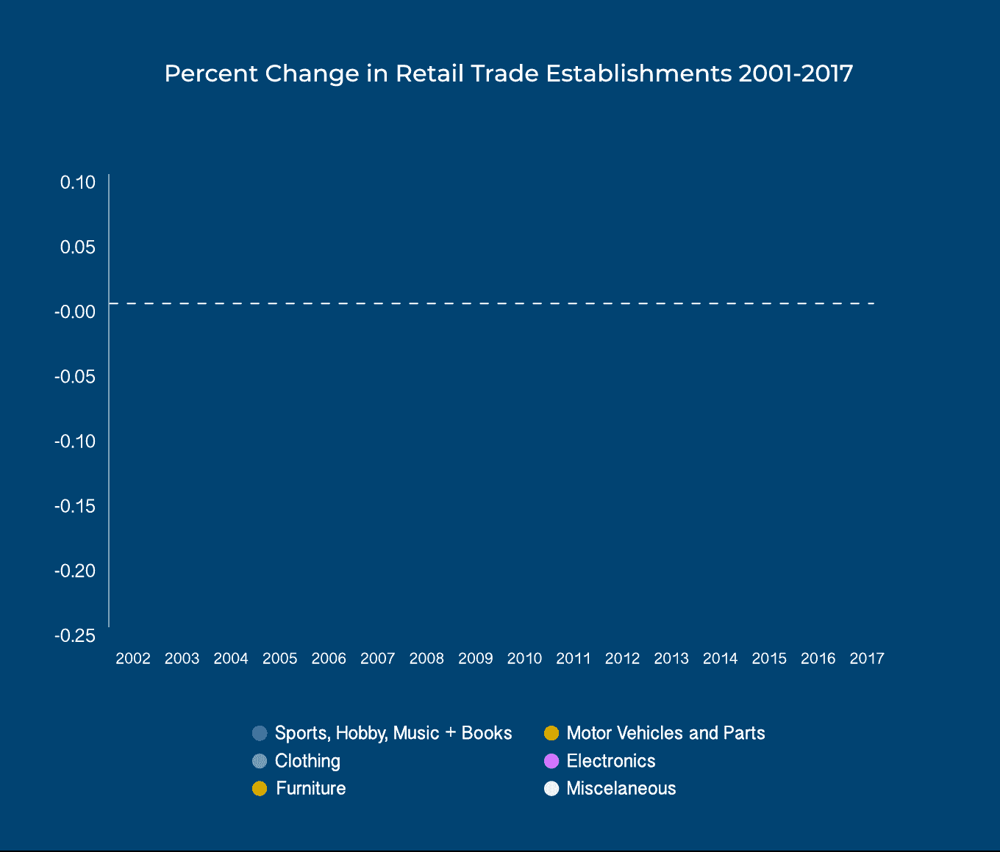
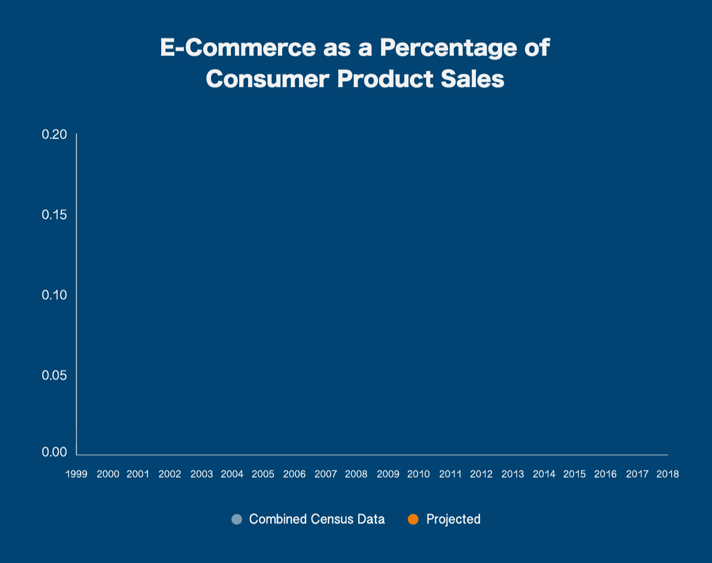
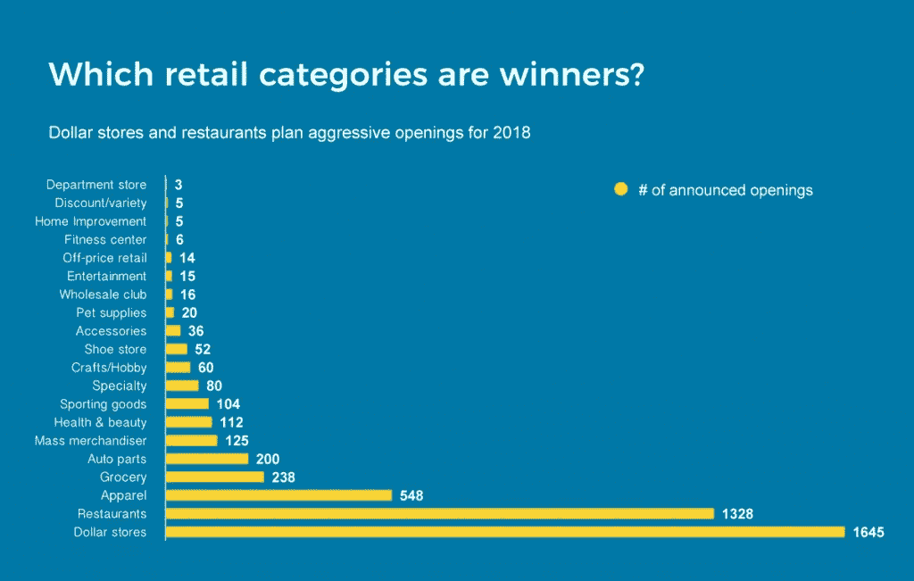
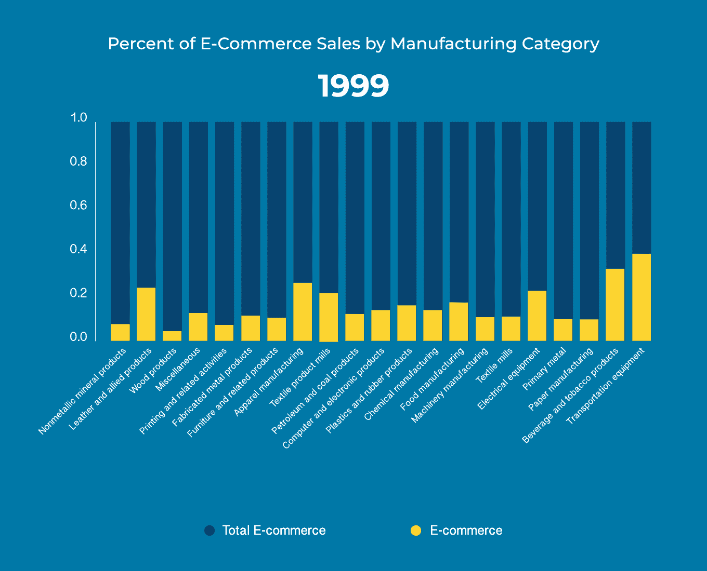
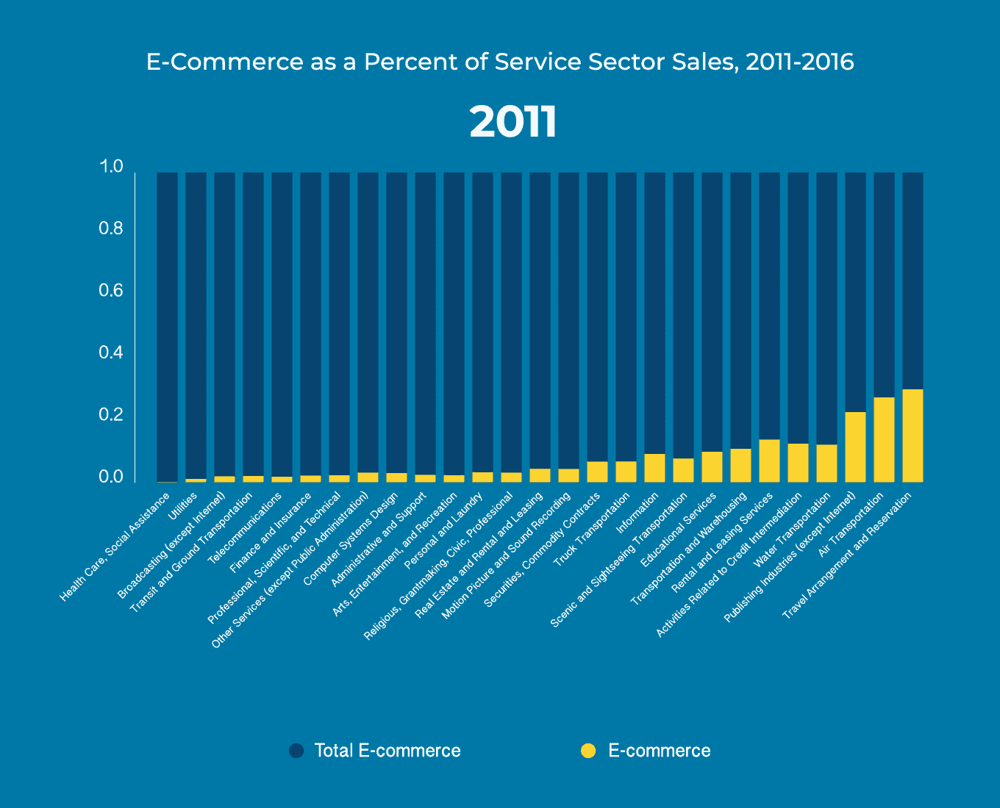
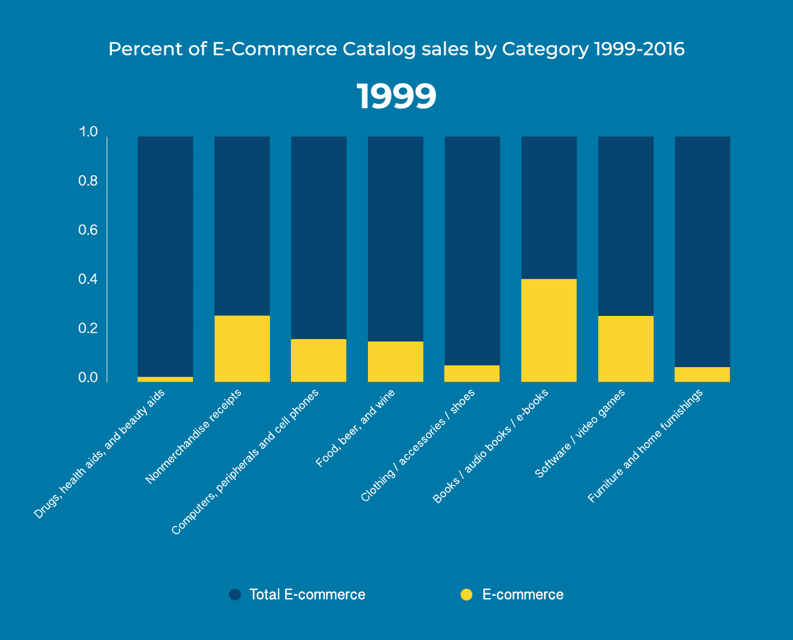

# 电商正在(几乎)吃掉一切。这是它的意思。

> 原文：<https://towardsdatascience.com/e-commerce-is-eating-almost-everything-heres-what-that-means-90d7328efc49?source=collection_archive---------28----------------------->

美国人口普查局的新数据显示，现代人对点击购物的喜爱正在增长。与此同时，商品目录正在减少，零售店面正在萎缩，美国就业市场的前支柱正在严重衰退。

各个行业的情况并不一致。经济的某些部分继续抵制互联网的邀请——尽管当你读这篇文章时，这种情况可能正在改变。

我们深入研究了人口普查局发布的[数据以及其他相关数据，以调查美国电子商务的现状，以及这对美国公民意味着什么。这是我们的发现。](https://www.census.gov/newsroom/press-releases/2018/estats-report.html)

# 电子商务悄然兴起

消费者仍然亲自购买他们的大部分产品，但是电子商务已经取得了重大进展。根据零售和目录销售(包括在线目录)的综合数据，2016 年消费者在网上花费了 13.5%的产品美元。

如果当前的电子商务趋势继续下去，2018 年在线购买将占所有消费品购买的近 17%，并可能主导一些子市场。2016 年，网购占业余爱好购买的 32%，包括书籍、玩具、体育用品和乐器。

这与 1999 年占消费者购买量不到 2%的电子商务相比是一个巨大的变化，这种快速变化与零售业的巨大变化相对应。

# 零售启示录

虽然网上购物让生活变得更容易，让消费者可以舒舒服服地坐在沙发上(和睡衣)点任何他们想要的东西，但所有重大的经济变革都有受害者。随着亚马逊和其他主要在线零售商的崛起，他们留下了实体零售连锁店的废墟，如 Borders，Blockbuster 和最近的[玩具反斗城](http://www.businessinsider.com/amazon-walmart-target-killed-toys-r-us-2018-3)。

更多的传统零售商可能会及时倒下。虽然梅西公司的股票自 2018 年初以来已经恢复了大约 50%，但该公司 6 月份每股 40 美元的高点与其 2015 年每股 72 美元的[高点相比相形见绌。与此同时，自 2017 年 12 月以来，西尔斯(也拥有 K-Mart)的股价一直低于每股](https://www.google.com/search?biw=1279&bih=722&tbm=fin&ei=i60eW7CpC83CzgLzkYyAAg&stick=H4sIAAAAAAAAAONgecRoyi3w8sc9YSmdSWtOXmNU4-IKzsgvd80rySypFJLgYoOy-KR4uLj0c_UNzKtyisqKeQDUEIrYOgAAAA&q=NYSE%3A+M&oq=mac&gs_l=finance-immersive.1.0.81l3.1111774.1111971.0.1113790.3.3.0.0.0.0.129.324.1j2.3.0....0...1.1.64.finance-immersive..0.3.324....0.Zt2uymnX_Bo#scso=uid_5rEeW7HhA4uV5wKDlafoDw_5:0)4 美元的[。随着世界上最大的在线零售商进军汽车维修领域，这个曾经的零售巨头已经被压低到](https://www.google.com/search?biw=1279&bih=722&tbm=fin&ei=5rEeW7HhA4uV5wKDlafoDw&q=sears&oq=sears&gs_l=finance-immersive.3..81l3.107323.108248.0.108602.5.5.0.0.0.0.101.423.4j1.5.0....0...1.1.64.finance-immersive..0.5.421....0.uMoFFTduLc0#scso=uid_U7MeW_7IFcTAzgK4y7QI_5:0)[与亚马逊](https://www.marketwatch.com/story/sears-shares-spike-after-announcing-tire-partnership-with-amazon-2018-05-09)合作的地步。

虽然分析师和评论员认为这些公司都是因为公司领导而不是电子商务而苦苦挣扎，但电子商务不可否认是它们压力的一部分。

# 专家对电子商务趋势的看法

随着实体零售商的消亡或缩减规模，它们的衰落对购物中心产生了残酷的影响。

哥伦比亚商学院(Columbia Business School)教授、包括西尔斯加拿大(Sears Canada)在内的几家零售品牌的前首席执行官马克·科恩(Mark Cohen)在一次采访中告诉我们，美国有大约 230 家顶级购物中心“不仅在生存，而且在蓬勃发展。”

然而，在顶级公司之外，许多公司都在苦苦挣扎。

瑞士瑞信银行在 2017 年报告称，预计到 2022 年，全国 1211 家购物中心中有多达四分之一将[关闭。很多](http://money.cnn.com/2017/06/02/news/economy/doomed-malls/index.html?iid=EL)[已经有了](http://www.businessinsider.com/american-retail-apocalypse-in-photos-2018-1#it-was-temporarily-used-by-religious-congregations-who-held-services-in-old-stores-in-september-2017-amazon-announced-plans-to-build-a-17-million-square-foot-fulfillment-center-in-its-place-3)。在一个特别具有讽刺意味的案例中，亚马逊买下并拆除了一个[克里夫兰地区的购物中心](http://www.crainscleveland.com/article/20170928/news/137036/amazon-makes-euclid-warehouse-go)，代之以一个履行中心。这一趋势使得西蒙地产集团的股票大幅贬值，该集团拥有超过 130 家购物中心。

科恩说，在网络购物成为主要因素之前，今天失败的购物中心通常会将市场份额输给更新或更好的购物中心。他们仅靠一两家主要零售商和一小群专卖店勉强维持微薄的收入。但互联网时代迫使锚店缩减规模，导致本已疲软的商场关门。

# 固定轴环绕

科恩说，一些购物中心的业主试图通过安装健身房或攀岩墙，将他们的物业改造成“生活方式购物中心”。“一些二级商场正在实现这一目标，但很少，因为这需要大量投资。”科恩告诉我们。其他购物中心租用了呼叫中心、紧急医疗诊所、疗养院或社区大学的空间。

科恩说:“在很大程度上，他们基本上正在慢慢倒闭。”。“一个空置量越来越多的购物中心越来越像一家空荡荡的餐厅，这是许多人不想去的地方。”

随着房东收取的租金越来越少，他们也不太愿意在草坪护理或更换停车场坏灯等基本维护上投资。

科恩说:“购物中心呈现出‘不要去那里’的特点。然后它关闭，成为景观上的一个污点，损害当地经济，使当地社区迫切需要某种东西——任何东西——来取代它。

# 商业房地产卷轴

尽管这种损害在购物中心最为明显，但电子商务的兴起与零售地产的疲软有着明显的关联。

全国保险专员协会[在 2017 年](http://www.naic.org/capital_markets_archive/170601.htm)报告称，在 2009 年至 2016 年期间，约有 10%的零售物业处于空置状态。国家房地产投资者公布的数据[显示，商业地产的估值正在趋于平稳——特别是在中央商务区，PNC 房地产研究公司的数据显示，自 2015 年初](http://www.nreionline.com/finance-investment/latest-readings-show-commercial-property-prices-continuing-moderate)以来，美国累计关闭的商店多于开业的商店[。](https://www.bloomberg.com/graphics/2017-retail-debt/)

虽然在可预见的未来，美国似乎将继续失去实体零售点，但最糟糕的情况可能已经过去。总部位于芝加哥、专注于房地产行业的投资管理公司 JLL 表示，与 2017 年相比，2018 年的有效倒闭数量下降了 41%。

# 混合比

零售业的动荡改变了消费者可以进入的实体店的组合。根据美国劳工统计局的数据，美国零售商店的数量从 2008 年开始大幅下降。尽管零售商店自 2011 年以来有所恢复，但仍未达到 2001 年的数量，这是 BLS 有数据的最早年份。各个行业的复苏也不均衡。

与 2001 年相比，2017 年食品和饮料商店的数量增加了约 4%，而餐馆的数量增加了 33%。像沃尔玛这样的百货商店的数量增加了 45%以上。所有其他类型的零售商都看到自己的部门在萎缩——其中一些还急剧萎缩。电器商店、家具店、书店、体育和业余爱好商店以及杂货铺的数量都下降了至少 15%。

根据 JLL 公布的数据，这一趋势可能会继续，甚至可能会加速。在 2018 年 3 月的一次展示中，该公司表示，预计 2018 年开设的餐厅(1328 家)和一元店(1645 家)将超过其他任何一种商店的总和。

841 家服装店关门最多。虽然这并不奇怪(时尚行业是出了名的不稳定)，但它们不会被取代。服装店关门比开张多 53%。

# 模糊界限

随着零售品牌努力保持相关性，它们已经整合了在线和面对面的存在，为客户提供更大的灵活性。梅西百货和其他商店已经推出了他们所谓的“[点击并收集](https://www.cnbc.com/2016/01/13/like-it-or-not-click-and-collect-is-here-to-stay.html)”，让顾客在网上购买产品，然后几个小时后在附近的商店取走。

科恩说，本质上，这些零售商把他们的商店作为一个履行网络。但不清楚这种做法对他们的底线有多大帮助，如果有的话。

他说，点击收集“非常昂贵”，因为它“完全违背了商店的组织方式。”商店支付人工成本，让一名工人先把产品搬到展示区，然后让另一名工人把它们放在旁边的房间里。

科恩说，商店希望点击收取顾客在他们访问期间购买其他东西，但不清楚这种情况发生的频率。他说，零售品牌对这些计划的成功一直讳莫如深，但值得注意的是，梅西百货[在 2017 年关闭了 68 家门店](https://parade.com/537063/sphillips/macys-releases-list-of-stores-closing-in-2017/)，而[将在 2018 年再关闭 11 家](https://clark.com/shopping-retail/major-retailers-closing-2018/)。

快餐连锁店也加入了“点击领取”的潮流。星巴克在 2015 年推出了[移动点餐](https://news.starbucks.com/news/starbucks-mobile-order-pay-now-available-to-customers-nationwide)，允许顾客在短暂逛店取咖啡前在线点餐和支付。Dunkin Donuts 在 2016 年通过他们的 DD Perks 应用程序推出了类似的选项，麦当劳在 2017 年跟风。

# 弹出式零售

一些品牌，包括[耐克、Birchbox 和 Kanye West](https://www.insider-trends.com/top-50-pop-up-stores/) ，已经把实体店变成了他们自己的活动。弹出式商店在一个特定的地方短时间内提供独家商品。

科恩说，弹出式商店为新企业表达和建立品牌提供了一个很好的机会，但它们也代表了一个病态零售生态系统的另一个症状。这些商店通常出现在长期休眠的零售空间，科恩说，房东大幅折扣弹出式租金，甚至可能免费提供空间。

科恩说:“房东的存在是一个空商店。

具有讽刺意味的是，[易贝](http://www.dailymail.co.uk/sciencetech/article-3982264/Is-future-shopping-eBay-pop-shop-tells-Christmas-presents-buy-based-facial-reactions.html)，[亚马逊](https://www.amazon.com/b/ref=s9_acss_bw_cg_FYS_3c1_w?node=14303222011&pf_rd_m=ATVPDKIKX0DER&pf_rd_s=merchandised-search-2&pf_rd_r=091BQKWHWWW6TED0TY5G&pf_rd_t=101&pf_rd_p=486f4087-ceb1-4474-9c15-84a4cb56cce1&pf_rd_i=17608448011)， [Etsy](https://www.etsy.com/pages/dossier) 和其他网络零售商都在黄金地段开设了华丽的弹出式商店。因此，正是那些造成零售地产疲软的品牌找到了直接从中受益的方法。

# 整个经济领域的电子商务趋势

虽然电子商务对零售业的影响最为明显，但在线平台仍在侵蚀经济的各个方面。

根据人口普查报告，2016 年近 65%的制造订单是在线处理的，高于 1999 年的 18%。基于制造业的电子商务在 2016 年的出货量为 3.5 万亿美元，实际上让零售电子商务相形见绌。

该部门采用电子商务的部分原因是其业务关系的性质。当企业对企业的客户定期订购同样的东西时，人类处理交易的优势会迅速减少。消费者也基本上看不到这种变化，他们通常只看到成品。

随着我们越来越接近消费者，电子商务变得不那么流行了。电子商务占制造商销售分支和办事处销售额的 46.2%，占所有其他商业批发商总销售额的 27.2%。2016 年，商店货架上的大多数产品仍然是通过电子商务平台以外的途径到达那里的。

# 自助服务

经济中的服务部门仍然对电子商务的入侵具有惊人的抵抗力。根据人口普查数据，只有 4.2%的服务销售是通过在线平台进行的。

然而，某些服务部门比其他部门更容易接受在线平台。基于电子商务的平台在航空运输部门以及旅行安排和预订部门取得了重大进展。

# 抗药性

尽管 WebMD 和其他专注于健康和保健的网站盛行，但健康和保健部门一直抵制电子商务的影响。

根据人口普查数据，即使在目录渠道，2016 年也只有 23%的药物、健康辅助设备和美容辅助设备是在网上购买的——而与此同时，健康相关产品的购买在所有渠道都有所增长。

这种脱节吸引了科技初创企业和科技巨头的注意。【2017 年 8 月，亚马逊推出了一系列药房基本药物，包括布洛芬、泻药和抗过敏药物。此举引发了连锁药店 Rite-Aid、Walgreens 和 CVS 投资者的不安，他们担心亚马逊可能会成为下一个进入处方药游戏的公司。

这种易激动是恰当的。2018 年 6 月 28 日，[亚马逊以不到 10 亿美元的价格收购了 PillPack](https://techcrunch.com/2018/06/28/amazon-buys-pillpack-an-online-pharmacy-that-was-rumored-to-be-talking-to-walmart/) 。这家总部位于波士顿的初创公司将药丸(包括处方药和维生素)预先分类并包装到一卷塑料袋中。到了下一次服药的时间，顾客拿出下一个袋子，撕开它，然后服药。到了续杯的时候，[药丸包](https://www.pillpack.com/how-it-works)会给保险公司开账单，然后送货上门。

PillPack 在这个领域并不孤单。总部位于纽约市的创业胶囊公司还将处方药送到顾客家中，并自动处理医生和保险公司的配药。虽然 Capsule 还没有被更大的公司收购，但它正在成长；根据 LinkedIn 的数据，自 2016 年以来，该公司的员工人数增加了两倍多。

# 缩小:互联网和通货膨胀

除了让消费者更容易获得他们想要的产品，电子商务可能对日常生活产生更大和更广泛的影响:保持低价。

国际货币基金组织(International Monetary Fund)发表的一篇 2017 年[论文](https://www.imf.org/~/media/Files/Conferences/2017-stats-forum/session-3-coffinet.ashx)得出结论，互联网销售在短期内缓解了通胀——尽管作者不确定互联网将如何长期影响通胀。

导致这种情况的影响错综复杂，但归结起来主要有两点:

1.  电子商务让顾客更容易比较价格，这也让零售商更难提价。
2.  电子商务减少了对昂贵的物理基础设施的需求，这使得在线零售商能够保持低价。

虽然低通胀对购物者来说是好事，但对工人来说并不总是好事。随着商店关门或削减成本，零售业的工作机会正在减少。趋势如此糟糕，以至于纽约市服装店的零售人数已经连续四年下降[。考虑到该市人口在 2010 年至 2017 年间增长了 5.5%(T5)，这一下降尤为显著。](https://fred.stlouisfed.org/series/SMU36935614244810001A)

# 包裹

电子商务趋势大大小小地改变了我们的生活。它阻止了产品价格的攀升，但也削弱了美国经济长期依赖的部门。

目前，这一趋势没有停止的迹象。即使亚马逊开设了实体店，传统的小盒子零售的需求仍在继续减少。可能的结果似乎是一个购物中心更少、精品店更少、沃尔玛、一元店和餐馆更多的世界。

*本帖* [*原版*](http://blog.visme.co/ecommerce-trends/) *最早出现在 Visme 的* [*视觉学习中心*](http://blog.visme.co/) *。*