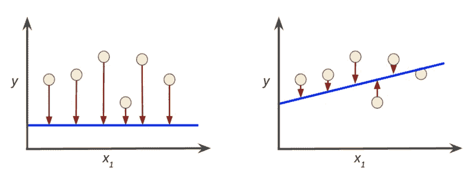
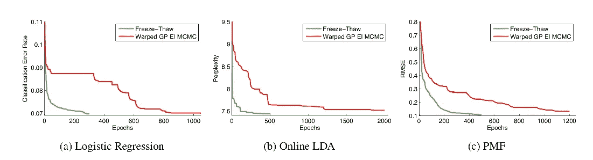

# 提前停止

> 原文：<https://towardsdatascience.com/early-stopping-2f92c29ce0ae?source=collection_archive---------11----------------------->

有时候不值得走到最后，尤其是在超参数调优中

M ost 机器学习模型具有由用户固定的超参数，以便在底层数据集上构建这些模型的训练。例如，在训练随机森林时，您需要指定树的深度和数量(以及其他超参数)。还有许多其他的[【真实世界】](/demystifying-hyper-parameter-tuning-acb83af0258f)超参数的例子。一旦设置了超参数，模型的训练就可以用标准的优化器如梯度下降来处理。指定不当的超参数会导致更长的训练时间或有偏差的模型。所选超参数的质量通常是在一个公开的测试数据集上测量的。

[贝叶斯优化](/the-intuitions-behind-bayesian-optimization-with-gaussian-processes-7e00fcc898a0)是一种旨在尽可能少的迭代中识别最佳超参数的方法，但每次迭代都需要在评估超参数的质量并进入下一次迭代之前完成给定超参数配置的模型训练。在许多超参数调优问题中，数据科学家可能在训练结束(或开始)之前就知道某些配置不会产生很好的结果！).在本文中，我们将研究一种叫做冻融的方法，它将贝叶斯优化中超参数调整的 ***【提前停止】*** 系统化。因此，这种方法可以更有效地利用超参数调优中的计算资源，并减少整体调优时间。

# 冻融贝叶斯优化

> [冻融](https://arxiv.org/pdf/1406.3896.pdf)使用在训练机器学习模型的过程中获得的部分信息，以便决定是否暂停训练并开始新的模型，或者恢复先前考虑的模型的训练。

在模型训练期间提供的部分信息实质上是模型的训练损失，其指示模型对训练数据的预测有多差。一个例子是均方误差，它是每个例子的平均平方损失，由以下公式给出:

例如，线性回归的最佳权重使损失最小化，这就是为什么在图 1 中，损失比第二种情况高得多(并且模型差得多)。

Figure 1: loss of the trained model (red) for linear regression models (blue) trained on data points (yellow)([source](https://developers.google.com/machine-learning/crash-course/descending-into-ml/training-and-loss))

冻融的工作原理是假设大多数机器学习模型的训练损失大致遵循朝向未知最终值的指数衰减。这种假设被编码在他们的贝叶斯优化方法的先验中，这允许他们预测部分训练模型的最终结果。

更简单地说:

*   贝叶斯优化为我们正在优化的底层函数构建了一个代理模型
*   在这种情况下，这是一个高斯过程，通过观察函数值和预测域的其他点来建立。
*   在冻结-解冻 BO 中，来自模型训练的部分信息用于预测最终损失，然后将最终损失纳入替代模型
*   换句话说，代理模型是对模型训练结束时的预测

一旦已经预测了替代物，贝叶斯优化策略适于“打包”一篮子 **B = B_old + B_new** 候选模型，这些模型已经用不同的超参数值进行了部分训练或者没有进行训练。然后，贝叶斯优化程序将确定尝试哪些新配置以及恢复哪些“冻结”配置。更详细的解释可以在他们的[论文](https://arxiv.org/pdf/1406.3896.pdf)中找到。

在众所周知的问题上，冻融法相对于其他贝叶斯优化方法的性能增益如图 2 所示。

FT vs GP EI MCMC on MNIST (a), LDA (b), PMF/Movie Lens (c)

收益是显著的，但是严重依赖于训练损失遵循指数衰减的假设。这项工作的扩展可以研究这个假设不成立的模型。提前停止是 [Mind Foundry](http://mindfoundry.ai) 的一个重要研究领域，很快将在我们的贝叶斯优化 API[opta as](https://optaas.mindfoundry.ai)中实现。

【**更新**:我开了一家科技[公司](http://www.legislate.tech)。您可以在此了解更多

1: K .斯维斯基、j .斯诺克和 R. P .亚当斯。冻融贝叶斯优化。 [arXiv:1406.3896](https://arxiv.org/abs/1406.3896) 【统计。ML]