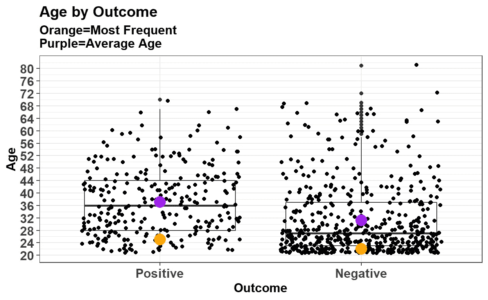
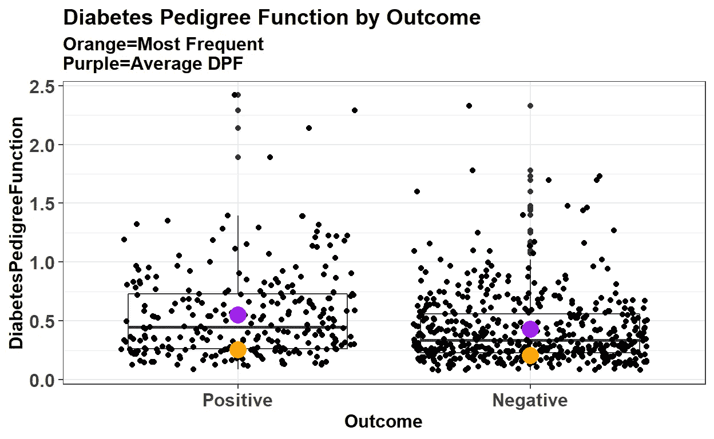

# 数据保留:处理带有许多缺失值和少于 1000 个观察值的数据

> 原文：<https://towardsdatascience.com/easy-data-science-with-r-and-python-diabetes-among-the-pima-indians-an-exploratory-analysis-d7bc321d0fa7?source=collection_archive---------7----------------------->

当前项目中使用的数据包含皮马印第安人后裔妇女中二型糖尿病的一些诊断方法，以及该个体是否患有二型糖尿病。数据集是在([https://www.kaggle.com/uciml/pima-indians-diabetes-database](https://www.kaggle.com/uciml/pima-indians-diabetes-database))从 Kaggle 获得的。总共有 768 个观察值和 9 个变量。数据集中的变量有:

*   怀孕
*   葡萄糖——2 小时口服葡萄糖耐量试验后的血浆葡萄糖浓度。
*   血压——舒张压(毫米/汞柱)。
*   皮肤厚度——三头肌的皮褶厚度(毫米)。
*   胰岛素— 2 小时血清胰岛素(μU/ml)。
*   身体质量指数——身体质量指数(千克/平方米)
*   DiabetesPedigreeFunction——基于家族史确定二型糖尿病风险的函数，函数越大，二型糖尿病风险越高。
*   年龄。
*   结果—此人是否被诊断为二型糖尿病(1 =是，0 =否)。

# 预处理

```
library(readr) 
library(tidyverse) 
library(dplyr) 
library(knitr) 
```

# 概观

```
glimpse(Diabetes)Observations: 768 Variables: 9 
$ Pregnancies <int> 6, 1, 8, 1, 0, 5, 3, 10, 2, 8, 4... 
$ Glucose <int> 148, 85, 183, 89, 137, 116, 78, ... 
$ BloodPressure <int> 72, 66, 64, 66, 40, 74, 50, 0, 7... 
$ SkinThickness <int> 35, 29, 0, 23, 35, 0, 32, 0, 45,... 
$ Insulin <int> 0, 0, 0, 94, 168, 0, 88, 0, 543,... 
$ BMI <dbl> 33.6, 26.6, 23.3, 28.1, 43.1, 25... 
$ DiabetesPedigreeFunction <dbl> 0.627, 0.351, 0.672, 0.167, 2.28... $ Age <int> 50, 31, 32, 21, 33, 30, 26, 29, ... 
$ Outcome <int> 1, 0, 1, 0, 1, 0, 1, 0, 1, 1, 0,...
```

# 类型转换

## 因素

结果变量需要转换成分类变量。在不久的将来，它将被订购用于分析目的。

```
Diabetes$Outcome <- as.factor(unlist(Diabetes$Outcome)) Diabetes$Outcome <- factor(Diabetes$Outcome, levels=c("1", "0"),           labels = c("Positive", "Negative")) summary(Diabetes$Outcome)Positive Negative 268 500
```

我们可以看到没有患糖尿病的人几乎是患糖尿病的人的两倍。虽然目标变量的行数没有统一的界限，但这应该足够了。

我们只需要确保你的模型有足够的数据来学习如何区分这两者。

## 数字的

以下变量:

`* Glucose`

`* BloodPressure`

`* SkinThickness`

`* Insulin`

`* BMI`

需要从其当前整数类转换为数值变量。这些变量具有十进制值，如果没有这些值，可能会产生误导性的结果，并扭曲这些医学测试所代表的特定风险范围。

```
Diabetes$Glucose <- as.numeric(Diabetes$Glucose) Diabetes$BloodPressure <- as.numeric(Diabetes$BloodPressure) Diabetes$SkinThickness <- as.numeric(Diabetes$SkinThickness) Diabetes$Insulin <- as.numeric(Diabetes$Insulin) Diabetes$BMI <- as.numeric(Diabetes$BMI) Diabetes$Age <- as.integer(Diabetes$Age)
```

# 处理缺失值

数据集中 6/9 的变量有许多零标记。在分别对每一列和每一行求和后，数据集中似乎有 763 个零值。令人担忧的是，这几乎代表了我们 100%的观察结果。

```
list( Column = colSums(Diabetes==0), 
        Row = sum(rowSums(Diabetes==0)) )$Column 
Pregnancies 111
Glucose 5 
BloodPressure 35 
SkinThickness 227 
Insulin 374 
BMI 11 
DiabetesPedigreeFunction 0
Age 0 
Outcome 0 $Row 
[1] 763
```

# 怀孕

值“0”不一定意味着它是缺失值。例如:*一名妇女的怀孕记录为零，因为这名妇女没有怀孕。*

这是一个例子，说明在对数据进行丢失值的预处理时，您必须非常小心。零不代表它不见了。然而，除了这一点，零值在传递给机器学习模型时可能会产生问题。当变量为零时，像回归这样的技术可以给你一个输出的估计。另一种处理零的方法是绑定变量，然后创建一个分类变量。

`Diabetes$Pregnancies <- ifelse(Diabetes$Pregnancies==0, "No", "Yes") %>% factor()`

> `summary(Diabetes$Pregnancies)`
> 
> `No Yes 111 657`

# 胰岛素

胰岛素中 50%的行具有 0 值。让我们从实际的角度来看它。有时身体产生很少或没有胰岛素，这是 1 型糖尿病的一个迹象。但我怀疑这一次是不是这样。胰岛素对于糖尿病来说是一个非常重要的变量，但是当一个变量充满了缺失值时，你就必须采取措施了。你可以只是估算这些值，但这是医学数据，有一半的值是缺失的。在我看来，仅仅用它的意思来估算行是不合适的。这就是为什么再重要也要**去掉**的原因。这是你需要做出艰难抉择的时候之一。

```
Diabetes$Insulin <- NULL 
```

# 表皮厚度

对于`SkinThickness`也可以这么说。31%的行的值为 0。实际上，一个人怎么可能有 0 毫米厚的皮褶。这个变量也没有给我们太多的用处。因此，我也将删除这个变量。

```
Diabetes$SkinThickness <- NULL 
```

# 身体质量指数

身体质量指数可以补充其各自的肥胖标准范围。身体质量指数只有 11 0 个值，所以预计不会引起太多麻烦。如果它高得多，宁滨不会真正解决问题，因为分配的 bin 可能不是正确的 bin。

`Diabetes$BMI <- ifelse(Diabetes$BMI<19,"Underweight", ifelse(Diabetes$BMI>=19 & Diabetes$BMI<=25, "Normal", ifelse(Diabetes$BMI>=25 & Diabetes$BMI<=30, "Overweight","Obese"))) %>% factor(levels=c("Underweight","Normal", "Overweight","Obese"))`

> `list(BMI = summary(Diabetes$BMI))`
> 
> `$BMI Underweight Normal Overweight Obese
> 15 108 180 465`

现在我看到`Underweight`有 15 行，这意味着有 15 行的身体质量指数小于 19，并且知道`BMI`有 11 个零值，我们知道大多数行都是零。因为太少了，所以我选择留着它。此外，我们已经删除了两个变量，我想保留尽可能多的数据，同时确保它可以增加价值。

# 葡萄糖

对于 2 小时的“口服葡萄糖耐量试验”(OGTT)，如果在进行该试验 2 小时后，患者的水平低于 7.8 mmol/L，则认为患者没有糖尿病。为了对葡萄糖耐量水平进行分类，我们将使用以下标准:

```
* Hypoglycemia (Low Blood Sugar) - <2.2 mmol/L 
* Normal/No Diabetes - >=2.2 mmol/L - <=7.8mmol/L 
* Prediabetes (Hyperglycemia / High Blood Sugar) - >7.8 mmol/L - <=11.1 mmol/L 
* Diabetes - >11.1 mmol/L
```

**虽然其中一个级别说此人患有糖尿病，但这不是最终的糖尿病。其他因素也必须考虑在内。为了避免误导，这里的“糖尿病”是指 ANME 的检测结果，而不是二型糖尿病的最终诊断结果**

该数据集中 2 小时 OGTT 的测量单位假定为毫克/分升(mg/dl)。它可以转换成毫摩尔每升(mmol/l ),这样我们就可以将定性测试结果应用于数值结果。将当前结果乘以 0.0555 会将其转换为以毫摩尔/升为单位进行测量。

```
Diabetes$Glucose <- Diabetes$Glucose*0.0555Diabetes$Glucose <- if_else(Diabetes$Glucose<2.2,"Hypoglycemia", if_else(Diabetes$Glucose>=2.2 & Diabetes$Glucose<=7.8,"Normal", if_else(Diabetes$Glucose>7.8 & Diabetes$Glucose<=11.1, "Hyperglycemia","Diabetes"))) %>% factor()list( `Test Result` = summary(Diabetes$Glucose) )$`Test Result` 
Hyperglycemia Hypoglycemia Normal 
   192           5          571
```

似乎 74%的参与者具有正常的葡萄糖水平，25%的参与者具有糖尿病前期/高血糖症/高血糖。只有 1%的人有低血糖症。

我对低血糖的主要担忧是，当我通过机器学习过程时，该水平可能不会在 k 倍交叉验证中出现。在这一点上我不能肯定地说，但这是值得注意的，并在未来牢记在心。

# 血压

测量血压时，使用两种方法:

```
** Systolic - Measures the pressure in blood vessels when the heart beats. 
* Diastolic - Measures the pressure in blood vessels when the heart rests between beats.*
```

在该数据集中，仅报告了舒张压。这要求我们谨慎行事。

据疾病控制和预防中心报道，血压是用心脏收缩和心脏舒张单位来测量的。当它们被报道时，我们可以作出如下推论:

*   常态

*收缩压< 120mmHg，*

*舒张压< 80mmHg*

*   高血压前期

*收缩压> =120mmHg — < =139mmHg*

*舒张压> =80 — < =89mmHg*

*   高的

*收缩压:> =140mmHg*

*舒张压:> =90mmHg*

因为没有报道收缩压，所以我对这个变量感到不舒服。这是我的主观决定。

```
Diabetes$BloodPressure <- NULL
```

# 数字变量的可视化

# 年龄

```
ggplot(Diabetes, aes(y=Age, x=Outcome)) + 
geom_boxplot() + geom_jitter()+ theme_bw() + 
xlab("Outcome") + ylab("Age") + 
stat_summary(fun.y=mode, colour="Orange", geom="point", shape=16, size=5) + 
stat_summary(fun.y=mean, colour="purple", geom="point", shape=16, size=5) + 
ggtitle(label="Age by Outcome", subtitle = "Orange=Most Frequent\nPurple=Average Age") + 
theme(axis.text.x = element_text(face="bold",size=12), axis.text.y =       element_text(face="bold",size=12), title = element_text(face="bold",size=12), axis.title = element_text(face="bold",size=12)) + scale_y_continuous(breaks=seq(20,80,4))
```



这个变量中似乎有很多噪声。患糖尿病的年龄没有明显的区别。

# 糖尿病谱系功能

```
ggplot(Diabetes, aes(y=DiabetesPedigreeFunction, x=Outcome)) + geom_boxplot() + geom_jitter()+ 
theme_bw() + xlab("Outcome") + ylab("DiabetesPedigreeFunction") + stat_summary(fun.y=mode, colour="orange", geom="point", shape=16, size=5) + 
stat_summary(fun.y=mean, colour="purple", geom="point", shape=16, size=5) + ggtitle(label="Diabetes Pedigree Function by Outcome", subtitle = "Orange=Most Frequent\nPurple=Average Age") + theme(axis.text.x = element_text(face="bold",size=12), axis.text.y = element_text(face="bold",size=12), title = element_text(face="bold",size=12), axis.title = element_text(face="bold",size=12)) + scale_y_continuous(breaks=seq(0,3,0.5))
```



Scatter Plot of the Diabetes Pedigree Function with the average and most frequent amount

有趣的是，`Diabetes Pedigree Function`似乎没有给出糖尿病结果的清晰图像。这应该是一个分数，分数越高，你越有可能患有糖尿病。这也是一个有很多噪音的变量。

# 分类变量(占结果的百分比)

# 怀孕

```
(pregnant <- table(Diabetes$Pregnancies, Diabetes$Outcome, dnn = c("Pregnant", "Outcome")) ) Outcome 
Pregnant  Positive Negative  
No         38       73
Yes        230     427pregnant %>% prop.table(2) %>% round(2) %>% kable(format = 'html') Positive Negative  
No      0.14    0.15 
Yes     0.86    0.85
```

怀孕似乎并不一定会增加患糖尿病的几率，因为患或没患糖尿病的女性中至少有一次怀孕的比例是相同的。

# 肥胖

```
(bmi <- table(Diabetes$BMI, Diabetes$Outcome, dnn = c("BMI", "Outcome")) ) Outcome 
BMI           Positive Negative 
Underweight      2      13 
Normal           7      101 
Overweight       44     136 
Obese           215     250bmi %>% prop.table(2)%>% round(2) %>% kable(format = 'html') Positive  Negative 
Underweight      0.01       0.03 
Normal           0.03       0.20 
Overweight       0.16       0.27 
Obese            0.80       0.50
```

毫不奇怪，80%的糖尿病女性肥胖，16%超重。据报道，只有 3%的人体重正常。在没有糖尿病的女性中，50%肥胖，27%超重，20%正常。

# 葡萄糖

```
(glucose <- table(Diabetes$Glucose, Diabetes$Outcome, dnn = c("Glucose Level", "Outcome")) ) Outcome 
Glucose Level    Positive Negative 
Hyperglycemia      132       60 
Hypoglycemia        2         3 
Normal             134       437glucose %>% prop.table(2) %>% round(2) %>% kable(format = 'html') Positive Negative 
Hyperglycemia     0.49     0.12 
Hypoglycemia      0.01     0.01 
Normal            0.50      0.87
```

49%的女性糖尿病患者高血糖呈阳性，50%的女性血糖水平正常。令人惊讶的是，葡萄糖水平似乎不能清楚地区分糖尿病患者。显然，高血糖症患者更有可能患有糖尿病，但根据上表，其程度非常低。

不出所料，87%没有糖尿病的女性血糖水平正常。

# 最终数据

```
summary(Diabetes)Pregnancies 
 No :111
 Yes:657Glucose 
 Hyperglycemia:192
 Hypoglycemia : 5
 Normal :571BMI 
Underweight: 15 
Normal :108 
Overweight :180 
Obese :465 DiabetesPedigreeFunction 
 Min. :0.0780
 1st Qu.:0.2437
 Median :0.3725
 Mean :0.4719
 3rd Qu.:0.6262
 Max. :2.4200Age 
 Min. :21.00
 1st Qu.:24.00
 Median :29.00
 Mean :33.24
 3rd Qu.:41.00
 Max. :81.00 Outcome 
 Positive:268 
 Negative:500 
```

在我接下来的文章中，我使用这个数据集来创建一个决策树分类器。

> 如果您有任何问题或顾虑，请发表评论进行讨论，我邀请任何对此感兴趣的人加入。谢谢你

原文可以在我的博客中找到:[用 R 和 Python 实现简单的数据科学](https://easydsrp.com/posts/2018-11-06-diabetes-among-the-pima-indians-an-exploratory-analysis/)