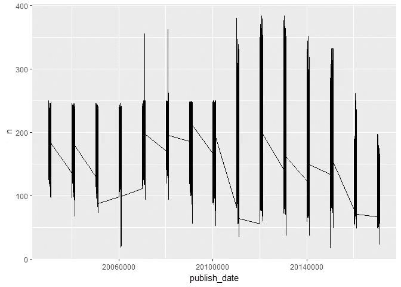
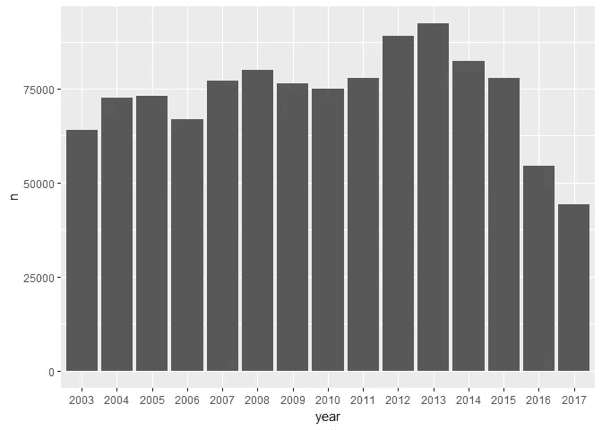
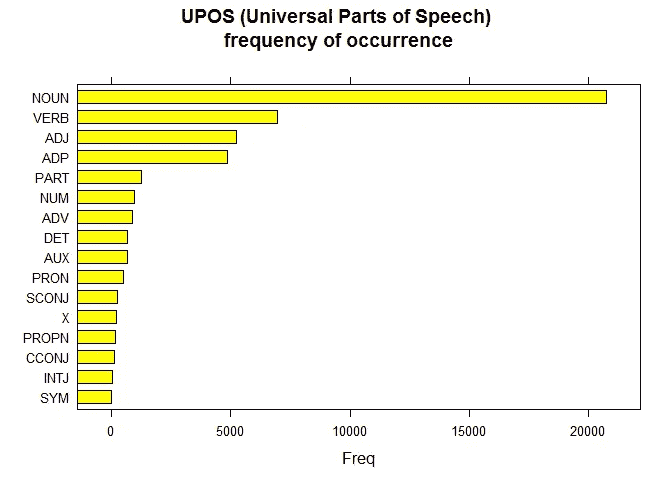
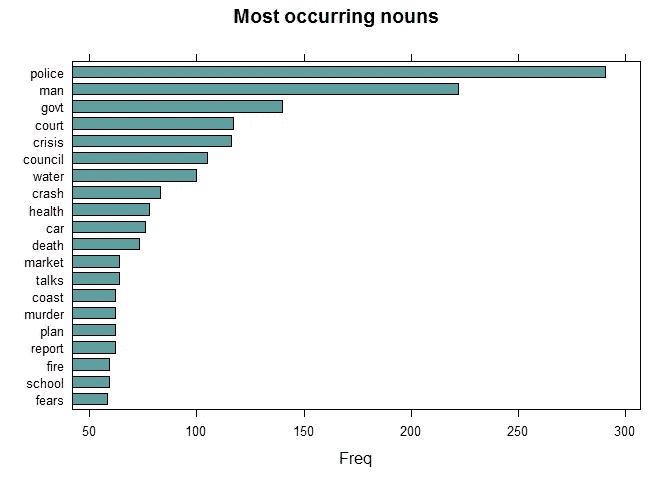
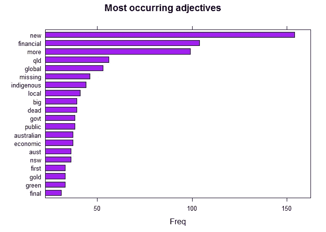
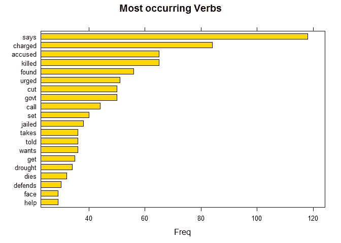
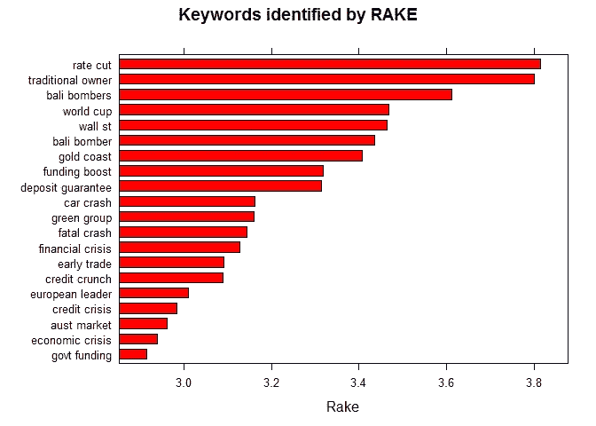
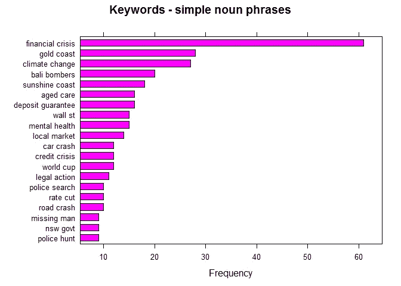

# 使用 Udpipe 简化 R 中的文本分析

> 原文：<https://towardsdatascience.com/easy-text-analysis-on-abc-news-headlines-b434e6e3b5b8?source=collection_archive---------4----------------------->


Courtesy: [https://pixabay.com/en/news-daily-newspaper-press-1172463/](https://pixabay.com/en/news-daily-newspaper-press-1172463/)

文本分析被视为数据分析的黑箱之一。这篇文章的目的是介绍这个简单易用但有效的 R 包`udpipe`用于文本分析。

# 关于 udpipe 包

[UDPipe](https://github.com/bnosac/udpipe) — R 包提供了*语言无关的*对原始文本的标记化、标注、词条化和依存解析，这是自然语言处理中必不可少的一部分。

# 输入数据集

这包括 ABC 网站在给定时间范围内发布的全部文章。每天 200 篇文章的量和对国际新闻的良好关注，我们可以相当肯定地说，每一个重大事件都在这里被捕获。这个数据集可以从 [Kaggle Datasets](https://www.kaggle.com/therohk/million-headlines) 下载。

# 摘要

加载基本摘要所需的包:

```
library(dplyr)
library(ggplot2)
```

了解已发表新闻文章的基本分布:

```
news <- read.csv('abcnews-date-text.csv', header = T, stringsAsFactors = F)news %>% group_by(publish_date) %>% count() %>% arrange(desc(n))## # A tibble: 5,422 x 2
## # Groups: publish_date [5,422]
##    publish_date     n
##           <int> <int>
##  1     20120824   384
##  2     20130412   384
##  3     20110222   380
##  4     20130514   380
##  5     20120814   379
##  6     20121017   379
##  7     20130416   379
##  8     20120801   377
##  9     20121023   377
## 10     20130328   377
## # ... with 5,412 more rows
```

试图了解标题出现的频率:

```
news %>% group_by(publish_date) %>% count() %>% ggplot() + geom_line(aes(publish_date,n, group = 1))
```



在我们继续执行文本分析之前，让我们将年、月和日分开

```
library(stringr)news_more <- news %>% mutate(year = str_sub(publish_date,1,4),
                        month = str_sub(publish_date,5,6),
                        date = str_sub(publish_date,7,8))
```

让我们看看数据按年份的分布情况:

```
news_more %>% group_by(year) %>% count()  %>% ggplot() + geom_bar(aes(year,n), stat ='identity')
```



# 预训练模型

Udpipe 包为各种语言(不是编程，而是口语)提供了预先训练的语言模型，我们可以使用`udpipe_download_model()`下载所需的模型

# 加载 R 包并准备好语言模型

```
library(udpipe)#model <- udpipe_download_model(language = "english")
udmodel_english <- udpipe_load_model(file = 'english-ud-2.0-170801.udpipe')
```

# 仅过滤 2008 年的数据

```
news_more_2008 <- news_more %>% filter(year == 2008 & month == 10)
```

# 注释 2008 年的输入文本数据

这是我们在`udpipe`中使用的第一个函数，用来开始我们的文本分析之旅。`udpipe_annotate()`采用语言模型并标注给定的文本数据

```
s <- udpipe_annotate(udmodel_english, news_more_2008$headline_text)x <- data.frame(s)
```

# 通用 POS

从给定文本中绘制词性标签

```
library(lattice)
stats <- txt_freq(x$upos)
stats$key <- factor(stats$key, levels = rev(stats$key))
barchart(key ~ freq, data = stats, col = "yellow", 
         main = "UPOS (Universal Parts of Speech)\n frequency of occurrence", 
         xlab = "Freq")
```



# 大多数出现的名词

既然我们已经有了带词性注释的课文，那就让我们来了解一下名词中最常见的词。

```
## NOUNS
stats <- subset(x, upos %in% c("NOUN")) 
stats <- txt_freq(stats$token)
stats$key <- factor(stats$key, levels = rev(stats$key))
barchart(key ~ freq, data = head(stats, 20), col = "cadetblue", 
         main = "Most occurring nouns", xlab = "Freq")
```



具有讽刺意味的是，仅仅在一个月内——2008 年 10 月 10 日——出现在报纸标题上的顶级名词没有一个带来乐观。

# 出现最多的形容词

很难找到一个不喜欢夸张的新闻机构，在英语中，你用形容词来夸大你的对象。所以，让我们来探索一下出现频率最高的形容词

```
## ADJECTIVES
stats <- subset(x, upos %in% c("ADJ")) 
stats <- txt_freq(stats$token)
stats$key <- factor(stats$key, levels = rev(stats$key))
barchart(key ~ freq, data = head(stats, 20), col = "purple", 
         main = "Most occurring adjectives", xlab = "Freq")
```



# 最常出现的动词

媒体的报道本质可以通过他们使用的动词的方式很好的理解。这些带来了乐观的迹象吗？还是仅仅注入了悲观情绪？动词的用法可以回答它们。

```
## NOUNS
stats <- subset(x, upos %in% c("VERB")) 
stats <- txt_freq(stats$token)
stats$key <- factor(stats$key, levels = rev(stats$key))
barchart(key ~ freq, data = head(stats, 20), col = "gold", 
         main = "Most occurring Verbs", xlab = "Freq")
```



有了像`charged`、`killed`、`drought`等等这样的词，看起来澳大利亚媒体对在公民中建立乐观心态并不感兴趣，就像任何典型的新闻机构都会寻找热点、热点、耸人听闻的新闻一样，它也这样做了。

# RAKE 自动关键词提取

是时候进行一些机器学习了，或者简单地说是算法。RAKE 是信息检索中提取关键词的最流行(无监督)算法之一。RAKE 是快速自动关键字提取算法的缩写，是一种独立于领域的关键字提取算法，它通过分析单词出现的频率及其与文本中其他单词的共现来尝试确定文本主体中的关键短语。

```
## Using RAKE
stats <- keywords_rake(x = x, term = "lemma", group = "doc_id", 
                       relevant = x$upos %in% c("NOUN", "ADJ"))
stats$key <- factor(stats$keyword, levels = rev(stats$keyword))
barchart(key ~ rake, data = head(subset(stats, freq > 3), 20), col = "red", 
         main = "Keywords identified by RAKE", 
         xlab = "Rake")
```



# 顶级名词——动词对作为关键词对

在英语中(或者可能在许多语言中)，简单的一个名词和一个动词可以组成一个短语。比如，**狗吠**——用名词`Dog`和`Barked`，我们可以理解句子的上下文。对这些标题数据进行逆向工程，让我们找出热门短语——也就是关键词/主题

```
## Using a sequence of POS tags (noun phrases / verb phrases)
x$phrase_tag <- as_phrasemachine(x$upos, type = "upos")
stats <- keywords_phrases(x = x$phrase_tag, term = tolower(x$token), 
                          pattern = "(A|N)*N(P+D*(A|N)*N)*", 
                          is_regex = TRUE, detailed = FALSE)
stats <- subset(stats, ngram > 1 & freq > 3)
stats$key <- factor(stats$keyword, levels = rev(stats$keyword))
barchart(key ~ freq, data = head(stats, 20), col = "magenta", 
         main = "Keywords - simple noun phrases", xlab = "Frequency")
```



众所周知的事实是，2008 年的金融危机不仅仅是美国市场的崩溃，而是全世界的热门话题，澳大利亚市场也不例外，这份分析将`Financial Crisis`列在首位，在几个话题之后是`Wall st`。

同样值得注意的是，这本杂志(尽管我们在上面已经看到它对突出负面新闻更感兴趣)帮助人们意识到甚至现任美国总统都不喜欢的`Climate Change`。

希望这篇文章能帮助你开始使用 R 语言进行文本分析，如果你想了解更多关于 Tidy 文本分析的知识，请查看 Julia Silge 的教程。这里使用的代码可以在 [my github](https://github.com/amrrs/text-analysis-with-udpipe) 上找到。