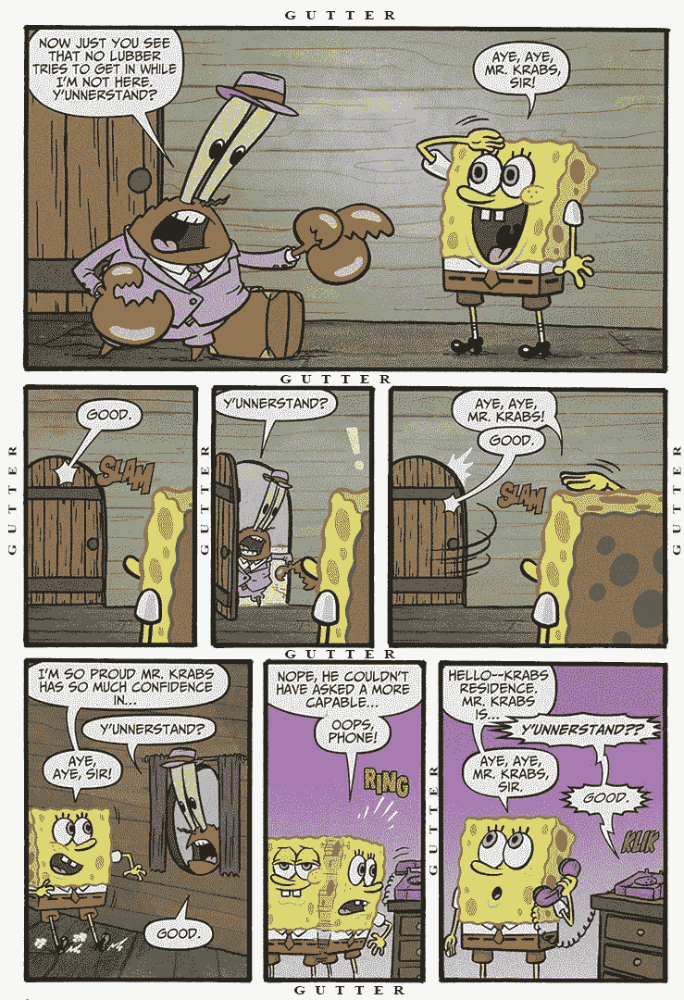
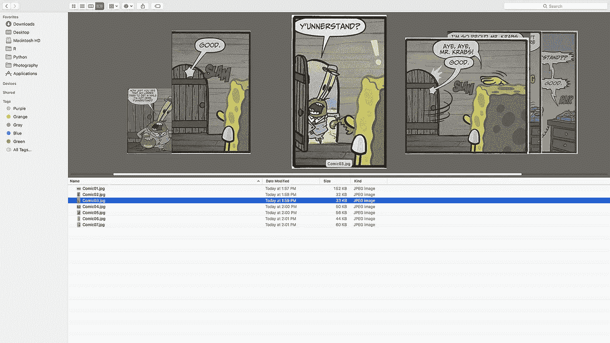

# 在手机上阅读漫画的简单方法:Python 3.6 和枕头

> 原文：<https://towardsdatascience.com/easy-way-to-read-comics-on-your-cellphone-python-3-6-and-pillow-104e0d38afbf?source=collection_archive---------8----------------------->

漫威还是 DC？超人还是蝙蝠侠？鸣人还是漂白剂？

所有这些都只与一件事有关…漫画！！！

当我们还是孩子的时候，总是有一种对漫画书的巨大热爱，翻开书页看到我们的英雄在行动是一种幸福。关于谁是最好的超级英雄的多次辩论，关于他们家族历史的严肃讨论，或者梦想自己拯救哥谭市，我们很多人都在童年创造了如此难忘的时刻。

时代过去了，但我们中的一些人仍然在寻找越来越多的漫画。在这个数字时代，人们可以轻松接入超高速互联网，随时随地阅读/下载自己喜欢的漫画书。然而，每当我们试图在手机上阅读漫画时，我们都会面临这样的问题:压缩页面中的每一帧，以便我们可以阅读帧中所写的内容。

每次你不得不这样做的时候，你不觉得有一种强烈的冲动，有能力削减每一帧，使其清晰和舒缓的眼睛吗？如果你的答案是“是”，并且你渴望学习 Python 中的新知识，那么这篇文章将帮助你在手机/平板电脑上轻松阅读漫画。



Spongebob Squarepants Comic(White parts have been labelled as “”GUTTER”)

我们来看看上面的《海绵宝宝》漫画。这张图片有 7 帧，如果我们将它们切片，我们将得到 7 张漫画的图片，可以在我们的手机上轻松阅读。输出在期望的位置保存为单独的图像，



Output: Individual frames images saved at desired location

在这里，我们将采取从上到下扫描图像的每一行的方法，然后绘制一幅黑白行的图片，白色用于装订线，黑色用于任何其他颜色。我们将再次从左和右列扫描图像，并绘制一张黑白图片。

这种方法将帮助我们获得每个帧的尺寸，然后将每个帧分别保存到我们的硬盘驱动器中。

我们将使用 Python v3.6 版和 PIL/Pillow(Python 图像库)包开发 Spyder v3.2 版。

## 软件要求

**Anaconda v 5.1
点击以下链接下载并安装 Anaconda for Windows、Mac
或 Linux。**

[](https://www.anaconda.com/download/) [## 下载

### 下载 1，000 多个 Python 和 R 数据科学包的 Anaconda 发行版，一个包、环境和依赖项…

www.anaconda.com](https://www.anaconda.com/download/) 

**Python 3.6** 点击以下链接下载并安装 Python for Windows、Mac、
Linux 或其他。

[](https://www.python.org/downloads/) [## 下载 Python

### Python 编程语言的官方主页

www.python.org](https://www.python.org/downloads/) 

**Python 映像库(PIL/Pillow)** 使用下面的
链接下载并安装用于 Windows、Mac、Linux 或其他系统的 PIL/Pillow:

 [## 在 Windows 和 Mac 上为 Python 安装 PIL/Pillow/cImage

### Python 是什么？Python 是一种广泛使用的编程语言，在这里的许多计算机科学课程中都有使用

wp.stolaf.edu](https://wp.stolaf.edu/it/installing-pil-pillow-cimage-on-windows-and-mac/) 

## Python 代码:

点击下面的链接获得完整的代码，

***Python 2*** Python 2 和包 *PIL* (Python 映像库)。[https://github . com/Mozilla monks/comicstrip/blob/master/comicstrip](https://github.com/mozillamonks/comicstrip/blob/master/comicstrip)

***Python 3*** 在这个版本的代码中，我们实现了使用*枕头*包代替*PIL*(Python 3 中不支持)。
*Pillow* 是 *PIL* 的一个分支，在 Python 3 中增加了一些用户友好的特性。[https://github . com/sohamsil/comicstrip/blob/master/comicstrip _ python 3.6](https://github.com/sohamsil/comicstrip/blob/master/comicstrip_Python3.6)

让我们从第一步开始，导入必要的库！

```
 import sys
  import inspect
  import zipfile
  import os
  import PIL
  import fnmatch
  from math import log
  from PIL import Image
  from PIL.ImageFile import Parser
  from PIL.ImageEnhance import Contrast
  from PIL.ImageFilter import BLUR
  from optparse import OptionParser
  from PIL.ImageOps import autocontrast
```

由于大多数漫画都有白色的装订线空间，让我们创建一个名为 *gcolor* 的变量，并将值指定为 255(RGB)。此外，每个槽框的尺寸为 *gwidth* = 10 和 *gheight* = 10。

```
# gutter color
   gcolor = 255# gutter width and height
   gwidth, gheight = 10, 10
```

我们需要从水槽中去除噪声并数字化图像，让我们通过创建一个变量*对比度*并赋值 0.8 来改变对比度。(您可以根据需要更改该值)

```
contrast = 0.8
```

在我们继续我们的方法之前，创建一个名为 *barrier* 的变量，它将帮助我们区分装订线和漫画其余部分的颜色。

***关卡*** (以 1 到 255 的刻度来表示)。如果颜色的值小于屏障的值，颜色将转换为黑色，否则将转换为白色。在我们的例子中，我们选择值为 210。

```
barrier = 210# debug method
  def debug(switch, *args):
   if switch:
    callerframe = inspect.getouterframes(inspect.currentframe())[1]
    line, caller = callerframe[2], callerframe[3]
    context = "%s:%d" % (caller, line)
    print("%-20s:" % (context), " ".join(map(str, args)))def nopfn(*args):
   pass# We will now create our class called “page”,
  class page(object):
  """A page of the book"""
```

现在让我们来看看我们的方法。定义一个方法***_ isGutterRow()***来判断一行是否为装订线，并返回值 TRUE 或 FALSE。

```
def _isGutterRow(self, left, row, right):
  """Is the row from [left, right) a gutter?"""
   nongutter = [x for x in range(left, right) if gcolor !=
   self.img.getpixel((x,row))]
   return len(nongutter) == 0
```

类似地，我们为列定义了另一种方法。***_ isGutterCol()***检查一列是否为装订线，并返回值 TRUE 或 FALSE。

```
def _isGutterCol(self, col, top, bot):
  “””Is the column from [top, bot) a gutter?”””
   nongutter = [r for r in range(top, bot) if gcolor != 
   self.img.getpixel((col,r))]
   return len(nongutter) == 0
```

每遇到一行，我们都会通过 ***_getRow()*** 方法传递，进一步细化一帧的上下边界。确定一个帧的上限值和下限值后，该方法返回这两个值。

```
def _getRow(self, l, startRow, r, b):
   debug(self.debug, "startRow:", startRow) 
    if startRow >= b:
     return (-1,-1)# move down as long as the rows are gutter
   row1 = startRow
   while row1 < b and self._isGutterRow(l, row1, r):
     row1 += 1debug(self.debug, "row1:", row1)
   if row1 == b:
     return (-1, -1)# There are no more rows , we have finished the image
# We assume a frame height of at least fheight(minimum frame height)
# pixels and add it to the value of row1 as those rows can be
# skipped. Next we check if we have reached the bottom of the frame,
# else we check more columns until we reach the bottom of the framerow2 = row1 + self.fheightdebug(self.debug, "row2 starting with:", row2)
   if row2 > b:
    return (-1, -1)# probably looking at the area after the last row (e.g. pagenum)
   while row2 < b and not self._isGutterRow(l, row2, r):
    row2 += 1debug(self.debug, "row2:", row2)
   if row2 - row1 < self.fheight:
    return (-1, -1) # Not a proper framereturn (row1, row2)def _prnfn(self, symbol):
   print(symbol),
   sys.stdout.flush()def _nlfn(self):
   print
```

***_getRows()*** 帮助我们跟踪图像中的所有行，并让我们确定这些行的帧边界。该方法有两个参数，self 和 startRow。

***_isGutterRow()*** 和 ***_getRow()*** 被调用，第一个检查一行是否为装订线，第二个返回一帧的顶行和底行。

```
def _getRows(self, startRow):
   top, rows = startRow, []
   count = 0
   l,r,b = 
   self.lignore,self.img.size[0]- self.rignore,self.img.size[1]-1while True:
    top, bot = self._getRow(l, top, r, b)
    if top != -1:
     debug(self.debug, "got row:", top, bot)
     rows.append((0, top, self.img.size[0]-1, bot))
     top = bot + (gheight//2)
     count += 1else:
     debug(self.debug, "No more rows")
     break
   debug(self.debug, "rows:", rows)
   return rows
```

类似于行，我们每遇到一列都会通过 ***_getCol()*** 的方法来传递，进一步细化一帧的边界。在确定一个帧的最左边和最右边的值之后，该方法返回这两个值。

```
def _getCol(self, startCol, t, b):
   debug(self.debug, "startCol, t, b:", startCol, t, b)
   r = self.img.size[0] - 1
   if startCol >= r:
     return (-1,-1)# move right as long as the columns are gutter
   col1 = startCol
   while col1 < r and self._isGutterCol(col1, t, b):
     col1 += 1
   if col1 == r:
   return (-1, -1) 
# There are no more columns, we have finished the image# We assume a frame width of at least fwidth(min.frame width)pixels 
# and add it to the value of col1 as those columns can be 
# skipped.Next we check if we have reached the right most column of # the frame, else we check more columns until we reach the right 
# most column of the framecol2 = col1 + self.fwidth
  debug(self.debug, "Starting with column:", col2)
  if col2 > r:
    return (-1, -1) # no frame here - just gutter area on the rightwhile col2 < r and not self._isGutterCol(col2, t, b):
  col2 += 1
  debug(self.debug, "col2:", col2)
  if col2 - col1 < self.fwidth:
    return (-1, -1) # not a proper frame
  return (col1, col2)
```

***_getCols()*** 帮助我们跟踪图像中的所有列，并让我们确定帧的边界。该方法采用三个参数:图像文件、单个帧的顶行和底行。

***_ isGutterCol()***和 ***_getCol()*** 得到调用。第一个函数检查一列是否是装订线，第二个函数返回单个框架的左列和右列。

```
def _getCols(self, rt, rb): 
   left, cols = 0, [] 
   while True:
     left, right = self._getCol(left, rt, rb)
     if left != -1:
      debug(self.debug, "got column:", left, right)
      cols.append((left, rt, right, rb))
      left = right + (gwidth//2)
     else:
      debug(self.debug, "No more columns")
      break
    debug(self.debug, "cols:", cols)
    return cols
```

***_getFrames()*** 整体获取一个页面，返回页面中的所有框架。

```
def _getFrames(self):# Get all the rows, traversing the entire height of the image
   rows = self._getRows(self.startRow)
   debug(self.debug, "Got rows:", rows)# Determine the left and right columns for each row
   frames = []
   for rl, rt, rr, rb in rows:
     debug(self.debug, "Row:", rl, rt, rr, rb)
     cols = self._getCols(rt, rb)
     debug(self.debug, "Got Columns:", cols)
     frames.extend(cols)debug(self.debug, "=== Frames:", frames)# Now try to further trim the top and bottom gutters of each 
# frame (left and right gutters would already be as tight as 
# possible) and then extract the area from the original imagefimgs = []
  for (fl, ft, fr, fb) in frames:
    debug(self.debug, "Refining:", fl, ft, fr, fb)
    newt, newb = self._getRow(fl, ft, fr, fb)
    if newt == -1 # The frame is already as tight as possible
      debug(self.debug, "Cannot reduce any further")
      newt, newb = ft, fbelse:
      debug(self.debug, "Got:", newt, newb)fimg = Image.new("RGB", (fr - fl, newb - newt))
    fimg = Image.new("RGB", (fr - fl, newb - newt))
    fimg.paste(self.orig.crop((fl, newt, fr, newb)), (0, 0))
    fimgs.append(fimg)
  return fimgs
```

使用以下两种方法数字化和准备页面。

```
def _digitize(self, color):
   if color // barrier == 0:
     result = 0
   else:
     result = 255
   return resultdef _prepare(self):
   bwimg = self.orig.convert("L")
   return Contrast(autocontrast(bwimg,10)).enhance(contrast)
          .point(self._digitize)keys = ["startRow", "lignore", "rignore", "contents", "infile",
        "pgNum","quiet","debug", "fwidth", "fheight"]
```

我们将为类 *page* 定义一个构造函数为 ***__init__()*** ，并根据我们将要处理的漫画页面的类型传递一个类的实例和其他参数。构造函数的参数如下:

***startRow(默认值:0)*** :从哪一行开始分析。这通常是
用于分析漫画的第一页，其中页面的某个顶部
包含标题(我们需要跳过)

***lignore，rignore(默认值:两者均为 0)***:扫描的页面可能在一侧或两侧有一些非白色的颜色，这会干扰装订线检测。当定位装订线时，这些参数告诉装订线检测算法通过 *lignore* 调整左边界，通过 *rignore* 调整右边界

***内容(默认值:True)***:
True =>*infile*是由页面内容组成的字符串
False = > *infile* 是保存要打开的页面文件名称的字符串

***infile*** :保存页面内容或页面文件名的字符串(取决于
contents 参数)

***安静*** :不打印任何状态信息

***调试*** :启用调试打印*宽度*，f *高度*(一帧的最小宽度和高度)

```
def __init__(self, **kw):
   object.__init__(self)
   [self.__setattr__(k, kw[k]) for k in page.keys]
   quietFns = {False:(self._prnfn, self._nlfn), True:(nopfn, nopfn)}
   self.prnfn, self.nlfn = quietFns[self.quiet]
   if self.contents:
     parser = Parser()
     parser.feed(kw["infile"])
     self.orig = parser.close()
   else:
     self.orig = Image.open(self.infile)
   self.img = self._prepare()
   self.frames = self._getFrames()
```

将每个帧作为图像文件导出到指定的目的位置，同时为每个帧的名称添加前缀和计数器。

```
def getargs(parser):
  (options, args) = parser.parse_args()
  kw = {}
  kw["infile"] = options.infile
  if kw["infile"] is None:
    raise ValueError("Input File Not Specified")
  kw["prefix"] = options.prefix
  kw["startRow"] = options.startRow
  kw["lignore"] = options.lignore
  kw["rignore"] = options.rignore
  kw["filePat"] = options.filePat
  kw["quiet"] = options.quiet
  kw["gwidth"] = options.gwidth
  kw["fwidth"] = options.fwidth
  kw["fheight"] = options.fheight
  kw["debug"] = options.debug
  kw["fileList"] = args
  return kwparser = OptionParser(usage="%prog [options]", version="%%prog %s
 (_version),description="Split a comic page into individual frames")parser.add_option("-q", "--quiet", action="store_true",dest="quiet",
 help="Don't print progress messages to stdout [default:%default]")parser.add_option("-d", "--debug", dest="debug",action="store_true",
 help="Enable debug prints [default:%default]")parser.add_option("-f", "--file", dest="infile",type="string",
 metavar="FILE",help="Name of the input file")parser.add_option("", "--prefix", dest="prefix",
 help="Prefix for outputfiles")parser.add_option("", "--left-ignore", type="int",dest="lignore",
 metavar="PIXELS",help="How much of the left 
 margin to ignore when detecting rows [default:%default]")parser.add_option("", "--right-ignore", type="int", dest="rignore",
   metavar="PIXELS",help="How much of the right margin to 
   ignore when detecting rows [default:%default]")parser.add_option("", "--startrow", type="int", dest="startRow",
   metavar="PIXELS",help="From which line of the each page 
   (other than the first page) should the processing start  
   [default:%default]")parser.add_option("", "--gutter-width", dest="gwidth",
   metavar="WIDTH",help="Minimum width of the gutter  
   [default:%default]")parser.add_option("", "--min-width", dest="fwidth", metavar="WIDTH",
   type="int",help="Minimum width of a frame [default:%default]")parser.add_option("", "--min-height", dest="fheight",  
   metavar="HEIGHT",
type="int",help="Minimum height of a frame [default:%default]")parser.set_defaults(quiet=False,prefix="cstrip-",lignore=0,rignore=0,
   startRow=0,gwidth=15,fwidth=50,fheight=50,debug=True)kw = getargs(parser)
```

## 终端中的调用:

`$ comic.py [options]`

有效选项有:
***—版本*** :显示程序的版本号并退出。
***-h，—帮助*** :显示简短的帮助信息并退出。

***-q，— quiet*** :不将进度消息打印到 stdout【默认:False】。

***-d，—调试:*** 启用调试打印【默认:假】。仅用于调试
普通用户不需要启用此功能。使用-d 选项时启用'-q'
会有所帮助，这样常规进度显示就不会
干扰调试输出(反之亦然)。

***-f 文件，— file=FILE :*** 输入文件的名称**(必选参数)。**这个
可能是一个图像文件的名称。

***—前缀=前缀*** :输出文件的前缀。**(强制参数)**

单个帧以下列格式的名称保存到文件中:
*<前缀>00.jpg、
<前缀>01.jpg
<前缀>02.jpg
…* 前导零的数量根据输出帧的数量自动调整。如果您想将输出文件保存到一个特定的目录，只需将目录前缀添加到文件前缀
(例如:前缀/tmp/foo-)

***—left-ignore = PIXELS***:当
检测行时，忽略多少左边距。
【默认值:0】有时(尤其是扫描的漫画)页面中间的

边缘会一直有阴影，使得装订线“非白色”。该
会干扰沟槽检测算法，并阻止
成功检测到沟槽。此参数告诉应用程序在检测装订线时应该忽略左侧多少像素。

注意:这并不意味着页边距左边的像素在
最终输出中被丢弃——这只是意味着它们在装订线
检测期间不被考虑。

***—right-ignore = PIXELS***: *检测行数时忽略多少右边距【默认:0】。与“-左-忽略”相同，除了这是用于
右侧。*

****—startrow = PIXELS***:*从每一页(除第一页
外)的哪一行开始处理【默认:0】。对于扫描的漫画，页面顶部的装订线
可能会有阴影，从而干扰
装订线处理算法。该参数告诉应用程序在检测页面中的行时要跳过多少个
像素，从而允许算法
跳过阴影。**

*****—gutter-WIDTH = WIDTH***:*最小的装订线宽度[默认值:15]***

******—最小宽度=宽度* :** 一帧的最小宽度【默认:100】。更精确的值加速了帧提取算法***

*****—最小高度=高度:*** 一个框架的最小高度【默认:100】。更精确的值加速了帧提取算法**

**谢谢你 Sohini Ghosh。**