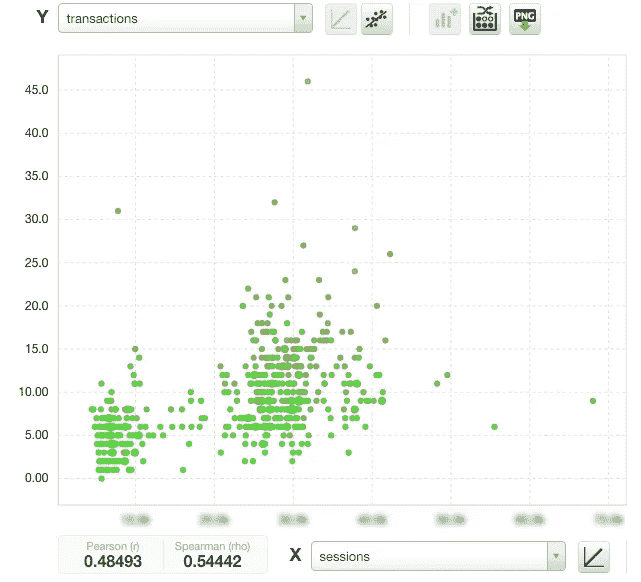
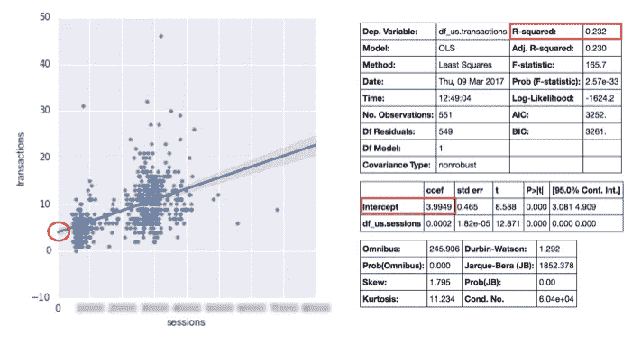
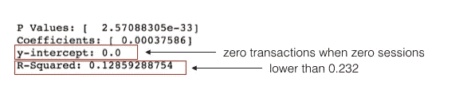
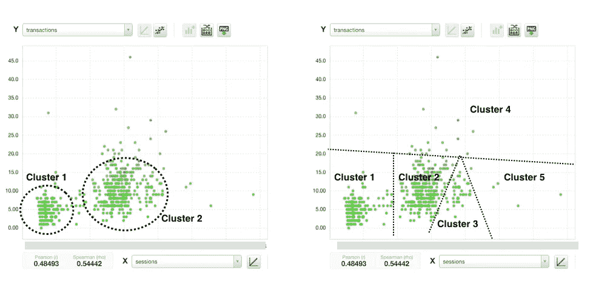
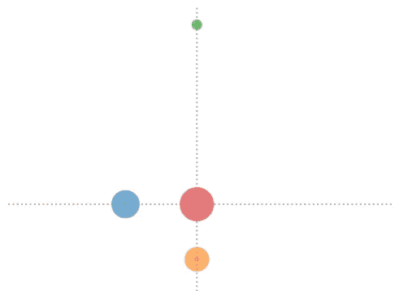
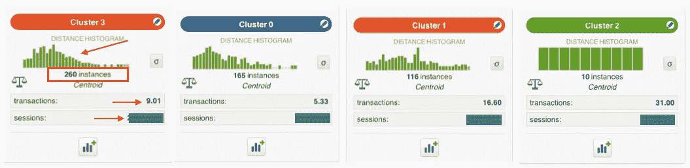
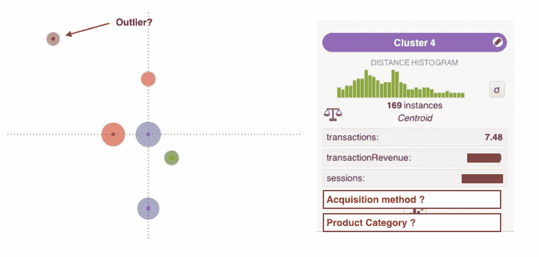

# 电子商务:如何利用统计数据增加销售额？

> 原文：<https://towardsdatascience.com/ecommerce-how-to-use-statistics-to-increase-sales-1830cf7eb684?source=collection_archive---------2----------------------->

Photo by [Bench Accounting](https://unsplash.com/@benchaccounting?utm_source=medium&utm_medium=referral) on [Unsplash](https://unsplash.com?utm_source=medium&utm_medium=referral)

销售分析中的回归分析和聚类案例。

在前一部分，我们看了一下电子商务商店的表现。我们从虚荣 KPI(会话)和相当好的业务 KPI(交易)的组合开始。它有着相当有趣的关系。

Number of sessions (horizontal axis, blurred) by number of transactions (vertical axis)

如何弄清楚数据的意义并理解其中的关系？在前一部分，我们探讨了相关性，这导致了更多的问题。下一步将涉及两种统计方法的使用:回归分析和聚类。

**预测销售额—回归分析** 在统计建模中，**回归分析**是估计变量之间关系的统计过程。这正是我们正在寻找的。

我们将使用 Python 和 stat 模型库构建一个模型，根据会话数预测事务数。

模型的结果可以表示为一条直线(线性回归)。

Predicting number of transactions based on number of sessions

我们的模型面临两个直接挑战。逻辑上讲不通。它无法解释没有会话或会话数量非常少的情况。如果会话等于零，模型预测有四个事务(截距值为 3.99)。
2。 [R 平方值为 0.232](http://blog.minitab.com/blog/adventures-in-statistics-2/regression-analysis-how-do-i-interpret-r-squared-and-assess-the-goodness-of-fit) 。我们的模型只解释了*23%*的数据可变性。这使得 77%的数据无法解释，从商业角度来看这是不可接受的。

让我们尝试调整我们的模型，以适应会话数量较少的情况。我们将强制截距等于零(零会话意味着零事务):

新模型在逻辑上更有意义，但*明显更差。*它只解释了 *13%的数据可变性*，令人失望。我们总是可以尝试通过使用不同的回归分析方法来改进 r 平方参数，如[套索](https://en.wikipedia.org/wiki/Lasso_(statistics))或[梯度下降](https://en.wikipedia.org/wiki/Stochastic_gradient_descent)而不是最小二乘法)，但这超出了本文的范围。我们将探索另一种有趣的方法。

**了解受众——聚类分析** 聚类分析或聚类是对一组对象进行分组的任务，使得同一组(称为聚类)中的对象彼此之间比其他组(聚类)中的对象更相似(在某种意义上)。

为什么这对电子商务很重要？没有一般的用户或客户。相反，我们可以试着区分有一些共同点的不同群体(集群)。

我们通过将数据集分成几个不同的组来说明聚类的概念:

Examples of clusters

我们可以使用像 SPSS 或 BigML 这样的统计软件包来处理数据。

在下面的例子中，我们采用了两个变量:会话数和事务数。集群的数量被设置为四个。每个圆圈代表一个集群，大小代表其中的实例数量。

Diagram showing distance between clusters — level of similarity.

在这个简化的示例中，我们已经完成了四个集群。虽然它不会提供丰富的见解，但它将有助于理解集群的概念。

以上四个聚类可能比回归分析更能解释我们的受众。例如，聚类 2(非常高的事务数)是由回归分析没有捕捉到的异常值组成的。

每个集群由多个参数描述:实例(观察)的数量、事务和会话的中心点。集群中的所有实例都与他的中心点相关。直方图中显示了距该点的距离。

**从聚类分析中获得洞察力。现实生活场景。**

拥有行业知识会有所帮助。良好实践将要求在分析中包含更多相关数据。我们应该从哪里开始？我们可能要考虑以下变量:
——客户获取方式(付费、电子邮件、社交等)。)，
-交易明细(如产品类别)

Adding more variables may brings better insights

聚类分析是一种很好的平衡行为。我们的目标是更好地了解电子商务受众，同时我们试图保持集群数量较低，并确保它们具有商业意义。

*下一个问题:我们能根据过去的业绩预测未来的销售吗？*

[回到第 1 部分——揭开虚荣心 KPI 的神秘面纱](https://medium.com/@maciej.piwoni/demystifying-vanity-kpis-e59557b41ab1#.47vq84xnq)