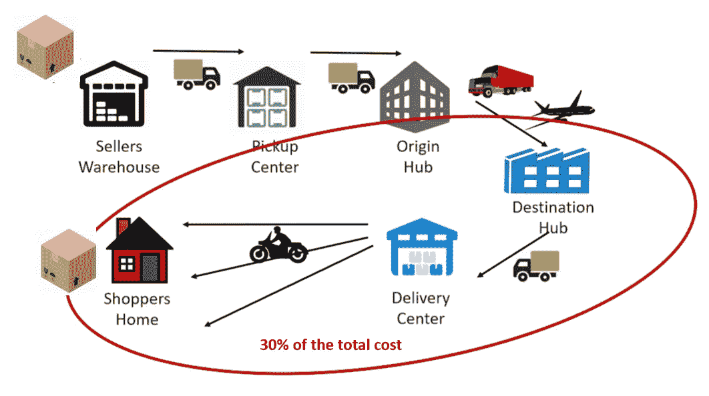
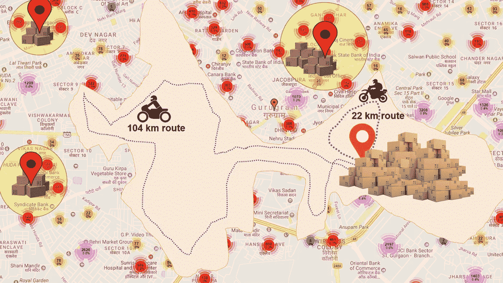
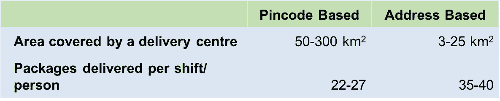
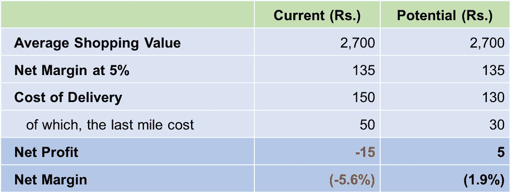
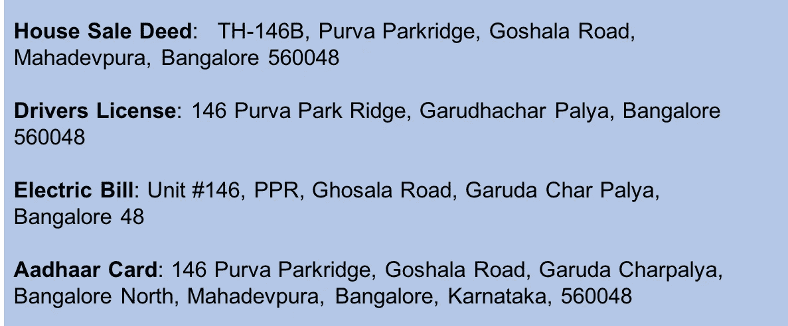
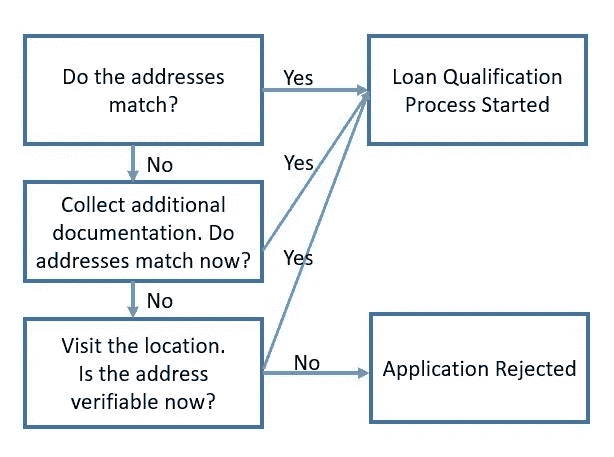
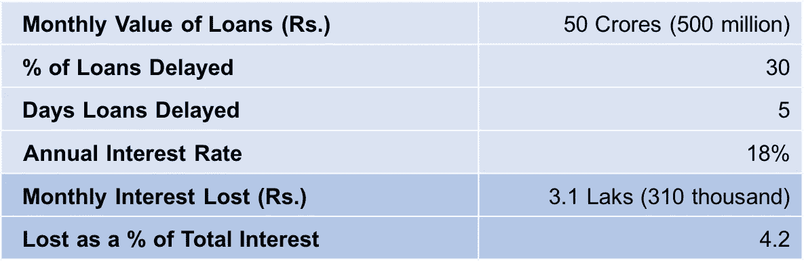
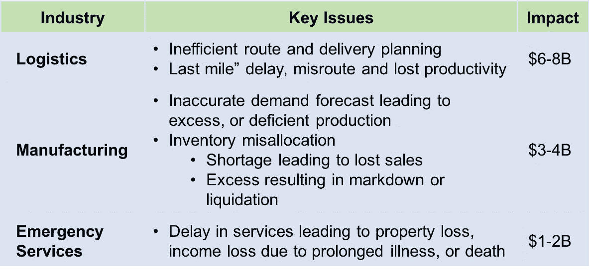

# 糟糕的地址每年给印度造成 100-140 亿美元的损失

> 原文：<https://towardsdatascience.com/economic-impact-of-poor-addresses-in-india-10-14-billion-a-year-11cc97cb40fc?source=collection_archive---------14----------------------->

对于新兴经济体来说，无组织、结构不良的寻址系统是主要的经济负担。我们估计，糟糕的地址每年给印度造成 100-140 亿美元的损失，约占 GDP 的 0.5%。

*本文大图最初出现在麻省理工学院的(*[*【MITs】)新兴世界博客*](http://mitemergingworlds.com/blog/2018/2/12/economic-impact-of-discoverability-of-localities-and-addresses-in-india) *。*

在地球上的 70 亿居民中，大约有 40 亿[1]没有合适的地址，无法在地图上以合理的精度定位他们的房屋、财产或企业。举例来说，考虑我们的一个作者在两个不同大陆的两个地址:

Figure 1: Every place needs an address. Crowded Old Delhi seen from the Jama Masjid. Photo Credit — Erik Torner

*   **在美国:**【名称】，7116 Via Correto Dr，Austin，TX 78749:该地址的位置很容易找到，任何导航系统都可以在白天或晚上将您带到家门口；或好或坏的天气！这是一个结构化地址的例子。
*   **在印度:**【姓名】，蒂拉学院，PO Agartala 学院，Agartala 799004:谷歌地图将这个地址解析为大约 76 平方公里的区域。公里。在阿加尔塔拉城。这个地址是非结构化的。
*   在上面的地址上添加一个地标，“蒂拉学院**靠近蒂拉学院湖**，..”将答案缩小到大约 3 平方公里。公里。到达目的地后，根据对居住者、房子或位置了解的详细程度，如果不是深夜或下雨，还需要 15-45 分钟。此外，基于地标的寻址是不常见的、不完整的并且也是不一致的。

**Figure 2: Most addresses in the developed world resolves within a narrow area, where those in India can resolve anywhere from town to a locality to (rarely) at a house level**

这些不仅仅是造成不便的一次性体验。无法为每个地址提供准确的位置，在许多方面影响了居民的生活。它抑制了当地行业的发展，如沙龙、面包店或小吃摊。它降低了便利设施的可用性，如创建银行账户和交付货物和服务(如电子商务)，并延误了消防队和救护车等紧急服务。

# 对工业的经济影响

## 案例研究 1:物流和运输

如前一个示例所示，无法在合理的准确度内定位地址会影响运输商按时交付货物的能力。考虑一下电子商务行业，或者任何一个把商品送到一个地址的行业。在没有适当的地理编码的情况下，印度的大多数公司通过 PIN 码(PIN 代表“邮政索引号”)对包裹或货物进行“分类”，因为 PIN 码是在印度大多数书面地址中出现的唯一数字位置描述。

虽然按密码对交货和设施(存储交货和退货的货物)进行分类听起来是一个逻辑上可行的解决方案，但它有两个主要的实际问题:

*   在印度，大约 30–40%[2]的 pin 码书写不正确，导致货件发送路线错误，需要人工干预才能发送到正确的 pin 码
*   一个密码的平均面积约为 179 平方英尺。公里。约有 135，000 个家庭和 100，000 多个商业、教育机构、政府建筑等。对超过 25 万个地址的可交付内容进行排序，其中只有 30%的地址是结构化的，这带来了许多挑战。

我们将选择物流和运输行业中的一个领域来详细说明这些挑战。考虑一个电子商务，它正在以 30 CAGR[【3】](https://www.bloombergquint.com/markets/2017/09/28/morgan-stanley-bets-on-digital-to-forecast-6-trillion-economy-sensex-at-130000)的速度增长，受收入、消费和数字化[【4】](http://www.morganstanley.com/ideas/digital-india)增长的驱动，并且在可预见的未来预计将继续如此。印度消费者希望产品免费送货上门，这给电子商务公司带来了独特的负担，这在世界上大多数地方是看不到的。

当一个电子商务网站的产品在网上订购时，商品从卖家或仓库被取走，并被送到加工厂，在那里被分拣到目的地城市，这一过程被称为“第一英里操作”。然后在始发地和目的地城市之间进行长途运输。在“最后一英里操作”中，商品被送到配送中心，从那里被送到购物者的家里。图 3 展示了这个过程。

**Figure 3: The “last mile cost” in India is ~30% of the total cost of delivery**

在西方国家，结构化地址导致相对准确的地理编码，因此最后一英里的成本约为总成本的 10–12%[5]。在印度，同样的费用约占配送总成本的 30%;尽管印度的劳动力成本很低。额外的成本来自于司机在定位一个地址时所花费的更长的时间——多次停下来给收件人打电话或向路上的人问路，以及为寻找正确的位置而额外驾驶。

图 4。说明了向无法在内部消除歧义的地址发送邮件所面临的挑战。在缺少所需地址的经度的情况下，基于密码对地址进行分类，并且对一个密码的所有包裹进行分类、存储并从一个(或者有时是两个或更多个)递送中心进行递送。位于橙色 pin 位置的典型的基于 pin 码的分拣中心可以有 4-20 公里的递送“范围”(半径)。在缺乏对基于地址的负载分布的理解的情况下，这种中心的位置往往是不平衡的。例如，在这种情况下，一名送货骑车人行驶了大约 22 公里，而另一名骑车人行驶了大约 104 公里，几乎是第一名骑车人行驶距离的 5 倍。这些问题严重阻碍了这些中心提高生产率和降低成本的举措。

**Figure 4: The difference between a pincode-based sorting and local-address-based sorting. In this picture, the light orange area shows a typical pincode boundary. In this delivery center productivity can vary widely as optimal route planning becomes complex, as depicted by two delivery bikers’ routes**

另一方面，如果地址可以在家庭一级消除歧义，那么每个地方都可以有一个小的递送中心。在这种情况下，配送中心的平均“行程”会下降到 1-3 公里。在图 4 中，这种小型交付中心的位置用红色大头针表示，它们覆盖的区域用黄色表示。这使得能够进行基于地址的分拣的较小中心的生产率显著提高。

此外，地址地理编码的粒度更大，也使我们能够执行路线优化，并为快递员提供系统驱动的路线。我们以 Delhivery 为例，它是印度领先的电子商务公司物流供应商之一。

在 Delhivery，根据地址的类型/复杂性和地区的大小/形状，从基于密码的分拣转换到基于地区的分拣，将最后一英里操作的生产率提高了 40–60%。

**Table 1: An address-based sorting can result in a 40–60% better productivity**

这种最后一英里的高成本不成比例地影响了公司的底线。在表 2 中的一个简单分析中，我们证明了一个更好的地理编码可以将最后一英里的成本降低 40%，完全在当前技术的范围内，可以提高电子商务公司的盈利能力。

**Table 2: Illustration: An improvement in the last mile cost can swing the profitability of an e-commerce business**

即使对于印度的一个小行业，如电子商务交付，估计每年有 50 亿卢比(约 7 . 75 亿美元)的业务(截至 2017 年)，更好的寻址方案每年可以节省约 65 亿卢比(约 1 亿美元)的成本。

对于物流和运输行业，同一框架可用于不同类型的货物和服务运输。即使在城市间运输的情况下，第一英里(例如，从客户或配送中心提货)或最后一英里(送货到户或企业)的交付都会受到无法解析地址的严重影响。

## 案例研究 2:贷款和金融服务

印度是一个信用匮乏的国家，有 6.42 亿人(高达 53%)被排除在正规金融产品之外，如贷款、保险和其他形式的信贷和金融服务。这对经济的影响是巨大的。麦肯锡估计，到 2025 年，印度数字金融服务的回报可以达到 7000 亿美元，并且可以额外创造 2100 万个工作岗位。

缺乏信用的原因有很多:缺乏可验证的身份(类似于美国的社会安全号码)，在一个主要由现金驱动的经济中缺乏正式收入的证明，以及消除一个人的位置(无论是家庭还是工作场所)的复杂性。

因此，在过去两年中，在金融科技公司(fintech)的大型风险投资的资助下，100 多家初创公司开始提供连接借款人和贷款人的服务。

图 5 显示了这类服务之一承诺的典型流程。这个过程相当简单。一旦用户在线或通过应用程序申请并选择产品，他们通常会被要求提供 5-8 套文件，包括身份证明、地址、年龄和收入、教育资格、就业证明文件和银行对账单。

**Figure 5: Typical loan generation process promised by one of India’s many digital loan or financing start-ups**

信使从借书人那里取走这些文件。然后，这些文件(主要是纸质文件)经过扫描和代码转换，使用光学字符识别(OCR)保存在数据库中，并与借款人在贷款申请中提供的信息进行比较。

这一过程对大约 60%—70%的借款人非常有效，尤其是在大城市。根据我们对领先公司的调查，我们估计大约 70%的文档被认为是“匹配的”,并进入贷款处理的下一步，例如贷款资格分析、贷款批准等。，尽管只有一定比例的申请人有资格获得贷款。

然而，对于大约 30%的申请，申请人在申请中提供的地址与文件不符。要理解为什么，请考虑图 6 中同一栋房子的以下地址。

**Figure 6: Same address written in multiple formats in different documents**

替换为:对于同一地址:a)门牌号写为“TH-146B”、“146”、“146 单元”。b)该社区被称为"普尔瓦公园岭"和"普尔瓦公园岭"，也简称为" PPR "。c)道路名称以两种方式拼写为“Goshala Road”和“Ghosala Road ”,其中一种完全省略。d)该地区被称为“哥鲁达查帕利亚”和“哥鲁达查帕利亚”。

换句话说，仅仅四个不同来源的官方地址验证文档就可以产生超过 50 种组合。因此，文件中提供的地址经常不匹配也就不足为奇了。由于这些信息的处理发生在一个集中的设施中，那里的人们不会知道“普尔瓦公园岭”和“PPR”是同一个社区。

对于 30%不匹配的文档，下面的过程开始，如图 7 所示。

**Figure 7: 30% of the applicants whose addresses do not match directly are either asked for additional documentations or have their addresses manually verified, adding to the time and cost for the service providers**

这导致贷款审批延迟，最好的情况下会延迟 5 天，有时甚至会延迟几周或几个月。这既影响了借款人，他可能急需用钱；而贷款人必须承担他在贷款最终处理之前本可以赚取的利息损失以及额外验证的成本。

**Table 3: Bad addresses delay verification and approval resulting in the loss of interest to moneylenders**

此外，居住地或企业是贷款风险评估过程中的一个关键因素，无法消除这一点在风险模型中表现出来，从而提高了利率，进而提高了贷款的总成本。

# 泛印度经济影响

我们对排名前三的行业——物流、制造业(包括消费品)和应急服务进行了类似的分析，得出了印度的成本估算。使用这种方法，我们的估计表明，不良地址**每年花费印度 100-140 亿美元，约占 GDP** 的 0.5%；参见表 4。

**Table 4: The economic cost of bad addresses in India**

还要注意的是，表 4 中的数字反映了不良地址的成本，但不包括拥有更好地址的额外好处，如生产率和收入的提高，这将导致企业和 GDP 的进一步增长等。

# 结论

容易被发现的地址对于像印度这样快速发展的经济体来说非常重要。地址不仅仅是一种便利，它对于推动自我强化的经济循环，进而改善下一个 10 亿印度人的生活和收入至关重要。消费者为了自己的方便而独立地识别和采用地址，而企业使用技术或第三方服务将这些地址解析成地理编码，以降低的成本交付产品和服务。

我们的案例研究分析表明，缺乏良好的寻址系统每年给印度造成至少 100-140 亿美元的损失，相当于其年度国内生产总值的 0.5%。随着印度经济在经济产出以及各种新业务和服务方面的持续增长，由于缺乏适当的寻址系统而导致的成本将显著增加。因此，印度需要考虑一种全新的方法来实现寻址系统的现代化，以提高效率。

# 参考

[1]40 亿人没有地址。机器学习可以改变这种情况

[2]样本来自 Delhivery 的 1000 万个地址的数据库

[3]摩根士丹利押注数字预测 6 万亿美元经济，Sensex 在 1，30000[https://www . Bloomberg quint . com/markets/2017/09/28/mor gan-Stanley-Bets-On-Digital-To-Forecast-6 万亿美元经济-sensex-at-130000](https://www.bloombergquint.com/markets/2017/09/28/morgan-stanley-bets-on-digital-to-forecast-6-trillion-economy-sensex-at-130000)

[4]摩根士丹利报告《印度的数字未来》【http://www.morganstanley.com/ideas/digital-india 

[5]与亚马逊、联邦快递和史泰博电子商务的多个利益相关方的私人谈话

[6]数字金融如何促进新兴经济体的增长(2016 年 9 月)[https://www . McKinsey . com/global-themes/employment-and-growth/How-digital-finance-can-boost-growth-in-emerging-economies](https://www.mckinsey.com/global-themes/employment-and-growth/how-digital-finance-could-boost-growth-in-emerging-economies)

# 关于作者:

**Santa nu Bhattacharya 博士**是 Airtel 的首席数据科学家，Airtel 是全球最大的电信公司之一，拥有 4.5 亿多用户。他是一位连续创业家，曾在脸书 a 引领新兴市场手机，他是美国国家航空航天局戈达德太空飞行中心的前物理学家，也是麻省理工学院媒体实验室的合作者

**Sai Sri Sathya** 是麻省理工学院媒体实验室 REDX 和 Camera Culture Group 的合作研究员，之前在脸书的连通性实验室工作，专注于新兴世界的创新。他是一家致力于在边缘实现人工智能民主化的秘密模式初创公司的创始人

**Kabir rusto gi 博士**领导着印度最大的电子商务物流公司 Delhivery 的数据科学团队。他是一位已经出版的作者，之前是英国格林威治大学运筹学的高级讲师。

Ramesh Raskar 教授是麻省理工学院媒体实验室的副教授，领导麻省理工学院新兴世界项目，该项目旨在利用全球数字平台解决重大社会问题。