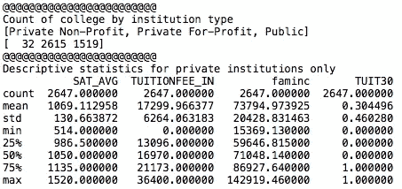
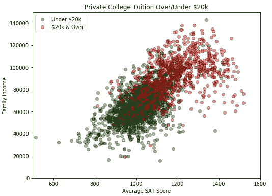
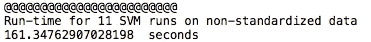
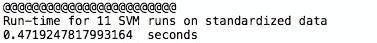
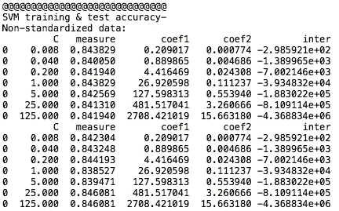
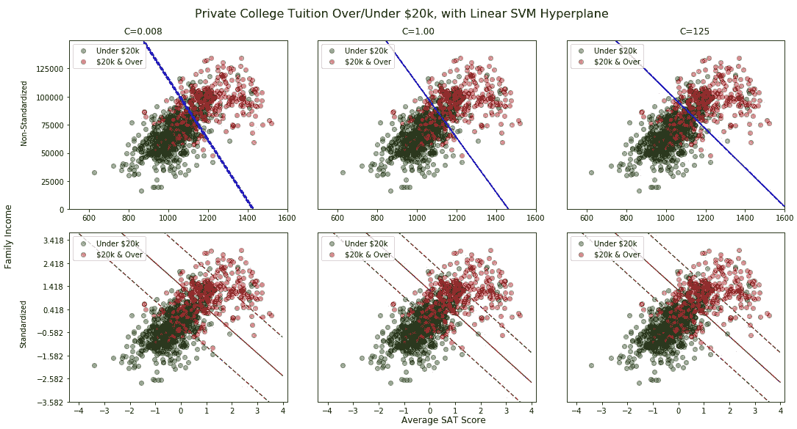

# 特征标准化对线性支持向量机的影响

> 原文：<https://towardsdatascience.com/effect-of-feature-standardization-on-linear-support-vector-machines-13213765b812?source=collection_archive---------4----------------------->

因为支持向量机(SVM)优化是通过最小化决策向量 *w，*来实现的，所以最优超平面受输入特征规模的影响，因此建议在 SVM 模型训练之前对数据进行标准化(均值为 0，方差为 1)。在这篇文章中，我展示了标准化对双特征线性 SVM 的影响，以及一些(希望)对结果的实际解释。

我在这里使用的数据来自[大学记分卡](https://collegescorecard.ed.gov/)，这是一个免费的美国教育部数据来源，包含美国大学的各种统计数据。我使用了由 Kaggle 托管的[版本的大学记分卡数据。](https://www.kaggle.com/kaggle/college-scorecard)

使用此数据源，我将训练一个 SVM 来根据(1)注册学生的平均 SAT 分数和(2)注册学生的平均家庭收入预测大学的州内学费是大于还是小于每年 2 万美元。这个模型有点做作和简单——我的主要目标不是成功地预测目标类本身，而是展示特性标准化对最终模型的影响。

在该数据集中，有 4166 所大学具有非空平均 SAT 分数和家庭收入数据。有相当多的大学在这些特征上具有空值，我在分析中排除了这些特征:

每年 2 万美元的州内学费介于该变量的第 50 和第 75 百分位之间——因此在这个目标阶层的两边都有相当数量的大学。

上面，我根据平均 SAT 分数和家庭收入绘制了大学学费。应该立即明确的是，这些数据不是线性可分的。在线性 SVM 中，没有超平面可以按照学费类别清晰地分割数据点——在模型选择的任何决策超平面中，总是会有大学位于“错误的一边”。sklearn SVM 实现将根据用户指定的超参数“C ”,搜索最佳超平面(和+1/-1 边缘超平面),该超参数确定边缘超平面“错误侧”上的数据点的惩罚程度。

对于每组特征(非标准化，然后标准化)，我运行了 11 个线性 SVM 模型，C 系数为 5**-3，5**-2，…5**3。

很明显，这两种模型在运行时间上有很大的不同:

以下两个表格记录了每个拟合 SVM 的分类预测精度(字段“测量”)。顶部的结果集代表 60%的训练数据子集，而底部的结果集代表 40%的测试或维持数据子集。我还包括了每次运行的拟合决策向量 *w* 和标量 *b* 。所有模型的准确率都相似，但是 *w* 和 *b* 的拟合值却大相径庭。

下面的 6 个图显示了各种罚系数 c 值的拟合 SVM 超平面和(+1，-1)余量。上面的三个图显示了非标准化特征的拟合超平面，而下面的三个图显示了标准化特征的拟合超平面。

不难看出，非标准化数据会产生对系数 c 高度敏感的决策超平面。前三个支持向量机中的每一个都会产生肉眼明显不同的决策超平面。标准化数据跨超参数产生更加一致的 SVM 超平面。底部图之间的差异在于，C 值越低，(+1，-1)边缘超平面的范围越宽。直观地，由于边缘超平面的“错误侧”上的数据点在低 C SVM 模型中受到的惩罚越少，因此模型逻辑具有更大的自由度来拟合远离决策超平面的边缘边界。

 [## 达索特罗/SVM _ 学院 _ 学费. py

github.com](https://github.com/dasotelo/Python_Projects/blob/master/SVM_College_Tuition.py)