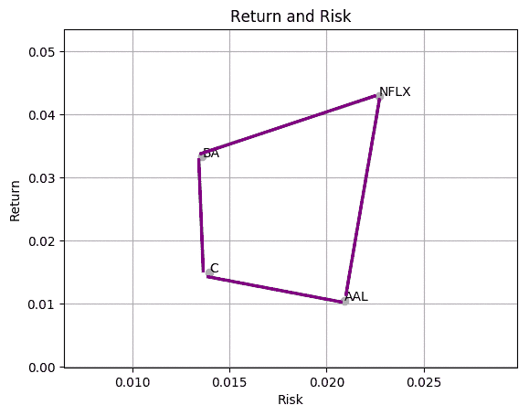
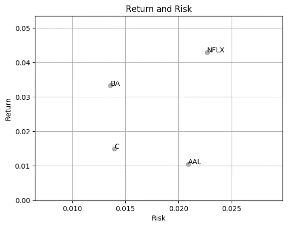
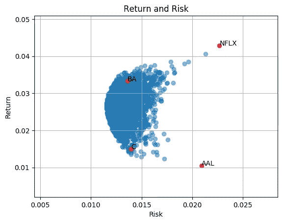

# 用 Scipy——有效边界解释最小风险的投资组合优化

> 原文：<https://towardsdatascience.com/efficient-frontier-optimize-portfolio-with-scipy-57456428323e?source=collection_archive---------7----------------------->


Photo by [Chris Liverani](https://unsplash.com/@chrisliverani?utm_source=medium&utm_medium=referral) on [Unsplash](https://unsplash.com?utm_source=medium&utm_medium=referral)

(我的[博客](https://kylelix7.github.io/Efficient-Frontier-Explained-with-SciPy/)里也有这个帖子)

## 超越界限

给定 4 种资产的风险和回报如下，用这些资产构建的任何投资组合的风险回报可能是多少。人们可能认为所有可能的值都落在凸包内。但如果考虑资产之间的相关系数，超越债券是有可能的。也就是说，组合反向相关的资产可以构建一个风险较低的投资组合。更多细节可以在我的[上一篇](https://medium.com/@kyle.jinhai.li/reducing-risk-by-building-portfolio-8772d1ce0f21)中找到。



为了证明投资组合的风险回报可以超越这个区域，我得到了 3000 个随机加权投资组合的样本，并绘制了它们的风险回报。

## 环境设置

遵循这个[帖子](https://medium.com/@kyle.jinhai.li/collect-trading-data-with-pandas-library-8904659f2122)中的步骤 1

## 计算并可视化资产回报和风险

这是教程，我们从 4 个不同的部门挑选了 4 只股票 BA(波音)，C(花旗集团)，AAL(美国航空集团)，NFLX(网飞)进行分析。正如我的[上一篇文章](https://medium.com/@kyle.jinhai.li/reducing-risk-by-building-portfolio-8772d1ce0f21)所说，风险是通过每日回报的标准差来衡量的。回报计算如下

```
**K * (expected return – expected risk free rate)**
```

k 是采样频率的平方根。这意味着如果我们用日收益率来衡量，K 就是 sqrt(250)(一年大概有 250 个交易日)。国债利率通常被用作无风险利率。在本教程中，我们将使用 0。

## 密码

散点图描绘单个资产的风险收益

```
**import** pandas_datareader.data **as** web
**import** pandas **as** pd
**import** matplotlib.pyplot **as** plt
**import** numpy **as** np
**from** scipy.optimize **import** minimize**def** get_risk(prices):
    **return** (prices / prices.shift(1) - 1).dropna().std().values **def** get_return(prices):**return** ((prices / prices.shift(1) - 1).dropna().mean() * np.sqrt(250)).valuessymbols = [**'BA'**, **'C'**, **'AAL'**, **'NFLX'**]
prices = pd.DataFrame(index=pd.date_range(start, end))
**for** symbol **in** symbols:
    portfolio = web.DataReader(name=symbol, data_source=**'quandl'**, start=start, end=end)
    close = portfolio[[**'AdjClose'**]]
    close = close.rename(columns={**'AdjClose'**: symbol})
    prices = prices.join(close)
    portfolio.to_csv(**"~/workspace/{}.csv"**.format(symbol))prices = prices.dropna()
risk_v = get_risk(prices)
return_v = get_return(prices)fig, ax = plt.subplots()
ax.scatter(x=risk_v, y=return_v, alpha=0.5)
ax.set(title=**'Return and Risk'**, xlabel=**'Risk'**, ylabel=**'Return'**)**for** i, symbol **in** enumerate(symbols):
    ax.annotate(symbol, (risk_v[i], return_v[i]))plt.show()
```



Return and risk for BA (Boeing), C (Citigroup), AAL (American Airlines Group), NFLX (Netflix)

## 构建随机权重的投资组合

```
**def** random_weights(n):
    weights = np.random.rand(n)
    **return** weights / sum(weights)**def** get_portfolio_risk(weights, normalized_prices):
    portfolio_val = (normalized_prices * weights).sum(axis=1)
    portfolio = pd.DataFrame(index=normalized_prices.index, data={**'portfolio'**: portfolio_val})
    **return** (portfolio / portfolio.shift(1) - 1).dropna().std().values[0]**def** get_portfolio_return(weights, normalized_prices):
    portfolio_val = (normalized_prices * weights).sum(axis=1)
    portfolio = pd.DataFrame(index=normalized_prices.index, data={**'portfolio'**: portfolio_val})
    ret = get_return(portfolio)
    **return** ret[0]risk_all = np.array([])
return_all = np.array([])*# for demo purpose, plot 3000 random portoflio* np.random.seed(0)
normalized_prices = prices / prices.ix[0, :]
**for** _ **in** range(0, 3000):
    weights = random_weights(len(symbols))
    portfolio_val = (normalized_prices * weights).sum(axis=1)
    portfolio = pd.DataFrame(index=prices.index, data={**'portfolio'**: portfolio_val})
    risk = get_risk(portfolio)
    ret = get_return(portfolio)
    risk_all = np.append(risk_all, risk)
    return_all = np.append(return_all, ret)
    p = get_portfolio_risk(weights=weights, normalized_prices=normalized_prices)fig, ax = plt.subplots()
ax.scatter(x=risk_all, y=return_all, alpha=0.5)
ax.set(title=**'Return and Risk'**, xlabel=**'Risk'**, ylabel=**'Return'**)**for** i, symbol **in** enumerate(symbols):
    ax.annotate(symbol, (risk_v[i], return_v[i]))
ax.scatter(x=risk_v, y=return_v, alpha=0.5, color=**'red'**)
ax.set(title=**'Return and Risk'**, xlabel=**'Risk'**, ylabel=**'Return'**)
ax.grid()
plt.show()
```

> 风险来自于不知道自己在做什么——沃伦·巴菲特

再来看风险和收益。我们确实看到区域外有蓝点。所以分散投资确实有助于降低风险。但是，我们如何找到最佳或有效的重量呢？



Return and risk of a portfolio of random weighted BA (Boeing), C (Citigroup), AAL (American Airlines Group), NFLX (Netflix) (3000 samples)

## 效率限界

来自[维基百科](https://en.wikipedia.org/wiki/Efficient_frontier)，在[现代投资组合理论](https://en.wikipedia.org/wiki/Modern_portfolio_theory)中，**有效边界**(或**投资组合边界**)是一种投资组合，它占据了风险回报谱的‘有效’部分。

在这里，我们将使用 scipy 的优化器来获得不同目标回报的最佳权重。请注意，我们有界限来确保权重在范围[0，1]内，并且有约束来确保权重之和为 1，并且投资组合回报满足我们的目标回报。有了所有这些条件，scipy optimizer 就能够找到最佳分配。

```
*# optimizer* **def** optimize(prices, symbols, target_return=0.1):
    normalized_prices = prices / prices.ix[0, :]
    init_guess = np.ones(len(symbols)) * (1.0 / len(symbols))
    bounds = ((0.0, 1.0),) * len(symbols)
    weights = minimize(get_portfolio_risk, init_guess,
                       args=(normalized_prices,), method=**'SLSQP'**,
                       options={**'disp'**: **False**},
                       constraints=({**'type'**: **'eq'**, **'fun'**: **lambda** inputs: 1.0 - np.sum(inputs)},
                                    {**'type'**: **'eq'**, **'args'**: (normalized_prices,),
                                     **'fun'**: **lambda** inputs, normalized_prices:
                                     target_return - get_portfolio_return(weights=inputs,
                                                                          normalized_prices=normalized_prices)}),
                       bounds=bounds)
    **return** weights.xoptimal_risk_all = np.array([])
optimal_return_all = np.array([])
**for** target_return **in** np.arange(0.005, .0402, .0005):
    opt_w = optimize(prices=prices, symbols=symbols, target_return=target_return)
    optimal_risk_all = np.append(optimal_risk_all, get_portfolio_risk(opt_w, normalized_prices))
    optimal_return_all = np.append(optimal_return_all, get_portfolio_return(opt_w, normalized_prices))# plotting
fig, ax = plt.subplots()
*# random portfolio risk return* ax.scatter(x=risk_all, y=return_all, alpha=0.5)*# optimal portfolio risk return* **for** i, symbol **in** enumerate(symbols):
    ax.annotate(symbol, (risk_v[i], return_v[i]))
ax.plot(optimal_risk_all, optimal_return_all, **'-'**, color=**'green'**)*# symbol risk return* **for** i, symbol **in** enumerate(symbols):
    ax.annotate(symbol, (risk_v[i], return_v[i]))
ax.scatter(x=risk_v, y=return_v, color=**'red'**)ax.set(title=**'Efficient Frontier'**, xlabel=**'Risk'**, ylabel=**'Return'**)
ax.grid()
plt.savefig(**'return_risk_efficient_frontier.png'**, bbox_inches=**'tight'**)
```

绿线表示有效边界。现在我们知道了给定目标回报率的最佳配置。下一个问题，总体而言，最佳配置是什么？投资组合的表现可以用收益/风险比率(称为[夏普比率](https://www.investopedia.com/terms/s/sharperatio.asp))来评估。高夏普比率表明收益和风险的良好平衡。这种分配可以通过画一条与有效边界相切的资本分配线来找到。切点是产生最高夏普比率的分配。要了解更多，你可以看看这篇[文章](https://corporatefinanceinstitute.com/resources/knowledge/finance/capital-allocation-line-cal-and-optimal-portfolio/)，关于如何用资本配置线(CAL)从有效边界找到最高夏普比率。


Efficient frontier — Return and risk of optimal asset-weights at different targeted returns

现在我们知道为什么多样化可以帮助你的投资。如果你想了解更多关于机器学习的知识，educative.io 网站上有一系列[课程很有帮助。这些课程包括像基本的 ML，NLP，图像识别等主题。投资和编码快乐！](https://www.educative.io/profile/view/6083138522447872?aff=VEzk)

我的下一篇帖子——[交易策略:用 Python TA-Lib](https://medium.com/@kyle.jinhai.li/trading-strategy-technical-analysis-with-python-ta-lib-3ce9d6ce5614) 进行技术分析。

***来自《走向数据科学》编辑的注释:*** *虽然我们允许独立作者根据我们的* [*规则和指南*](/questions-96667b06af5) *发表文章，但我们并不认可每个作者的贡献。你不应该在没有寻求专业建议的情况下依赖一个作者的作品。详见我们的* [*读者术语*](/readers-terms-b5d780a700a4) *。*

推荐阅读:

[动手机器学习](https://www.amazon.com/gp/product/1492032646/ref=as_li_tl?ie=UTF8&camp=1789&creative=9325&creativeASIN=1492032646&linkCode=as2&tag=blog023b-20&linkId=e6994d31d10e7ac4d35d9889cfe5622e)

[用于数据分析的 Python:与 Pandas、NumPy 和 IPython 的数据角力](https://www.amazon.com/gp/product/1491957662/ref=as_li_tl?ie=UTF8&camp=1789&creative=9325&creativeASIN=1491957662&linkCode=as2&tag=blog023b-20&linkId=be0bbd6ab4fd578397d9c14facc76911)

[对冲基金真正在做什么](https://www.amazon.com/gp/product/1631570897/ref=as_li_tl?ie=UTF8&camp=1789&creative=9325&creativeASIN=1631570897&linkCode=as2&tag=blog023b-20&linkId=d7bb68173b008df1b500073e3a8d054e)

我的帖子:

[我关于 FAANG 访谈的帖子](https://medium.com/@fin.techology/my-posts-about-faang-interview-20e529c5f13f?source=your_stories_page---------------------------)

[我的 YouTube 频道](https://bit.ly/3bBOjtJ)

[我关于金融和科技的帖子](https://medium.com/@fin.techology/my-posts-about-finance-and-tech-7b7e6b2e57f4?source=your_stories_page---------------------------)

[从 CRUD web 应用开发到语音助手中的 SDE——我正在进行的机器学习之旅](https://medium.com/@fin.techology/from-crud-app-dev-to-sde-in-voice-assistant-my-ongoing-journey-to-ml-4ea11ec4966e?)

[全栈开发教程:将 AWS Lambda 无服务器服务集成到 Angular SPA 中](/full-stack-development-tutorial-integrate-aws-lambda-serverless-service-into-angular-spa-abb70bcf417f)

[全栈开发教程:用运行在 AWS Lambda 上的无服务器 REST API 提供交易数据](/full-stack-development-tutorial-serverless-rest-api-running-on-aws-lambda-a9a501f54405)

[全栈开发教程:在 Angular SPA 上可视化交易数据(1)](/full-stack-development-tutorial-visualize-trading-data-on-angular-spa-7ec2a5749a38)

[强化学习:Q 学习简介](https://medium.com/@kyle.jinhai.li/reinforcement-learning-introduction-to-q-learning-444c951e292c)