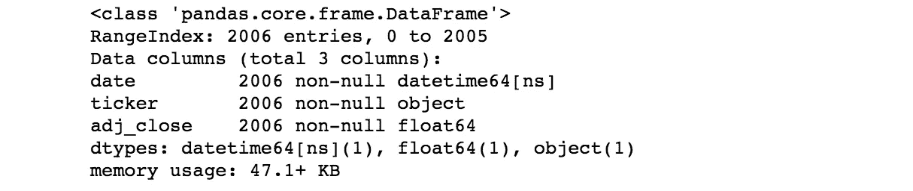
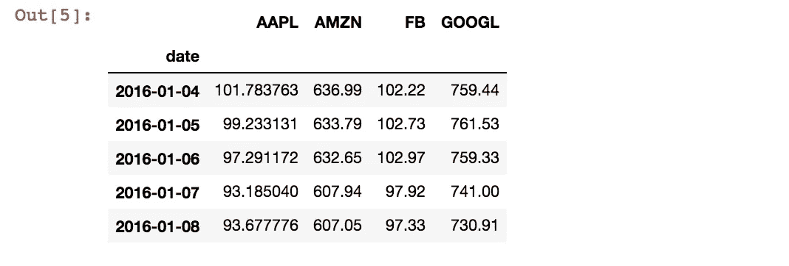
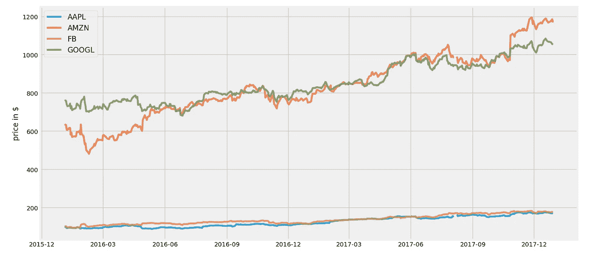
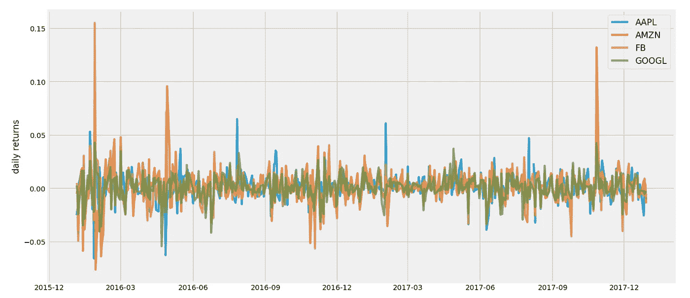
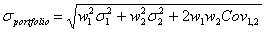
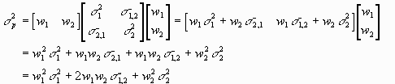
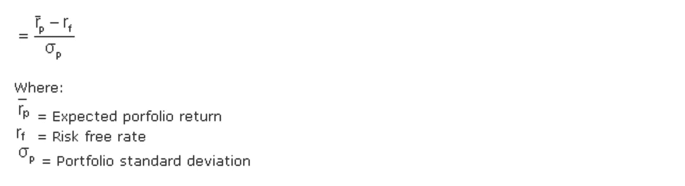
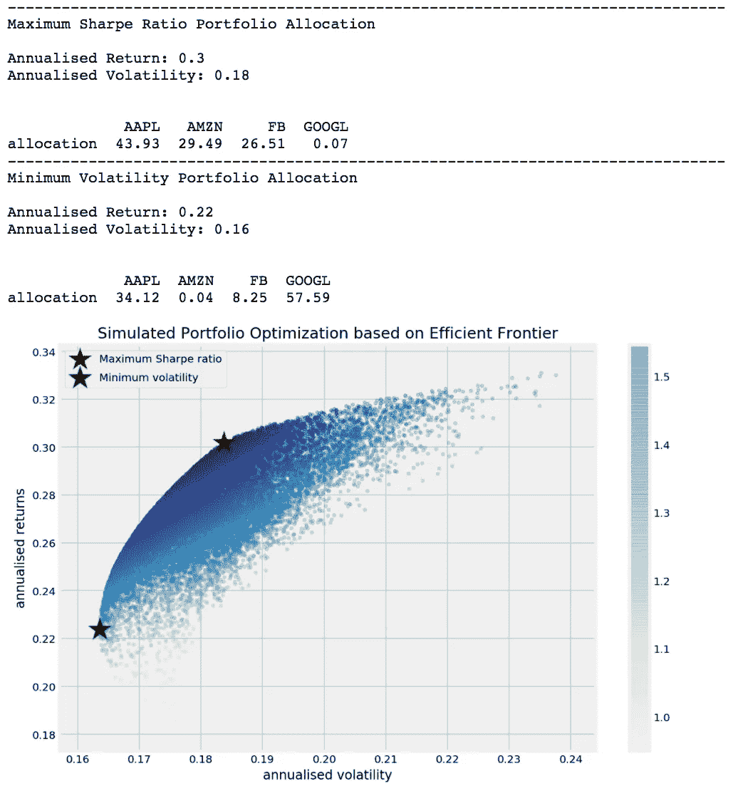
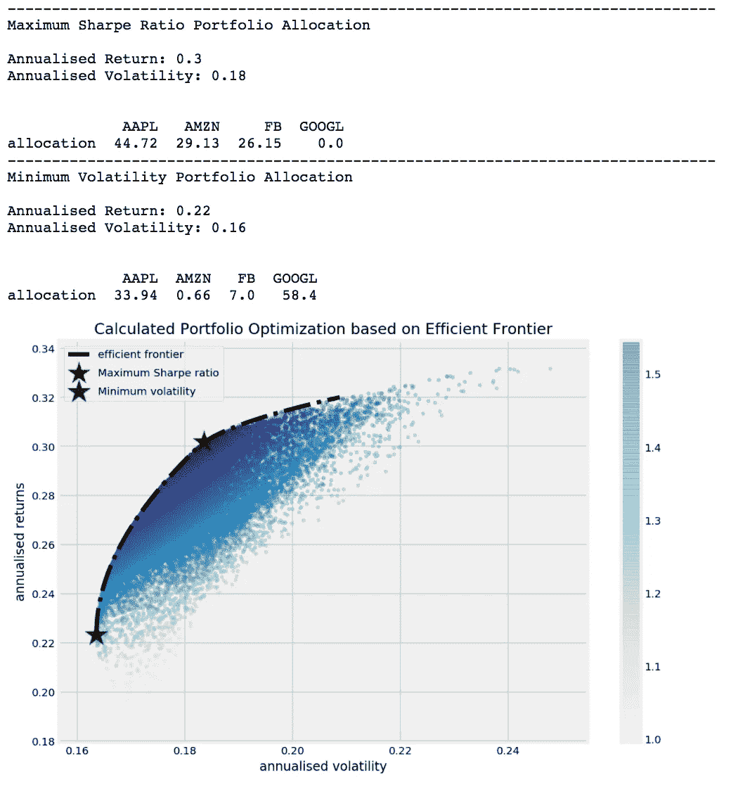
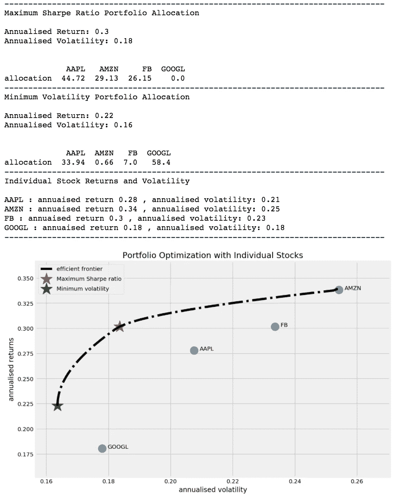

# Python 中的高效前沿投资组合优化

> 原文：<https://towardsdatascience.com/efficient-frontier-portfolio-optimisation-in-python-e7844051e7f?source=collection_archive---------0----------------------->


Photo by [Frank Busch](https://unsplash.com/@frankbusch?utm_source=medium&utm_medium=referral) on [Unsplash](https://unsplash.com?utm_source=medium&utm_medium=referral)

我个人对金融的兴趣让我在 Coursera 上了一门关于投资管理的在线课程。这是由日内瓦大学和瑞士联合银行合作的 5 门专业课程。它不是专门为金融建模，但更多的是对投资策略及其相关理论的一般性介绍。作为一个没有任何行业经验的人，该课程确实有助于了解大局。我目前正在专业的第三个课程上，我学到了一些非常有趣的东西，叫做“现代投资组合理论”

在我学习这门课程的时候，我认为这将是一个非常好的练习 Python 技能的材料。尽管这个课程没有提供任何关于如何实际实现它的技术细节，但通过一些挖掘，我发现了一些非常有用的博客帖子，我可以参考。

由 [Bernard Brenyah](https://medium.com/@bbrenyah) 撰写的一系列媒体博客文章

*   [Markowitz 在 Python 中的有效前沿【第 1/2 部分】](https://medium.com/python-data/effient-frontier-in-python-34b0c3043314)
*   [Markowitz 在 Python 中的有效边界[第 2/2 部分]](https://medium.com/python-data/efficient-frontier-portfolio-optimization-with-python-part-2-2-2fe23413ad94)

布拉德福德·林奇[的博客文章](http://www.bradfordlynch.com/)

*   [投资组合优化](http://www.bradfordlynch.com/blog/2015/12/04/InvestmentPortfolioOptimization.html)

基于我从课程中学到的东西，以及从上面的博客文章中，我试图用我自己的方式复制它，一路上不断调整。

*除了我将附上的简短代码块，你可以在这篇文章的末尾找到整个 Jupyter 笔记本的链接。

# 现代投资组合理论

一个好的投资组合不仅仅是一长串好的股票和债券。这是一个平衡的整体，为投资者提供了各种保护和机会。哈利·马科维茨

现代投资组合理论(MPT)是由哈里·马科维茨发展的投资理论，于 1952 年以“投资组合选择”的标题发表在《金融杂志》上。


Harry Markowitz is the 1990 Nobel Memorial Prize winner in Economic Sciences

有几个基本概念可以帮助你理解 MPT。如果你熟悉金融，你可能知道缩写“TANSTAAFL”代表什么。这是“天下没有免费的午餐”的著名缩写。这个概念也和‘风险收益权衡’密切相关。

风险越高，回报越高的可能性越大，风险越低，回报越小的可能性越大。MPT 假设投资者厌恶风险，这意味着给定两个预期回报相同的投资组合，投资者会选择风险较小的一个。因此，投资者只有在得到更高预期回报的补偿时，才会承担更大的风险。

另一个在 MPT 发挥作用的因素是“多元化”。现代投资组合理论认为，只看一只特定股票的预期风险和回报是不够的。通过投资一种以上的股票，投资者可以获得多样化的好处——其中最主要的是降低投资组合的风险。

你需要明白的是“投资组合的风险不等于投资组合中个股的平均/加权平均”。就回报而言，是的，它是单个股票回报的平均值/加权平均值，但这不是风险的情况。风险在于资产的波动性，如果你的投资组合中有不止一只股票，那么你必须考虑这些股票的走势如何相互关联。多样化的美妙之处在于，通过优化配置，你甚至可以获得比投资组合中风险最低的股票更低的风险。

我将在使用实际代码的同时尝试解释。首先，我们从导入一些我们需要的库开始。" [Quandl](https://www.quandl.com/) "是一个金融平台，它也提供 Python 库。如果你之前没有安装过，当然首先需要在你的命令行“pip install quandl”中安装包，在使用之前，你还需要在 quandl 的网站上获取一个 API key。注册并获得 API 密钥是免费的，但有一些限制。作为登录的免费用户，您最多可以在 10 分钟内拨打 2，000 个电话(速度限制)，每天可以拨打 50，000 个电话(音量限制)。

```
import pandas as pd  
import numpy as np
import matplotlib.pyplot as plt
import seaborn as sns
import quandl
import scipy.optimize as scoplt.style.use('fivethirtyeight')
np.random.seed(777)%matplotlib inline
%config InlineBackend.figure_format = 'retina'
```

为了运行下面的代码块，你需要自己的 API 密匙。这篇文章选择的股票是苹果，亚马逊，谷歌，脸书。下面的代码块将获得从 2016 年 1 月 1 日到 2017 年 12 月 31 日每只股票的每日调整收盘价(2 年的价格数据)。

```
quandl.ApiConfig.api_key = 'your_api_key_here'
stocks = ['AAPL','AMZN','GOOGL','FB']
data = quandl.get_table('WIKI/PRICES', ticker = stocks,
                        qopts = { 'columns': ['date', 'ticker', 'adj_close'] },
                        date = { 'gte': '2016-1-1', 'lte': '2017-12-31' }, paginate=True)
data.head()
```


```
data.info()
```



通过查看数据的 info()，似乎“date”列已经是 datetime 格式了。让我们稍微转换一下数据，使其更容易处理。

```
df = data.set_index('date')
table = df.pivot(columns='ticker')
# By specifying col[1] in below list comprehension
# You can select the stock names under multi-level column
table.columns = [col[1] for col in table.columns]
table.head()
```



现在看起来好多了。让我们先来看看每只股票的价格在给定的时间框架内是如何演变的。

```
plt.figure(figsize=(14, 7))
for c in table.columns.values:
    plt.plot(table.index, table[c], lw=3, alpha=0.8,label=c)
plt.legend(loc='upper left', fontsize=12)
plt.ylabel('price in $')
```



看起来，亚马逊和谷歌的股价相对比脸书和苹果要贵。但由于脸书和苹果被挤在底部，很难看到这两个移动。

另一种方法是绘制每日回报(与前一天相比的百分比变化)。通过绘制每日回报而不是实际价格，我们可以看到股票的波动性。

```
returns = table.pct_change()plt.figure(figsize=(14, 7))
for c in returns.columns.values:
    plt.plot(returns.index, returns[c], lw=3, alpha=0.8,label=c)
plt.legend(loc='upper right', fontsize=12)
plt.ylabel('daily returns')
```



亚马逊有两个明显的正面峰值和几个负面峰值。脸书有一个最高的正峰值。而且苹果也有一些尖峰从剧情中脱颖而出。从上面的剧情中，我们大致可以看出，亚马逊看起来是一只风险相当大的股票，而谷歌似乎是其中最稳定的一只。

# 随机投资组合生成

我们的投资组合中有 4 只股票。我们必须做出的一个决定是，我们应该如何将预算分配给投资组合中的每一只股票。如果我们的总预算是 1，那么我们可以决定每只股票的权重，这样权重的总和就是 1。权重的值将是我们分配给特定股票的预算部分。例如，如果亚马逊的权重为 0.5，这意味着我们将预算的 50%分配给亚马逊。

让我们定义一些函数来模拟投资组合中每只股票的随机权重，然后计算投资组合的总年回报率和年波动率。

“投资组合 _ 年化 _ 绩效”函数将计算回报率和波动性，并使其作为一个年化计算我考虑 252 作为一年中的交易天数。“random_portfolios”函数将生成随机权重分配给每只股票的投资组合，通过给出 num_portfolios 参数，您可以决定要生成多少个随机投资组合。

从上面的代码块中，我想指出两点。

## 投资组合标准差

第一个是“投资组合 _ 年化 _ 绩效”函数中投资组合波动率的计算。如果你查找“投资组合标准差公式”，你会遇到如下公式。



如果我们使用矩阵表示法，这个公式可以简化。我在文章开头提到的 Bernard Brenyah 已经在[的一篇博客文章](https://medium.com/python-data/assessing-risks-and-return-with-probabilities-of-events-with-python-c564d9be4db4)中清晰地解释了如何用矩阵计算来表达上述公式



通过上面的矩阵计算，我们得到了原公式中平方根里面的部分。现在，我们需要做的就是把它们放在平方根里面。与年化回报相同，我考虑了 252 个交易日(在这种情况下，是 252 的平方根)来计算投资组合的年化标准差。

## 夏普比率

我想指出的第二点是夏普比率。为了理解夏普比率，有必要理解更广泛的风险调整回报率概念。风险调整回报通过衡量产生回报所涉及的风险来细化投资回报，这通常用数字或评级来表示。可能有许多不同的方法来表达风险调整后的回报，夏普比率是其中之一。

夏普比率是由另一位诺贝尔经济学奖得主威廉夏普于 1966 年得出的。


Sharpe was one of the originators of the CAPM (Capital Asset Pricing Model)

这个比率描述了你持有高风险资产所承受的额外波动带来的超额回报。夏普比率可以用下面的公式表示。



对于夏普比率如何使用回报率的标准差作为分母，假设回报率的正态分布，有一些批评。然而，通常情况下，金融资产的回报往往偏离正态分布，并可能使夏普比率的解释产生误导。正是由于这个原因，有其他方法来调整或修改原始夏普比率。但这是一个更高级的话题，对于这篇文章，我将坚持传统的夏普比率。

现在让我们获取函数所需的参数值。通过在带有价格数据的数据框上调用 pct_change，可以很容易地获得每日回报。平均日收益，收益的协方差矩阵是计算投资组合收益和波动性所需要的。我们将生成 25，000 个随机投资组合。最后，无风险利率来自美国财政部。1.78%的利率是 2018 年初的 52 周国库券利率。这背后的基本原理是，历史价格数据是 2016~2017 年的，如果我假设我在 2018 年初实施这一分析，最新的国债利率是从 2018 年初开始的。我还选择了 52 周的国库券利率来匹配我计算的年化回报和风险。

```
returns = table.pct_change()
mean_returns = returns.mean()
cov_matrix = returns.cov()
num_portfolios = 25000
risk_free_rate = 0.0178
```

让我简单解释一下下面的函数在做什么。首先，它生成随机投资组合，并获得结果(投资组合回报、投资组合波动性、投资组合夏普比率)和相应结果的权重。然后，通过找到具有最高夏普比率的投资组合，它将最大夏普比率投资组合显示为红星符号。对最小波动率投资组合做类似的步骤，在图上显示为绿色星号。所有随机生成的投资组合也将根据夏普比率绘制彩色地图。越蓝，夏普比率越高。

对于这两个最优投资组合，它还将显示如何在投资组合中分配预算。

```
display_simulated_ef_with_random(mean_returns, cov_matrix, num_portfolios, risk_free_rate)
```



对于最小风险投资组合，我们可以看到超过一半的预算分配给了谷歌。如果你再看一下之前的每日回报图，你会发现谷歌是四只股票中波动性最小的，因此将很大一部分股票分配给谷歌以获得最小风险的投资组合具有直观的意义。

如果我们愿意为了更高的回报而承担更高的风险，那么能给我们带来最佳风险调整回报的股票就是夏普比率最大的股票。在这种情况下，我们将很大一部分配置给亚马逊和脸书，从之前的每日回报图来看，这两只股票波动很大。谷歌在最小风险投资组合中占了 50%以上，但分配给它的预算不到 1%。

# 效率限界

从随机模拟的投资组合图中，我们可以看到它在聚集的蓝点顶部形成了一条弧线。这条线叫做有效边界。为什么有效率？因为对于给定的目标回报，沿线的点会给你最低的风险。直线右侧的所有其他点会给你带来更高的风险和相同的回报。如果预期回报是一样的，当有一个风险更低的选择时，你为什么要冒额外的风险呢？

我们找到上述两种最优投资组合的方法是通过模拟许多可能的随机选择，并挑选出最佳选择(最小风险或最大风险调整回报)。我们也可以通过使用 Scipy 的优化函数来实现这一点。

如果您是 excel 的高级用户，您可能熟悉 Excel 中的“规划求解”功能。Scipy 的 optimize 函数在给定要优化的内容以及约束和界限时执行类似的任务。

下面的函数是为了得到最大的夏普比率投资组合。在 Scipy 的优化函数中，没有“最大化”，所以作为一个目标函数，你需要传递一些应该最小化的东西。这就是为什么第一个“负夏普比率”计算负夏普比率。现在我们可以用这个作为目标函数来最小化。在“max_sharpe_ratio”函数中，您首先定义参数(这不应包括您想要为优化而更改的变量，在本例中为“权重”)。起初，约束的构造对我来说有点难以理解，这是由于它的表述方式。

```
constraints = ({‘type’: ‘eq’, ‘fun’: lambda x: np.sum(x) — 1})
```

上面的约束是说 x 的和应该等于 1。你可以把“有趣”部分的结构想象成等号右边的“1”被移到了等号的左边。

np.sum(x) == 1 变成了 np.sum(x)-1

这意味着什么？它仅仅意味着所有权重的总和应该等于 1。您分配的总额不能超过预算的 100%。

“bounds”给出了分配随机权重的另一个限制，即任何权重都应该在 0 和 1 之间。你不能给一只股票负的预算分配，也不能给一只股票超过 100%的分配。

我们还可以定义一个计算最小波动率投资组合的优化函数。这一次我们真的最小化目标函数。我们想要最小化什么？我们希望通过尝试不同的权重来最小化波动性。“约束”和“界限”同上。

正如我在上面已经提到的，我们也可以画一条线来描述给定风险率的有效投资组合应该在哪里。这就是所谓的“有效前沿”。下面我定义其他函数来计算有效边界。第一个函数“efficient_return”计算给定目标回报的最有效投资组合，第二个函数“efficient_frontier”将采用一系列目标回报，并计算每个回报水平的有效投资组合。

让我们试着用所有随机生成的投资组合来绘制具有最大夏普比率和最小波动性的投资组合选择。但这一次，我们不是从随机生成的投资组合中挑选最优的，而是使用 Scipy 的“最小化”功能进行计算。下面的函数也会画出有效的边界线。

```
display_calculated_ef_with_random(mean_returns, cov_matrix, num_portfolios, risk_free_rate)
```



我们从随机生成的投资组合中挑选，得到了几乎相同的结果。略有不同的是，Scipy 的“优化”功能没有为谷歌的最大夏普比率投资组合分配任何预算，而我们从随机生成的样本中选择的一个为谷歌分配了 0.45%的预算。小数位有些不同，但大致相同。

我们可以在图上用每只股票的年收益和年风险的相应值来绘制每只股票，而不是绘制每个随机生成的投资组合。这样，我们可以看到并比较多样化是如何通过优化配置来降低风险的。

```
display_ef_with_selected(mean_returns, cov_matrix, risk_free_rate)
```



从上面的图可以看出，风险最小的股票是谷歌，在 0.18 左右。但通过投资组合优化，我们可以实现 0.16 的更低风险，同时仍能获得比谷歌更高的回报。如果我们愿意在类似谷歌的风险水平上承担稍微多一点的风险，我们可以通过投资组合优化获得 0.30 的更高回报。

考虑到金融领域的广度和深度，我可能只是触及了皮毛。但是我在编码和试图理解这个概念的过程中获得了乐趣。我每天都在学习。做完这个实现，我肯定比昨天的我更清楚。如果我继续学习，大约几年后，我会比今天的我知道得更多。如果您有任何意见或问题，请随时留下您的评论。任何反馈都将不胜感激。

感谢您的阅读。你可以从下面的链接找到 Jupyter 笔记本。

[https://github . com/tthustlea/Efficient _ Frontier/blob/master/Efficient % 20 _ Frontier _ implementation . ipynb](https://github.com/tthustla/efficient_frontier/blob/master/Efficient%20_Frontier_implementation.ipynb)