# TensorFlow 中的特征向量投影自动编码器

> 原文：<https://towardsdatascience.com/eigen-vector-projection-auto-encoders-in-tensorflow-46a376dafb34?source=collection_archive---------8----------------------->

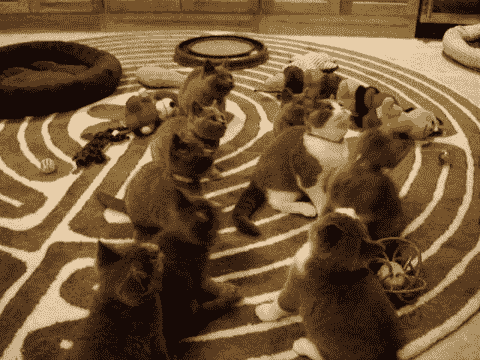

GIF from this [website](https://giphy.com/gifs/afvpets-afv-americas-funniest-home-videos-l41Yea1LYiWd8HBGU)

最近我一直在玩[特征值和向量以及投影](/only-numpy-having-fun-with-eigen-value-s-vectors-with-interactive-code-in-numpy-80d3443dfd22)。(通过点积)现在我想看看它们是如何被整合到神经网络中的。(自动编码器)。此外，请注意，我在这里使用的技术与执行[主成分分析(PCA](https://sebastianraschka.com/Articles/2014_pca_step_by_step.html#4-computing-eigenvectors-and-corresponding-eigenvalues) )时非常相似，但并不完全相同。(具体来说，我没有删除维度，也没有对特征值进行排序)。所以我不会叫它 PCA。在这篇文章中，我将比较不同的自动编码器，如…..

***情况 a)改变潜在向量基的自动编码器
情况 b)改变潜在向量基并增加网络参数的自动编码器
情况 c)普通自动编码器
情况 d)改变潜在向量基的自动编码器(不同的激活函数)
情况 e)改变隐藏层基的自动编码器
情况 f)改变隐藏层基的自动编码器(2)***

> **请注意，这个帖子只是为了自己表达创意。**

**网络架构/数据集**

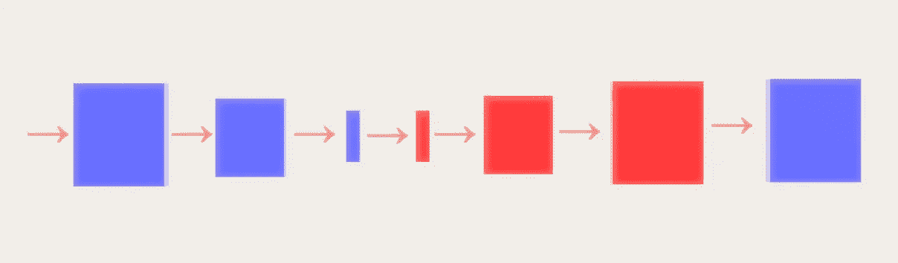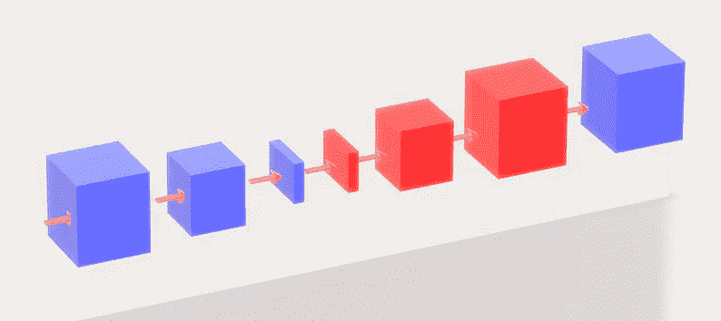

**蓝色矩形** →卷积/全连接层
**红色矩形** →转置卷积/全连接层

如上所述，我们的网络仅由 3 个卷积运算、2 个全连接层和 2 个用于上采样的转置卷积运算组成。对于下采样操作，我选择使用下采样操作。现在我将要使用的数据集是著名的 [MNIST 数据集。](http://yann.lecun.com/exdb/mnist/)

***情况 a)自动编码器改变潜在向量的基础***

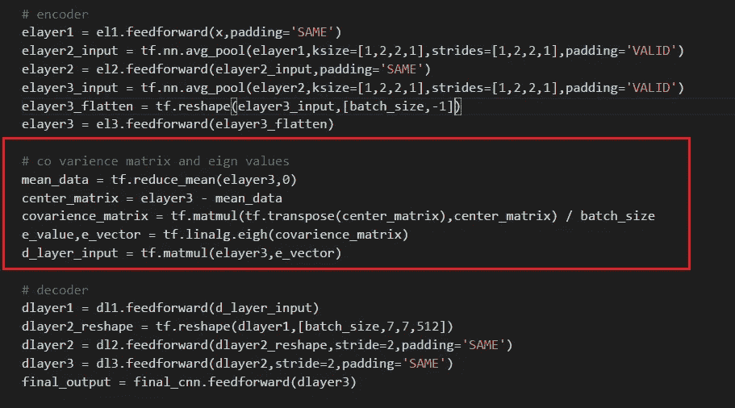

**红色部分** →自动编码器潜在向量的基础变化

由于我们要将维度从 28*28 降低到 3，因此我们实际上可以计算隐藏表示的协方差矩阵，并使用协方差矩阵的特征向量来投影原始数据。

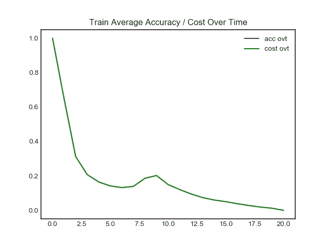

**左侧 GIF** →生成的训练图像
**右侧图像** →训练阶段的时间成本

网络在生成原始图像方面表现不佳，大多数图像都很模糊，甚至与原始图像不接近。现在让我们来看看编码向量的潜在空间。

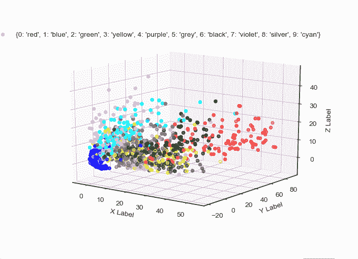

如上所述，在改变基底之前，我们可以看到编码器实际上在将相似图像彼此聚类方面做得很好。

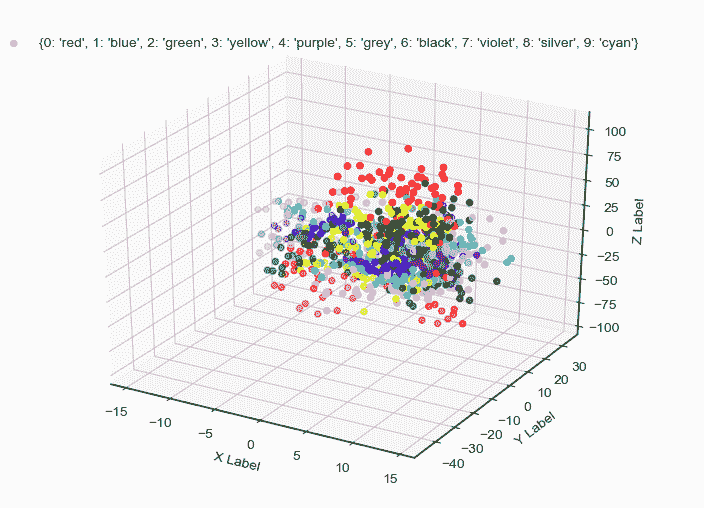

然而，在投影到本征向量后，我们可以看到，现在数据已经混合在一起，显然彼此不能完全分开。

***情况 b)增加了网络参数*** 改变了潜在向量的基的自动编码器

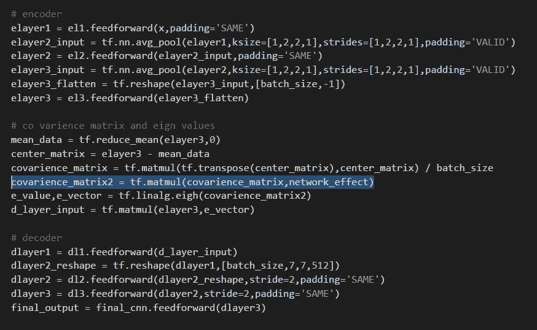

现在，我添加了一个名为 network_effect 的参数，这是一个来自均匀分布的 3*3 矩阵。(范围 0–1)。这是因为我想让网络对投影空间有更多的控制。

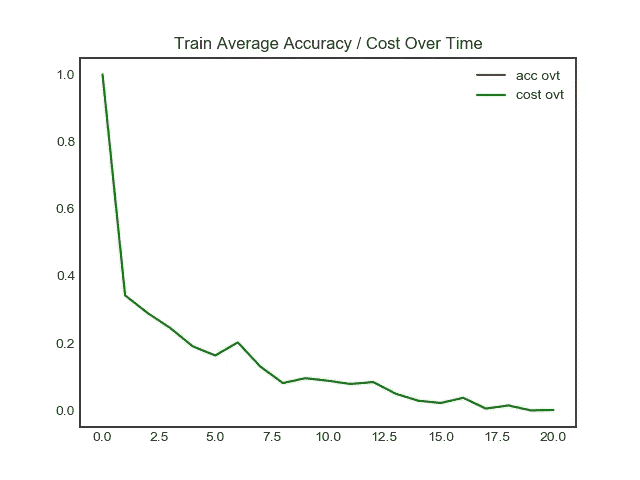

**左图 GIF** →生成的训练图像
**右图** →训练阶段的时间成本

与情况 a)相比，该网络做得还不错，然而，同样，大多数生成的图像是模糊的，不可识别的。

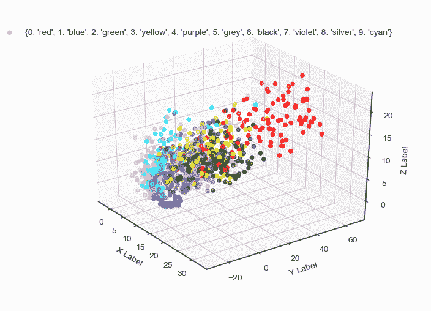

同样，当我们可视化编码的潜在空间时，我们观察到编码器在聚类相似图像方面做得很好。(投影前)

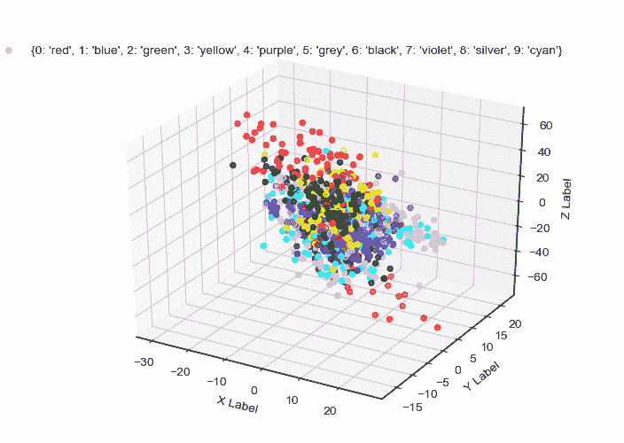

但是，在向量投影之后，每一类之间的编码空间实际上恶化了。

***案例 c)普通自动编码器***

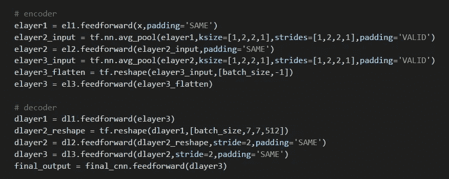

被上面两个网络的性能所质疑，我想知道网络架构本身是否是问题所在。所以我训练了一个普通的自动编码器。

**左侧 GIF** →生成的训练图像
**右侧图像** →训练阶段的时间成本

与其他网络相比，vanilla 在生成和分离潜在空间中的数据方面做得最好。

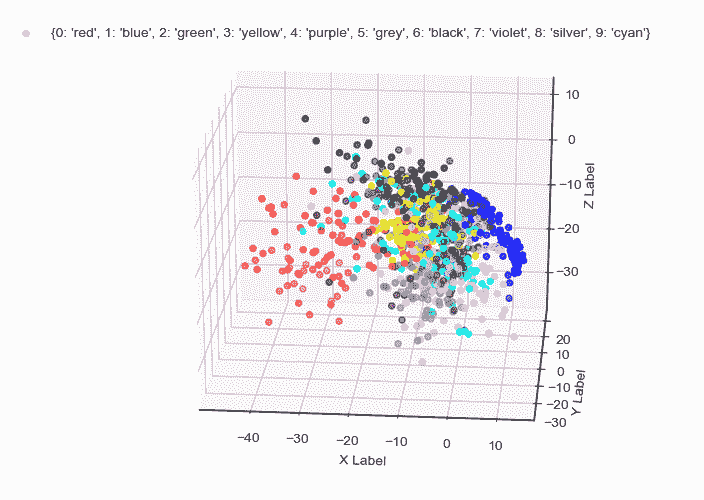

如上所述，每种颜色的数据点都很好地聚集在一起。

***情况 d)自动编码器改变潜在向量的基础(不同的激活函数)***

**红色部分** → Tanh 激活功能

从以前的 GIF 中，我们可以观察到生成的潜在空间的范围是巨大的。(当我们要生成数据的时候，这不是一件好事。所以我想看看当我使用一个双曲正切函数而不是一个恒等函数时，事情会有什么变化。

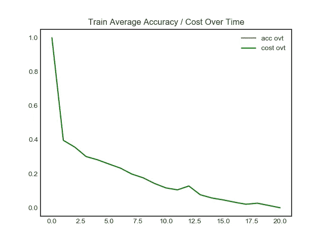

**左侧 GIF** →生成的训练图像
**右侧图像** →训练阶段的时间成本

不幸的是，生成的图像非常模糊，不是最好的。

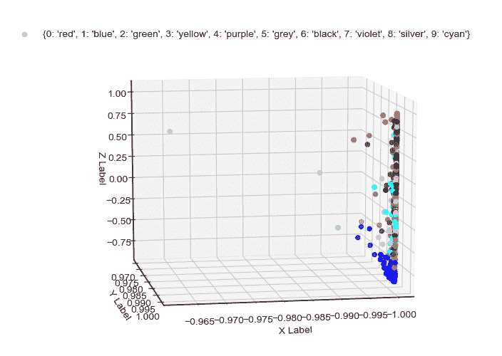

如上所述，现在潜在空间在更近的范围内，但是数据点彼此之间的聚类很差。非常非常差。

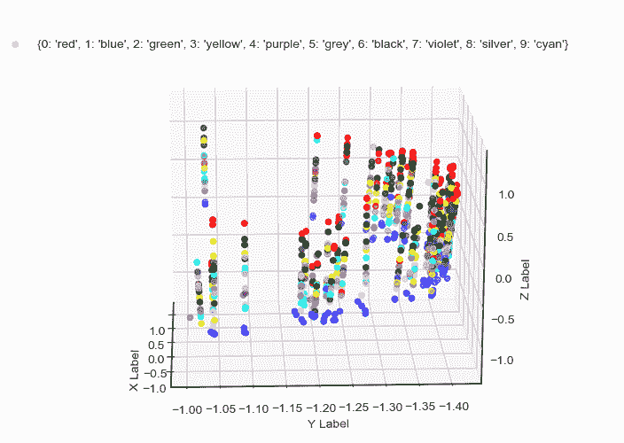

然而，在投射之后，它产生了我所见过的最有趣的图案。我希望回到这件事上来，因为它太有趣了。

***情况 e)隐藏层*** 基础改变的自动编码器

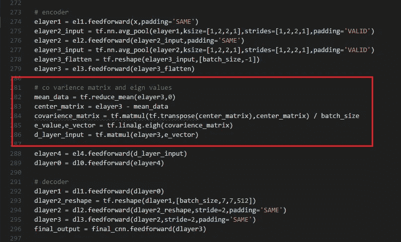

现在，我想看看当我在创建潜在空间的完全连接的层后面的层上执行投影时的效果。(如果我可怕的描述没有意义，请理解为我在不同的层上做了相同的操作。)

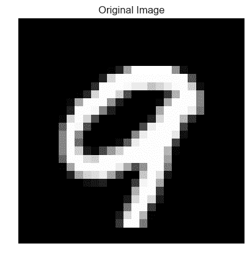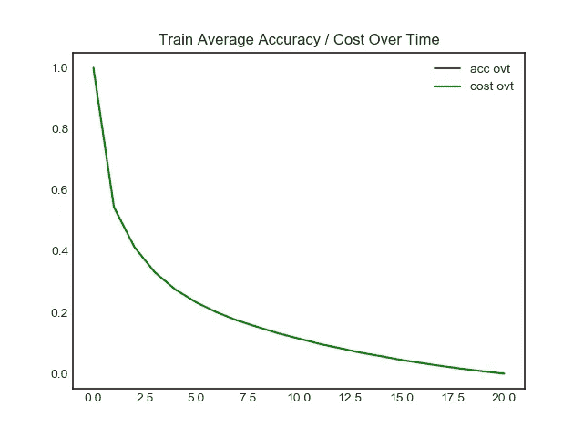

网络实际上在生成新图像方面做得很好，当我们观察潜在空间时，我们可以观察到类似的潜在空间，当我们与普通的自动编码器进行比较时。

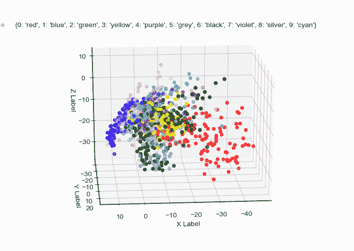

实际上，我认为它比普通的自动编码器做得更好。

***情况 f)自动编码器与隐藏层的基础变化(2)***

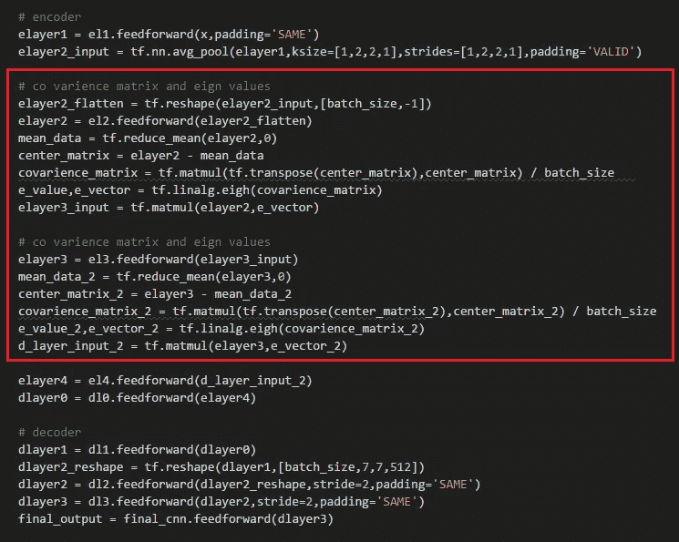

前一个实验者的自然延伸是在不同的层上执行相同的操作。(在这里，我将在前面两层上执行它。)

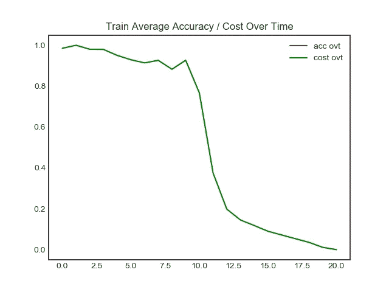

尽管这个网络产生了最有趣的图像模式，但实验还是彻底失败了。

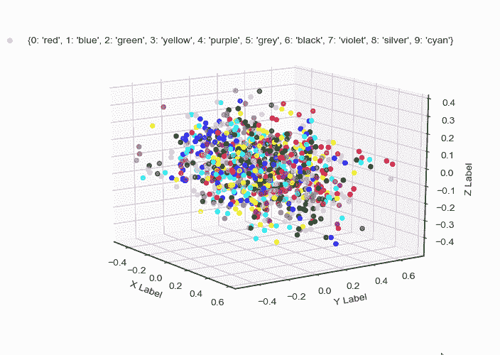

当我们看到潜在空间时，我们可以看到这些数据点是无法区分的。

**互动码**

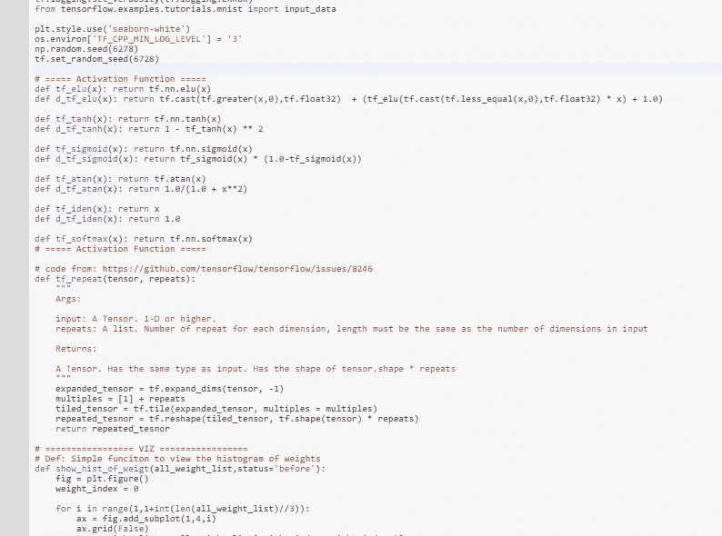

对于 Google Colab，您需要一个 Google 帐户来查看代码，而且您不能在 Google Colab 中运行只读脚本，所以请在您的操场上创建一个副本。最后，我永远不会请求允许访问你在 Google Drive 上的文件，仅供参考。编码快乐！同样为了透明，我在 github 上上传了所有的训练日志。

要访问[案例 a 的代码，请单击她的](https://colab.research.google.com/drive/1OZPXC31aa_vfNlZcU9YQN2f_N1Zvat9P) e，要查看[日志，请单击此处。](https://github.com/JaeDukSeo/Daily-Neural-Network-Practice-2/blob/master/NeuralNetwork/eigen_auto/casea/viz/casea.txt)
点击 h 查看[案例 b 的代码，点击 l](https://colab.research.google.com/drive/1JJTkQssUfBrx7FKFADktkfjHYvQHN08q) [ogs 点击此处](https://github.com/JaeDukSeo/Daily-Neural-Network-Practice-2/blob/master/NeuralNetwork/eigen_auto/caseb/viz/caseb.txt)。
要访问[案例 c 的代码，单击](https://colab.research.google.com/drive/1mI3O58MCQNHZH16L8CXEH3d7P0toqpWC) re，要查看[日志，单击此处](https://github.com/JaeDukSeo/Daily-Neural-Network-Practice-2/blob/master/NeuralNetwork/eigen_auto/casec/viz/casec.txt)。
点击此处访问 [r 案例 d 的代码，点击此处查看](https://colab.research.google.com/drive/11tKfr129M8GoF0gyt7Qd2J1TWC7BXh_A)[日志。](https://github.com/JaeDukSeo/Daily-Neural-Network-Practice-2/blob/master/NeuralNetwork/eigen_auto/cased/viz/cased.txt)
访问[案例 e 的代码点击此处，](https://colab.research.google.com/drive/1aw4PmlS7VrdBXypV0GY89hDQ9V2-yAcx)[日志的](https://github.com/JaeDukSeo/Daily-Neural-Network-Practice-2/blob/master/NeuralNetwork/eigen_auto/casee/viz/casee.txt)点击此处。
点击此处查看[案例 f 的代码](https://colab.research.google.com/drive/151eI5QtO6xUU7qAVuIUhS-QMdfIXLpp6)，点击此处查看[日志。](https://github.com/JaeDukSeo/Daily-Neural-Network-Practice-2/blob/master/NeuralNetwork/eigen_auto/casef/viz/casef.txt)

**最后的话**

这是一个非常有趣的实验，通常我认为自动编码器本身就是一种降维的方法。但是现在，我越来越想知道是否可以在网络中加入额外的技术。

如果发现任何错误，请发电子邮件到 jae.duk.seo@gmail.com 给我，如果你想看我所有写作的列表，请在这里查看我的网站。

同时，在我的 twitter 上关注我[这里](https://twitter.com/JaeDukSeo)，访问[我的网站](https://jaedukseo.me/)，或者我的 [Youtube 频道](https://www.youtube.com/c/JaeDukSeo)了解更多内容。我还实现了[广残网，请点击这里查看博文](https://medium.com/@SeoJaeDuk/wide-residual-networks-with-interactive-code-5e190f8f25ec) t。

**参考**

1.  导入 tflearn 错误:属性错误:模块“熊猫”没有属性“计算”问题#766 tflearn/tflearn。(2018).GitHub。检索于 2018 年 7 月 11 日，来自[https://github.com/tflearn/tflearn/issues/766](https://github.com/tflearn/tflearn/issues/766)
2.  适合 ML 初学者的 MNIST。(2018).张量流。检索于 2018 年 7 月 11 日，来自[https://www . tensor flow . org/versions/r 1.0/get _ started/mnist/初学者](https://www.tensorflow.org/versions/r1.0/get_started/mnist/beginners)
3.  警告，T. (2018)。Tensorflow 导入 mnist 警告。堆栈溢出。检索于 2018 年 7 月 11 日，来自[https://stack overflow . com/questions/49901806/tensor flow-importing-mnist-warnings](https://stackoverflow.com/questions/49901806/tensorflow-importing-mnist-warnings)
4.  TensorFlow，E. (2018)。张量流中的特征值问题。堆栈溢出。检索于 2018 年 7 月 11 日，来自[https://stack overflow . com/questions/43697539/tensor flow 中的特征值问题](https://stackoverflow.com/questions/43697539/eigenvalue-problems-in-tensorflow)
5.  基本功能的领域和范围。(2018).Analyzemath.com。检索于 2018 年 7 月 11 日，来自[http://www . analyze math . com/domain range/domain _ range _ functions . html](http://www.analyzemath.com/DomainRange/domain_range_functions.html)
6.  tf.self _ 共轭 _eig | TensorFlow。(2018).张量流。检索于 2018 年 7 月 11 日，来自[https://www . tensor flow . org/API _ docs/python/TF/self _ 共轭 _eig](https://www.tensorflow.org/api_docs/python/tf/self_adjoint_eig)
7.  (2018).Users.stat.umn.edu。检索于 2018 年 7 月 11 日，来自[http://users.stat.umn.edu/~helwig/notes/datamat-Notes.pdf](http://users.stat.umn.edu/~helwig/notes/datamat-Notes.pdf)
8.  tf.random_uniform | TensorFlow。(2018).张量流。检索于 2018 年 7 月 11 日，来自[https://www . tensor flow . org/API _ docs/python/TF/random _ uniform](https://www.tensorflow.org/api_docs/python/tf/random_uniform)
9.  tf.self _ 共轭 _eig | TensorFlow。(2018).张量流。检索于 2018 年 7 月 11 日，来自[https://www . tensor flow . org/API _ docs/python/TF/self _ agreement _ EIG](https://www.tensorflow.org/api_docs/python/tf/self_adjoint_eig)
10.  实施主成分分析(PCA)。(2014).塞巴斯蒂安·拉什卡博士。检索于 2018 年 7 月 11 日，来自[https://sebastianraschka . com/Articles/2014 _ PCA _ step _ by _ step . html # 4-计算-特征向量-及对应-特征值](https://sebastianraschka.com/Articles/2014_pca_step_by_step.html#4-computing-eigenvectors-and-corresponding-eigenvalues)
11.  MNIST 手写数字数据库，Yann LeCun，Corinna Cortes 和 Chris Burges。(2018).Yann.lecun.com。检索于 2018 年 7 月 11 日，来自[http://yann.lecun.com/exdb/mnist/](http://yann.lecun.com/exdb/mnist/)