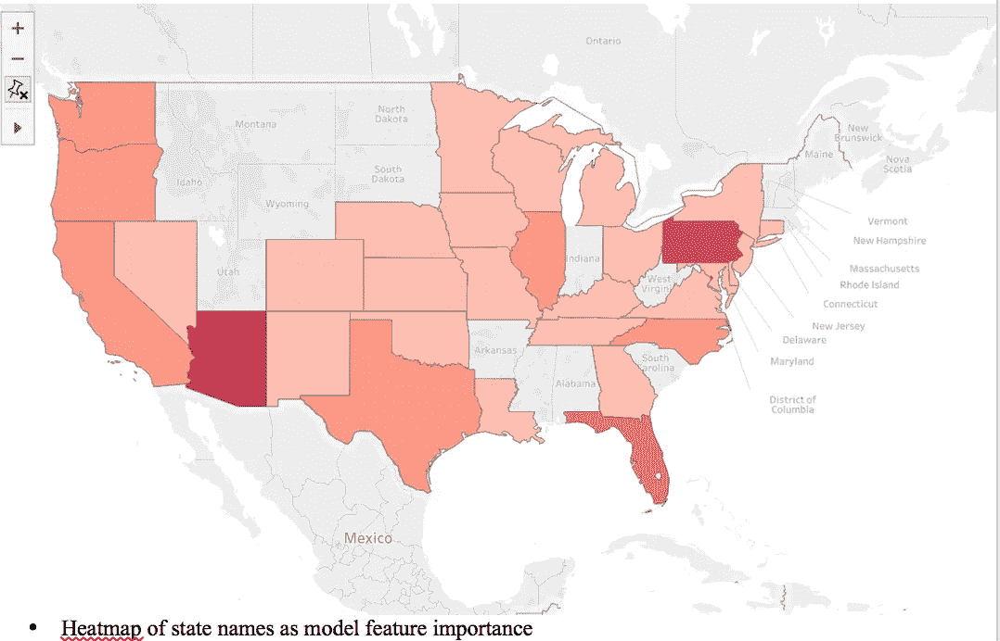
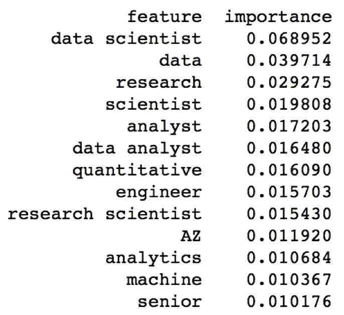

# 数据科学家的薪酬要素

> 原文：<https://towardsdatascience.com/elements-of-a-data-scientists-salary-1dc547f6d888?source=collection_archive---------4----------------------->

到目前为止，我在大会经历中最喜欢的部分是网络抓取项目。虽然在我们将在数据科学沉浸式课程中涉及的更简单的任务中，web 抓取是我最感兴趣的。我甚至写过两篇关于编写一个简单的 scraper 的博文(这篇博文的灵感来自这个项目)。

该项目的目标是找出哪些特征或变量与高薪数据科学家职位最直接相关。为了收集数据，我们在 indeed.com 运行了一个 web scraper，从美国 40 多个城市的招聘信息中提取数据。然后对数据进行处理，以创建逻辑元素，最大限度地让我们确定何时一份工作的薪酬高于全国职业的中位数。该项目得出的结论是，除了更直接的“数据科学家”术语，对决策重要的其他特征是术语“定量”、“工程师”和“机器”。没有特定的技能或编程语言成为最重要的词汇，然而，亚利桑那州和俄勒冈州都登记为负面影响特征。

# 我的方法

这些数据是使用一个 web scraper 获得的，该 web scraper 针对术语“数据科学家”迭代了 350 多个页面，并针对 42 个美国城市重复了这一过程。对于 scraper 找到的每个职位发布，它都记录了职位名称、位置、公司名称和薪水。绝大多数帖子不包括工资数据，由于它们是这个项目的目标，我只能使用包括上述数据的条目。

然后，salary 列被转换为 float，如果提供了范围，则进行平均。基于月/周/日的工资数据被转换以匹配单位:美元/年。当工资浮动数据准备就绪时，我取数据的中间值，并将高于和低于该值的任何条目分别转换为二进制 1 和 0。当我们创建模型中使用的变量时，这个过程被重复。这背后的基本原理是因为我们正在尝试使用逻辑分类来解决这个问题，它适用于二元选择。

在使用上述过程为职位和位置(按州)中的几个关键词设置变量后，我利用了一个过程，该过程对职位的所有条目中的单词进行计数，并根据它们与成功结果(即正确预测)的相关程度对它们进行排序。这个项目选择的模型是 Random Forest，这是一个分类聚合器，将使用二进制数据进行位置和“单词排序”。

# 结果

当预测与我们在实验开始前生成的测试数据集进行比较时，该模型产生了 89%的准确率。在被认为对预测很重要的显著特征中，该模型确定，除了职位名称中“数据、科学家、研究、分析师”及其组合等显而易见的词之外，还有一些其他被认为很重要的词:定量、机器、高级和技术人员，顺序如下。根据该模型，排名前 15 位的唯一一个州是亚利桑那州，排在第 10 位。

当我使用 Scikit Learn 在逻辑回归模型上运行相同的变量时，使用与上述相同的标准，我最终得到了 84%的相似准确度分数。尽管重要性的度量并不等同于系数值的排名，但我能够看到我的随机森林模型识别的特征也是逻辑回归模型中更具影响力的变量:数量、工程师、高级、亚利桑那州，这些特征都与成功的预测有非常积极或消极的关系。

下面我提供了一个简短的表格，列出了来自随机森林模型的单词作为特征及其各自的重要性，以及来自逻辑回归模型的单词及其各自的系数:

*   抱歉，尺寸有问题..

# 最后的想法…

总结从这项研究中得出的所有信息，当发布工作或寻找工作时，要注意你的用词会对薪水期望和潜在的谈判优势产生影响。在更大范围的求职中，进行像我这样的研究并不特别耗时，所以花点时间去调查市场。最坏的情况是，如果你获得了这些链接，你就有了一个很好的工作数据库和申请方法，让你的求职工作效率成倍提高。