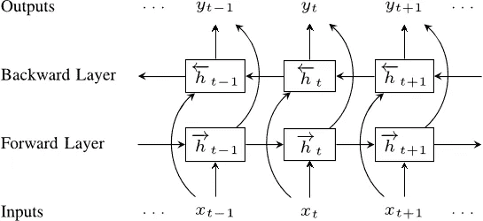

# 带 TensorFlow hub 的 Keras 中的 Elmo 嵌入

> 原文：<https://towardsdatascience.com/elmo-embeddings-in-keras-with-tensorflow-hub-7eb6f0145440?source=collection_archive---------1----------------------->

新发布的 [Tensorflow hub](https://www.tensorflow.org/hub/) 提供了一个简单的接口，可以使用现有的机器学习模型进行迁移学习。然而，有时启动 Keras 并快速构建模型原型也是不错的。通过一些修复，很容易将 Tensorflow hub 模型与 Keras 集成在一起！

[在](https://arxiv.org/pdf/1802.05365.pdf) [Allen NLP](http://allennlp.org/elmo) 开发的 ELMo 嵌入，是 Tensorflow Hub 上许多优秀的预训练模型之一。ELMo 嵌入从双向 LSTM 的内部状态中学习，并表示输入文本的上下文特征。在各种各样的自然语言处理任务中，它的表现都优于 GloVe 和 Word2Vec 嵌入。



A bidirectional LSTM is trained on a large text corpus, and the internal states are combined to calculate rich, context sensitive features of text.

这是我们在 [Strong Analytics](http://strong.io) 的团队最近使用 Keras 中最先进的 ELMo 嵌入技术制作的一个 NLP 模型的原型。

首先，我们加载一些数据:

```
# Load all files from a directory in a DataFrame.
def load_directory_data(directory):
  data = {}
  data["sentence"] = []
  data["sentiment"] = []
  for file_path in os.listdir(directory):
    with tf.gfile.GFile(os.path.join(directory, file_path), "r") as f:
      data["sentence"].append(f.read())
      data["sentiment"].append(re.match("\d+_(\d+)\.txt", file_path).group(1))
  return pd.DataFrame.from_dict(data)

# Merge positive and negative examples, add a polarity column and shuffle.
def load_dataset(directory):
  pos_df = load_directory_data(os.path.join(directory, "pos"))
  neg_df = load_directory_data(os.path.join(directory, "neg"))
  pos_df["polarity"] = 1
  neg_df["polarity"] = 0
  return pd.concat([pos_df, neg_df]).sample(frac=1).reset_index(drop=True)

# Download and process the dataset files.
def download_and_load_datasets(force_download=False):
  dataset = tf.keras.utils.get_file(
      fname="aclImdb.tar.gz", 
      origin="http://ai.stanford.edu/~amaas/data/sentiment/aclImdb_v1.tar.gz", 
      extract=True)

  train_df = load_dataset(os.path.join(os.path.dirname(dataset), 
                                       "aclImdb", "train"))
  test_df = load_dataset(os.path.join(os.path.dirname(dataset), 
                                      "aclImdb", "test"))

  return train_df, test_df

# Reduce logging output.
tf.logging.set_verbosity(tf.logging.ERROR)

train_df, test_df = download_and_load_datasets()
train_df.head()
```

我们接下来处理我们的数据。注意，要使用字符串作为 Keras 模型的输入，我们需要创建一个 numpy 对象数组。我已经将这些数据限制为内存的前 150 个字(ELMo 嵌入是计算密集型的，所以使用 GPU！).

```
# Create datasets (Only take up to 150 words)
train_text = train_df['sentence'].tolist()
train_text = [' '.join(t.split()[0:150]) for t in train_text]
train_text = np.array(train_text, dtype=object)[:, np.newaxis]
train_label = train_df['polarity'].tolist()test_text = test_df['sentence'].tolist()
test_text = [' '.join(t.split()[0:150]) for t in test_text]
test_text = np.array(test_text, dtype=object)[:, np.newaxis]
test_label = test_df['polarity'].tolist()
```

要在 Keras 中实例化 Elmo 嵌入，我们首先必须创建一个自定义层，以确保嵌入权重是可训练的:

```
class ElmoEmbeddingLayer(Layer):
    def __init__(self, **kwargs):
        self.dimensions = 1024
        self.trainable = True
        super(ElmoEmbeddingLayer, self).__init__(**kwargs)def build(self, input_shape):
        self.elmo = hub.Module('[https://tfhub.dev/google/elmo/2'](https://tfhub.dev/google/elmo/2'), trainable=self.trainable, name="{}_module".format(self.name))self.trainable_weights += K.tf.trainable_variables(scope="^{}_module/.*".format(self.name))
        super(ElmoEmbeddingLayer, self).build(input_shape)def call(self, x, mask=None):
        result = self.elmo(K.squeeze(K.cast(x, tf.string), axis=1),
                      as_dict=True,
                      signature='default',
                      )['default']
        return resultdef compute_mask(self, inputs, mask=None):
        return K.not_equal(inputs, '--PAD--')def compute_output_shape(self, input_shape):
        return (input_shape[0], self.dimensions)
```

现在，我们可以使用 ElmoEmbeddingLayer 构建和训练我们的模型:

```
input_text = layers.Input(shape=(1,), dtype=tf.string)
embedding = ElmoEmbeddingLayer()(input_text)
dense = layers.Dense(256, activation='relu')(embedding)
pred = layers.Dense(1, activation='sigmoid')(dense)model = Model(inputs=[input_text], outputs=pred)model.compile(loss='binary_crossentropy', optimizer='adam', metrics=['accuracy'])
model.summary()model.fit(train_text, 
          train_label,
          validation_data=(test_text, test_label),
          epochs=5,
          batch_size=32)
```

就是这样！tensorflow hub 上有很多很棒的模型，一定要全部试用！

点击这里查看 IPython 笔记本:[https://github . com/strong io/keras-Elmo/blob/master/Elmo % 20 keras . ipynb](https://github.com/strongio/keras-elmo/blob/master/Elmo%20Keras.ipynb)'

***想和芝加哥的顶级数据科学家团队一起从事各种行业中具有挑战性的 NLP、机器学习和 AI 工作吗？我们正在招聘有才华的数据科学家和工程师！***

在 [strong.io](http://strong.io) 了解更多信息，并在 [careers.strong.io](https://careers.strong.io/) 申请