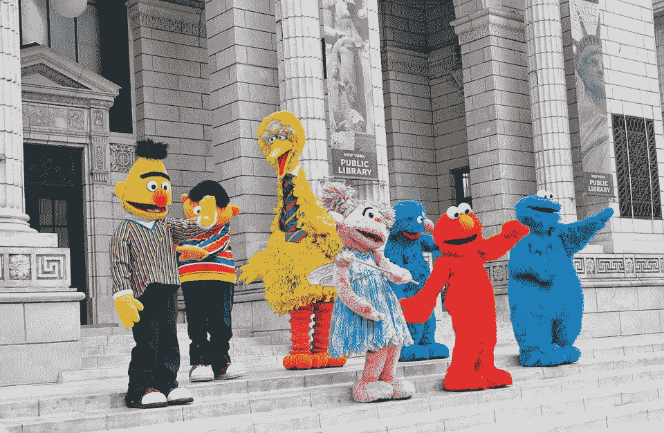
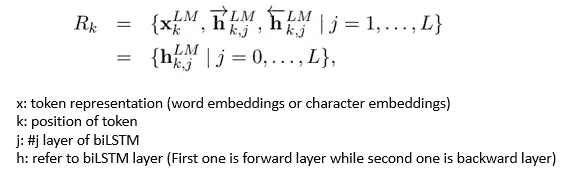
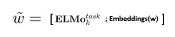

# ELMo 有助于进一步提高你的句子嵌入

> 原文：<https://towardsdatascience.com/elmo-helps-to-further-improve-your-word-embeddings-c6ed2c9df95f?source=collection_archive---------4----------------------->



by [https://pixabay.com/en/universal-studios-singapore-2413365/](https://pixabay.com/en/universal-studios-singapore-2413365/)

在最后一个故事中，[上下文化的单词向量](/replacing-your-word-embeddings-by-contextualized-word-vectors-9508877ad65d) (CoVe)被引入，这是单词嵌入的增强版本。Peters 等人提出了深度语境化单词表征，旨在为不同语境下的自然语言处理任务提供更好的单词表征。他们称之为 ELMo(来自语言模型的嵌入)。

看完这篇帖子，你会明白:

*   语言模型设计中的嵌入
*   体系结构
*   履行
*   拿走

# 语言模型设计中的嵌入


Photo by [Conor Luddy](https://unsplash.com/@madebyluddy?utm_source=medium&utm_medium=referral) on [Unsplash](https://unsplash.com?utm_source=medium&utm_medium=referral)

ELMo 使用双向语言模型(biLM)来学习单词(例如，句法和语义)和语言上下文(即，对多义性建模)。在预训练之后，向量的内部状态可以被转移到下游的 NLP 任务。Peters 等人使用 6 个 NLP 任务来评估 biLM 的结果。

这些任务分别是**问答**、**文本蕴涵**、**语义角色标注**、**指代消解**、**命名实体抽取**和**情感分析**。他们都取得了优异的成绩。

# 体系结构

与传统的单词嵌入不同，ELMo 针对不同的场景，为每个单词生成多个单词嵌入。较高层捕获单词嵌入的上下文相关方面，而较低层捕获语法的模型方面。在最简单的情况下，我们只使用 ELMo 的顶层(只有一层),同时我们也可以将所有层合并成一个矢量。



Peters et al. (2018)

我们可以连接 ELMo 向量和令牌嵌入([单词嵌入](/3-silver-bullets-of-word-embedding-in-nlp-10fa8f50cc5a)和/或[字符嵌入](/besides-word-embedding-why-you-need-to-know-character-embedding-6096a34a3b10))以形成如下新嵌入:



在实验中，Peters 等人使用 L=2 (2 个 biLSTM 层),其中 4096 个单元和 512 个输出维度用于上下文相关部分，而 2048 个字符 n-gram 构成过滤器和 512 个输出维度用于上下文不敏感部分，以构建上下文化的单词嵌入。

# 履行

原作者是 McCann 等人，他们用 python 3.6 通过 Pytorch 实现了 ELMo。有 Tensorflow，chainer 和 Keras 版本可供选择。我将使用 Keras 版本来演示我们如何将文本转换为矢量。对于其他人，您可以查看参考资料部分提到的 githubs。

下面的例子展示了我们如何使用 keras 来实现它。 *Tensorflow Hub* 是一个模型 Hub，存储了大量不同的模型。如果您只需要一个预训练的嵌入，您可以使用下面的代码从 Tensorflow Hub 中检索它并传输到 Keras。

可以从 Tensorflow Hub 预训练模型中选择 2 个嵌入层(总共有 5 层)。第一个“elmo”是其他 3 层的加权和。第二个是“默认”，它是所有层的固定均值轮询。你可以从[这里](https://alpha.tfhub.dev/google/elmo/2)找到更多信息。

在我的演示中，有 3 种方法可以使用 ELMo 预训练模型。它们是:

1.  具有单词嵌入的 3 层的加权和
2.  没有单词嵌入的 3 层的加权和
3.  不含单词嵌入的固定均值池

***1。具有单词嵌入的 3 层的加权和***

```
# Input Layers
word_input_layer = Input(shape=(None, ), dtype='int32')
elmo_input_layer = Input(shape=(None, ), dtype=tf.string)# Output Layers
word_output_layer = Embedding(
    input_dim=vocab_size, output_dim=256)(word_input_layer)
elmo_output_layer = Lambda(
    elmo_embs.to_keras_layer, 
    output_shape=(None, 1024))(elmo_input_layer)
output_layer = Concatenate()(
    [word_output_layer, elmo_output_layer])
output_layer = BatchNormalization()(output_layer)
output_layer = LSTM(
    256, dropout=0.2, recurrent_dropout=0.2)(output_layer)
output_layer = Dense(4, activation='sigmoid')(output_layer)# Build Model
model = Model(
    inputs=[word_input_layer, elmo_input_layer], 
    outputs=output_layer)
model.compile(
    loss='sparse_categorical_crossentropy', 
    optimizer='adam', metrics=['accuracy'])
model.summary()
model.fit(
    [x_train_words, x_train_sentences], y_train,
#     validation_data=([x_test_words, x_test_sentences], y_test), 
    epochs=10, batch_size=32)
```

结果

```
Accuracy:77.10%
Average Precision: 0.78
Average Recall: 0.77
Average f1: 0.76
```

***2。没有单词嵌入的 3 层的加权和***

```
# Input Layers
elmo_input_layer = Input(shape=(None, ), dtype=tf.string)# Output Layers
output_layer = Lambda(
    elmo_embs.to_keras_layer, 
    output_shape=(None, 1024))(elmo_input_layer)
output_layer = BatchNormalization()(output_layer)
output_layer = LSTM(
    256, dropout=0.2, recurrent_dropout=0.2)(output_layer)
output_layer = Dense(4, activation='sigmoid')(output_layer)# Build Model
model = Model(
    inputs=elmo_input_layer, outputs=output_layer)
model.compile(
    loss='sparse_categorical_crossentropy', 
    optimizer='adam', metrics=['accuracy'])
model.summary()
model.fit(
    x_train_sentences, y_train,
#     validation_data=([x_test_words, x_test_sentences], y_test), 
    epochs=10, batch_size=32)
```

结果

```
Accuracy:76.83%
Average Precision: 0.78
Average Recall: 0.77
Average f1: 0.77
```

***3。不含单词嵌入的固定均值池***

```
# Input Layers
input_layer = Input(shape=(None,), dtype=tf.string)# Output Layers
output_layer = Lambda(
    elmo_embs.to_keras_layer, 
    output_shape=(1024,))(input_layer)
output_layer = Dense(
    256, activation='relu')(output_layer)
output_layer = Dense(4, activation='sigmoid')(output_layer)model = Model(inputs=[input_layer], outputs=output_layer)
model.compile(
    loss='sparse_categorical_crossentropy', 
    optimizer='adam', metrics=['accuracy'])
model.summary()
model.fit(
    x_train_sentences, y_train,
#     validation_data=([x_test_words, x_test_sentences], y_test), 
    epochs=10, batch_size=32)
```

结果

```
Accuracy:74.37%
Average Precision: 0.79
Average Recall: 0.74
Average f1: 0.75
```

# 拿走

要访问所有代码，您可以访问这个 [github](https://github.com/makcedward/nlp/blob/master/sample/nlp-embeddings-sentence-elmo.ipynb) repo

*   CoVe 需要标签数据来获得上下文单词向量，而 ELMo 则采用无监督的方式。
*   CoVe 只使用最后一层，而 ELMo 使用多层来表示上下文单词。
*   无法解决 OOV 问题。它建议使用零向量来表示未知单词。ELMO 可以处理 OOV 问题，因为它使用**字符嵌入**来构建单词嵌入。
*   ELMo 计算矢量很费时间。根据作者的建议，您可以离线预计算令牌，并在在线预测期间查找它，以减少时间开销。

# 关于我

我是湾区的数据科学家。专注于数据科学、人工智能，尤其是 NLP 和平台相关领域的最新发展。你可以通过[媒体博客](http://medium.com/@makcedward/)、 [LinkedIn](https://www.linkedin.com/in/edwardma1026) 或 [Github](https://github.com/makcedward) 联系我。

# 参考

彼得斯 M. E .、诺依曼 m .、乌耶 m .、加德纳 m .、克拉克 c ...深层语境化的词语表达。2018.[https://arxiv.org/pdf/1802.05365.pdf](https://arxiv.org/pdf/1802.05365.pdf)

[py torch 中的 ELMo](https://github.com/allenai/allennlp/)(原创)

[ELMo in Keras](https://github.com/strongio/keras-elmo/blob/master/Elmo%20Keras.ipynb)

[ELMo in Tensorflow](https://github.com/allenai/bilm-tf)

[ELMo in chainer](https://github.com/chainer/models/tree/master/elmo-chainer)