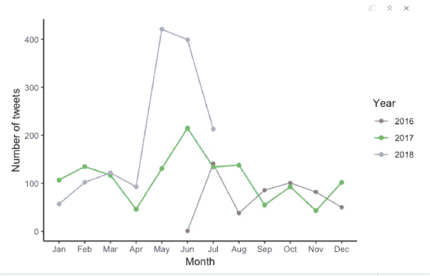
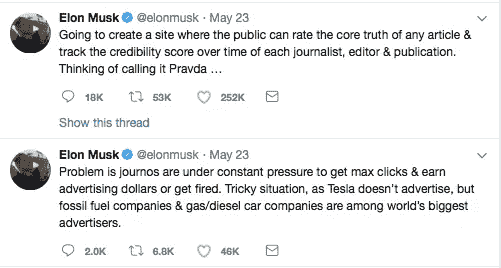
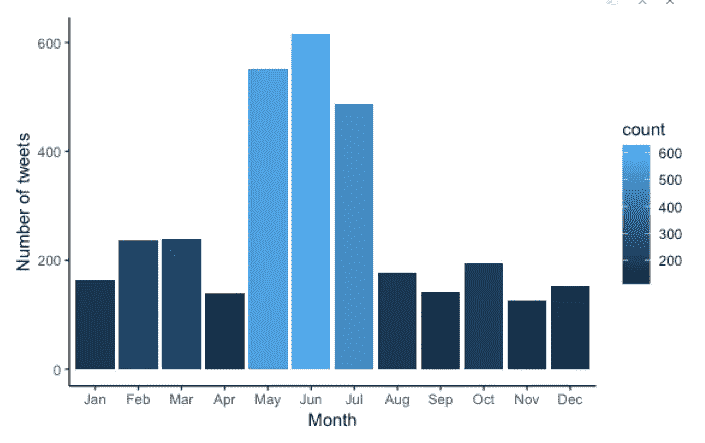
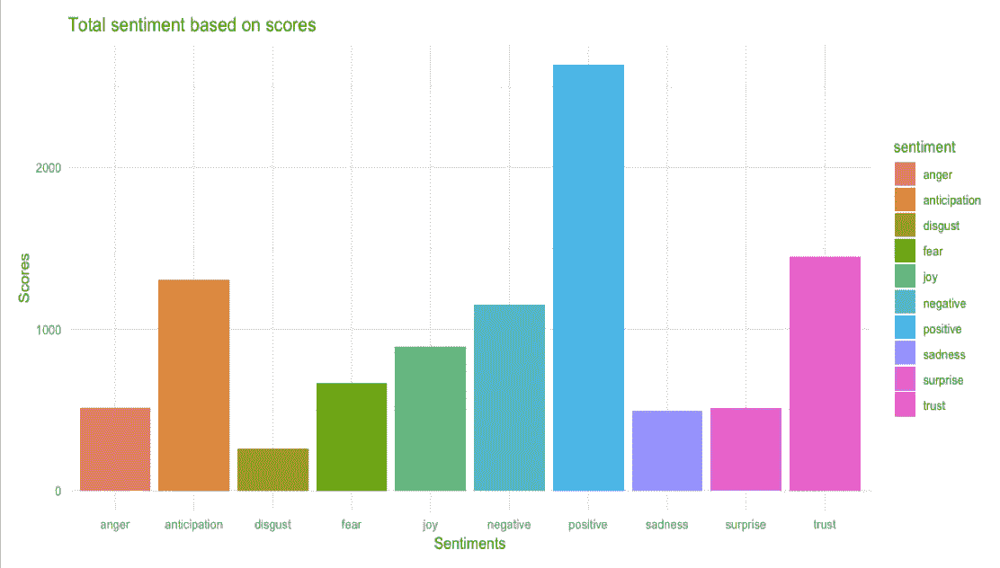
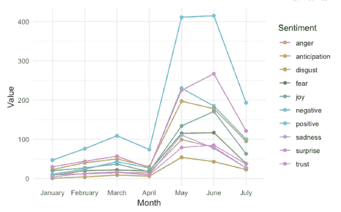
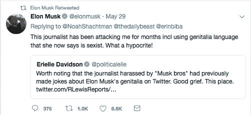
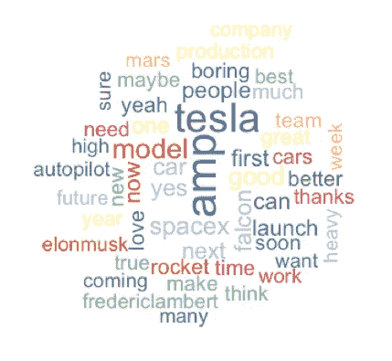
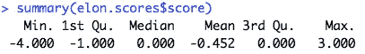
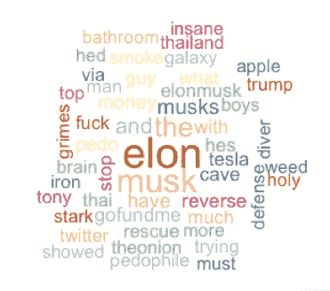

# 埃隆·马斯克和推特

> 原文：<https://towardsdatascience.com/elon-musk-twitter-adf324120b3f?source=collection_archive---------6----------------------->

## Elon 与 Twitter“麝香”关系的频率和情感分析

Twitter 是一个强大的微博工具，从一开始就改变了人们的对话——不管是好是坏。有如此多的数据可用，因为它有数百万全球活跃用户来收集和利用。

特斯拉和 SpaceX 的首席执行官埃隆·马斯克(Elon Musk)因其最近的推文而成为争议的焦点。我想既然他是一个在世的名人，分析他在 Twitter 上的行为和声誉会很有趣。


我把我的项目分成几个部分:对马斯克的推文频率的分析，对马斯克推文的情感分析，对关于马斯克的推文的情感分析，以词云为产品。

我用 R 和 Twitter 的 API 做了我的项目。链接设置 API [这里](https://cran.r-project.org/web/packages/rtweet/vignettes/auth.html)。

以下代码建立了 twitter 和 R Studios 之间的连接:

```
twitter_token<-create_token(app = "joysentiment1", api_key, api_secret, accessToken, accessTokenSecret, set_renv = TRUE)
```

之后我继续摘录了埃隆·马斯克的 5000 条推文。

```
em_tweets<-get_timeline("ElonMusk",n=5000)
```

***第一部分:推文频率***

我首先查看了埃隆·马斯克过去几年的推特习惯。他于 2009 年加入 Twitter，但只有他自 2016 年以来的推文可用。



Elon Musk’s 5000 Tweets Frequency

```
ggplot(data = em_tweets,
aes(x=em_tweets$month,group=factor(year(created_at)), color=factor(year(created_at)))) +
geom_line(stat="count") +
geom_point(stat="count") +
labs(x="Month", colour="Year",y="Number of tweets") +
theme_classic()
```

值得注意的是，埃隆·马斯克在 5 月和 6 月开始更频繁地发推特。他过去最令人难忘的一些推文可能包括宣布他为记者创建 Yelp [的想法。](https://techcrunch.com/2018/05/23/elon-musk-has-a-very-bad-idea-for-a-website-rating-journalists/)



Yelp for journalists…

我创建了另一个他在 12 个月内发推文频率的可视化，这也不奇怪，他在 5 月、6 月和 7 月在 Twitter 上最活跃。



Elon Musk’s Tweets Frequency over 12 months

```
ggplot(data = em_tweets, aes(x = em_tweets$month)) +
geom_bar(aes(fill = ..count..)) +
xlab("Month") + ylab("Number of tweets") +
theme_classic()
```

这引发了一个重要的问题:为什么马斯克比过去花更多的时间发推特？

***第二部分:马斯克推文的情感分析***

情感分析是针对特定情感/产品对词语进行量化和分类的过程。我在课堂上被介绍了这个概念，并且在阅读了这里的[后变得更加感兴趣。](https://www.tidytextmining.com)

我对埃隆·马斯克的 5000 条推文进行了情绪分析，很想知道这种情绪在过去的一年里是如何变化的。我利用了“NRC”词典，它将单词归类为情绪，如“快乐”、“悲伤”等。

在我的第一次可视化中，我看到埃隆·马斯克的推文主要植根于积极、信任和期待的情绪。



Sentiment Analysis On Elon Musk’s Tweets

```
ggplot(data=primaryscores,aes(x=sentiment,y=Score))+
geom_bar(aes(fill=sentiment),stat = "identity")+
xlab("Sentiments")+ylab("Scores")+
ggtitle("Total sentiment based on scores")+
theme(legend.position="none")+
theme_minimal()
```

我还想看看他的情绪在 2018 年的过去几个月里有什么变化。



Sentiment Analysis on Elon Musk’s Tweets the past year

```
ggplot(data=monthly_sentiment,aes(x=month,y=value,group=sentiment))+
geom_line(aes(color=factor(sentiment)))+
geom_point(aes(color=factor(sentiment)))+
labs(x="Month", colour="Sentiment",y="Value")+
theme_minimal()
```

积极情绪在 4 月和 6 月间达到顶峰。但我们可以看到，愤怒、消极、期待和信任情绪也经历了类似的增长。鉴于他在 Twitter 上的多次公开争吵，这一发现是有道理的。



An example of a public dispute

埃隆经常以积极的态度在推特上谈论他的生活经历，特别是关于他的公司:特斯拉和 SpaceX。


An example of a positive tweet

我想涉及的另一个方面是他的词汇用法。最有效的方法是创建一个单词云，这是我在阅读了这个[指南](https://medium.com/@rohitnair_94843/analysis-of-twitter-data-using-r-part-2-word-cloud-dd423af1b2c6)后意识到的。

这被证明是这项任务中最具挑战性的部分，因为我必须创建一个停用词列表，包括但不限于:just，like，way，also，其实。

停用词用于删除对分析没有价值的词。很难完全删除所有的停用词，因为这些词是他推文的主干。



Word cloud for Elon Musk’s tweets

```
wordcloud(em_text_corpus,min.freq=1,max.words=50,scale=c(2.5,1),colors=brewer.pal(8,"Accent"),random.color=T,random.order=F)
```

埃隆·马斯克(Elon Musk)使用他的 twitter 账户谈论他在无聊公司特斯拉(Tesla)和 SpaceX 的工作，这在这个词云中显而易见。他对自己公司的骄傲和对未来的乐观态度反映在他的推特上。

***第三部分:关于埃隆马斯克*** 的推文情感分析

Twitter 的魅力在于能够加入其他人的对话。我利用这个功能来看看大多数用户是如何描绘埃隆·马斯克的。

为此，我做了另一项情感分析。我查看了我的 1000 条微博。

```
elon_raw<-searchTwitter("elon",lang="en",n=1000)
```

我进行了另一项情感分析，但这次是通过给每个词打分:正面词的分数大于 0，负面词的分数小于 0。关于伊隆的推文数量分布如下:



我通过实现我上面的技术创建了另一个单词云，来看看流行的单词是什么。



Word Cloud on tweets about Elon Musk

```
wordcloud(elon_text_corpus,min.freq=1,max.words=50,scale=c(2.5,1),colors=brewer.pal(8,"Accent"),random.color=T,random.order=F)
```

Twitter 用户似乎没有对埃隆·马斯克的积极情绪做出回应。大多数 Twitter 用户谈论他最近的追求、丑闻和个人生活，而不是他在公司的工作。俗话说，一枚硬币有两面。

Twitter 的有效性取决于用户本身。虽然有些人认为，如果不想伤害他的公司，埃隆·马斯克必须尽快改变他的推特习惯，但这种命运仍然不确定。很明显，尽管他发了积极的推文，但大多数人并不一定有同样的感觉。

这个项目很有趣，也很有挑战性。我会把扩展代码上传到我的 G [itHub](http://GitHub.com/joygraciacia) 上。如果你想了解更多关于它和我用于情感分析的代码，我在页面底部提供了一些参考。

最初，我在设置 API、创建停用词列表和实现代码时遇到了困难。我的发现有局限性，所以如果你愿意，请随时给我反馈。

总结一下，这是埃隆·马斯克最好的作品之一。


I guess he’s funny sometimes

重要包裹:

```
library(wordcloud)
library(httr)
library(rtweet)
library(twitteR)
library(plyr)
library(ggplot2)
library(devtools)
library(tm)
library(dplyr)
library(stringr)
library(tidytext)
library(lubridate)
```

参考:

为情感分析设置代码

[https://www . slide share . net/ajayohri/Twitter-analysis-by-kaify-rais](https://www.slideshare.net/ajayohri/twitter-analysis-by-kaify-rais)

示例项目

[https://analyze core . com/2014/04/28/Twitter-情操-分析/](https://analyzecore.com/2014/04/28/twitter-sentiment-analysis/)