# 如何用机器学习算法设计垃圾邮件过滤系统

> 原文：<https://towardsdatascience.com/email-spam-detection-1-2-b0e06a5c0472?source=collection_archive---------2----------------------->

## 探索、绘制和可视化您的数据


作为软件开发人员，电子邮件是非常重要的沟通工具之一。为了进行有效的通信，垃圾邮件过滤是一个重要的功能。

那么垃圾邮件过滤系统实际上是如何工作的呢？我们能从零开始设计类似的东西吗？

# 概述

本文这两部分的主要目的是展示如何从头开始设计垃圾邮件过滤系统。

本文概述如下:

1.  探索性数据分析
2.  数据预处理
3.  特征抽出
4.  评分和指标
5.  利用嵌入+神经网络进行改进(下)
6.  最大似然算法与深度学习的比较(下)

**我们开始吧！**

# 探索性数据分析

探索性数据分析是数据科学中一个非常重要的过程。它帮助数据科学家理解手头的数据，并将其与业务上下文联系起来。

我将在可视化和分析我的数据中使用的开源工具是 **Word Cloud。**

Word Cloud 是一个用于表示文本数据的数据可视化工具。图像中文本的**大小**代表训练数据中单词的**频率或重要性**。

在这一部分要采取的步骤:

1.  获取电子邮件数据
2.  探索和分析数据
3.  使用文字云和条形图可视化培训数据

**获取垃圾邮件数据**

在我们开发任何有意义的算法之前，数据是必不可少的成分。知道从哪里获取数据可能是一个非常方便的工具，尤其是当你只是一个初学者的时候。

下面是几个著名的仓库，在那里你可以很容易地免费获得上千种数据集

1.  [加州大学欧文分校机器学习知识库](https://archive.ics.uci.edu/ml/index.php)
2.  [Kaggle 数据集](https://www.kaggle.com/datasets)
3.  [自动气象站数据集](https://registry.opendata.aws/)

对于这个邮件垃圾数据集，是垃圾刺客分发的，可以点击这个[链接](https://spamassassin.apache.org/old/publiccorpus/)去数据集。有几类数据，你可以阅读*readme.html*来获得更多关于这些数据的背景信息。

简而言之，这个存储库中存在两种类型的数据，即**垃圾数据**(非垃圾数据)和**垃圾数据**。此外，在垃圾邮件数据中，有简单和困难，这意味着有一些非垃圾邮件数据与垃圾邮件数据具有非常高的相似性。这可能会给我们的系统做出决定带来困难。

如果您使用的是 Linux 或 Mac，只需在终端中这样做， *wget* 只是一个命令，它可以帮助您下载给定 url 的文件:

```
wget [https://spamassassin.apache.org/old/publiccorpus/20030228_easy_ham.tar.bz2](https://spamassassin.apache.org/old/publiccorpus/20030228_easy_ham.tar.bz2)wget [https://spamassassin.apache.org/old/publiccorpus/20030228_easy_ham_2.tar.bz2](https://spamassassin.apache.org/old/publiccorpus/20030228_easy_ham_2.tar.bz2)wget [https://spamassassin.apache.org/old/publiccorpus/20030228_spam.tar.bz2](https://spamassassin.apache.org/old/publiccorpus/20030228_spam.tar.bz2)wget [https://spamassassin.apache.org/old/publiccorpus/20050311_spam_2.tar.bz2](https://spamassassin.apache.org/old/publiccorpus/20050311_spam_2.tar.bz2)wget [https://spamassassin.apache.org/old/publiccorpus/20030228_hard_ham.tar.bz2](https://spamassassin.apache.org/old/publiccorpus/20030228_hard_ham.tar.bz2)
```

让我们运行一些代码，看看所有这些电子邮件的内容！

**探索和分析数据**

让我们看一下邮件内容，对数据有一个基本的了解

## 火腿

这看起来像是给另一个人的普通邮件回复，这不难归类为一个火腿:

```
This is a bit of a messy solution but might be useful -

If you have an internal zip drive (not sure about external) and
you bios supports using a zip as floppy drive, you could 
use a bootable zip disk with all the relevant dos utils.
```

## 硬火腿(火腿电子邮件是棘手的)

硬火腿确实更难从垃圾数据中区分出来，因为它们包含一些关键词，如*限时订单、特殊“返校”优惠*，这使其非常可疑！

```
Hello Friends!

We hope you had a pleasant week. Last weeks trivia questions was:

What do these 3 films have in common: One Crazy Summer, Whispers in the =
Dark, Moby Dick?=20

Answer: Nantucket Island

Congratulations to our Winners:

Caitlin O. of New Bedford, Massachusetts

Brigid M. of Marblehead, Massachusetts Special "Back to School" Offer!

For a limited time order our "Back to School" Snack Basket and receive =
20% Off & FREE SHIPPING!
```

## 罐头猪肉

其中一个垃圾邮件训练数据看起来确实像垃圾邮件文件夹中的垃圾广告邮件:

```
IMPORTANT INFORMATION:

The new domain names are finally available to the general public at discount prices. Now you can register one of the exciting new .BIZ or .INFO domain names, as well as the original .COM and .NET names for just $14.95\. These brand new domain extensions were recently approved by ICANN and have the same rights as the original .COM and .NET domain names. The biggest benefit is of-course that the .BIZ and .INFO domain names are currently more available. i.e. it will be much easier to register an attractive and easy-to-remember domain name for the same price.  Visit: [http://www.affordable-domains.com](http://www.affordable-domains.com) today for more info. 
```

# **可视化**

**Wordcloud**

Wordcloud 是一个非常有用的可视化工具，可以让你粗略估计出在你的数据中出现频率最高的单词。

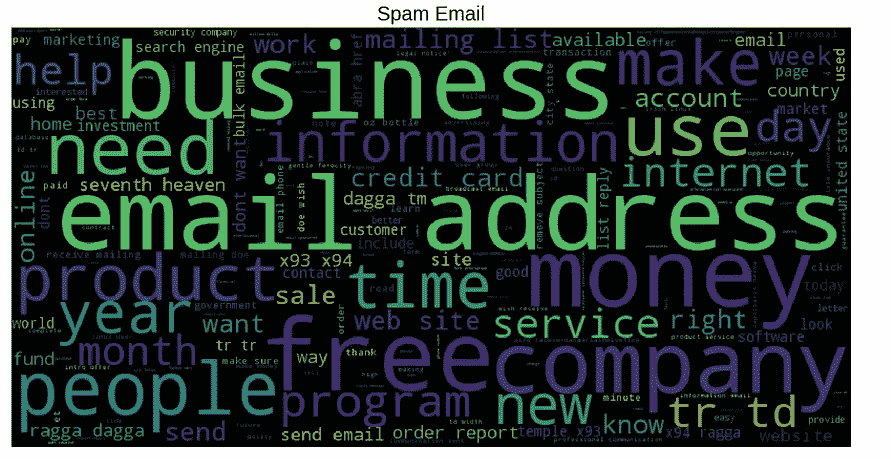

Visualization for spam email

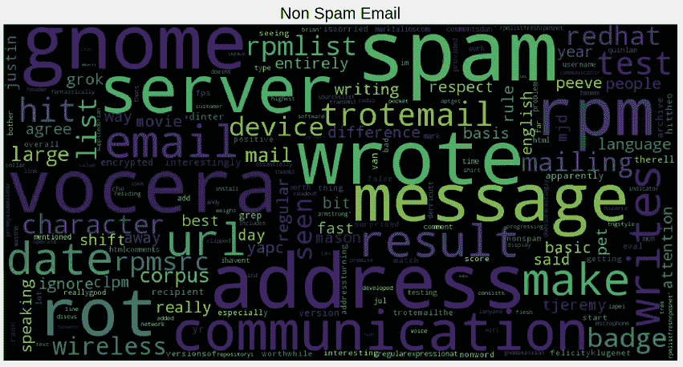

Visualization for non spam email

从这个图像中，您可以注意到垃圾邮件的一些有趣之处。他们中的许多人有大量的“垃圾”词，如:免费，金钱，产品等。在设计垃圾邮件检测系统时，有了这种意识可能有助于我们做出更好的决策。

需要注意的一点是，单词云只显示单词的频率，不一定显示单词的重要性。因此，在可视化数据之前，有必要进行一些数据清理，例如**从数据中删除停用词、标点符号**等。

**N 元模型可视化**

另一种可视化技术是利用条形图并显示出现频率最高的单词。N-gram 的意思是，当你计算单词的频率时，你把多少个单词作为一个单位来考虑。

在本文中，我展示了 1-gram 和 2-gram 的例子。你绝对可以尝试更大的 n-gram 模型。

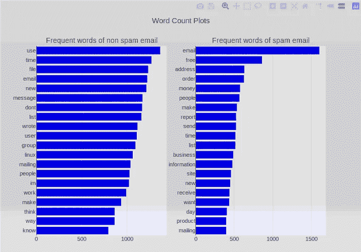

Bar chart visualization of 1-gram model

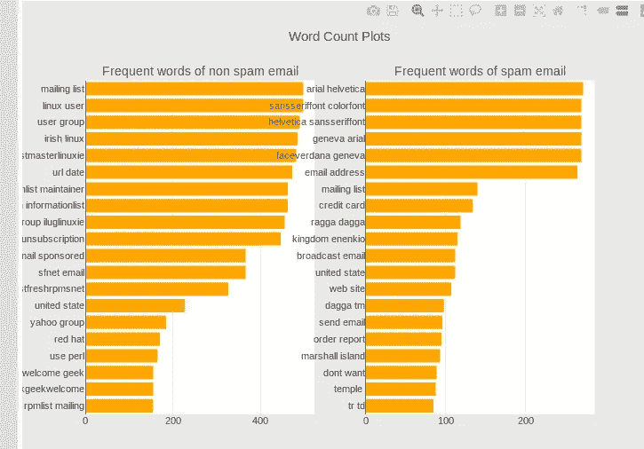

Bar chart visualization of 2-gram model

# **列车试分裂**

将您的数据集分为**训练集**和**测试集**非常重要，这样您就可以在将模型部署到生产环境之前使用测试集来评估模型的性能。

在进行训练测试分割时，需要注意的一件重要事情是确保训练集和测试集之间的数据分布是相似的。

在这种情况下，这意味着垃圾邮件在训练集和测试集中的百分比应该相似。

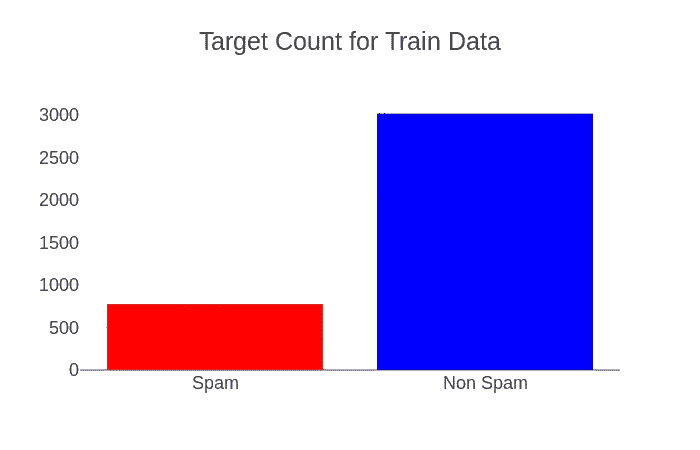

Target Count For Train Data

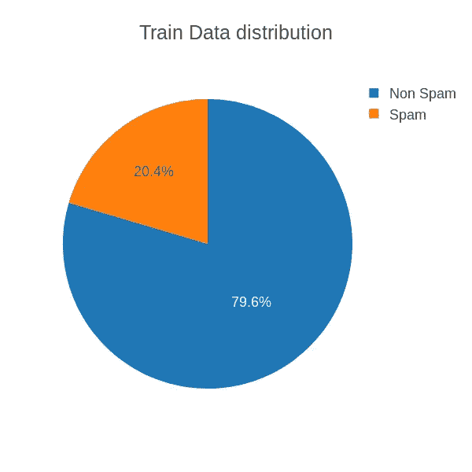

Train Data Distribution

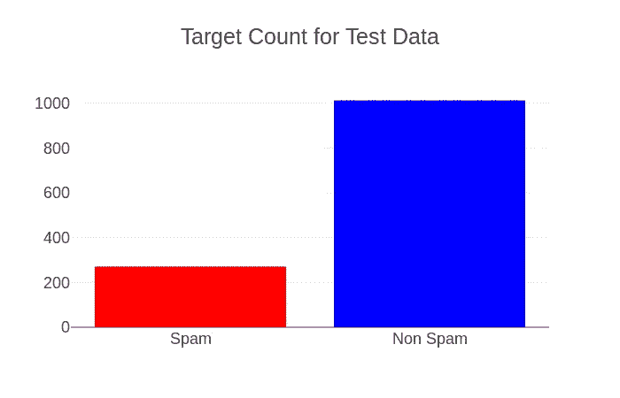

Target Count For Test Data

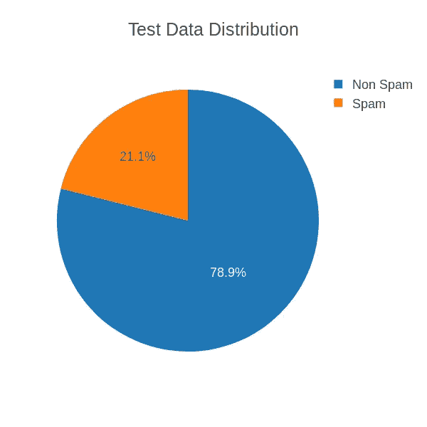

Test Data Distribution

训练数据和测试数据之间的分布非常相似，大约为 20–21%，所以我们可以开始处理我们的数据了！

# 数据预处理

**文字清理**

文本清理是机器学习中非常重要的一步，因为你的数据可能包含许多噪音和不需要的字符，如标点符号、空白、数字、超链接等。

人们通常使用的一些标准程序是:

*   将所有字母转换为小写/大写
*   移除数字
*   删除标点符号
*   删除空白
*   删除超链接
*   删除停用词，如 *a、about、above、down、doing* 等等
*   **词干**
*   **单词词条化**

对大多数人来说，这两种技术可能是陌生的，它们是**单词词干**和**单词词条化**。这两种技术都试图将单词简化为最基本的形式，但采用的方法不同。

*   词干提取—词干提取算法通过使用该语言中常见的前缀和后缀列表来删除单词的结尾或开头。英语单词词干的示例如下:

*   单词词汇化——词汇化是利用特定语言的词典，并试图将单词转换回其基本形式。它会试着考虑动词的意思，然后 conv 把它还原成最合适的基本形式。

实现这两种算法可能很棘手，需要大量的思考和设计来处理不同的边缘情况。

幸运的是 **NLTK** 库已经提供了这两个算法的实现，所以我们可以从库中开箱即用！

导入库，开始设计一些函数，帮助我们理解这两个算法的基本工作原理。

```
# Just import them and use itfrom nltk.stem import PorterStemmer
from nltk.stem import WordNetLemmatizerstemmer = PorterStemmer()
lemmatizer = WordNetLemmatizer()dirty_text = "He studies in the house yesterday, unluckily, the fans breaks down"def word_stemmer(words):
    stem_words = [stemmer.stem(o) for o in words]
    return " ".join(stem_words)def word_lemmatizer(words):
   lemma_words = [lemmatizer.lemmatize(o) for o in words]
   return " ".join(lemma_words)
```

词干分析器的输出非常明显，一些词尾被砍掉了

```
clean_text = word_stemmer(dirty_text.split(" "))
clean_text#Output
'He studi in the hous yesterday, unluckily, the fan break down'
```

词汇化已转换为研究->研究，休息->休息

```
clean_text = word_lemmatizer(dirty_text.split(" "))
clean_text#Output
'I study in the house yesterday, unluckily, the fan break down'
```

# 特征抽出

我们的算法总是期望输入是整数/浮点数，所以我们需要在中间有一些特征提取层来将单词转换成整数/浮点数。

有几种方法可以做到这一点，今天我将向大家介绍:

1.  计数矢量器
2.  tfidf 矢量器
3.  单词嵌入

**计数矢量器**

首先，我们需要将所有训练数据输入到 CountVectorizer 中，CountVectorizer 将保存每个单词及其各自 id 的字典，该 id 将与整个训练集中该单词的字数相关。

比如像*‘我喜欢吃苹果，喝苹果汁’这样的句子*

```
from sklearn.feature_extraction.text import CountVectorizer# list of text documentstext = ["I like to eat apple and drink apple juice"]# create the transformvectorizer = CountVectorizer()# tokenize and build vocabvectorizer.fit(text)# summarizeprint(vectorizer.vocabulary_)# encode documentvector = vectorizer.transform(text)# summarize encoded vectorprint(vector.shape)print(type(vector))print(vector.toarray())# Output# The number follow by the word are the index of the word
{'like': 5, 'to': 6, 'eat': 3, 'apple': 1, 'and': 0, 'drink': 2, 'juice': 4}# The index relates to the position of the word count array below
# "I like to eat apple and drink apple juice" -> [1 2 1 1 1 1 1]# apple which has the index 1 correspond to the word count of 2 in the array
```

**tfidf 矢量器**

字数不错，但我们能做得更好吗？简单字数统计的一个问题是，像“the”、“and”这样的词会出现很多次，它们并没有真正增加太多有意义的信息。

另一个流行的选择是 TfidfVectorizer。除了计算每个单词(经常出现在多个文档或句子中的单词)的字数，矢量器还会尝试缩小它们的大小。

关于 CountVectorizer 和 TfidfVectorizer 的更多信息，请阅读这篇伟大的[文章](https://machinelearningmastery.com/prepare-text-data-machine-learning-scikit-learn/)，这也是我获得大部分理解的地方。

**字嵌入**

网上有很多很棒的文章解释了单词嵌入的细节和生成它们的算法。所以在这里，我将跳过其中的大部分，试着给你一个大概的概念。

单词嵌入试图将单词转换成矢量化格式，该矢量表示该单词在高维空间中的位置。

对于具有相似含义的单词，这两个单词向量的余弦距离会更短，并且它们会彼此更接近。

事实上，这些单词是向量，所以你甚至可以对它们进行数学运算！这些操作的最终结果将是映射到单词的另一个向量。出乎意料的是，那些操作产生了一些惊人的结果！

> 例 1:国王-男人+女人=王后
> 
> 示例 2:马德里-西班牙+法国=巴黎
> 
> 例 3:步行-游泳+游泳=步行

简而言之，单词嵌入是单词的一种非常强大的表示，生成这种嵌入的一种众所周知的技术是 *Word2Vec。*

呼！将所有的句子转换成某种形式的向量后，就到了我们文章最精彩的部分→ **算法实现！**

# 算法实现

**tfidf 矢量器+朴素贝叶斯算法**

我采用的第一种方法是使用 tfidf 矢量器作为特征提取工具，并使用朴素贝叶斯算法进行预测。朴素贝叶斯是一种简单的概率型传统机器学习算法。

即使在过去，它在解决垃圾邮件检测等问题时也非常流行。朴素贝叶斯的细节可以在这篇由 **Devi Soni** 撰写的[文章](/introduction-to-naive-bayes-classification-4cffabb1ae54)中查阅，这篇文章简明清晰地解释了朴素贝叶斯算法的理论。

使用 **sklearn** 库提供的朴素贝叶斯库，让我们自己实现这个算法省去了很多麻烦。我们可以用几行代码轻松完成这项工作

```
from sklearn.naive_bayes import GaussianNBclf.fit(x_train_features.toarray(),y_train)# Output of the score is the accuracy of the prediction
# Accuracy: 0.995
clf.score(x_train_features.toarray(),y_train)# Accuracy: 0.932
clf.score(x_test_features.toarray(),y_test)
```

我们达到了 93.2%的准确率。但是准确性并不是评价算法性能的唯一指标。让我们尝试其他评分标准，这可能有助于我们彻底了解该模型的表现。

# **评分&指标**

**准确度的缺点**

在评估数据科学模型的性能时，有时准确性可能不是最佳指标。

我们在现实生活中解决的一些问题可能有一个非常不平衡的类，使用准确性可能不会给我们足够的信心来理解算法的性能。

在我们试图解决的垃圾邮件问题中，垃圾邮件数据约占我们数据的 20%。如果我们的算法预测所有的电子邮件都是非垃圾邮件，它将达到 80%的准确率。

对于一些只有 1%正面数据的问题，预测所有样本都是负面的会给他们 99%的准确率，但我们都知道这种模型在现实生活中是没有用的。

**精度&召回**

查准率和查全率是人们评价类不平衡分类模型时常用的评价指标。

让我们试着理解 Precision & Recall 试图回答什么问题，

**精度**:实际上有多少比例的肯定识别是正确的？

**回忆**:实际阳性中有多少比例被正确识别？

所以， **precision** 是评估，当一个模型预测某件事是肯定的，这个模型有多精确。另一方面， **recall** 正在评估一个模型在寻找所有正样本方面做得如何。

精确率和召回率的数学等式分别是

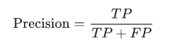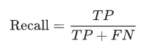

TP:真阳性

FP:假阳性

TN:真阴性

FN:假阴性

**混淆矩阵**

混淆矩阵是理解像真阳性、假阳性、真阴性等结果的一个非常好的方法。

Sklearn 文档提供了一个示例代码，说明如何绘制好看的混淆矩阵来可视化您的结果。你可以在这里查看[，](https://scikit-learn.org/stable/auto_examples/model_selection/plot_confusion_matrix.html)或者你可以在我在文章末尾分享的笔记本中找到代码。

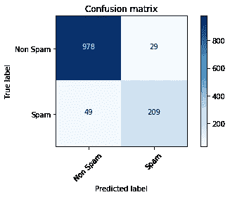

Confusion Matrix of the result

```
Precision: 87.82%
Recall: 81.01%
```

该模型的召回率相当低，可能在发现垃圾邮件方面做得不够好。**我们如何做得比这更好？**

# **总结**

在本文中，我向您展示了设计垃圾邮件检测算法所需的所有必要步骤。简单回顾一下:

1.  探索和理解您的数据
2.  将手头的数据可视化以获得更好的直觉——word cloud，N-gram 条形图
3.  文本清理—单词斯特梅尔和单词词条化
4.  特征提取—计数矢量器、Tfidf 矢量器、单词嵌入
5.  算法—朴素贝叶斯
6.  评分和指标——准确度、精确度、召回率

垃圾邮件检测算法设计演示的第一部分到此结束。

还有这篇文章的第 2 部分！我将展示如何通过使用**单词嵌入**和**深度学习模型来提高模型的准确度、精确度和召回率。**有兴趣的话在这里 阅读文章[！](/spam-filtering-system-with-deep-learning-b8070b28f9e0)

你可以从 [Github](https://github.com/huai99/Email-Spam-Detection-Python) 克隆笔记本，或者直接从 [Colab](https://colab.research.google.com/drive/1nh4bWccs7cgOx7kSalBmUMJzK3h7UEvU) 运行。请在下面的评论区留下你的任何问题。