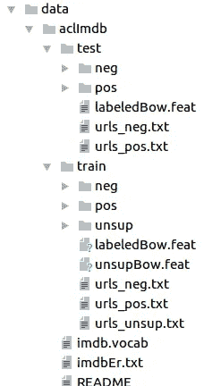
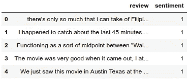
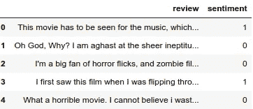
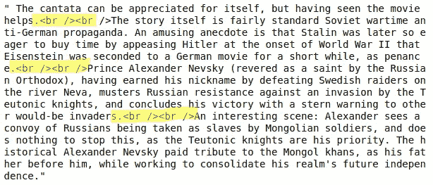
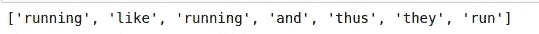
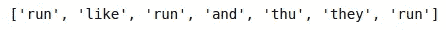
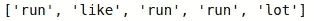
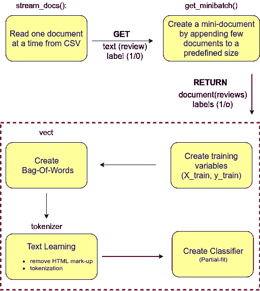
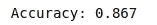

# 将机器学习模型嵌入 Web 应用程序(第 1 部分)

> 原文：<https://towardsdatascience.com/embedding-machine-learning-models-to-web-apps-part-1-6ab7b55ee428?source=collection_archive---------1----------------------->

Source ([Pixabay](https://pixabay.com/))

学习数据科学的最佳方式是实践，没有其他选择。在这篇文章中，我将反映我如何开发一个可以将电影评论分为正面或负面的机器学习模型，以及如何将该模型嵌入到 Python Flask web 应用程序中。最终目标是完成一个端到端的项目。我坚信，在这篇文章的结尾，你将具备将 ML 模型嵌入 web 应用程序的所有必要技能。我遇到了这种情况，打算写一本书，由 Sebastian Raschka 和 Vahid Mirjalili 编写的“Python 机器学习:用 Python、scikit-learn 和 TensorFlow 进行机器学习和深度学习，第二版”。我发现这本书对我的数据科学之旅是一个很好的投资，我鼓励你试用这本书。

> 请注意，我不打算详细讨论理论和概念。为了让这篇文章简单易懂，我将简单地提供解释，并分享链接，这样你就可以在时间允许的情况下阅读更多的概念和理论。我的建议是，从头到尾跟着这篇文章，在你阅读的第二阶段重新审视新概念。

现在系好安全带，这将是一次奇妙的:D 之旅

这篇文章有两个主要部分

1.  开发电影评论分类器(这篇文章)
2.  开发 Python Flask web 应用程序并集成电影评论分类器(即将发布！)

# 开发电影评论分类器

Source([Pixabay](https://pixabay.com/))

我在 [Paperspace](https://www.paperspace.com/) 建立了我的开发者环境，这是一个云基础设施提供商(可能有其他用途，但我只用作 [PaaS](https://en.wikipedia.org/wiki/Platform_as_a_service) ，它提供基于 GPU 的计算能力来开发机器学习和深度学习模型。我在我选择的位置创建了一个单独的项目文件夹“情感分析”。这是项目的根目录。

## **下载电影评论数据**

首先，让我们开始下载所需的电影数据。我创建了一个单独的文件‘download _ data . ipynb’。这会将电影评论下载并提取到“数据”文件夹中。当您在“数据”文件夹中导航时，您将能够看到一个名为“acllmdb”的文件夹。在“acllmdb”文件夹中，有“train”和“test”文件夹。“train”和“test”文件夹都包含两个子文件夹，分别名为“pos”和“neg”，前者包含正面评价，后者包含负面评价(图[1])。

download_data.ipynb

Image[1]: Inside data folder

你会注意到这些在‘pos’和‘neg’文件夹中的评论是文本文件的形式。为了方便我们进行数据处理和操作，我们的下一步是创建一个 Python Pandas 数据框。

**从文本文件创建熊猫数据框**

pandas_data_frame_from_text.ipynb

上面的脚本创建了一个 Pandas 数据帧“df ”,其中包含来自“train”和“test”文件夹中“pos”和“neg”子目录的文本文件的电影评论(这一步大约需要 10-20 分钟，取决于您的 PC 的性能)。如果电影评论是正面的，我们将情感标记为“1”，如果是负面的，我们将情感标记为“0”。在我们的数据框架“df”中，我们有两列，“review”列，它包含文本字符串形式的评论，以及“perspective”列，它包含评论的情绪，根据情绪的积极和消极程度，该情绪为“1”或“0”。图像[2]包含数据帧“df”的前五行。

Image[2] : Movie reviews in Pandas data-frame

在图[2]中，我们只能看到正面的影评。原因是，当我们创建数据框架时，该函数以一种排序的方式安排评论。为了更好地进行有用的数据操作，我们需要随机化电影评论的顺序(即，我们应该以不均匀的无序方式看到‘0’和‘1’)。为此，我们可以利用 NumPy 库的内置函数“置换”和“随机”。

**随机化数据帧并保存为 CSV 文件**

randomize_data_and_create_csv.ipynb

Image[3]: Unsorted movie reviews

正如您在图[3]中看到的，现在我们有了一个随机数据框，并将数据保存到一个名为“ *movie_data.csv* ”的 csv 文件中。

**清理文本数据**

我们的数据框中的“审查”有文本。非常仔细地看这些文本是极其重要的。让我们继续，从上一步准备的数据框中可视化最后 999 个字符。

[movie_reviews_last_999_chars.ipy](https://gist.github.com/0xchamin/b20e9b00089946283bd824593dceeae8#file-movie_reviews_last_999_chars-py)nb

Image[4]: Reviews consists of HTML mark-up

很明显,“评论”栏包含 HTML 标记。这些标记并没有给评论增加任何有用的洞察力。因此，作为文本清理过程的一部分，我们必须确保在使用这些评论来开发模型之前，删除这些不需要的标记。

虽然 HTML 标记不包含太多有用的语义，但标点符号可以表示 NLP 上下文中有用的附加信息。为了简单起见，我们将删除除表情符号之外的标点符号，例如:)，因为这些表情符号对于语义分析肯定是有用的。我们将使用 Python 的**正则表达式** ( **regex** )来执行这项任务。

这些评论都是大段文字。为了让我们分析评论，我们需要将这些评论分成单独的元素。这个过程在 NLP 上下文中被称为“**”[2]。有多种技术可以对给定的文本字符串进行标记。最简单的方法就是在 Python 中的内置函数中使用 **split()** 。下面是使用 split()函数将一组字符串标记为单个元素的简单示例，如图[5]所示。**

**tokenize_text_to_individual_element.ipynb**

****

**Image[5]: Tokenize words from text**

**在图[5]中，你可以看到我们已经成功地将文本标记为它的单个元素。在结果输出中，我们可以看到单词“running”和“run”。在 NLP 中，有一种技术可以将单词转换成它们的词根形式。这种技巧叫做 [**词干**](https://nlp.stanford.edu/IR-book/html/htmledition/stemming-and-lemmatization-1.html)【3】。波特·斯特梅尔在自然语言处理领域的研究者中很受欢迎。在下面的代码段中，你可以看到我们如何使用 NLTK 包的 PorterStemmer 来获得单词的根形式(图[6])。**

**porter_stemmer.ipynb**

****

**Image[6]: Tokenize words in their root form**

> **在这个项目中，我们不打算看单词的词根形式。原因是，已经证明它不会给我们将要建立的模型带来显著的改进。为了这篇文章的完整性，我与你分享了这些信息。**

**数据清理和预处理步骤中的另一个重要概念是被称为“**停止字移除**”的概念。“停用词”是在各种形式的文本中经常出现的词，可能没有任何有用的信息。几个“停用词”是，*是*、*和*、*有*、*是*、*有*、*像*……停用词去除使得我们的文本处理机制高效，因为它减少了我们需要分析的词的数量。Python NLTK 提供了一种有效的机制来从给定的[文本语料库](https://en.wikipedia.org/wiki/Text_corpus)中移除“停用词”。你可以参考下面的代码片段和图片[7]来了解停用词移除的机制。**

**stop_words_removal.ipynb**

****

**Image[7]: Stop words removal results**

> ****注意** : *在上面的代码片段中，我们使用了在前面的代码片段中定义的‘tokenizer _ porter’函数。***

**如图[7]所示，打包的“停用词”去掉了最常出现的词，如“ *a* ”、“*和*”。这将减少我们的“单词袋”的大小(这将在本文后面说明)，从而使计算更有效。**

**至此，您已经了解了清理文本数据的许多重要步骤。**

*   **移除不需要的 HTML 标记(通过正则表达式)**
*   **标记化(通过 Python *split()* 方法)**
*   **词干(如波特斯特梅尔)**
*   **停止单词删除(通过 NLTK 停止单词)**

****制作电影评论分类器****

**有了这些背景知识，我们现在可以继续开发情感分类器。我们将把上述步骤(除了词干处理)应用到我们创建的 *movie_data.csv* 文件中。**

**有两种方法来开发分类器。一种是一次利用整个数据集，或者换句话说，一次读取整个 movie_data.csv 文件，创建训练和测试集并拟合模型。这种方法的缺点是，我们需要高性能的 PC/计算能力。尽管我在试用本教程时使用了 [Paperspace](https://www.paperspace.com/) ，但是用这种方法构建分类器花了我将近两个小时。这是一种非常麻烦的体验。因此，在这篇文章中，我将继续第二种方法。**

**当处理大量数据时，机器学习从业者使用在线学习算法。同样，在我们的例子中，我们也将使用一种在线学习算法，称为" [**【核外学习】**](https://simplyml.com/hunt-for-the-higgs-boson-using-out-of-core-machine-learning/)【5】。简单来说，这就是我们在给定时间使用数据集的一部分，并从这部分数据中创建模型。我们将用我们输入的每个新数据部分来更新模型。通过遵循这种方法，我们可以很容易地在合理的时间框架内构建我们的模型。此外，我们将定义一系列函数来执行以下操作:**

*   ***stream_docs* — read_csv(一次一个文档)**
*   ***get_minibatch* —通过附加文档创建较小尺寸的文档**

**最后利用以上两个函数创建分类器。你可以参考图[8]和下面提供的代码片段来获得更多关于分类器构建过程的理解。**

****

**Image[8]: Classifier creation steps using out-of-core-learning approach**

**movie_review_classifier.ipynb**

**这就是创建电影分类器所需的全部内容。也许这现在看起来有点复杂，所以让我带您看一下代码。必要时你可以参考图[8]。**

**根据图[8]，我们的第一步是读取我们在最开始创建的 csv 文件。在上面的代码片段中，第 16 行读取 csv 文件。它一次读取一行(文档)，然后将该文档传递给(第 53 行) ***get_minibatch()*** 函数以创建一个迷你文档。我们创建一个迷你文档，直到迷你文档的大小达到 1000(第 53 行)。一旦在 ***get_minibatch()*** 函数中创建了这个迷你批处理，它就返回这个迷你批处理以供进一步处理(从第 36 行到第 53 行)。我们使用这个小批处理并创建训练集变量 ***X_train*** 和 ***y_train*** 。**

**然后，这个 ***X_train*** 变量被传递下去，以创建**单词包**(第 56 行)。因为我们使用的是核外学习方法，所以我们使用了 **scikit-learn** 的**哈希矢量器**。哈希矢量器负责创建单词包。在创建单词包时，它将对包含电影评论的***【X _ train】、*** 进行预处理，并在移除停用词(或对我们的文本语料库没有任何价值的频繁出现的词，如“ *a* ”、“*like*“*is*”等)的同时移除不必要的 HTML 标记。)(第 49 行和第 38–44 行)。**

> **我们用**标记器**函数初始化**哈希矢量器**，并将特征数量设置为 **2**21** 。此外，我们通过将**SGD 分类器**的 ***损失*** 参数设置为 ***日志*** 来重新初始化逻辑回归分类器。在 HashingVectorizer 中选择大量功能的原因是，在增加逻辑回归模型中系数数量的同时，减少导致哈希冲突的机会。**

**使用 ***for*** 循环(第 52 行),我们迭代了 45 个小批量文档，其中每个小批量包含 1000 个文档。完成增量学习过程后，我们将使用 5000 个文档来评估我们模型的性能。下面我给出了关于测试集生成和准确性计算的代码片段。这几乎是不言自明的:)(你可以参考上面的详细解释来加深你的理解)。**

**test_set.ipynb**

****

**Image[9]**

**我们可以看到，我们的模型已经产生了 86.7%的准确率，这是相当不错的。到目前为止，我们已经完成了最重要的一步，下一步是保存这个模型供以后参考。否则，我们需要再次执行所有这些步骤来达到这一点。**请保持您当前的 Python 会话打开**。**

> **PS:我们的 csv 文件包含 50K 记录，我们使用 45K 作为训练集，5K 作为测试集。你可以使用熊猫的“信息”功能来查看我们 csv 中的记录数量。**

**每当我们关闭 Python 会话时，对我们来说训练我们的模型将是一项相当忙碌的任务。因此，我们将保存我们训练和构建的分类器。为此，我们使用 Python 内置的 pickle 模块，它允许我们序列化和反序列化 Python 对象以压缩字节代码。当我们想要对新样本进行分类时，我们可以直接重新加载这些对象。**

**serialize_deserialize_objects.py**

**在上面的代码段中，我们创建了一个名为' *movieclassifier* 和' *pkl_objects* 子目录的文件夹来保存序列化的 Python 对象。' *dump* 方法所做的是，它序列化经过训练的逻辑回归模型以及 NLTK 库中的'*停用词集*。我鼓励你阅读 [Python *pickle* 文档](https://docs.python.org/3/library/pickle.html)【6】来了解更多关于这个包的信息(如果我要在这里解释，那将是:D 的另一篇博文)**

**我们的下一步是创建一个新的 Python 脚本，我们可以使用它将矢量器导入到现有的 Python 会话中。让我们继续在上一步创建的 *movieclassifier* 目录中创建一个新的 Python 脚本 *vectorizer.py* 。**

**vectorizer.py**

**现在，在这一点上，我们应该能够使用我们创建的 Python 序列化对象，即使是在一个新的 Python 会话中(培训的麻烦将不再存在！耶！！！).让我们继续测试。导航到“*电影分类器*”文件夹。停止您当前的 Python 会话。让我们启动一个新的 Python 会话，看看能否从硬盘加载我们的模型。手指交叉！！！**

**unpiclked_classifier.py**

**上面的代码段负责加载我们创建的矢量器和分解分类器。现在我们可以使用这些对象和预处理文档样本，并对它们的情感做出预测。例如，让我们试着检查“**我爱这部电影**”是属于积极的还是消极的。**

****

**Image[10]**

**厉害！看来我们的模型工作正常。我们有能力将这种机器学习模型与我们将要开发的 web 应用程序集成在一起。这是这个两部分系列的第一部分的结尾。**

# **开发 Python Flask web 应用程序**

**这将是这篇文章的第二部分。我鼓励您熟悉 Python Flask web 应用程序开发。大量的 Python Flask 足够让你阅读这篇文章的第二部分。如果你是新手，可以查一下 [Traversy Media](https://www.youtube.com/channel/UC29ju8bIPH5as8OGnQzwJyA) 的 [Flask Web App 开发](https://www.youtube.com/playlist?list=PLillGF-RfqbbbPz6GSEM9hLQObuQjNoj_)系列。**

**非常感谢你有兴趣阅读这篇文章。请给这篇文章一点掌声，留下你的评论和反馈，我总是欣赏和欢迎你的观点。如果你觉得这篇文章有用，那就和你的朋友:D 分享吧**

## **礼貌:我想对塞巴斯蒂安·拉什卡和瓦伊德·米尔贾利利表示极大的感谢。我从他们身上学到了很多，并且还在学习。我从来不认为书籍是学习编程的好资源，因为我非常依赖在线视频教程。现在我觉得，书籍也是学习编程的一种很好的方式，而出版一本书需要付出巨大的努力。你可以做重点，边学边做笔记。这是一个很大的加分点，所以花你喜欢的书的钱真的是一个很大的时间投资。**

**参考资料:**

**[1][https://www . Amazon . com/Python-Machine-Learning-scikit-learn-tensor flow/DP/1787125939](https://www.amazon.com/Python-Machine-Learning-scikit-learn-TensorFlow/dp/1787125939)
【2】[https://NLP . Stanford . edu/IR-book/html/html edition/tokenization-1 . html](https://nlp.stanford.edu/IR-book/html/htmledition/tokenization-1.html)
【3】[https://NLP . Stanford . edu/IR-book/html/html edition/stemming](https://nlp.stanford.edu/IR-book/html/htmledition/stemming-and-lemmatization-1.html)**