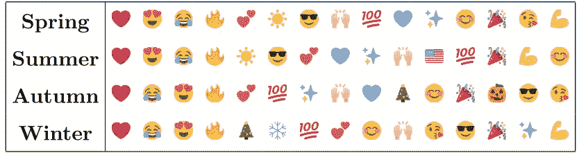
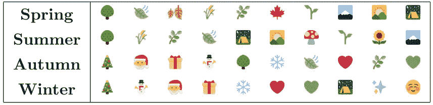
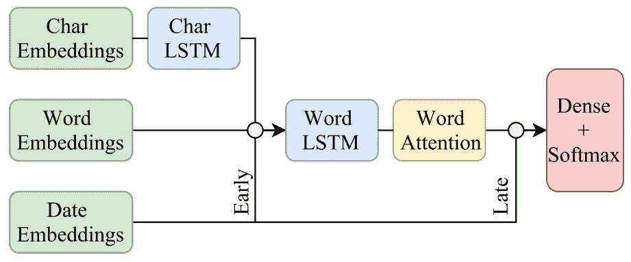
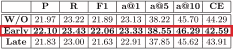
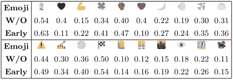

# 使用时间嵌入的表情预测

> 原文：<https://towardsdatascience.com/emoji-prediction-using-time-embeddings-de124d8c8c6e?source=collection_archive---------7----------------------->

表情符号的使用已经成为一种新的社交形式，这很重要，因为它可以帮助改善聊天应用程序等通信系统。本文调查表情符号的*用法*和*语义随时间的变化，分析表情符号用法的*季节性变化*。此外，作者开发了一个基于时间信息的表情预测模型。*

***贡献***

过去已经进行了多种表情符号预测研究(参见 [Felbo 等人的著名工作，2017](https://arxiv.org/abs/1708.00524) )，但没有考虑*时间信息*。探索表情符号和季节事件之间的时间相关性，并用于消除表情符号含义的歧义。

***例题***

考虑一下三叶草表情符号(🍀)，它通常与一年四季的好运愿望有关，除了三月，在三月它主要用于表达与*聚会*和*饮酒*(由于圣帕特里克节)有关的事件情况。

***挑战***

*   这项研究表明，时间信息对于表情符号预测是有用的，即使对于与时间无关的表情符号(💪还有❤️).
*   表情符号天生是主观的，这就是为什么很难分析它们的语义。

***数据集***

Twitter 用于收集 1 亿条美国推文，组织如下:

*   *季节性表情数据集* —数据按季节分为四个子集:春、夏、秋、冬(见下图)
*   *表情符号预测数据集*——数据减少到只包含一个常用表情符号的推文(表情符号必须属于 300 个常用表情符号)

***季节性表情符号语义及用法***

使用季节性数据集的四个子集来训练跳格词嵌入模型。这些模型提供的信息基本上有助于根据表情符号彼此之间的语义相似性来描述表情符号。(详见论文)

通过比较与嵌入空间中的每个表情符号相关联的前 10 个表情符号，发现与音乐、动物、糖果和情绪相关的表情符号不受季节性的影响(例如，🎶,🎼,🍦,🐠,😂,🎸).这意味着这些表情符号跨季节保留了意义。

相反，与运动相关的表情符号(例如，🏀,🏆)在不同的季节有不同的意思，可能是因为运动的高峰期。另一个与学校有关的有趣表情符号(🎓)，跨季节变了意思；在春季，它与派对表情符号有关，在秋季，它与学校相关的表情符号有关。查看每一季松树表情符号的 10 大相关表情符号(🌲)在下图中——非常依赖于季节，你不觉得吗？你能猜到原因吗？(提示:户外 vs 圣诞节)。(参见论文中大量有趣的发现)

***表情符号预测***

第二个数据集包括 300 个表情类和总共 900，000 条推文(每个类 3，000 条推文)，用于表情预测。表情预测模型的架构如下:通过早期融合方法和后期融合方法来组合字符嵌入、单词嵌入和日期嵌入。这就产生了两个型号( ***前期*** 和 ***后期*** )。第三个模型被训练( ***W/O*** )，其完全忽略日期嵌入。(参见论文，了解这些嵌入是如何构建的)

***结果***

下表中报告了所有型号的精确度、召回率和 F1 分数。我们可以观察到，通过使用早期融合来组合时间信息，*早期*模型优于其他模型。

F1 得分较高的表情符号(无日期对早日期)如下表所示。你肯定可以观察到许多表情符号是特定于季节的(例如，🍀,🌒)并因此受益于日期嵌入。甚至与时间无关的表情符号(例如，🖤，❤️，💪)受益于时间信息。

***结论&未来工作***

*   提出了一种基于深度神经网络进行表情预测的多通道架构。
*   对一天或一周中特定时间的表情符号语义和用法进行更多分析，可能有助于改善日期嵌入和整体预测模型。
*   这项工作有很大的改进空间，与情绪识别、事件检测和计算健康研究相结合可能是一个非常有趣的主题。

***参考文献***

*   参考:[https://arxiv.org/abs/1805.00731](https://arxiv.org/abs/1805.00731)——“通过时间变化透镜探索表情符号的使用和预测**”**

关于这篇论文还有其他问题吗？给我发个 DM[@ Omar saro](https://twitter.com/omarsar0)。