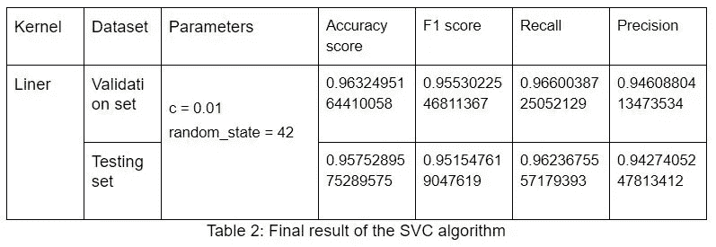
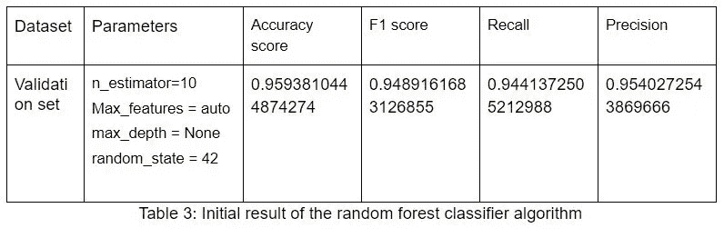
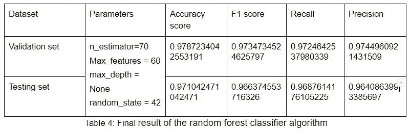
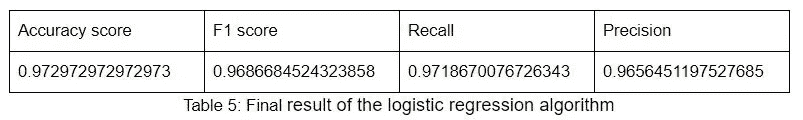
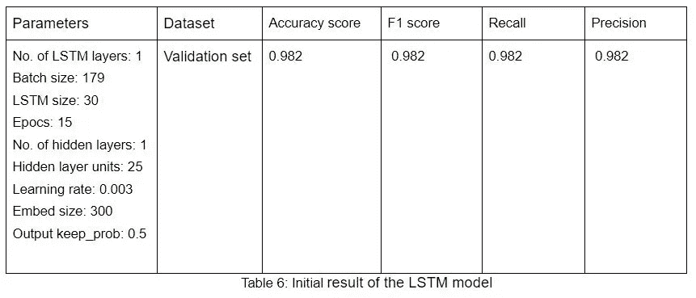
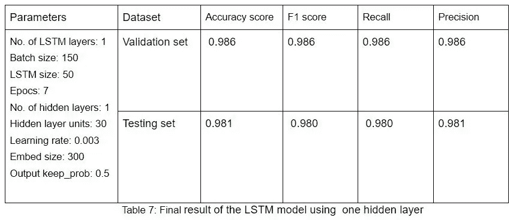
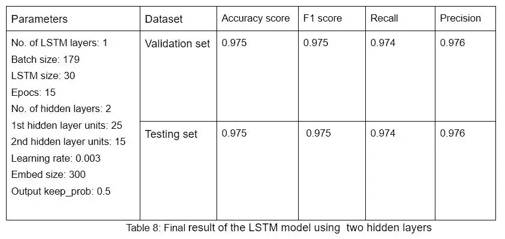
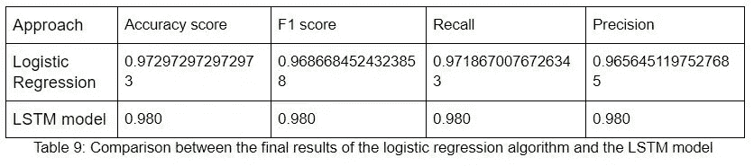

# 基于安然数据集的电子邮件分类实证分析

> 原文：<https://towardsdatascience.com/empirical-analysis-on-email-classification-using-the-enron-dataset-19054d558697?source=collection_archive---------4----------------------->

在本文中，我们将首先评估 3 种机器学习算法的性能，即逻辑回归、支持向量分类和随机森林分类器。在后一部分，我们将比较机器学习算法的性能与使用递归神经网络模型(LSTM)获得的结果。我们将在整个评估过程中使用[安然数据集](http://www2.aueb.gr/users/ion/data/enron-spam/)。

**1。关于数据集**

安然数据集包括主要由安然公司高级管理层发送的电子邮件。在这个实验中，我们使用了专门为垃圾邮件和火腿分类制作的数据集的处理版本。该数据集包含 30207 封电子邮件，其中 16545 封被标记为垃圾邮件，13662 封被标记为垃圾邮件。

**2。** **方法论**

**2.1 数据预处理**

**2.1.1 机器学习**

对于机器学习算法，我使用了单词袋方法。这是一种从文本中提取特征以用于机器学习算法的方法[1]。在这种情况下，我们首先对电子邮件进行标记，并为所有电子邮件中的所有单词创建一个字典。然后，我们从其中选取最常见的 3000 个单词作为我们的最终词典。然后我们遍历每封邮件，记录邮件中每个令牌在字典中对应的令牌的出现频率。这样，所有电子邮件的最大序列长度变为 3000。

**2.1.2 递归神经网络**

RNN 模型使用了一种略有不同的单词包方法来预处理电子邮件。我们首先对电子邮件进行标记，并制作所有电子邮件中所有单词的字典，就像我们对机器学习模型所做的那样。那么所有的单词将从 1 开始被索引。然后，电子邮件集合将被迭代，对于电子邮件中的每个单词，将参考字典将该单词映射到相应的索引。这种方法确保了电子邮件中单词的顺序不变。但是我们现在有一个问题，每个电子邮件有不同的序列长度。为了减轻这一点，我们将得到最长的电子邮件的长度，并将所有电子邮件填充到该长度。填充将通过在每个序列的开头添加“0”来完成，以便它不会影响训练过程。在这个场景中，所有电子邮件的序列长度是 3425。

**2.2 机器学习算法**

安然数据集将用于训练机器学习模型，以将电子邮件分类为垃圾邮件或 ham。所有利用的机器学习算法都取自 scikit learn 库。所有算法的参数调整都是手动完成的。这是因为数据集的大小是 30207，运行网格搜索太耗费时间了

**2.2.1 拆分数据**

对于所有算法，数据被分成三组作为训练集、验证集和测试集。验证集用于调整参数。在参数调整过程之后，使用测试集来获得最终结果。训练集由 80%的数据组成，20%用于验证集。然后这 20%被进一步平均分配，50%用于验证，另外 50%用于测试。

**2.2.2 支持向量分类**

支持向量分类算法通过创建一个特征空间来模拟这种情况，这是一个有限维的向量空间，其中的每一维都代表特定对象的一个“特征”[2]。

首先，在没有任何优化的情况下进行观察。以下是初步结果:

在使用线性核获得初始结果之后，调整 C 参数以获得最终结果。下面显示的是收到的验证和测试集的最终结果。这些是观察期间获得的最高验证分数。

**2.2.3 随机森林分类器**

随机森林分类器从随机选择的训练集子集创建一组决策树。然后它聚集来自不同决策树的投票来决定测试对象的最终类[3]。

最初，观测是在没有任何优化的情况下进行的，就像 SVC 算法一样。以下是初步结果:

通过改变可能对最终结果产生最大影响的不同参数来改进初始结果。探索的参数是:n_estimators、max_features 和 Max_depth。下面显示的是最终结果:

**2.2.4 逻辑回归**

逻辑回归用于描述数据，并解释一个因变量与一个或多个名义变量、序数变量、区间变量或比率水平自变量之间的关系[4]。

该算法使用默认设置运行，因为没有要优化的参数。下面显示的是测试集获得的结果。

**2.2.5 总结**

在比较这些车型时，我们将主要关注 f1 的得分。根据观察，尽管对 svc 算法进行了优化，但仍无法实现显著的改进。但是随机森林分类器在调整参数值后显示出相当显著的改进。尽管这两种算法都给出了很好的结果，但是逻辑回归算法的最终结果是最高的。如您所见，逻辑回归算法和 svc 算法的最终结果相差不远，但我们必须让逻辑回归算法胜出，因为这是我们能够获得的最高结果。

我们将进一步探讨这个主题，看看我们是否可以通过使用不同的方法来改善最终结果。即递归神经网络。我们将用于这一观察的递归神经网络的类型是 LSTM 模型。

**2.3 LSTM 车型**

LSTM 代表长期短期记忆网络，这是一种特殊的 RNN，能够学习长期依赖关系。这些是专门设计来避免大多数模型中存在的长期依赖问题的。LSTMs 长时间记忆信息，有助于建立长期依赖性模型[5]。

采用张量流框架建立 LSTM 模型。LSTM 模型由几层组成。当将数据输入模型时，我们将首先通过嵌入层传递数据。嵌入层的功能是将代表字典中单词的每个索引表示为一个范围内指定大小的随机数值向量。这种方法有助于对单词之间的关系进行建模。那么嵌入层的输出将通过 LSTM 层发送。我们使用 Tensorflow 提供的“基本 LSTM 池”来完成这项任务。LSTM 层将在其输出中添加一个漏失，以随机抑制神经网络中的一些神经元，从而降低过拟合的可能性[6]。然后，隐藏图层将消耗 LSTM 图层的输出，并生成最终输出。

当计算成本函数时，logit(没有通过激活函数发送的最终结果)将被传递给它。使用的成本函数是“softmax 交叉熵与 logits”。然后，优化函数将用于降低成本。所利用的优化功能是 Adam 优化器。

通过激活函数传递获得的 logit 值进行预测。为此使用了 Sigmoid 函数，因为相关的任务是二元分类。

**2.3.1 拆分数据**

数据被分成 3 组，作为之前在机器学习方法中提到的训练、验证和测试集。在获得初始结果后，验证集用于调整超参数以提高最终得分。然后使用测试集进行最终评估。训练、验证和测试数据的百分比与用于机器学习方法的百分比相同。

2.3.2 结果

下面显示了使用验证数据集获得的初步结果:

以下结果显示了调整超参数后的最终输出

在使用上述模型获得令人满意的结果之后。通过叠加更多的隐藏层来进行观察，以查看结果是否可以进一步改进。

下面显示的是使用两个隐藏层得到的结果。

**2.3.3 总结**

为了评估该模型，我们将主要考虑 f1 分数，正如我们对机器学习算法所做的那样。考虑到优化参数后获得的结果，我们可以看到分数略有提高。

当试图通过添加更多的隐藏层来进一步改善结果时，正如你所看到的，它给出了一个低得多的输出。其原因是，即使在理论上，神经网络应该对堆叠层给出更好的分数，在这种情况下，我们缺乏数据。我们拥有的数据量不足以训练多个隐藏层。

**3。谁做得更好？**

如上所述，逻辑回归算法给出了比其他两种机器学习算法更好的结果。所以现在我们来了个问题，考虑到逻辑回归算法和 LSTM 模型，谁做得更好。下图是逻辑回归算法和 LSTM 模型的最终结果对比。

查看表格，我们可以清楚地看到，LSTM 的****f1 得分优于逻辑回归算法。基本上所有的分数 LSTM 模型都优于逻辑回归算法。这让 LSTM 模式轻而易举地胜出。****

******4。结论******

****考虑到所获得的结果，LSTM 模型优于所有其他考虑的机器学习算法。其原因是 LSTMs 模拟长期依赖性的能力。安然是一个文本数据集，因此，能够记住整个电子邮件中单词之间的依赖关系增加了更好地猜测它是垃圾邮件还是火腿电子邮件的机会。由于 LSTM 设计擅长这项任务，它能够给出比其他机器学习算法更好的结果。****

****总之，我们可以说，LSTM 真正能够捕捉数据中的长期依赖性，并利用其在架构中的存储方面胜过其他机器学习算法。****

******5。参考文献******

****[1][https://medium . com/grey atom/an-introduction-to-bag-of-words-in-NLP-AC 967d 43 b 428](https://medium.com/greyatom/an-introduction-to-bag-of-words-in-nlp-ac967d43b428)****

****[2]https://mindmajix.com/support-vector-machine-algorithm****

****[3][https://medium . com/machine-learning-101/chapter-5-random-forest-classifier-56dc 7425 c3e 1](https://medium.com/machine-learning-101/chapter-5-random-forest-classifier-56dc7425c3e1)****

****[4][http://www . statistics solutions . com/what-is-logistic-regression/](http://www.statisticssolutions.com/what-is-logistic-regression/)****

****[http://colah.github.io/posts/2015-08-Understanding-LSTMs/](http://colah.github.io/posts/2015-08-Understanding-LSTMs/)****

****[6][https://www . quora . com/How-the-dropout-method-work-in-deep-learning-And-why-it-be-a-effective-trick-to-improve-your-network](https://www.quora.com/How-does-the-dropout-method-work-in-deep-learning-And-why-is-it-claimed-to-be-an-effective-trick-to-improve-your-network)****

******注**:本次评估使用的完整代码可以通过[这个链接](https://github.com/suleka96/Email-Classification)找到。请随意摆弄代码，亲自尝试一下。编码快乐！****