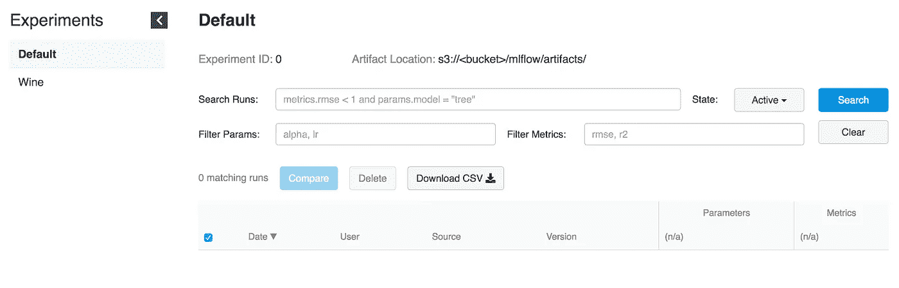
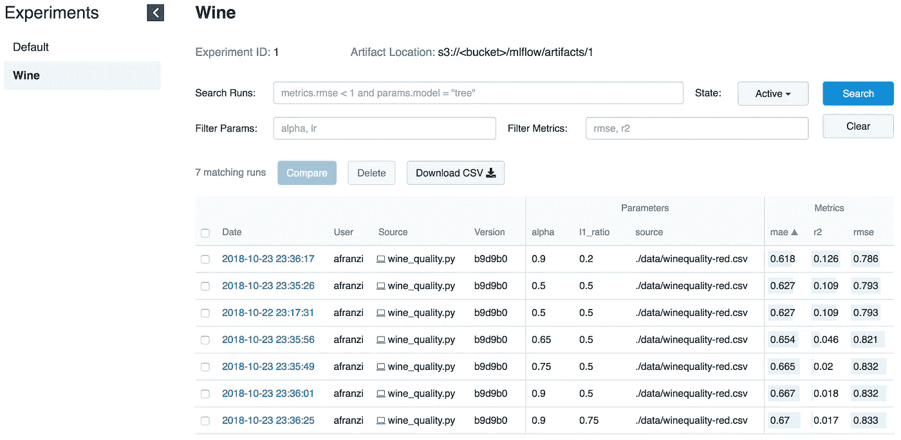
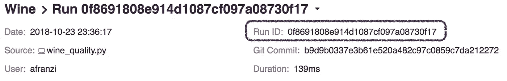
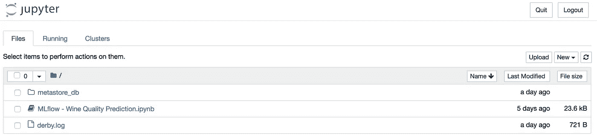
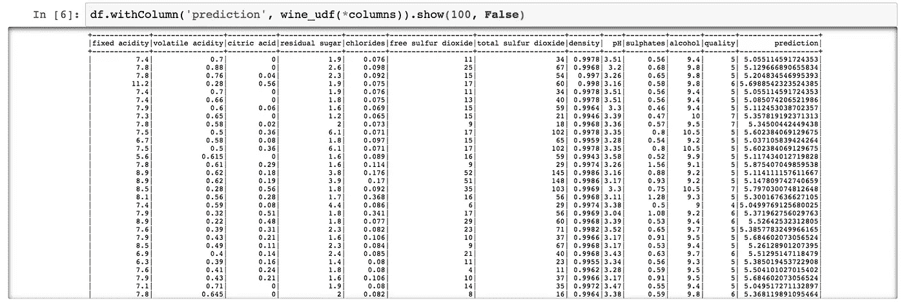

# 利用 MLflow 增强 Spark

> 原文：<https://towardsdatascience.com/empowering-spark-with-mlflow-58e6eb5d85e8?source=collection_archive---------8----------------------->

这篇文章旨在讲述我们使用 [**MLflow**](https://mlflow.org) 的初步经验。

我们将通过记录所有探索性迭代，开始用自己的[跟踪服务器](https://mlflow.org/docs/latest/tracking.html)发现 MLflow。然后，我们将展示使用 UDF 链接 Spark 和 MLflow 的经验。

## 语境

在 [**Alpha Health**](http://alpha.company/moonshots/alpha-health) 我们利用机器学习和人工智能的力量，让人们能够控制自己的健康和福祉。因此，机器学习模型是我们正在开发的数据产品的核心，这也是为什么 MLFLow，一个覆盖 ML 生命周期所有方面的开源平台吸引了我们的注意力。

# MLflow

MLflow 的主要目标是在 ML 之上提供一个额外的层，允许数据科学家使用几乎任何机器学习库(*[*keras，*](https://keras.io/) [*mleap，*](http://mleap-docs.combust.ml/)[*【py torch，*](https://pytorch.org/)[*sk learn&*](http://scikit-learn.org/stable/)[*tensor flow*](https://www.tensorflow.org/))*

*MLflow 提供了三个组件:*

*   *[**跟踪**](https://mlflow.org/docs/latest/tracking.html) —记录和查询实验:代码、数据、配置和结果。非常有助于跟踪你的建模进度。*
*   *[**项目**](https://mlflow.org/docs/latest/projects.html) —可在任何平台上重复运行的打包格式( ***即***[*Sagemaker*](https://aws.amazon.com/sagemaker))。*
*   *[**模型**](https://mlflow.org/docs/latest/models.html) —将模型发送到不同部署工具的通用格式。*

> ***MLflow** (目前处于 alpha 阶段)是一个管理 ML 生命周期的开源平台，包括实验、可复制性和部署。*

## *设置 MLflow*

*为了使用 MLflow，我们首先需要设置所有的 Python 环境来使用 MLflow，我们将使用 [PyEnv](https://github.com/pyenv/pyenv) *(* ***来设置****→*[*Python in Mac)*](https://gist.github.com/chris-zen/9e61db6924bd37fbe414f648614ca4c5)。这将提供一个虚拟环境，我们可以在其中安装运行它所需的所有库。*

> ***注意:**我们使用 PyArrow 来启动模型作为 UDF。PyArrow 和 Numpy 版本需要修复，因为最新的版本之间有一些冲突。*

## *启动跟踪用户界面*

*MLflow 跟踪允许我们使用 [Python](https://mlflow.org/docs/latest/python_api/index.html#python-api) 和[REST](https://mlflow.org/docs/latest/rest-api.html#rest-api)API 来记录和查询实验。除此之外，还可以定义我们将模型工件存放在哪里( *Localhost、* [*亚马逊 S3*](https://mlflow.org/docs/latest/tracking.html#amazon-s3) *、* [*Azure Blob 存储*](https://mlflow.org/docs/latest/tracking.html#azure-blob-storage) *、* [*谷歌云存储*](https://mlflow.org/docs/latest/tracking.html#google-cloud-storage) *或* [*SFTP 服务器*](https://mlflow.org/docs/latest/tracking.html#sftp-server) )。由于我们在 **Alpha Health** 中使用 AWS，我们将尝试用 **S3** 作为工件存储。*

*MLflow 建议使用**持久文件存储**。`file-store`是服务器存储运行和实验元数据的地方。因此，在运行服务器时，要确保它指向一个持久文件系统位置。这里，我们只是使用`/tmp`进行实验。*

*请记住，如果我们想要使用 mlflow 服务器来运行旧的实验，它们必须存在于文件存储中。然而，如果没有它们，我们仍然可以在 UDF 中使用它们，因为只需要模型路径。*

> ****注意:*** 记住跟踪 UI 和模型客户端必须能够访问工件位置。这意味着，不管 EC2 实例上的跟踪 UI 如何，如果我们在本地运行 MLflow，我们的机器应该可以直接访问 S3 来编写工件模型。*

**

*Tracking UI storing artifacts to a **S3** bucket*

## *运行模型*

*一旦追踪服务器开始运行，我们就可以开始训练我们的模型了。*

*作为示例，我们将使用 [***MLflow Sklearn 示例***](https://github.com/mlflow/mlflow/blob/master/examples/sklearn_elasticnet_wine/train.py) 中提供的葡萄酒示例的修改。*

*如前所述，MLflow 允许记录我们模型的参数、度量和工件，因此我们可以跟踪这些在我们不同的迭代中是如何发展的。这个特性非常有用，因为我们将能够通过检查跟踪服务器来重现我们的最佳模型，或者验证哪个代码正在执行期望的迭代，因为**它记录了** *(免费)***git 散列提交**。*

**

*Wine Iterations*

## *为模特服务*

> *使用“***ml flow server****”，*启动的 **MLflow 跟踪服务器**也托管 REST APIs，用于跟踪运行并将数据写入本地文件系统。您可以使用"***MLFLOW _ TRACKING _ URI****"*环境变量指定跟踪服务器 URI，ml flow 跟踪 API 会自动与该 URI 上的跟踪服务器进行通信，以创建/获取运行信息、日志度量等。*

****Ref:****[*Docs//运行跟踪服务器*](https://mlflow.org/docs/latest/tracking.html#running-a-tracking-server)**

**为了服务一个模型，我们所需要的是一个**跟踪服务器**运行( ***见*** *启动 UI* )和一个**模型运行 ID** 。**

****

**Run ID**

**为了使用 **MLflow serve 特性**服务模型，我们需要访问跟踪 UI，因此它可以通过指定`--run_id`来检索模型信息。**

**一旦模型由跟踪服务器提供服务，我们就可以查询新的模型端点。**

# **运行 Spark 的模型**

**虽然，仅仅通过训练模型和使用 serve 特性(***ref:****[*ml flow//docs//models # local*](https://mlflow.org/docs/latest/models.html#local))就能够实时地为模型提供服务是非常强大的，但是使用 Spark(批处理或流)来应用模型甚至更加强大，因为它加入了分布的力量。***

> **想象一下，有一个离线训练，然后以一种更简单的方式将输出模型应用于所有数据。这是 Spark 和 MLflow 共同闪耀出完美光芒的地方。**

## **安装 PySpark + Jupyter + Spark**

*****Ref:***[*入门 PySpark — Jupyter*](https://blog.sicara.com/get-started-pyspark-jupyter-guide-tutorial-ae2fe84f594f)**

**展示我们如何将 MLflow 模型应用于 Spark 数据框架。我们需要在 Jupyter 笔记本上安装 PySpark。**

## **从 PySpark 发射 Jupyter**

**由于我们将 Jupyter 配置为 PySpark 驱动程序 ，现在我们可以在笔记本上附加 PySpark 上下文来启动 Jupyter。**

****

**正如我们上面所展示的，MLflow 提供了一个将我们的模型工件记录到 S3 的特性。因此，一旦我们选择了一个模型，我们就可以通过使用`mlflow.pyfunc`模块将其作为 UDF 导入。**

****

**PySpark — Wine Quality Prediction Output**

**到目前为止，我们已经展示了如何将 PySpark 与 MLflow 结合使用，对所有葡萄酒数据集进行葡萄酒质量预测。但是，当您需要使用 Scala Spark 的 Python MLflow 模块时，会发生什么呢？**

**我们还通过在 Scala 和 Python 之间共享 Spark 上下文来测试这一点。这意味着我们在 Python 中注册了 MLflow UDF，然后在 Scala 中使用它( *yeap，这不是一个好的解决方案，但至少它是个东西* **🍭**)。**

## **Scala Spark + MLflow**

**对于这个例子，我们将把 [**Toree 内核**](https://toree.apache.org/) 添加到现有的 Jupyter 中。**

**正如您在随附的笔记本中看到的，UDF 由 Spark 和 PySpark 共享。我们希望这最后一部分对那些热爱 Scala 并且必须将 ML 模型投入生产的团队有所帮助。**

## **后续步骤**

**虽然 MLflow 目前在阿尔法(🥁)，它看起来很有希望。凭借能够运行多个机器学习框架并从同一端点使用它们的能力，它将所有推荐系统带到了一个新的水平。**

> **此外，MLflow 通过在数据工程师 **和数据科学家**之间建立一个公共层，拉近了**和数据工程师**的距离。**

**在对 MLflow 进行研究之后，我们确信我们将会更进一步，并开始在我们的 Spark 管道和推荐系统中使用它。**

**让文件存储与数据库同步而不是使用文件系统会更好。这应该允许多个端点使用同一个文件存储。比如让多个 [Presto](https://prestodb.io/) 和 [Athena](https://aws.amazon.com/athena/) 实例使用同一个[胶水 metastore](https://aws.amazon.com/glue/) 。**

**最后，感谢 MLflow 背后的所有社区，是他们让这一切成为可能，让我们的数据生活更加有趣。**

**如果您正在使用 MLflow，**请随时联系我们**并提供一些关于您如何使用它的反馈！甚至，如果你在生产中使用 MLflow。**