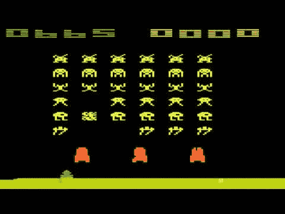
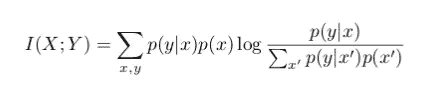
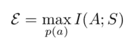
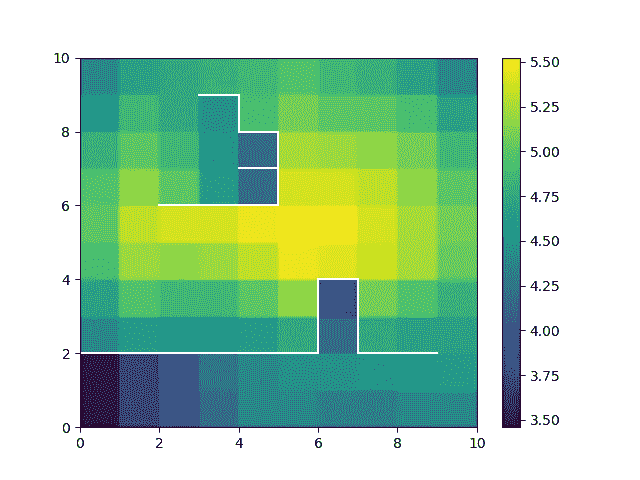

# 赋权作为内在动力

> 原文：<https://towardsdatascience.com/empowerment-as-intrinsic-motivation-b84af36d5616?source=collection_archive---------2----------------------->

## 在没有目标或奖励的情况下，被授权

有钱，有影响力的朋友，或者拥有一辆车意味着你更有权力决定你想要什么样的未来。这不一定意味着你知道哪些目标是正确的，但它肯定会让你处于一个权力的位置，在那里有许多可能的未来可供选择。

这种授权的概念是由 Klyubin 等人[1]在设计适应性代理的上下文中正式提出的。它旨在作为一种独立于目标的内在行为动机，并在机器人学、强化学习和自适应系统中产生了一些有趣的结果。例如，使用授权最大化策略来控制模拟双摆，Jung 等人[4]发现了以下行为:

Maximising empowerment in a double pendulum controller. The controller finds the most unstable point of the pendulum and keeps it there, even though there is no explicitly encoded goal of reaching this state. Image taken from Jung et al. [4]

双摆被控制到最不稳定的点(垂直 90 度)并保持在那里，即使控制器中没有编程找到这种状态的明确目标——它只是最大化授权，并且恰好钟摆的顶部是最授权的位置(这是因为从这个不稳定点可以到达更多可能的未来状态)。

授权是基于一种信息理论的形式主义，它将行动和未来的感觉视为一种信息传输渠道(就像 Claude Shannon 在他关于通信工程的开创性工作中描述的那样[5])。我在这篇文章中的目标是以最简单的方式解释授权，包括如何计算它的数学，以及它对强化学习和人工智能的影响。在文章的最后，我提供了一个到我的 GitHub 库的链接，在那里你可以找到在离散世界中实现授权的代码。

# 奖励和强化学习

强化学习是关于在一个不确定的世界中学习一个最佳的行动策略，它在每个时间步提供一个奖励信号。DeepMind 通过训练深度网络，使用游戏分数作为奖励信号，利用强化学习技术在雅达利游戏[2]上超过人类水平的表现。

Space Invaders Atari game. DeepMind’s Q-learning network outperforms human-level game play by training deep networks using the game pixels as input, and the game score as reward signal.

虽然这令人印象深刻，但现实世界中的生物面临着更加复杂和不确定的世界——将来自你眼睛和耳朵的感官刺激与用作 DeepMind 神经网络输入的简单像素和分数信号进行比较。但更关键的是，对于生物有机体来说，根本不存在明显的回报信号。当蚂蚁、松鼠或人类做出“好”或“坏”的举动时，没有全知的守护者或“神谕”来告诉他们。

事实上，像我们这样的生命体最令人印象深刻的品质是我们继续生存的能力。我们的内部器官不仅继续做着让我们生存的事情，而且我们通常会避免可能导致我们死亡的情况。为了增加我们继续生存的机会，我们的大脑/身体有没有可以遵循的一般原则？

# 内在动机

卡尔·弗里斯顿提出了一个雄心勃勃的框架，认为大脑的功能是最小化一个被称为自由能的量。不仅如此，他还提出，对于任何旨在避免宇宙无序化趋势的破坏性影响的有机体来说，将这个量最小化是必须的(热力学第二定律)。不过自由能框架不是本文的主题，这里就不赘述了。

我提到这一点是为了引入*内在动机的概念。*在基地，所有生物都必须抵抗宇宙的无序趋势，才能继续存在。大部分工作是由我们的新陈代谢完成的，新陈代谢为有用的工作收集能量，并排出高熵废物。但是，在行为的更高层次上，问题是:在没有具体目标或奖励信号的情况下，有没有可以指导行为的普遍原则？

例如，假设目前我没有要完成的目标或任务，但是我知道在将来的某个时候一个任务可能会出现。与此同时，有没有什么原则性的行为方式可以让我为未来的任务做好最充分的准备？

# 授权

根据克柳宾的说法，在其他条件相同的情况下，代理人应该最大化他们行为的未来可能结果的数量。以这种方式“保持你的选择余地”意味着当一项任务出现时，一个人尽可能地被授权去完成它所需要做的任何事情。Klyubin 等人在两篇标题恰当的论文中很好地提出了这一概念:“在其他条件相同的情况下，被赋予权力”[1]和“保持选择的开放性:感觉运动系统的基于信息的驱动原则”[3]。从那以后，机器人和强化学习领域的许多令人兴奋的工作都使用并扩展了这个概念[8，9]。

这里的主要创新是使用信息论正式授权。要做到这一点，世界必须被认为是一个将*行为*转化为未来*感觉状态的信息理论通道。*通过将动作和随后的感觉视为通过通道相关联，我们可以将授权精确量化为传感器-致动器通道的信息论*通道容量*。也就是说，通过我的行动，我能向未来的感官状态注入多少信息？说的更直观一点，我的环境*有多可操控*？

为了定义这一点，我们需要首先定义两个随机变量 *X* 和 *Y* 之间的互信息。假设 *X* 和 *Y* 通过一个通道 *X→Y* 相关联，由条件分布 *p(y|x)* 描述。也就是说，值 *x* 规定了在值 *y* 上的*概率分布*(记住，信道可能是有噪声的，因此 *x* 仅用某个概率来确定 *y* ，因此是概率分布，而不是与每个 *x* 相关联的精确值)。如果通道的输入 *x* 分布为 *p* (x)，则 *X* 和 *Y* 之间的互信息由下式给出。

Mutual information between *X* and Y. Formally, it is the average reduction in uncertainty (entropy) in Y due to knowledge of X (and vice versa, although that may not be immediately clear).

互信息量化了已知 X 的 Y 的不确定性(熵)的减少，并且以比特来测量。事实证明，这种关系是对称的，因此*I(X；Y)= I(Y；x)。*

在我们的例子中，感兴趣的通道是*传感器-执行器*通道。让我们称 *A* 为致动器变量(描述动作),称 *S* 为定义下一时间步传感器读数的变量。给定一个主体/环境系统的状态，行动通过概率规则 *p(s|a)* 或渠道 *A→S* 导致未来的感觉，这是由世界上这个特定点的环境动态决定的。动作 p(a) 上的某个*分布现在足以确定互信息*I(A；S)* (与上面的 *X* 和 *Y* 完全相同)。信道容量，这里是授权，仅仅是动作分布上最大可能的互信息 *p(a)。**

For a fixed channel p(s|a) empowerment is the maximum mutual information over actions distributions p(a).

类似地，我们可以将随机变量 A 视为描述 n 步动作，然后 S 在 n 个时间步之后读取传感器数据，因此定义了所谓的 n 步授权。

为了帮助思考这意味着什么，考虑一下这个。当我行动时，我改变了我的环境，并因此影响了我在下一个时间点的感知。当我所有可能的行动在下一个时间步骤导致完全相同的感官读数时，我完全没有控制，也就是说我没有权力，这反映在零的相互信息中(结果的不确定性没有减少)。当我的每一个动作都导致下一个时间步的一个明显的感官读数时，我就有了很大的控制力，所以我很有权力(体现在一个很高的互信息上)。

# 克柳宾的迷宫世界

如果你的眼睛刚刚变得呆滞，是时候醒来看一个启示性的例子了。如果你和我一样对这些信息论的形式主义感到兴奋，那就值得看一看 Cover & Thomas 的书[6]，其中详细讨论了熵、互信息和信道容量等主题。

在 Klyubin 的论文“在其他条件相同的情况下被赋予权力”中，一个简单的迷宫世界的例子被用来说明这个概念。假设一个智能体存在于 2D 网格世界中，它可以做出向北、向南、向东、向西或停留的动作。然而，这个世界有墙，使它成为一种迷宫。命令代理进入墙壁的动作没有效果，并且世界的边缘被墙壁包围(即没有循环)。

假设代理的传感器只是报告代理在世界上的绝对位置。下图显示了世界上每个网格单元的赋权值，计算为将可能的 5 步操作与 5 步序列后的传感器读数相关联的通道的通道容量。

5-step empowerment value at each point in Klyubin’s deterministic maze world. Highly empowered positions are so because more future states are reachable from those states.

我们看到，在世界上代理更“卡住”的部分，授权更低(通道容量约为 3.5 位)。“停滞”意味着即使是最有希望的行为分布也只能导致有限数量的未来状态。高度授权的州(像地图中间附近)对应于代理人拥有许多可能性的州。

假设“一块食物”将在时间 *t，*出现在网格中的某个位置，但是在此之前，不知道关于该未来位置的信息。在此期间，一个人应该如何行动？嗯，移动到网格中心附近的位置[5，5]可能是您的最佳选择，因为从该位置可以获得更多的未来状态。

# 为人工智能赋能

大多数有趣的人类行为都不是基于奖励的学习的结果(尤其是不像标准的机器学习模型那样使用成千上万的例子)。心理学文献谈到“内在动机”，基本上是指为了自己内在的愉悦而做任务。这种行为是有用的，因为这些“天生令人愉快”的活动往往会教给我们有价值的、抽象的、可重复使用的概念，这些概念可以应用于大量潜在的未来任务(想象一个孩子在玩耍)。

对于任何旨在成为通用、通用或自主的人工智能来说，学习一般概念是必须的——这意味着*信息具有内在价值*。对于一个处于环境中的具体化代理人来说，了解环境中内在结构的唯一方式是通过*与它互动—* 因此授权位置，在那里行动的结果更加多样化，本质上是世界上更有趣/有趣的部分。随着我们从特定任务智能转向通用智能，授权和其他信息驱动的概念(查看预测信息和相关想法的顺势疗法)将是重要的工具。

*感谢您阅读我关于授权的文章。查看* [*我的 GitHub 库*](https://github.com/Mchristos/empowerment) *，其中有实现任意离散环境授权的代码。*

## 参考

[1] Klyubin，A.S .，Polani，d .和 Nehaniv，C.L .，2005 年 9 月。在其他条件相同的情况下，被赋予权力。在*欧洲人工生命会议*(第 744-753 页)。斯普林格，柏林，海德堡。

[2] Mnih，v .，Kavukcuoglu，k .，Silver，d .，鲁苏，a .，Veness，j .，Bellemare，M.G .，Graves，a .，Riedmiller，m .，Fidjeland，A.K .，Ostrovski，g .和 Petersen，s .，2015。通过深度强化学习实现人类水平的控制。*性质*， *518* (7540)，第 529 页。

[3] Klyubin，A.S .，Polani，d .和 Nehaniv，C.L .，2008 年。保持选择的开放性:感觉运动系统的基于信息的驾驶原则。 *PloS one* ， *3* (12)，p.e4018

[4]t .荣格、d .波拉尼和斯通出版社，2011 年。连续智能体-环境系统的授权。*适应行为*， *19* (1)，第 16–39 页。

[5]香农出版社，2001 年。交流的数学理论。 *ACM SIGMOBILE 移动计算与通信评论*， *5* (1)，第 3–55 页。

[6]盖，T.M .和托马斯，J.A .，2012 年。*信息论的要素*。约翰·威利的儿子们。

[7]k .弗里斯顿，2010 年。自由能原理:统一的大脑理论？。*《自然评论神经科学*， *11* (2)，第 127 页。

[8]穆罕默德和雷森德，司法部，2015 年。内在激励强化学习的变分信息最大化。在*神经信息处理系统的进展*(第 2125–2133 页)。

[9]g .蒙图法尔、k .加齐-扎赫迪和 n .艾，2016 年。信息理论辅助的具身智能体强化学习。 *arXiv 预印本 arXiv:1605.09735* 。